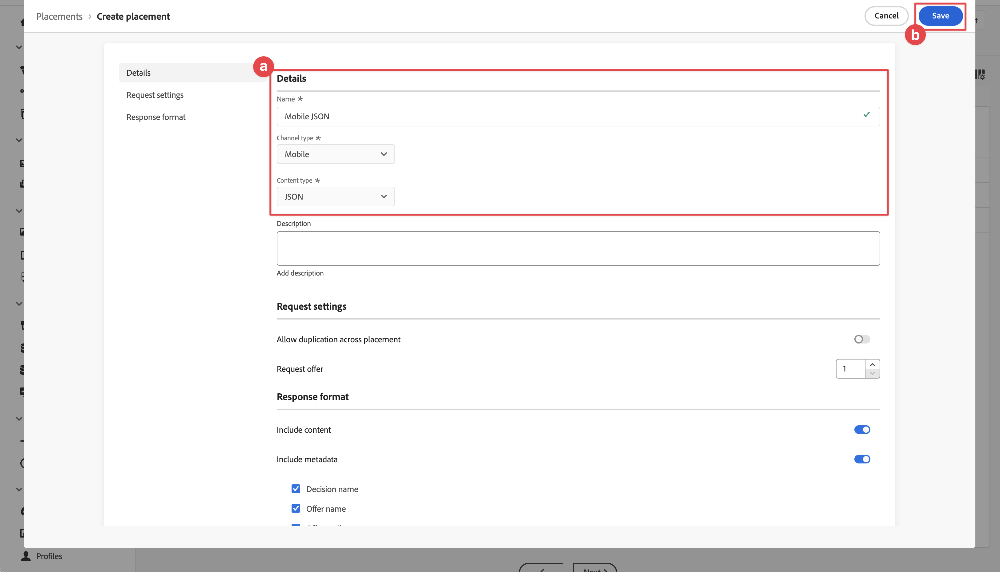
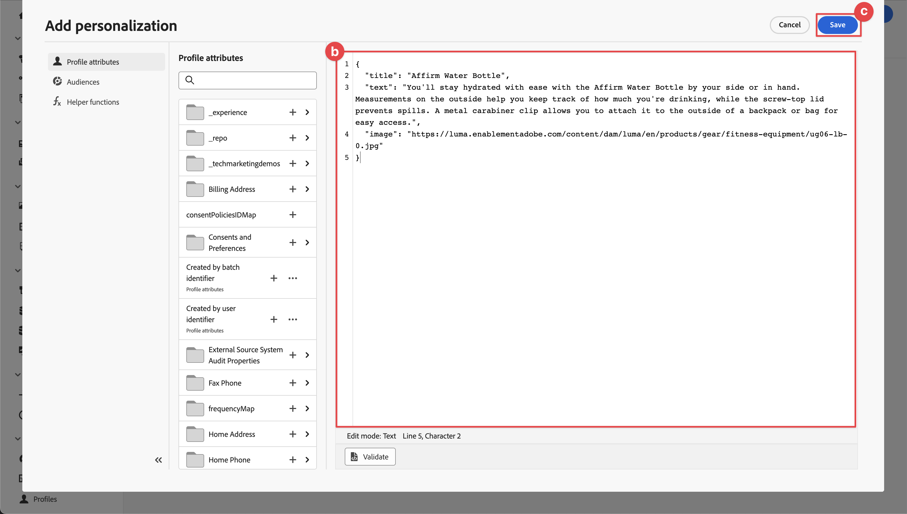
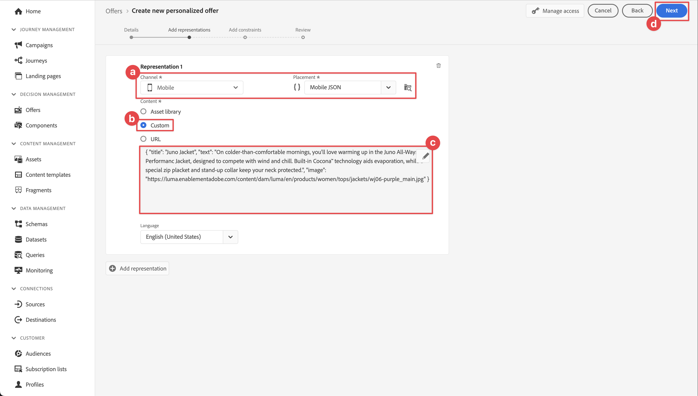
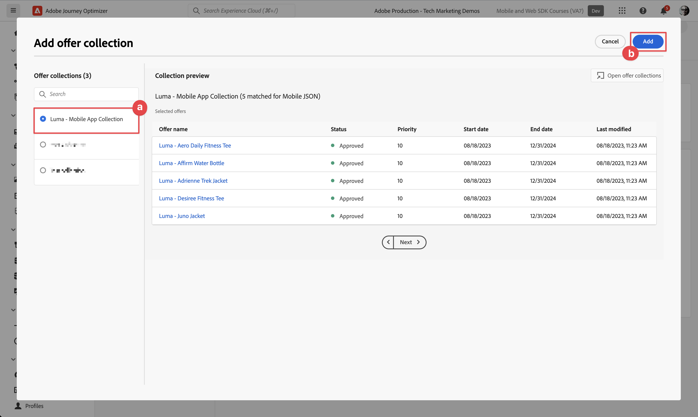

# Skapa och visa erbjudanden med Beslutshantering

Lär dig hur du visar erbjudanden från Journey Optimizer Decision Management i dina mobilappar med Experience Platform Mobile SDK.

Med Journey Optimizer Decision Management kan ni leverera det bästa erbjudandet och upplevelsen till era kunder över alla kontaktytor vid rätt tidpunkt. När ni väl utformat er målgrupp kan ni inrikta er på personaliserade erbjudanden.

{zoomable="yes"}

Beslutshantering förenklar personaliseringen med ett centralt bibliotek med marknadsföringserbjudanden och en beslutsmotor som tillämpar regler och begränsningar på komplexa realtidsprofiler som skapats av Adobe Experience Platform. Resultatet blir att ni kan skicka rätt erbjudande till kunderna vid rätt tidpunkt. Mer information finns i [Om beslutshantering](https://experienceleague.adobe.com/en/docs/journey-optimizer/using/decisioning/offer-decisioning/get-started-decision/starting-offer-decisioning).


>[!NOTE]
>
>Den här lektionen är valfri och gäller endast för Journey Optimizer-användare som vill använda beslutsstyrningsfunktionen för att visa erbjudanden i en mobilapp.


## Förhandskrav

* App med SDK:er har installerats och konfigurerats.
* Konfigurera appen för Adobe Experience Platform.
* Åtkomst till Journey Optimizer - Beslutshantering med de [korrekta behörigheterna för att hantera erbjudanden och beslut](https://experienceleague.adobe.com/en/docs/journey-optimizer/using/access-control/high-low-permissions).


## Utbildningsmål

I den här lektionen ska du

* Uppdatera din Edge-konfiguration för beslutshantering.
* Uppdatera taggegenskaperna med Offer Decisioning- och Target-tilläggen.
* Uppdatera ditt schema för att hämta offerthändelser.
* Validera konfigurationen i Assurance.
* Skapa ett offertbeslut baserat på erbjudanden från Journey Optimizer - Beslutshantering.
* Uppdatera appen och registrera tillägget Optimizer.
* Implementera erbjudanden från Beslutshantering i appen.


## Inställningar

>[!TIP]
>
>Om du redan har konfigurerat miljön som en del av [Konfigurera A/B-tester med Target](target.md) -lektionen kanske du redan har utfört några av stegen i det här installationsavsnittet.

### Uppdatera datastream-konfiguration

För att säkerställa att data som skickas från din mobilapp till Platform Edge Network vidarebefordras till Journey Optimizer - Beslutshantering uppdaterar du ditt datastream.

1. I användargränssnittet för datainsamling väljer du **[!UICONTROL Datastreams]** och markerar ditt datastream, till exempel **[!DNL Luma Mobile App]**.
1. Välj  för **[!UICONTROL Experience Platform]** och välj  **[!UICONTROL Edit]** på snabbmenyn.
1. Kontrollera att **[!UICONTROL Datastreams]**,  är markerade på skärmen **[!UICONTROL Adobe Experience Platform]** > **[!UICONTROL Offer Decisioning]** Mapp **[!UICONTROL Edge Segmentation]** > **[!UICONTROL Adobe Journey Optimizer]**. Om du gör mållektionen väljer du också **[!UICONTROL Personalization Destinations]**. Mer information finns i [Adobe Experience Platform-inställningar](https://experienceleague.adobe.com/en/docs/experience-platform/datastreams/configure).
1. Välj **[!UICONTROL Save]** om du vill spara dataströmskonfigurationen.

   {zoomable="yes"}


### Installera taggtillägget Offer Decisioning och Target

1. Navigera till **[!UICONTROL Tags]** och hitta din mobila taggegenskap och öppna egenskapen.
1. Välj **[!UICONTROL Extensions]**.
1. Välj **[!UICONTROL Catalog]**.
1. Sök efter tillägget **[!UICONTROL Offer Decisioning and Target]**.
1. Installera tillägget. Tillägget kräver ingen ytterligare konfiguration.

   {zoomable="yes"}


### Uppdatera ditt schema

1. Navigera till gränssnittet för datainsamling och välj **[!UICONTROL Schemas]** i den vänstra listen.
1. Välj **[!UICONTROL Browse]** i det övre fältet.
1. Välj ditt schema för att öppna det.
1. Välj  **[!UICONTROL Add]** bredvid Fältgrupper i schemaredigeraren.
1. I dialogrutan **[!UICONTROL Add fields groups]**  efter `proposition`, markera **[!UICONTROL Experience Event - Proposition Interactions]** och välj **[!UICONTROL Add field groups]**. Den här fältgruppen samlar in data om upplevelsehändelser som är relevanta för erbjudanden, precis som vilket erbjudande som presenteras, som en del av vilken samling, vilket beslut och andra parametrar (se senare i den här lektionen)? Men vad händer med erbjudandet? Visas den, interagerar med den, stängs av och så vidare?
   {zoomable="yes"}
1. Välj **[!UICONTROL Save]** om du vill spara ändringarna i ditt schema.


## Validera inställningar i Assurance

Så här validerar du konfigurationen i Assurance:

1. Gå till Assurance användargränssnitt.
1. Markera **[!UICONTROL Configure]** i den vänstra listen och välj  intill **[!UICONTROL Validate Setup]** under **[!UICONTROL OFFER DECISIONING AND TARGET]**.
1. Välj **[!UICONTROL Save]**.
1. Välj **[!UICONTROL Validate Setup]** i den vänstra listen. Både datastream-konfigurationen och SDK-konfigurationen i ditt program valideras.
   {zoomable="yes"}


## Skapa placering

Innan ni kan skapa erbjudanden måste ni definiera hur och var dessa erbjudanden kan placeras i mobilappen. I Beslutshantering definierar du placeringar för detta och du definierar en placering för den mobila kanal som stöder en JSON-nyttolast:

1. I Journey Optimizer-gränssnittet väljer du  **[!UICONTROL Components]** från **[!UICONTROL DECISION MANAGEMENT]** i den vänstra listen.

1. Välj **[!UICONTROL Placements]** i det övre fältet.

1. Om ingen placering med namnet **[!UICONTROL Mobile JSON]**, **[!UICONTROL Mobile]** som **[!UICONTROL Channel type]** och **[!UICONTROL JSON]** som **[!UICONTROL Content type]** visas, måste du skapa en placering. Annars fortsätter du med att [skapa erbjudanden](#create-offers).

Så här skapar du Mobile JSON-placeringen:

1. Välj  Skapa placering.

   1. i avsnittet **[!UICONTROL Details]** anger du `Mobile JSON` som **[!UICONTROL Name]**, väljer **[!UICONTROL Mobile]** från **[!UICONTROL Channel type]** och **[!UICONTROL JSON]** från **[!UICONTROL Content type]**.
   1. Välj **[!UICONTROL Save]** om du vill spara placeringen.

   {zoomable="yes"}


## Skapa erbjudanden

1. I Journey Optimizer-gränssnittet väljer du  **[!UICONTROL Offers]** från **[!UICONTROL DECISION MANAGEMENT]** i den vänstra listen.
1. På skärmen **[!UICONTROL Offers]** väljer du **[!UICONTROL Browse]** för att se listan över erbjudanden.
1. Välj **[!UICONTROL Create offer]**.
1. I dialogrutan **[!UICONTROL New offer]** väljer du **[!UICONTROL Personalized offer]** och klickar på **[!UICONTROL Next]**.
1. I **[!UICONTROL Details]**-steget i **[!UICONTROL Create new personalized offer]**:
   1. Ange **[!UICONTROL Name]** som erbjudande, till exempel `Luma - Juno Jacket`, och ange **[!UICONTROL Start date and time]** och **[!UICONTROL End date and time]**. Endast erbjudanden inom dessa datum väljs av beslutsmotorn.
   1. Välj **[!UICONTROL Next]**.
      {zoomable="yes"}

1. I **[!UICONTROL Add representations]**-steget i **[!UICONTROL Create new personalized offer]**:
   1. Välj  **[!UICONTROL Mobile]** i listan **[!UICONTROL Channel]** och välj **[!UICONTROL Mobile JSON]** i listan **[!UICONTROL Placement]**.
   1. Välj **[!UICONTROL Custom]** för **[!UICONTROL Content]**.
   1. Välj **[!UICONTROL Add content]**.  I dialogrutan **[!UICONTROL Add personalization]**:
      1. Om en [!UICONTROL Mode]-väljare är tillgänglig kontrollerar du att den är inställd på **[!UICONTROL JSON]**.
      1. Ange följande JSON:

         ```json
         { 
             "title": "Juno Jacket",
             "text": "On colder-than-comfortable mornings, you'll love warming up in the Juno All-Ways Performance Jacket, designed to compete with wind and chill. Built-in Cocona&trade; technology aids evaporation, while a special zip placket and stand-up collar keep your neck protected.", 
             "image": "https://luma.enablementadobe.com/content/dam/luma/en/products/women/tops/jackets/wj06-purple_main.jpg" 
         }  
         ```

      1. Välj **[!UICONTROL Save]**.
         {zoomable="yes"}
   1. Välj **[!UICONTROL Next]**.
      {zoomable="yes"}

1. I **[!UICONTROL Add constraints]**-steget i **[!UICONTROL Create new personalized offer]**:
   1. Ange **[!UICONTROL Priority]** till `10`.
   1. Växla **[!UICONTROL Include capping]** av.
   1. Välj **[!UICONTROL Next]**.
      {zoomable="yes"}

1. I **[!UICONTROL Review]**-steget av **[!UICONTROL Create new personalized]**-erbjudandet:
   1. Granska erbjudandet och välj sedan **[!UICONTROL Finish]**.
   1. Välj **[!UICONTROL Save offer]** i dialogrutan **[!UICONTROL Save and approve]**.

1. Upprepa steg 3-8 för att skapa ytterligare fyra erbjudanden med olika namn och innehåll. Alla andra konfigurationsvärden, till exempel Startdatum och -tid eller Prioritet, liknar det första erbjudandet du skapade. Du kan snabbt skapa dubbletter och redigera erbjudanden.

   1. I Journey Optimizer-gränssnittet väljer du  **[!UICONTROL Offers]** i den vänstra listen och sedan Erbjudanden i den övre raden.
   1. Markera raden i erbjudandet som du skapade.
   1. Välj  **[!UICONTROL More actions]** i den högra rutan och välj  **[!UICONTROL Duplicate]** på snabbmenyn.

      Använd tabellen nedan för att definiera de fyra andra erbjudandena.

      | Namn på erbjudande | Erbjud innehåll i JSON |
      |---|---|
      | Luma - vattenflaskan har fastnat | `{ "title": "Affirm Water Bottle", "text": "You'll stay hydrated with ease with the Affirm Water Bottle by your side or in hand. Measurements on the outside help you keep track of how much you're drinking, while the screw-top lid prevents spills. A metal carabiner clip allows you to attach it to the outside of a backpack or bag for easy access.", "image": "https://luma.enablementadobe.com/content/dam/luma/en/products/gear/fitness-equipment/ug06-lb-0.jpg" }` |
      | Luma - Önskat träningsträd | `{ "title": "Desiree Fitness Tee", "text": "When you're too far to turn back, thank yourself for choosing the Desiree Fitness Tee. Its ultra-lightweight, ultra-breathable fabric wicks sweat away from your body and helps keeps you cool for the distance.", "image": "https://luma.enablementadobe.com/content/dam/luma/en/products/women/tops/tees/ws05-yellow_main.jpg" }` |
      | Luma - Adrienne Trek Jacket | `{ "title": "Adrienne Trek Jacket", "text": "You're ready for a cross-country jog or a coffee on the patio in the Adrienne Trek Jacket. Its style is unique with stand collar and drawstrings, and it fits like a jacket should.", "image": "https://luma.enablementadobe.com/content/dam/luma/en/products/women/tops/jackets/wj08-gray_main.jpg" }` |
      | Luma - Aero Daily Fitness Tee | `{ "title": "Aero Daily Fitness Tee", "text": "Need an everyday action tee that helps keep you dry? The Aero Daily Fitness Tee is made of 100% polyester wicking knit that funnels moisture away from your skin. Don't be fooled by its classic style; this tee hides premium performance technology beneath its unassuming look.", "image": "https://luma.enablementadobe.com/content/dam/luma/en/products/men/tops/tees/ms01-black_main.jpg" }` |

      {style="table-layout:fixed"}

1. Som sista steg måste ni skapa ett reserverbjudande, som är ett erbjudande som skickas till kunderna om de inte är berättigade till andra erbjudanden.
   1. Välj **[!UICONTROL Create offer]**.
   1. I dialogrutan **[!UICONTROL New offer]** väljer du **[!UICONTROL Personalized offer]** och sedan **[!UICONTROL Next]**.
   1. I **[!UICONTROL Details]**-steget av **[!UICONTROL Create new fallback offer]** anger du en **[!UICONTROL Name]** för erbjudandet, till exempel `Luma - Fallback Offer`, och väljer **[!UICONTROL Next]**.

   1. I **[!UICONTROL Add representations]**-steget i **[!UICONTROL Create new fallback offer]**:
      1. Välj  **[!UICONTROL Mobile]** i listan **[!UICONTROL Channel]** och välj **[!UICONTROL Mobile JSON]** i listan **[!UICONTROL Placement]**.
      1. Välj **[!UICONTROL Custom]** för **[!UICONTROL Content]**.
      1. Välj **[!UICONTROL Add content]**.
      1. Ange följande JSON i dialogrutan **[!UICONTROL Add personalization]** och välj **[!UICONTROL Save]**:

         ```json
         {  
            "title": "Luma",
            "text": "Your store for sports wear and equipment.", 
            "image": "https://luma.enablementadobe.com/content/dam/luma/en/logos/Luma_Logo.png" 
         }  
         ```

      1. Välj **[!UICONTROL Next]**.


1. I **[!UICONTROL Review]**-steget av **[!UICONTROL Create new fallback]**-erbjudandet:
   1. Granska erbjudandet och välj sedan **[!UICONTROL Finish]**.
   1. Välj **[!UICONTROL Save offer]** i dialogrutan **[!UICONTROL Save and approve]**.

Du bör nu ha följande lista över erbjudanden:
{zoomable="yes"}


## Skapa en samling

För att kunna presentera ett erbjudande för din mobilappsanvändare måste du definiera en erbjudandesamling som består av ett eller flera av de erbjudanden du har skapat.

1. I Journey Optimizer-gränssnittet väljer du **[!UICONTROL Offers]** i den vänstra listen.
1. Välj **[!UICONTROL Collections]** i det övre fältet.
1. Välj  **[!UICONTROL Create collection]**.
1. I dialogrutan **[!UICONTROL New collection]** anger du **[!UICONTROL Name]** för din samling, till exempel `Luma - Mobile App Collection`, väljer **[!UICONTROL Create static collection]** och klickar på **[!UICONTROL Next]**.
1. I **[!DNL Luma - Mobile App Collection]** väljer du de erbjudanden du vill inkludera i samlingen. I den här självstudiekursen väljer du fem erbjudanden du skapat. Du kan enkelt filtrera listan med hjälp av sökfältet, till exempel genom att skriva **[!DNL Luma]**.
1. Välj **[!UICONTROL Save]**.

   {zoomable="yes"}


## Skapa ett beslut

Det sista steget är att definiera ett beslut, vilket är kombinationen av ett eller flera beslutsomfattningar och ditt reserverbjudande.

Ett beslutsomfång är en kombination av en specifik placering (till exempel HTML i ett e-postmeddelande eller JSON i en mobilapp) och ett eller flera utvärderingskriterier.

Ett utvärderingskriterium är en kombination av

* en erbjudandesamling,
* regler för behörighet: Erbjudandet gäller t.ex. endast en viss målgrupp.
* en rangordningsmetod: när det finns flera erbjudanden att välja mellan, vilken metod använder du för att rangordna dem (t.ex. efter erbjudandeprioritet, med en formel eller en AI-modell).

Se [Viktiga steg för att skapa och hantera erbjudanden](https://experienceleague.adobe.com/en/docs/journey-optimizer/using/decisioning/offer-decisioning/get-started-decision/key-steps) om du vill veta hur placeringar, regler, rankningar, erbjudanden, representationer, samlingar, beslut och så vidare, interagerar och relaterar till varandra. Den här lektionen handlar endast om att använda beslutsresultatet i stället för att vara flexibel när det gäller att definiera beslut inom Journey Optimizer - Beslutshantering.

1. I Journey Optimizer-gränssnittet väljer du **[!UICONTROL Offers]** i den vänstra listen.
1. Välj **[!UICONTROL Decisions]** i det övre fältet.
1. Välj  **[!UICONTROL Create decision]**.
1. I **[!UICONTROL Details]**-steget i **[!UICONTROL Create a new offer decision]**:
   1. Ange en **[!UICONTROL Name]** för beslutet, till exempel `Luma - Mobile App Decision`, ange **[!UICONTROL Start date and time]** och **[!UICONTROL End date and time]**.
   1. Välj **[!UICONTROL Next]**.

1. I **[!UICONTROL Add decision scopes]**-steget i **[!UICONTROL Create a new offer decision]**:
   1. Välj **[!UICONTROL Mobile JSON]** i listan **[!UICONTROL Placement]**.
   1. I rutan **[!UICONTROL Evaluation Criteria]** väljer du  **[!UICONTROL Add]**.
      1. Välj din erbjudandesamling i dialogrutan **[!UICONTROL Add Offer Collection]**. Exempel: **[!DNL Luma - Mobile App Collection]**.
      1. Välj **[!UICONTROL Add]**.

         {zoomable="yes"}

   1. Kontrollera att **[!UICONTROL None]** är markerat för **[!UICONTROL Eligibility]** och att **[!UICONTROL Offer priority]** är markerat som **[!UICONTROL Ranking method]**.
   1. Välj **[!UICONTROL Next]**.

      {zoomable="yes"}

1. I **[!UICONTROL Add fallback offer]**-steget i **[!UICONTROL Create a new offer decision]**:
   1. Välj ditt reserverbjudande, till exempel **[!DNL Luma - Fallback offer]**.
   1. Välj **[!UICONTROL Next]**.
1. I **[!UICONTROL Summary]**-steget i **[!UICONTROL Create a new offer decision]**:
   1. Välj **[!UICONTROL Finish]**.
   1. Välj **[!UICONTROL Save offer decision]** i dialogrutan **[!UICONTROL Save and activate]**.
   1. På fliken **[!UICONTROL Decisions]** ser du ditt beslut med statusen **[!UICONTROL Live]**.

Ditt beslut om erbjudandet, som består av en uppsättning erbjudanden, är nu klart att användas. Om du vill använda beslutet i din app måste du i koden hänvisa till beslutsomfånget.

1. I Journey Optimizer-gränssnittet väljer du **[!UICONTROL Offers]**.
1. Välj **[!UICONTROL Decisions]** i det övre fältet.
1. Välj ditt beslut, till exempel **[!DNL Luma - Mobile App Decision]**.
1. Välj **[!UICONTROL Decision scopes]** Kopiera i rutan **[!UICONTROL Copy]**.
1. Välj **[!UICONTROL Decision scope]** på snabbmenyn.

   {zoomable="yes"}

1. Använd en textredigerare för att klistra in beslutsomfånget för senare bruk. Beslutsomfånget har följande JSON-format.

   ```json
   {
       "xdm:activityId":"xcore:offer-activity:xxxxxxxxxxxxxxx",
       "xdm:placementId":"xcore:offer-placement:xxxxxxxxxxxxxxx"
   }
   ```

## Implementera erbjudanden i din app

Som tidigare nämnts tillhandahåller installation av ett mobiltaggtillägg bara konfigurationen. Därefter måste du installera och registrera Optimera SDK. Om de här stegen inte är tydliga går du igenom avsnittet [Installera SDK](install-sdks.md).

>[!NOTE]
>
>Om du har slutfört avsnittet [Installera SDK:er](install-sdks.md) är SDK redan installerat och du kan hoppa över det här steget.
>

>[!BEGINTABS]

>[!TAB iOS]

1. Kontrollera att [AEP Optimize](https://github.com/adobe/aepsdk-messaging-ios) har lagts till i listan över paket i paketberoenden i Xcode. Se [Hanteraren för wift-paket](install-sdks.md#swift-package-manager).
1. Navigera till **[!DNL Luma]** > **[!DNL Luma]** > **[!UICONTROL AppDelegate]** i Xcode Project-navigatorn.
1. Se till att `AEPOptimize` ingår i din lista över importer.

   ```swift
   import AEPOptimize
   ```

1. Kontrollera att `Optimize.self` är en del av den array med tillägg som du registrerar.

   ```swift
   let extensions = [
       AEPIdentity.Identity.self,
       Lifecycle.self,
       Signal.self,
       Edge.self,
       AEPEdgeIdentity.Identity.self,
       Consent.self,
       UserProfile.self,
       Places.self,
       Messaging.self,
       Optimize.self,
       Assurance.self
   ]
   ```

1. Navigera till **[!DNL Luma]** > **[!DNL Luma]** > **[!DNL Model]** > **[!DNL Data]** > **[!UICONTROL decisions]** i Xcode Project-navigatorn. Uppdatera värdena `activityId` och `placementId` med beslutsscopeinformationen som du kopierade från Journey Optimizer-gränssnittet.

1. Navigera till **[!DNL Luma]** > **[!DNL Luma]** > **[!DNL Utils]** > **[!UICONTROL MobileSDK]** i Xcode Project-navigatorn. Hitta funktionen `func updatePropositionOD(ecid: String, activityId: String, placementId: String, itemCount: Int) async`. Lägg till följande kod:

   ```swift
   // set up the XDM dictionary, define decision scope and call update proposition API
   Task {
      let ecid = ["ECID" : ["id" : ecid, "primary" : true] as [String : Any]]
      let identityMap = ["identityMap" : ecid]
      let xdmData = ["xdm" : identityMap]
      let decisionScope = DecisionScope(activityId: activityId, placementId: placementId, itemCount: UInt(itemCount))
      Optimize.clearCachedPropositions()
      Optimize.updatePropositions(for: [decisionScope], withXdm: xdmData) { data, error in
            if let error = error {
               Logger.aepMobileSDK.error("MobileSDK - updatePropositionsAT: Error updating propositions: \(error.localizedDescription)")
            }
      }
   }
   ```

   Den här funktionen:

   * anger en XDM-ordlista `xdmData` som innehåller ECID för att identifiera den profil som du måste presentera erbjudandena för.
   * definierar `decisionScope`, ett objekt som baseras på det beslut som du har definierat i Journey Optimizer - Beslutshantering och som definieras med hjälp av det kopierade beslutsomfånget från [Skapa ett beslut](#create-a-decision).  Luma-appen använder en konfigurationsfil (`decisions.json`) som hämtar omfångsparametrarna, baserat på följande JSON-format:

     ```json
     "scopes": [
         {
             "name": "name of the scope",
             "activityId": "xcore:offer-activity:xxxxxxxxxxxxxxx",
             "placementId": "xcore:offer-placement:xxxxxxxxxxxxxxx",
             "itemCount": 2
         }
     ]
     ```

     Du kan dock använda vilken implementeringsmetod som helst för att se till att API:erna för Optimera får rätt parametrar (`activityId`, `placementId` och `itemCount`) för att skapa ett giltigt [`DecisionScope`](https://developer.adobe.com/client-sdks/documentation/adobe-journey-optimizer-decisioning/api-reference/#decisionscope) -objekt för implementeringen. <br/>För din information: övriga nyckelvärden i filen `decisions.json` är för framtida bruk och är inte relevanta och används för närvarande i den här lektionen och som en del av självstudiekursen.

   * anropar två API: [`Optimize.clearCachePropositions`](https://developer.adobe.com/client-sdks/edge/adobe-journey-optimizer-decisioning/api-reference/#clearpropositions) och [`Optimize.updatePropositions`](https://developer.adobe.com/client-sdks/edge/adobe-journey-optimizer-decisioning/api-reference/#updatepropositionswithcompletionhandler).  Dessa funktioner rensar alla cachelagrade offerter och uppdaterar propositionerna för den här profilen.

1. Navigera till **[!DNL Luma]** > **[!DNL Luma]** > **[!DNL Views]** > **[!UICONTROL Personalization]** > **[!UICONTROL EdgeOffersView]** i Xcode Project-navigatorn. Hitta funktionen `func onPropositionsUpdateOD(activityId: String, placementId: String, itemCount: Int) async` och kontrollera koden för den här funktionen. Den viktigaste delen av den här funktionen är API-anropet [`Optimize.onPropositionsUpdate`](https://developer.adobe.com/client-sdks/documentation/adobe-journey-optimizer-decisioning/api-reference/#onpropositionsupdate) som

   * hämtar förslagen för den aktuella profilen baserat på beslutsomfånget (som du har definierat i Journey Optimizer - Beslutshantering),
   * hämtar erbjudandet från erbjudandet,
   * frigör innehållet i erbjudandet så att det kan visas korrekt i appen, och
   * utlöser åtgärden `displayed()` för erbjudandet som skickar en händelse tillbaka till Edge Network som informerar om att erbjudandet visas.

1. I **[!DNL EdgeOffersView]** lägger du till följande kod i modifieraren `.onFirstAppear`. Den här koden ser till att callback-funktionen för uppdatering av erbjudanden registreras endast en gång.

   ```swift
   // Invoke callback for offer updates
   Task {
       await self.onPropositionsUpdateOD(activityId: decision.activityId, placementId: decision.placementId, itemCount: decision.itemCount)
   }
   ```

1. I **[!UICONTROL EdgeOffersView]** lägger du till följande kod i modifieraren `.task`. Den här koden uppdaterar erbjudandena när vyn uppdateras.

   ```swift
   // Clear and update offers
   await self.updatePropositionsOD(ecid: currentEcid, activityId: decision.activityId, placementId: decision.placementId, itemCount: decision.itemCount)
   ```

>[!TAB Android]


1. I Android Studio kontrollerar du att [aepsdk-optimize-android](https://github.com/adobe/aepsdk-optimize-android) är en del av beroendena i **[!UICONTROL build.gradle.kts (Module :app)]** i **[!UICONTROL Android]**  > **[!UICONTROL Gradle Scripts]**. Se [Gradle](install-sdks.md#gradle).
1. Navigera till **[!UICONTROL Android]**  > **[!DNL app]** > **[!DNL kotlin+java]** > **[!UICONTROL com.adobe.luma.tutorial.android]** > **[!UICONTROL MainActivity]** i Android Studio-navigatorn.
1. Se till att `Optimize` ingår i din lista över importer.

   ```kotlin
   import com.adobe.marketing.mobile.optimize.Optimize
   ```

1. Kontrollera att `Optimize.EXTENSION` är en del av den array med tillägg som du registrerar.

   ```kotlin
   val extensions = listOf(
      Identity.EXTENSION,
      Lifecycle.EXTENSION,
      Signal.EXTENSION,
      Edge.EXTENSION,
      Consent.EXTENSION,
      UserProfile.EXTENSION,
      Places.EXTENSION,
      Messaging.EXTENSION,
      Optimize.EXTENSION,
      Assurance.EXTENSION
   )
   ```

1. Navigera till **[!UICONTROL Android]**  > **[!DNL app]** > **[!DNL assets]** > **[!DNL data]** > **[!UICONTROL decisions.json]** i Xcode Project-navigatorn. Uppdatera värdena `activityId` och `placementId` med beslutsscopeinformationen som du kopierade från Journey Optimizer-gränssnittet.

1. Navigera till **[!UICONTROL Android]**  > **[!DNL app]** > **[!DNL kotlin+java]** > **[!DNL com.adobe.luma.tutorial.android]** > **[!UICONTROL models]** > **[!UICONTROL MobileSDK]** i Android Studio-navigatorn. Hitta funktionen `suspend fun updatePropositionsOD(ecid: String,        activityId: String, placementId: String, itemCount: Int) `. Lägg till följande kod:

   ```kotlin
   // set up the XDM dictionary, define decision scope and call update proposition API
   withContext(Dispatchers.IO) {
      val ecidMap = mapOf("ECID" to mapOf("id" to ecid, "primary" to true))
      val identityMap = mapOf("identityMap" to ecidMap)
      val xdmData = mapOf("xdm" to identityMap)
      val decisionScope = DecisionScope(activityId, placementId, itemCount)
      Optimize.clearCachedPropositions()
      Optimize.updatePropositions(listOf(decisionScope), xdmData, null, object :
            AdobeCallbackWithOptimizeError<MutableMap<DecisionScope?, OptimizeProposition?>?> {
            override fun fail(optimizeError: AEPOptimizeError?) {
               val responseError = optimizeError
               Log.i("MobileSDK", "updatePropositionsOD error: ${responseError}")
            }
            override fun call(propositionsMap: MutableMap<DecisionScope?, OptimizeProposition?>?) {
               val responseMap = propositionsMap
               Log.i("MobileSDK", "updatePropositionsOD call: ${responseMap}")
            }
      })
   }
   ```

   Den här funktionen:

   * anger en XDM-ordlista `xdmData` som innehåller ECID för att identifiera den profil som du måste presentera erbjudandena för.
   * definierar `decisionScope`, ett objekt som baseras på det beslut som du har definierat i Journey Optimizer - Beslutshantering och som definieras med hjälp av det kopierade beslutsomfånget från [Skapa ett beslut](#create-a-decision).  Luma-appen använder en konfigurationsfil (`decisions.json`) som hämtar omfångsparametrarna, baserat på följande JSON-format:

     ```json
     "scopes": [
         {
             "name": "name of the scope",
             "activityId": "xcore:offer-activity:xxxxxxxxxxxxxxx",
             "placementId": "xcore:offer-placement:xxxxxxxxxxxxxxx",
             "itemCount": 2
         }
     ]
     ```

     Du kan dock använda vilken implementeringsmetod som helst för att se till att API:erna för Optimera får rätt parametrar (`activityId`, `placementId` och `itemCount`) för att skapa ett giltigt [`DecisionScope`](https://developer.adobe.com/client-sdks/documentation/adobe-journey-optimizer-decisioning/api-reference/#decisionscope) -objekt för implementeringen. <br/>För din information: övriga nyckelvärden i filen `decisions.json` är för framtida bruk och är inte relevanta och används för närvarande i den här lektionen och som en del av självstudiekursen.

   * anropar två API: [`Optimize.clearCachePropositions`](https://developer.adobe.com/client-sdks/edge/adobe-journey-optimizer-decisioning/api-reference/#clearpropositions) och [`Optimize.updatePropositions`](https://developer.adobe.com/client-sdks/edge/adobe-journey-optimizer-decisioning/api-reference/#updatepropositionswithcompletionhandler).  Dessa funktioner rensar alla cachelagrade offerter och uppdaterar propositionerna för den här profilen.

1. Navigera till **[!UICONTROL Android]**  > **[!DNL app]** > **[!DNL kotlin+java]** > **[!DNL com.adobe.luma.tutorial.android]** > **[!UICONTROL views]** > **[!UICONTROL EdgeOffers.kt]** i Xcode Project-navigatorn. Hitta funktionen `suspend fun onPropositionsUpdateOD(ecid: String, activityId: String, placementId: String, itemCount: Int)` och kontrollera koden för den här funktionen. Den viktigaste delen av den här funktionen är API-anropet [`Optimize.onPropositionsUpdate`](https://developer.adobe.com/client-sdks/documentation/adobe-journey-optimizer-decisioning/api-reference/#onpropositionsupdate) som

   * hämtar förslagen för den aktuella profilen baserat på beslutsomfånget (som du har definierat i Journey Optimizer - Beslutshantering),
   * hämtar erbjudandet från erbjudandet,
   * frigör innehållet i erbjudandet så att det kan visas korrekt i appen, och
   * returnerar erbjudandena.

1. I **[!DNL EdgeOffers.kt]** lägger du till funktionen `LaunchedEffect` för att se till att erbjudandena uppdateras när du startar fliken Personalization.

   ```kotlin
   // recompose the view when the number of received offers changes
   LaunchedEffect(offersOD.count()) {
       updatePropositionsOD(
           currentEcid,
           decision.activityId,
           decision.placementId,
           decision.itemCount
       )
       offersOD =
           onPropositionsUpdateOD(decision.activityId, decision.placementId, decision.itemCount)
   }
   ```

>[!ENDTABS]

## Validera med appen

>[!BEGINTABS]

>[!TAB iOS]

1. Återskapa och kör appen i simulatorn eller på en fysisk enhet från Xcode med .

1. Gå till fliken **[!DNL Personalization]**.

1. Bläddra till toppen så visas två slumpmässiga erbjudanden från samlingen som du har definierat i **[!DNL DECISION LUMA - MOBILE APP DECISION]**-rutan.

   

   Anbuden är slumpmässiga eftersom ni har gett alla erbjudanden samma prioritet och rangordningen för beslutet baseras på prioritet.


>[!TAB Android]

1. Återskapa och kör appen i simulatorn eller på en fysisk enhet från Android Studio med .

1. Gå till fliken **[!DNL Personalization]**.

1. Rulla uppåt så visas två slumpmässiga erbjudanden i den övre rutan från samlingen som du har definierat i **[!DNL DECISION LUMA - MOBILE APP DECISION]**-rutan.

   

   Anbuden är slumpmässiga eftersom ni har gett alla erbjudanden samma prioritet och rangordningen för beslutet baseras på prioritet.

>[!ENDTABS]

## Validera implementering i Assurance

Så här validerar du erbjudandeimplementeringen i Assurance:

1. Granska avsnittet [installationsanvisningar](assurance.md#connecting-to-a-session) för att ansluta simulatorn eller enheten till Assurance.
1. Markera **[!UICONTROL Configure]** i den vänstra listen och välj  intill **[!UICONTROL Review & Simulate]** under **[!UICONTROL ADOBE JOURNEY OPTIMIZER DECISIONING]**.
1. Välj **[!UICONTROL Save]**.
1. Välj **[!UICONTROL Review & Simulate]** i den vänstra listen. Både datastream-konfigurationen valideras och SDK-konfigurationen i ditt program.
1. Välj **[!UICONTROL Requests]** i det övre fältet. Du ser dina **[!UICONTROL Offers]**-begäranden.
   {zoomable="yes"}

1. Du kan utforska flikarna **[!UICONTROL Simulate]** och **[!UICONTROL Event List]** om du vill ha mer funktionalitet och kontrollera hur du har konfigurerat Journey Optimizer Decision Management.

## Nästa steg

Nu bör du ha alla verktyg du behöver för att börja lägga till fler funktioner i implementeringen av Journey Optimizer - Beslutshantering. Exempel:

* tillämpa olika parametrar för erbjudandena (till exempel prioritet, capping)
* samla in profilattribut i appen (se [Profil](profile.md)) och använd dessa profilattribut för att skapa målgrupper. Använd sedan dessa målgrupper som en del av reglerna för behörighet i ditt beslut.
* kombinerar mer än ett beslutsområde.

>[!SUCCESS]
>
>Du har aktiverat appen för att visa erbjudanden med Offer Decisioning- och Target-tilläggen för Experience Platform Mobile SDK.
>
>Tack för att du har lagt ned din tid på att lära dig om Adobe Experience Platform Mobile SDK. Om du har frågor, vill dela allmän feedback eller har förslag på framtida innehåll kan du dela dem i det här [Experience League Community-diskussionsinlägget](https://experienceleaguecommunities.adobe.com/t5/adobe-experience-platform-data/tutorial-discussion-implement-adobe-experience-cloud-in-mobile/td-p/443796).

Nästa: **[Utför A/B-tester](target.md)**
