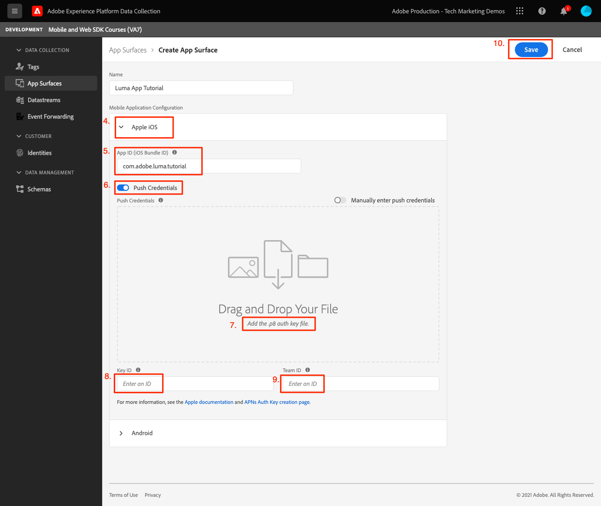
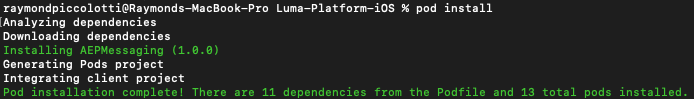
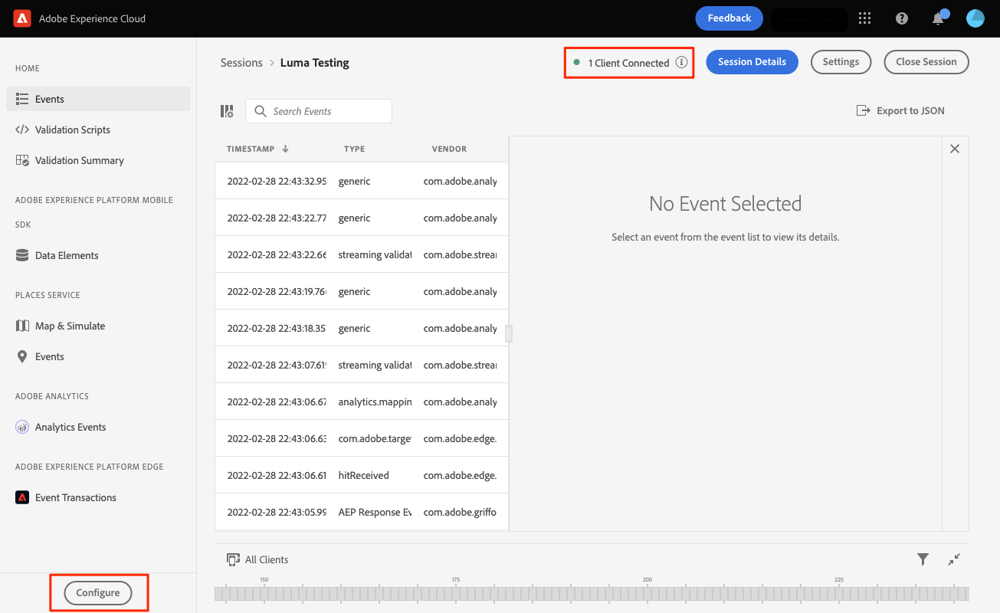
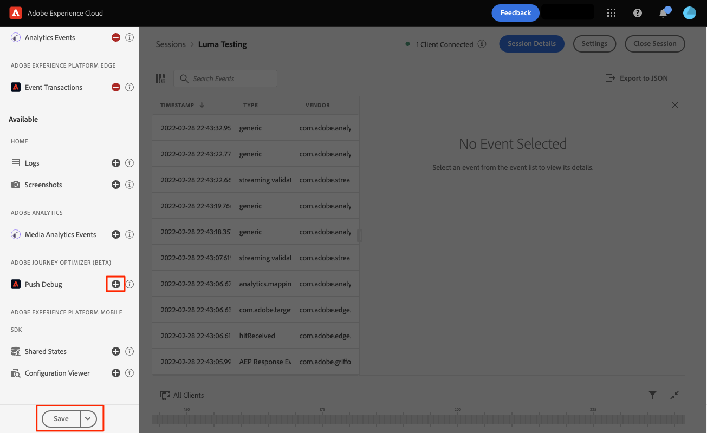

# Adobe Journey Optimizer push-meddelanden

Lär dig skapa push-meddelanden för mobilappar med Platform Mobile SDK och Adobe Journey Optimizer.

>[!INFO]
>
> Den här självstudiekursen kommer att ersättas med en ny självstudiekurs om hur du använder en ny exempelapp i slutet av november 2023

Med Journey Optimizer kan ni skapa resor och skicka meddelanden till riktade målgrupper. Innan du skickar push-meddelanden med Journey Optimizer måste du se till att rätt konfigurationer och integreringar finns på plats. Om du vill veta mer om dataflödet för push-meddelanden i Adobe Journey Optimizer kan du läsa [dokumentationen](https://experienceleague.adobe.com/docs/journey-optimizer/using/configuration/configuration-message/push-config/push-gs.html).

>[!NOTE]
>
>Den här lektionen är valfri och gäller endast för Adobe Journey Optimizer-användare som vill skicka push-meddelanden.


## Förutsättningar

* App med SDK:er har installerats och konfigurerats.
* Åtkomst till Adobe Journey Optimizer och tillräcklig behörighet enligt beskrivningen [här](https://experienceleague.adobe.com/docs/journey-optimizer/using/configuration/configuration-message/push-config/push-configuration.html?lang=en). Du behöver även tillräcklig behörighet för följande Adobe Journey Optimizer-funktioner.
   * Skapa en appyta.
   * Skapa en resa
   * Skapa ett meddelande.
   * Skapa meddelandeförinställningar.
* Betalat Apple-utvecklarkonto med tillräcklig behörighet för att skapa certifikat, identifierare och nycklar.
* Fysisk iOS-enhet för testning.

## Utbildningsmål

I den här lektionen kommer du att:

* Registrera program-ID med Apple Push Notification service (APN).
* Skapa en **[!UICONTROL Appyta]** i AJO.
* Uppdatera dina **[!UICONTROL schema]** för att inkludera push-meddelandefält.
* Installera och konfigurera **[!UICONTROL Adobe Journey Optimizer]** taggtillägg.
* Uppdatera programmet så att det innehåller AJO-taggtillägget.
* Validera inställningar i Assurance.
* Skicka ett testmeddelande.


## Registrera program-ID med APN

Följande steg är inte Adobe Experience Cloud-specifika och har utformats för att vägleda dig genom APN-konfigurationen.

### Skapa en `.p8` privat nyckel

1. Gå till Apple utvecklarportal **[!UICONTROL Tangenter]**.
1. Skapa en tangent genom att klicka på +-ikonen.
   

1. Ange en **[!UICONTROL Nyckelnamn]**.
1. Välj **[!UICONTROL APN]** kryssrutan.
1. Välj **[!UICONTROL Fortsätt]**.
   
1. Granska konfigurationen och välj **[!UICONTROL Registrera]**.
1. Ladda ned `.p8` privat nyckel. Den används i appytskonfigurationen.
1. Anteckna **[!UICONTROL Nyckel-ID]**. Den används i appytskonfigurationen.

Ytterligare dokumentation kan [hittades här](https://help.apple.com/developer-account/#/devcdfbb56a3).

### Hämta ditt Apple-utvecklarteam-ID

1. Gå till Apple utvecklarportal **[!UICONTROL medlemskap]**.
1. Dina **[!UICONTROL Team-ID]** visas tillsammans med din andra medlemskapsinformation. Den används i appytskonfigurationen.

## Lägg till push-autentiseringsuppgifter för appen i datainsamlingen

1. Från [Gränssnitt för datainsamling](https://experience.adobe.com/data-collection/)väljer du fliken Appytor i den vänstra panelen.
1. Välj **[!UICONTROL Skapa appytor]** för att skapa en konfiguration.
   
1. Ange en **[!UICONTROL Namn]** för konfigurationen, till exempel `Luma App Tutorial`  .
1. Från Mobile Application Configuration (Konfigurera mobilprogram) väljer du **[!UICONTROL Apple iOS]**.
1. Ange mobilappens paket-ID i fältet Program-ID (iOS Bundle-ID). Om du följer med i Luma-appen är värdet `com.adobe.luma.tutorial`.
1. Aktivera **[!UICONTROL Push-autentiseringsuppgifter]** för att lägga till dina inloggningsuppgifter.
1. Dra och släpp `.p8` **Autentiseringsnyckel för push-meddelanden i Apple** -fil.
1. Ange nyckel-ID, en sträng med 10 tecken som tilldelats när `p8` auth key. Den finns under fliken Tangenter i **Certifikat, identifierare och profiler** sida.
1. Ange ditt team-ID. Detta är ett strängvärde som finns under **medlemskap** -fliken.
1. Välj **[!UICONTROL Spara]**.
   

## Installera tillägget Adobe Journey Optimizer-taggar

1. Navigera till [!UICONTROL Taggar] > [!UICONTROL Tillägg] > [!UICONTROL Katalog]och hitta **[!UICONTROL Adobe Journey Optimizer]** tillägg.
1. Installera tillägget.
   
1. Välj `CJM Push Tracking Experience Event Dataset` Adobe Experience Platform dataset.
   
1. Välj **[!UICONTROL Spara i bibliotek och bygge]**.

>[!NOTE]
>Kontakta kundtjänst om du inte ser&quot;CJM Push Tracking Experience Event Dataset&quot; som ett alternativ.
>

## Implementera Adobe Journey Optimizer i appen

Som tidigare nämnts tillhandahåller installation av ett mobiltaggtillägg bara konfigurationen. Därefter måste du installera och registrera SDK för meddelanden. Om de här stegen inte är tydliga kan du läsa [Installera SDK:er](install-sdks.md) -avsnitt.

>[!NOTE]
>
>Om du har slutfört [Installera SDK:er](install-sdks.md) är SDK redan installerat och du kan hoppa till steg 7.

1. Öppna `Podfile` och lägg till följande rad och spara filen.

   `pod 'AEPMessaging', '~>1'`
1. Öppna terminalen och navigera till mappen som innehåller din `Podfile`.
1. Installera SDK genom att köra kommandot `pod install`.
   
1. Öppna XCode och navigera till `AppDelegate.swift`.
1. Lägg till följande i din lista över importer.

   `import AEPMessaging`
1. Lägg till `Messaging.self` till den array med tillägg som du registrerar.
1. Lägg till följande funktion i filen.

   ```swift
   func application(_: UIApplication, didRegisterForRemoteNotificationsWithDeviceToken deviceToken: Data) {
       MobileCore.setPushIdentifier(deviceToken)
   }
   ```

   Den här funktionen hämtar den enhetstoken som är unik för den enhet som appen är installerad på och skickar till Adobe/Apple för push-meddelandeleverans.

## Validera genom att skicka ett push-testmeddelande

1. Granska [installationsanvisningar](assurance.md) -avsnitt.
1. Installera appen på den fysiska enheten.
1. Starta appen med den URL som skapas av försäkringen.
1. Skicka appen till bakgrunden.
1. Välj **[!UICONTROL Konfigurera]**.
   
1. Välj **[!UICONTROL +]** knapp bredvid **[!UICONTROL Push-felsökning]**.
1. Välj **[!UICONTROL Spara]**.
   
1. Välj **[!UICONTROL Push-felsökning]** från vänster navigering.
1. Välj din enhet från **[!UICONTROL Klientlista]**.
1. Bekräfta att inga fel visas.
   
1. Bläddra nedåt och markera **[!UICONTROL Skicka meddelande om testpush]**.
1. Bekräfta att du inte tar emot meddelanden och fel och att du får meddelandet på din enhet.
   

Nästa: **[Slutsats och nästa steg](conclusion.md)**

>[!NOTE]
>
>Tack för att du lade ned din tid på att lära dig om Adobe Experience Platform Mobile SDK. Om du har frågor, vill dela allmän feedback eller har förslag på framtida innehåll kan du dela med dig av dem om detta [Experience League diskussionsinlägg](https://experienceleaguecommunities.adobe.com/t5/adobe-experience-platform-launch/tutorial-discussion-implement-adobe-experience-cloud-in-mobile/td-p/443796)