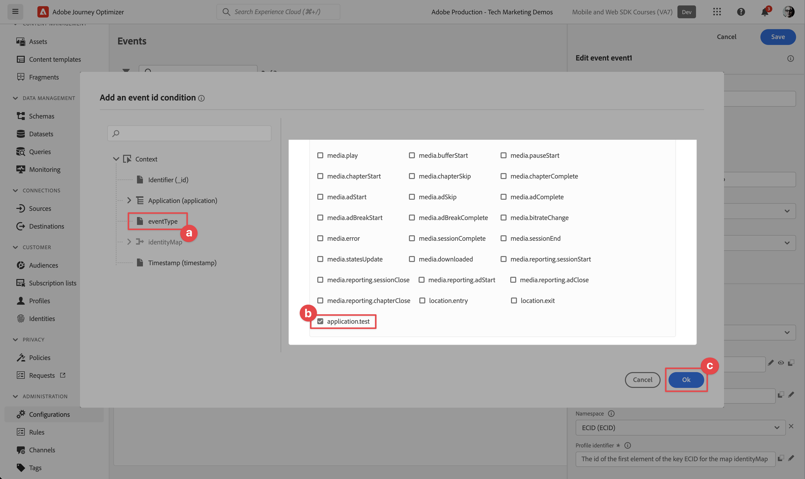

# Skapa och skicka push-meddelanden

Lär dig skapa push-meddelanden för mobilappar med Experience Platform Mobile SDK och Journey Optimizer.

Med Journey Optimizer kan ni skapa resor och skicka meddelanden till utvalda målgrupper. Innan du skickar push-meddelanden med Journey Optimizer måste du se till att rätt konfigurationer och integreringar finns på plats. Om du vill veta mer om dataflödet för push-meddelanden i Journey Optimizer kan du läsa [dokumentation](https://experienceleague.adobe.com/docs/journey-optimizer/using/push/push-config/push-gs.html).


>[!NOTE]
>
>Den här lektionen är valfri och gäller endast för Journey Optimizer-användare som vill skicka push-meddelanden.


## Förutsättningar

* Programmet har skapats och körts med SDK:er installerade och konfigurerade.
* Konfigurera appen för Adobe Experience Platform.
* Åtkomst till Journey Optimizer och tillräcklig behörighet enligt beskrivningen [här](https://experienceleague.adobe.com/docs/journey-optimizer/using/push/push-config/push-configuration.html?lang=en). Du behöver även tillräcklig behörighet för följande Journey Optimizer-funktioner.
   * Skapa en appyta.
   * Skapa en resa.
   * Skapa ett meddelande.
   * Skapa meddelandeförinställningar.
* **Betalat Apple-utvecklarkonto** med tillräcklig åtkomst för att skapa certifikat, identifierare och nycklar.
* Fysisk iOS-enhet eller simulator för testning.

## Utbildningsmål

I den här lektionen ska du

* Registrera program-ID med Apple Push Notification-tjänsten (APN:er).
* Skapa en appyta i Journey Optimizer.
* Uppdatera ditt schema så att det inkluderar push-meddelandefält.
* Installera och konfigurera taggtillägget för Journey Optimizer.
* Uppdatera appen för att registrera Journey Optimizer-taggtillägget.
* Validera inställningar i Assurance.
* Skicka ett testmeddelande från Assurance
* Definiera din egen push-meddelandehändelse, resa och upplevelse i Journey Optimizer.
* Skicka ditt eget push-meddelande inifrån appen.


## Inställningar

>[!TIP]
>
>Om du redan har konfigurerat miljön som en del av [Journey Optimizer-meddelanden i appen](journey-optimizer-inapp.md) kan du redan ha utfört några av stegen i det här inställningsavsnittet.

### Registrera program-ID med APN:er

Följande steg är inte Adobe Experience Cloud-specifika och har utformats för att vägleda dig genom APN-konfigurationen.

#### Skapa en privat nyckel

1. Gå till Apple utvecklarportal **[!UICONTROL Tangenter]**.
1. Om du vill skapa en nyckel väljer du **[!UICONTROL +]**.
   

1. Ange en **[!UICONTROL Nyckelnamn]**.
1. Välj **[!UICONTROL Tjänsten Apple Push Notification] (APN)** kryssrutan.
1. Välj **[!UICONTROL Fortsätt]**.
   
1. Granska konfigurationen och välj **[!UICONTROL Registrera]**.
1. Ladda ned `.p8` privat nyckel. Den används senare i konfigurationen för appytan i den här lektionen.
1. Anteckna **[!UICONTROL Nyckel-ID]**. Den används i appytskonfigurationen.
1. Anteckna **[!UICONTROL Team-ID]**. Den används i appytskonfigurationen.
   

Ytterligare dokumentation kan [hittades här](https://help.apple.com/developer-account/#/devcdfbb56a3).

#### Lägg till en appyta i datainsamling

1. Från [Gränssnitt för datainsamling](https://experience.adobe.com/data-collection/), markera **[!UICONTROL Appytor]** till vänster.
1. Om du vill skapa en konfiguration väljer du **[!UICONTROL Skapa appyta]**.
   
1. Ange en **[!UICONTROL Namn]** för konfigurationen, till exempel `Luma App Tutorial`  .
1. Från **[!UICONTROL Konfiguration av mobilprogram]**, markera **[!UICONTROL Apple iOS]**.
1. Ange programpaket-ID för mobilappen i **[!UICONTROL Program-ID (iOS Bundle-ID)]** fält. Exempel,  `com.adobe.luma.tutorial.swiftui`.
1. Aktivera **[!UICONTROL Push-autentiseringsuppgifter]** för att lägga till dina inloggningsuppgifter.
1. Dra och släpp `.p8` **Autentiseringsnyckel för push-meddelanden i Apple** -fil.
1. Ange **[!UICONTROL Nyckel-ID]**, en sträng med 10 tecken som tilldelas när `p8` auth key. Den finns under **[!UICONTROL Tangenter]** i **Certifikat, identifierare och profiler** på Apple Developer Portal. Se även [Skapa en privat nyckel](#create-a-private-key).
1. Ange **[!UICONTROL Team-ID]**. Team-ID är ett värde som finns under **medlemskap** eller högst upp på Apple Developer Portal-sidan. Se även [Skapa en privat nyckel](#create-a-private-key).
1. Välj **[!UICONTROL Spara]**.

   

### Uppdatera datastream-konfiguration

Uppdatera Experience Edge-konfigurationen för att säkerställa att data som skickas från din mobilapp till Edge Network vidarebefordras till Journey Optimizer.

1. I gränssnittet för datainsamling väljer du **[!UICONTROL Datastreams]** och välj till exempel din datastream **[!DNL Luma Mobile App]**.
1. Välj  for **[!UICONTROL Experience Platform]** och markera  **[!UICONTROL Redigera]** på snabbmenyn.
1. I **[!UICONTROL Datastreams]** >  >  **[!UICONTROL Adobe Experience Platform]** skärm:

   1. Om inte redan är markerat väljer du **[!UICONTROL AJO-push-profildatauppsättning]** från **[!UICONTROL Profildatauppsättning]**. Den här profildatauppsättningen krävs när du använder `MobileCore.setPushIdentifier` API-anrop (se [Registrera enhetstoken för push-meddelanden](#register-device-token-for-push-notifications)) som ser till att den unika identifieraren för push-meddelanden (alias push-identifierare) lagras som en del av användarens profil.

   1. **[!UICONTROL Adobe Journey Optimizer]** är markerat. Se [Adobe Experience Platform-inställningar](https://experienceleague.adobe.com/docs/experience-platform/datastreams/configure.html?lang=en#aep) för mer information.

   1. Om du vill spara din datastream-konfiguration väljer du **[!UICONTROL Spara]**.

   


### Installera tillägget Journey Optimizer-taggar

För att din app ska fungera med Journey Optimizer måste du uppdatera din taggegenskap.

1. Navigera till **[!UICONTROL Taggar]** > **[!UICONTROL Tillägg]** > **[!UICONTROL Katalog]**,
1. Öppna egenskapen, till exempel **[!DNL Luma Mobile App Tutorial]**.
1. Välj **[!UICONTROL Katalog]**.
1. Sök efter **[!UICONTROL Adobe Journey Optimizer]** tillägg.
1. Installera tillägget.
1. I **[!UICONTROL Installera tillägg]** dialog
   1. Välj en miljö, till exempel **[!UICONTROL Utveckling]**.
   1. Välj **[!UICONTROL AJO Push Tracking Experience, händelsedatauppsättning]** datauppsättning från **[!UICONTROL Händelsedatauppsättning]** lista.
   1. Välj **[!UICONTROL Spara i bibliotek och bygge]**.
      

>[!NOTE]
>
>Om du inte ser **[!UICONTROL AJO Push Tracking Experience, händelsedatauppsättning]** som ett alternativ, kontakta kundtjänst.
>

## Validera inställningar med Assurance

1. Granska [installationsanvisningar](assurance.md#connecting-to-a-session) för att ansluta simulatorn eller enheten till Assurance.
1. Välj **[!UICONTROL Konfigurera]**.
   
1. Välj  nästa **[!UICONTROL Push-felsökning]**.
1. Välj **[!UICONTROL Spara]**.
   
1. Välj **[!UICONTROL Push-felsökning]** från vänster navigering.
1. Välj **[!UICONTROL Validera inställningar]** -fliken.
1. Välj din enhet från **[!UICONTROL Klient]** lista.
1. Bekräfta att inga fel visas.
   
1. Välj **[!UICONTROL Skicka testöverföring]** -fliken.
1. (valfritt) Ändra standardinformationen för **[!UICONTROL Titel]** och **[!UICONTROL Brödtext]**
1. Välj  **[!UICONTROL Skicka meddelande om testpush]**.
1. Kontrollera **[!UICONTROL Testresultat]**.
1. Du bör se push-meddelandet för testningen visas i din app.

   


## Signering

Signera Luma-appen krävs för att skicka push-meddelanden och **kräver ett betalt Apple-utvecklarkonto**.

Så här uppdaterar du signeringen för din app:

1. Gå till appen i Xcode.
1. Välj **[!DNL Luma]** i projektnavigatorn.
1. Välj **[!DNL Luma]** mål.
1. Välj **Signering och funktioner** -fliken.
1. Konfigurera **[!UICONTROL Hantera signering automatiskt]**, **[!UICONTROL Team]** och **[!UICONTROL Paketidentifierare]** eller använd dina specifika Apple-utvecklingskonfigurationer.

   >[!IMPORTANT]
   >
   >Se till att du använder en _unik_ källidentifierare och ersätt `com.adobe.luma.tutorial.swiftui` källidentifierare eftersom varje källidentifierare måste vara unik. Vanligtvis använder du ett omvänt DNS-format för paket-ID-strängar, som `com.organization.brand.uniqueidentifier`. I den färdiga versionen av den här självstudiekursen används `com.adobe.luma.tutorial.swiftui`.


   {zoomable=&quot;yes&quot;}


## Lägg till funktioner för push-meddelanden i appen

>[!IMPORTANT]
>
>Om du vill implementera och testa push-meddelanden i en iOS-app måste du ha en **betald** Apple utvecklarkonto. Om du inte har ett betalt Apple-utvecklarkonto kan du hoppa över resten av den här lektionen.

1. Välj **[!DNL Luma]** från **[!UICONTROL MÅLGRUPPER]** väljer du **[!UICONTROL Signering och funktioner]** väljer du **[!UICONTROL + Funktioner]** knapp och sedan markera **[!UICONTROL Push-meddelanden]**. Detta gör att din app kan ta emot push-meddelanden.

1. Sedan måste du lägga till ett meddelandetillägg i programmet. Gå tillbaka till **[!DNL General]** och väljer **[!UICONTROL +]** ikonen längst ned i **[!UICONTROL MÅLGRUPPER]** -avsnitt.

1. Du uppmanas att välja en mall för det nya målet. Välj **[!UICONTROL Meddelandetjänsttillägg]** välj **[!UICONTROL Nästa]**.

1. I nästa fönster använder du `NotificationExtension` som tilläggets namn och klicka på **[!UICONTROL Slutför]** -knappen.

Du bör nu ha ett tillägg för push-meddelanden tillagt i appen, som liknar skärmen nedan.


## Implementera Journey Optimizer i appen

Som tidigare nämnts tillhandahåller installation av ett mobiltaggtillägg bara konfigurationen. Därefter måste du installera och registrera Messaging SDK. Om de här stegen inte är tydliga går du igenom [Installera SDK:er](install-sdks.md) -avsnitt.

>[!NOTE]
>
>Om du har slutfört [Installera SDK:er](install-sdks.md) är SDK redan installerat och du kan hoppa över det här steget.
>

1. I Xcode kontrollerar du att [AEP Messaging](https://github.com/adobe/aepsdk-messaging-ios) läggs till i listan över paket i paketberoenden. Se [Swift Package Manager](install-sdks.md#swift-package-manager).
1. Navigera till **[!DNL Luma]** > **[!DNL Luma]** > **[!UICONTROL AppDelegate]** i Xcode Project-navigatorn.
1. Säkerställ `AEPMessaging` är en del av din lista över importer.

   `import AEPMessaging`

1. Säkerställ `Messaging.self` är en del av den array med tillägg som du registrerar.

   ```swift
   let extensions = [
       AEPIdentity.Identity.self,
       Lifecycle.self,
       Signal.self,
       Edge.self,
       AEPEdgeIdentity.Identity.self,
       Consent.self,
       UserProfile.self,
       Places.self,
       Messaging.self,
       Optimize.self,
       Assurance.self
   ]
   ```

## Registrera enhetstoken för push-meddelanden

1. Lägg till [`MobileCore.setPushIdentifier`](https://developer.adobe.com/client-sdks/documentation/mobile-core/api-reference/#setpushidentifier) API till `func application(_ application: UIApplication, didRegisterForRemoteNotificationsWithDeviceToken deviceToken: Data)` funktion.

   ```swift
   // Send push token to Mobile SDK
   MobileCore.setPushIdentifier(deviceToken)
   ```

   Den här funktionen hämtar enhetstoken som är unik för den enhet som appen är installerad på. Ställer sedan in token för leverans av push-meddelanden med den konfiguration som du har konfigurerat och som är beroende av Apple Push Notification-tjänst (APN:er).

>[!IMPORTANT]
>
>The `MobileCore.updateConfigurationWith(configDict: ["messaging.useSandbox": true])` Anger om push-meddelanden använder en APN-sandlåda eller produktionsserver för att skicka push-meddelanden. När du testar din app i simulatorn eller på en enhet ska du kontrollera att `messaging.useSandbox` är inställd på `true` så att du får push-meddelanden. När du distribuerar din app för produktion för att testa med Apple Testflight måste du ange `messaging.useSandbox` till `false` annars kan produktionsappen inte ta emot push-meddelanden.


## Skapa ett eget push-meddelande

Om du vill skapa ett eget push-meddelande måste du definiera en händelse i Journey Optimizer som utlöser en resa som tar hand om att skicka ett push-meddelande.

### Uppdatera ditt schema

Du ska definiera en ny händelsetyp som ännu inte är tillgänglig som en del av listan med händelser som definieras i ditt schema. Du använder den här händelsetypen senare när du utlöser push-meddelanden.

1. I användargränssnittet för Journey Optimizer väljer du **[!UICONTROL Scheman]** från den vänstra listen.
1. Välj **[!UICONTROL Bläddra]** i tabbfältet.
1. Välj ditt schema, till exempel **[!DNL Luma Mobile App Event Schema]** för att öppna den.
1. I schemaredigeraren:
   1. Välj **[!UICONTROL eventType]** fält.
   1. I **[!UICONTROL Fältegenskaper]** bläddra nedåt för att se en lista över möjliga värden för händelsetypen. Välj **[!UICONTROL Lägg till rad]** och lägga till `application.test` som **[!UICONTROL VÄRDE]** och `[!UICONTROL Test event for push notification]` som `DISPLAY NAME`.
   1. Välj **[!UICONTROL Använd]**.
   1. Välj **[!UICONTROL Spara]**.
      

### Definiera en händelse

Med händelser i Journey Optimizer kan du utlösa resor åt gången för att skicka meddelanden, till exempel push-meddelanden. Se [Om händelser](https://experienceleague.adobe.com/docs/journey-optimizer/using/configuration/configure-journeys/events-journeys/about-events.html?lang=en) för mer information.

1. I användargränssnittet för Journey Optimizer väljer du **[!UICONTROL Konfigurationer]** från den vänstra listen.

1. I **[!UICONTROL Kontrollpanel]** väljer du **[!UICONTROL Hantera]** knappen i **[!UICONTROL Händelser]** platta.

1. I **[!UICONTROL Händelser]** skärm, välja **[!UICONTROL Skapa händelse]**.

1. I **[!UICONTROL Redigera händelse1]** ruta:

   1. Retur `LumaTestEvent` som **[!UICONTROL Namn]** av händelsen.
   1. Ange en **[!UICONTROL Beskrivning]**, till exempel `Test event to trigger push notifications in Luma app`.

   1. Välj det händelseschema för mobilappsupplevelsen som du skapade tidigare i [Skapa ett XDM-schema](create-schema.md) från **[!UICONTROL Schema]** lista, till exempel **[!DNL Luma Mobile App Event Schema v.1]**.
   1. Välj  bredvid **[!UICONTROL Fält]** lista.

      

      I **[!UICONTROL Fält]** kontrollerar du att följande fält är markerade (ovanpå de standardfält som alltid är markerade (**[!UICONTROL _id]**, **[!UICONTROL id]** och **[!UICONTROL tidsstämpel]**). Du kan växla mellan **[!UICONTROL Markerad]**, **[!UICONTROL Alla]** och **[!UICONTROL Primär]** eller använder  fält.

      * **[!UICONTROL Identifierat program (id)]**,
      * **[!UICONTROL Händelsetyp (eventType)]**,
      * **[!UICONTROL Primär (primär)]**.

      

      Välj sedan **[!UICONTROL OK]**.

   1. Välj  bredvid **[!UICONTROL Händelse-id-villkor]** fält.

      1. I **[!UICONTROL Lägg till ett händelse-id-villkor]** dialogruta, dra och släppa **[!UICONTROL Händelsetyp (eventType)]** till **[!UICONTROL Dra och släpp ett element här]**.
      1. Bläddra nedåt i poverteraren och välj **[!UICONTROL application.test]** (som är den händelsetyp som du lade till tidigare i listan över händelsetyper som en del av [Uppdatera ditt schema](#update-your-schema)). Bläddra sedan uppåt och uppåt och välj **[!UICONTROL OK]**.
      1. Välj **[!UICONTROL OK]** för att spara villkoret.
         

   1. Välj **[!UICONTROL ECID (ECID)]** från **[!UICONTROL Namnutrymme]** lista. Automatiskt **[!UICONTROL Profilidentifierare]** fältet är ifyllt med **[!UICONTROL ID för det första elementet i nyckel-ECID för map identityMap]**.
   1. Välj **[!UICONTROL Spara]**.
      

Du har just skapat en händelsekonfiguration som baseras på det händelseschema för mobilappsupplevelser som du skapade tidigare som en del av den här självstudien. Den här händelsekonfigurationen kommer att filtrera inkommande upplevelsehändelser med din specifika händelsetyp (`application.test`), så bara händelser av den typen, som initierats från din mobilapp, kommer att utlösa den resa du bygger i nästa steg. I ett verkligt scenario kanske du vill skicka push-meddelanden från en extern tjänst, men samma koncept gäller: från det externa programmet skickar du en upplevelsehändelse till Experience Platform som innehåller specifika fält som du kan använda för att tillämpa villkor på innan dessa händelser utlöser en resa.

### Skapa resan

Nästa steg är att skapa den resa som utlöser sändningen av push-meddelandet när du får den rätta händelsen.

1. I användargränssnittet för Journey Optimizer väljer du **[!UICONTROL Resor]** från den vänstra listen.
1. Välj **[!UICONTROL Skapa resa]**.
1. I **[!UICONTROL Reseegenskaper]** panel:

   1. Ange en **[!UICONTROL Namn]** för resan, till exempel `Luma - Test Push Notification Journey`.
   1. Ange en **[!UICONTROL Beskrivning]** för resan, till exempel `Journey for test push notifications in Luma mobile app`.
   1. Säkerställ **[!UICONTROL Tillåt återinträde]** är markerad och inställd **[!UICONTROL Vänteperiod för återinträde]** till **[!UICONTROL 30]** **[!UICONTROL Sekunder]**.
   1. Välj **[!UICONTROL OK]**.
      

1. Tillbaka på arbetsytan, från **[!UICONTROL HÄNDELSER]**, dra och släpp  **[!DNL LumaTestEvent]** på arbetsytan där den visas **[!UICONTROL Välj en anmälningshändelse eller läsmålgruppsaktivitet]**.

   * I **[!UICONTROL Händelser: LumaTestEvent]** panel, ange en **[!UICONTROL Etikett]**, till exempel `Luma Test Event`.

1. Från **[!UICONTROL ÅTGÄRDER]** listruta, dra och släppa  **[!UICONTROL Push]** på  till höger om **[!DNL LumaTestEvent]** aktivitet. I **[!UICONTROL Åtgärder: Skjut]** ruta:

   1. Ange en **[!UICONTROL Etikett]**, till exempel `Luma Test Push Notification`, tillhandahåller **[!UICONTROL Beskrivning]**, till exempel `Test push notification for Luma mobile app`, markera **[!UICONTROL Transactional]** från **[!UICONTROL Kategori]** lista och markera **[!DNL Luma]** från **[!UICONTROL Penselyta]**.
   1. Välj  **[!UICONTROL Redigera innehåll]** för att börja redigera det faktiska push-meddelandet.
      

      I **[!UICONTROL Push-meddelande]** redigerare:

      1. Ange en **[!UICONTROL Titel]**, till exempel `Luma Test Push Notification` och ange **[!UICONTROL Brödtext]**, till exempel `Test push notification for Luma mobile app`.
      1. Om du vill spara och lämna redigeraren väljer du .
         

   1. Om du vill spara och slutföra definitionen för push-meddelanden väljer du **[!UICONTROL OK]**.

1. Resan ska se ut så här nedan. Välj **[!UICONTROL Publicera]** för att publicera och aktivera din resa.
   


## Utlös push-meddelandet

Du har alla ingredienser på plats för att skicka ett push-meddelande. Det som återstår är hur detta push-meddelande ska utlösas. Det är alltså detsamma som du har sett tidigare: skicka bara en upplevelsehändelse med rätt nyttolast (som i [Händelser](events.md)).

Den här gången har den upplevelsehändelse du ska skicka inte skapats för att skapa en enkel XDM-ordlista. Du kommer att använda en `struct` som representerar en nyttolast för push-meddelanden. Att definiera en dedikerad datatyp är ett annat sätt att implementera händelsenyttolaster för att skapa upplevelser i ditt program.

1. Navigera till **[!DNL Luma]** > **[!DNL Luma]** > **[!UICONTROL Modell]** > **[!UICONTROL XML]** > **[!UICONTROL TestPushPayload]** i Xcode Project navigator och kontrollera koden.

   ```swift
   import Foundation
   
   // MARK: - TestPush
   struct TestPushPayload: Codable {
      let application: Application
      let eventType: String
   }
   
   // MARK: - Application
   struct Application: Codable {
      let id: String
   }
   ```

   Koden är en representation av följande enkla nyttolast som du ska skicka för att utlösa testresan för push-meddelanden

   ```json
   {
      "eventType": string,
      "application" : [
          "id": string
      ]
   }
   ```

1. Navigera till **[!DNL Luma]** > **[!DNL Luma]** > **[!DNL Utils]** > **[!UICONTROL MobileSDK]** i Xcode Project navigator och lägg till följande kod i `func sendTestPushEvent(applicationId: String, eventType: String)`:

   ```swift
   // Create payload and send experience event
   Task {
       let testPushPayload = TestPushPayload(
           application: Application(
               id: applicationId
           ),
           eventType: eventType
       )
       // send the final experience event
       await sendExperienceEvent(
           xdm: testPushPayload.asDictionary() ?? [:]
       )
   }
   ```

   Den här koden skapar en `testPushPayload` -instans med de parametrar som har angetts för funktionen (`applicationId` och `eventType`) och sedan anrop `sendExperienceEvent` när nyttolasten konverteras till ett lexikon. Den här koden, som nu även tar hänsyn till asynkrona aspekter av att anropa Adobe Experience Platform SDK genom att använda Swift-modellen för samtidighet baserat på `await` och `async`.

1. Navigera till **[!DNL Luma]** > **[!DNL Luma]** > **[!DNL Views]** > **[!DNL General]** > **[!UICONTROL ConfigView]** i Xcode Project-navigatorn. I definitionen för knappen Push Notification (Push-meddelande) lägger du till följande kod för att skicka händelsenyttolasten för testpush-meddelanden för att utlösa din resa när användaren trycker på knappen.

   ```swift
   // Setting parameters and calling function to send push notification
   Task {
       let eventType = testPushEventType
       let applicationId = Bundle.main.bundleIdentifier ?? "No bundle id found"
       await MobileSDK.shared.sendTestPushEvent(applicationId: applicationId, eventType: eventType)
   }
   ```


## Validera med din app

1. Återskapa och kör appen i simulatorn eller på en fysisk enhet från Xcode med .

1. Gå till **[!UICONTROL Inställningar]** -fliken.

1. Tryck **[!UICONTROL Push-meddelande]**. Push-meddelandet visas i din app.

   


## Nästa steg

Nu bör du ha alla verktyg som behövs för att hantera push-meddelanden i appen. Du kan till exempel skapa en resa i Journey Optimizer som skickar ett välkomstmeddelande när en användare av appen loggar in. Eller ett bekräftelsemeddelande när en användare köper en produkt i appen. Eller anger geofence för en plats (som du kommer att se i [Platser](places.md) lektion).

>[!SUCCESS]
>
>Du har nu aktiverat appen för push-meddelanden med Journey Optimizer och Journey Optimizer-tillägget för Experience Platform Mobile SDK.
>
>Tack för att du lade ned din tid på att lära dig om Adobe Experience Platform Mobile SDK. Om du har frågor, vill dela allmän feedback eller har förslag på framtida innehåll kan du dela dem om detta [Experience League diskussionsinlägg](https://experienceleaguecommunities.adobe.com/t5/adobe-experience-platform-data/tutorial-discussion-implement-adobe-experience-cloud-in-mobile/td-p/443796).

Nästa: **[Skapa och skicka meddelanden i appen](journey-optimizer-inapp.md)**
