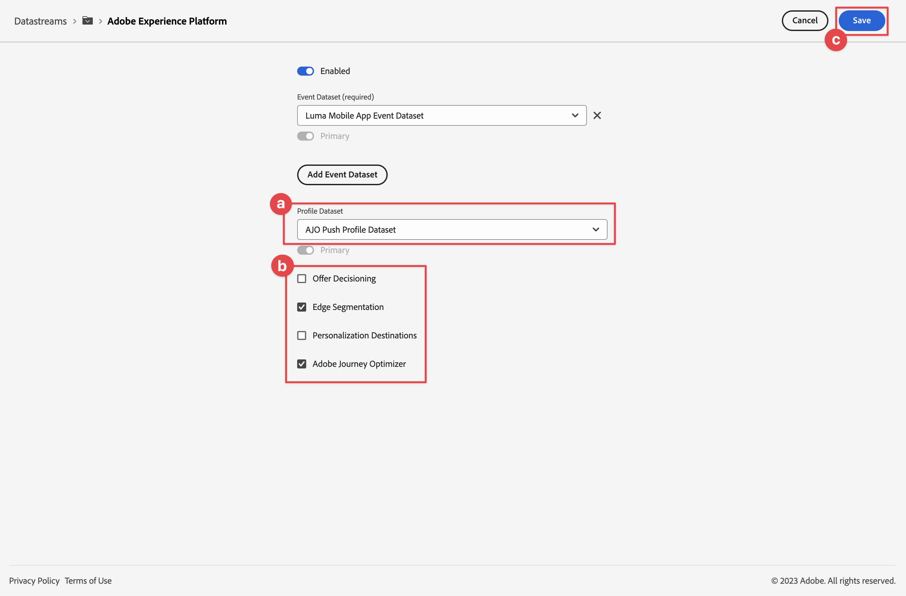
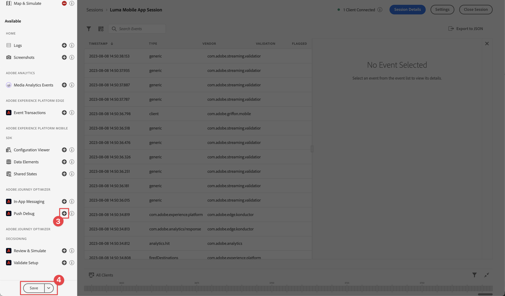
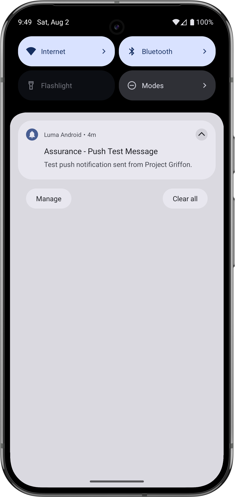

# Skapa och skicka push-meddelanden

Lär dig skapa push-meddelanden för mobilappar med Experience Platform Mobile SDK och Journey Optimizer.

Med Journey Optimizer kan ni skapa resor och skicka meddelanden till utvalda målgrupper. Innan du skickar push-meddelanden med Journey Optimizer måste du se till att rätt konfigurationer och integreringar finns på plats. Mer information om dataflödet för push-meddelanden i Journey Optimizer finns i [dokumentationen](https://experienceleague.adobe.com/sv/docs/journey-optimizer/using/channels/push/push-config/push-gs).

{zoomable="yes"}

>[!NOTE]
>
>Den här lektionen är valfri och gäller endast för Journey Optimizer-användare som vill skicka push-meddelanden.


## Förhandskrav

* Programmet har skapats och körts med SDK:er installerade och konfigurerade.
* Konfigurera appen för Adobe Experience Platform.
* Åtkomst till Journey Optimizer och [tillräckliga behörigheter](https://experienceleague.adobe.com/sv/docs/journey-optimizer/using/channels/push/push-config/push-configuration). Du behöver även tillräcklig behörighet för följande Journey Optimizer-funktioner.
   * Skapa en push-autentiseringsuppgift.
   * Skapa en push-kanalskonfiguration.
   * Skapa en resa.
   * Skapa ett meddelande.
   * Skapa meddelandeförinställningar.
* För iOS är ett **betalt Apple-utvecklarkonto** med tillräcklig behörighet för att skapa certifikat, identifierare och nycklar.
* För Android är ett Google-utvecklarkonto med tillräcklig behörighet för att skapa certifikat och nycklar.
* Fysisk iOS- eller Android-enhet eller simulator för testning.

## Utbildningsmål

I den här lektionen ska du

* Registrera program-ID med Apple Push Notification-tjänsten (APN:er).
* Skapa en kanalkonfiguration i Journey Optimizer.
* Uppdatera ditt schema så att det inkluderar push-meddelandefält.
* Installera och konfigurera taggtillägget för Journey Optimizer.
* Uppdatera appen för att registrera Journey Optimizer-taggtillägget.
* Validera konfigurationen i Assurance.
* Skicka ett testmeddelande från Assurance
* Definiera din egen push-meddelandehändelse, resa och upplevelse i Journey Optimizer.
* Skicka ditt eget push-meddelande inifrån appen.


## Inställningar

>[!TIP]
>
>Om du redan har konfigurerat din miljö som en del av [Journey Optimizer-lektionen för meddelanden i appen](journey-optimizer-inapp.md) kanske du redan har utfört några av stegen i det här installationsavsnittet.

### Skapa push-autentiseringsuppgifter

För push-meddelanden måste du först registrera din app för push-meddelanden.

>[!BEGINTABS]

>[!TAB iOS]

Följande steg är inte Adobe Experience Cloud-specifika och har utformats för att vägleda dig genom APN-konfigurationen.

1. Gå till **[!UICONTROL Keys]** på Apple utvecklarportal.
1. Välj **[!UICONTROL +]** om du vill skapa en nyckel.

   {zoomable="yes"}

1. Ange en **[!UICONTROL Key Name]**.
1. Välj **[!UICONTROL Apple Push Notification service] (APN:er)** och välj **[!UICONTROL Configure]**.
   1. Välj **[!UICONTROL Configure Key]** i listrutan **[!UICONTROL Sandbox & Production]** på skärmen **[!UICONTROL Environment]**.
   1. Välj **[!UICONTROL Save]**.
1. Välj **[!UICONTROL Continue]**.

   {zoomable="yes"}

1. Granska konfigurationen och välj **[!UICONTROL Register]**.
1. Hämta den privata nyckeln `.p8`. Den används i nästa övning när du konfigurerar push-autentiseringsuppgifter för Journey Optimizer.
1. Notera **[!UICONTROL Key ID]**. Den används i nästa övning när du konfigurerar push-autentiseringsuppgifter för Journey Optimizer.
1. Notera **[!UICONTROL Team ID]**. Den används i nästa övning när du konfigurerar push-autentiseringsuppgifter för Journey Optimizer. Team-ID:t finns uppe till höger på skärmen bredvid ditt inloggningsnamn.
   {zoomable="yes"}

Ytterligare dokumentation finns [här](https://help.apple.com/developer-account/#/devcdfbb56a3).

>[!TAB Android]

Följande steg är inte Adobe Experience Cloud-specifika och har utformats för att vägleda dig genom Firebase-konfigurationen.

1. Gå till Firebase-konsolen.
1. Välj **[!UICONTROL Create a Firebase project]**.
   1. Ange en **[!UICONTROL Project name]**.
   1. Välj **[!UICONTROL Continue]** i **[!UICONTROL Create a project]** - **[!UICONTROL Let's start with a name for your project]**. Exempel: `Luma Android App.`
   1. Inaktivera **[!UICONTROL Gemini in Firebase]** och välj **[!UICONTROL Continue]** i **[!UICONTROL Create a project]** - **[!UICONTROL AI assistance for your Firebase project]**.
   1. Inaktivera **[!UICONTROL Google Analytics for this project]** och välj **[!UICONTROL Continue]** i **[!UICONTROL Create a project]** - **[!UICONTROL Google Analytics for your Firebase project]**.
   1. Välj **[!UICONTROL Create Project]**.
   1. När projektet är klart väljer du **[!UICONTROL Continue]**.

1. Gå tillbaka till Firebase-konsolen och se till att ditt projekt är markerat längst upp. Exempel: **[!UICONTROL Luma Android App]**.

   {zoomable="yes"}

1. Välj  > **[!UICONTROL Project Settings]**.

1. I **[!UICONTROL Project settings]** väljer du **[!UICONTROL Add app]**.
   1. I **[!UICONTROL Add Firebase to your app]** väljer du **[!UICONTROL Android]** som plattform.
   1. I **[!UICONTROL Add Firebase to your Android app:]**
      1. I steg 1, **[!UICONTROL Register app]**:
         1. Ange ett namn på ett Android-paket som liknar din programidentifierare. Exempel: `com.adobe.luma.tutorial.android`.
         1. Ange ett valfritt **[!UICONTROL App nickname]**.
         1. Välj **[!UICONTROL Register app]**.
      1. I steg 2, **[!UICONTROL Download and then add config file]**.
         1. Välj  **[!UICONTROL Download google-services.json]**. När du skapar en egen version av Android-appen bör du ersätta den aktuella `google-services.json`-filen i Android Studio-exempelprojektet med den version av filen som genereras av den nya appkonfigurationen.
De andra stegen hanteras redan i exempelappen.

   Skärmen ska se ut så här:

   {zoomable="yes"}

1. I **[!UICONTROL Project Settings]** väljer du **[!UICONTROL Service accounts]**.
1. Välj **[!UICONTROL Generate new private key]**.  En `luma-android-app-firebase-adminsdk-xxxx-xxxxxxxx.json`-fil genereras. Spara filen på en säker plats när du behöver den i ett senare skede.

Mer information finns i [dokumentationen för Firebase-utvecklare](https://firebase.google.com/docs).

>[!ENDTABS]

### Lägg till push-autentiseringsuppgifter för appen i datainsamlingen

Därefter måste du lägga till push-autentiseringsuppgifter för mobilprogrammet för att godkänna att Adobe skickar push-meddelanden åt dig. Du kan lägga till push-inloggningsuppgifter antingen i datainsamling eller i Journey Optimizer. I den här självstudiekursen används gränssnittet Datainsamling. Push-autentiseringsuppgifterna länkas sedan till en kanalkonfiguration i Journey Optimizer.

1. Välj **[!UICONTROL App Surfaces]** i Datainsamling.
1. Välj **[!UICONTROL Create App Surface]**.
1. I gränssnittet **[!UICONTROL Create App Surface]**:
   1. Ange en **[!UICONTROL Name]**.
   1. Välj **[!UICONTROL Apple iOS]** om du vill skicka push-meddelanden för iOS.
      1. Ange din **[!UICONTROL App ID]**, till exempel `com.adobe.luma.tutorial.swiftui`.
      1. Markera sandlådan (valfritt).
      1. Aktivera **[!UICONTROL Push Credentials]**.
      1. Släpp den sparade `.p8` privata nyckelfilen på **[!UICONTROL Drag and Drop Your File]**.
      1. Ange **[!UICONTROL Key ID]**.
      1. Ange **[!UICONTROL Team ID]**.
   1. Välj **[!UICONTROL Android]** om du vill skicka push-meddelanden för Android.
      1. Ange din **[!UICONTROL App ID]**, till exempel `com.adobe.luma.tutorial.android`.
      1. Markera sandlådan (valfritt).
      1. Aktivera **[!UICONTROL Push Credentials]**.
      1. Släpp den sparade `luma-android-app-firebase-adminsdk-xxxx-xxxxxxxx.json`-filen på **[!UICONTROL Drag and Drop Your File]**.

   {zoomable="yes"}

1. Välj **[!UICONTROL Save]**.  Om all information är korrekt har du skapat push-autentiseringsuppgifter som ska kopplas till en kanalkonfiguration.


### Skapa en kanalkonfiguration för push-funktioner i Journey Optimizer

När du har skapat en konfiguration för push-autentiseringsuppgifter måste du skapa en konfiguration som kan skicka push-meddelanden från Journey Optimizer.

1. Öppna menyn **[!UICONTROL Channels]** > **[!UICONTROL General settings]** > **[!UICONTROL Channel configurations]** i Journey Optimizer-gränssnittet och välj sedan **[!UICONTROL Create channel configuration]**.

   {zoomable="yes"}

1. Ange ett namn och en beskrivning (valfritt) för konfigurationen.

   >[!NOTE]
   >
   > Namn måste börja med en bokstav (A-Z). Det får bara innehålla alfanumeriska tecken. Du kan också använda understreck `_`, punkt `.` och bindestreck `-`.


1. Om du vill tilldela anpassade eller grundläggande dataanvändningsetiketter till konfigurationen kan du välja **[!UICONTROL Manage access]**. [Läs mer om OLAC (Object Level Access Control)](https://experienceleague.adobe.com/sv/docs/journey-optimizer/using/access-control/object-based-access).

1. Välj kanalen **Push**.


1. Välj **[!UICONTROL Marketing action(s)]** om du vill associera medgivandeprinciper med de meddelanden som använder den här konfigurationen. Alla profiler för samtycke som är kopplade till marknadsföringsåtgärderna utnyttjas för att ta hänsyn till kundernas önskemål. [Läs mer om marknadsföringsåtgärder](https://experienceleague.adobe.com/sv/docs/journey-optimizer/using/privacy/consent/consent#surface-marketing-actions).

1. Välj din **[!UICONTROL Platform]**. Du kan konfigurera både **[!UICONTROL iOS]** och **[!UICONTROL Android]** för en kanalkonfiguration.

1. Välj rätt **[!UICONTROL App id]** som du använde tidigare för att definiera dina push-autentiseringsuppgifter. Exempel: **[!UICONTROL com.adobe.luma.tutorial.swiftui]** för iOS och **[!UICONTROL com.adobe.luma.tutorial.android]** för Android. Den gröna  anger att giltiga push-autentiseringsuppgifter är associerade med en kanalkonfiguration.


   {zoomable="yes"}

1. Välj **[!UICONTROL Submit]** om du vill spara ändringarna.


### Uppdatera datastream-konfiguration

Uppdatera Experience Edge-konfigurationen för att se till att data som skickas från din mobilapp till Edge Network vidarebefordras till Journey Optimizer.

1. I användargränssnittet för datainsamling väljer du **[!UICONTROL Datastreams]** och markerar ditt datastream, till exempel **[!DNL Luma Mobile App]**.
1. Välj  för **[!UICONTROL Experience Platform]** och välj  **[!UICONTROL Edit]** på snabbmenyn.
1. På skärmen **[!UICONTROL Datastreams]** >  > **[!UICONTROL Adobe Experience Platform]**:

   1. Om det inte redan är markerat väljer du **[!UICONTROL AJO Push Profile Dataset]** från **[!UICONTROL Profile Dataset]**. Den här profildatauppsättningen krävs när du använder API-anropet `MobileCore.setPushIdentifier` (se [Registrera enhetstoken för push-meddelanden](#register-device-token-for-push-notifications)). Detta val säkerställer också att den unika identifieraren för push-meddelanden (alias push-identifierare) lagras som en del av användarens profil.

   1. **[!UICONTROL Adobe Journey Optimizer]** har valts. Mer information finns i [Adobe Experience Platform-inställningar](https://experienceleague.adobe.com/sv/docs/experience-platform/datastreams/configure).

   1. Välj **[!UICONTROL Save]** om du vill spara dataströmskonfigurationen.

   {zoomable="yes"}


### Installera tillägget Journey Optimizer-taggar

För att din app ska fungera med Journey Optimizer måste du uppdatera din taggegenskap.

1. Navigera till **[!UICONTROL Tags]** > **[!UICONTROL Extensions]** > **[!UICONTROL Catalog]**,
1. Öppna din egenskap, till exempel **[!DNL Luma Mobile App Tutorial]**.
1. Välj **[!UICONTROL Catalog]**.
1. Sök efter tillägget **[!UICONTROL Adobe Journey Optimizer]**.
1. Installera tillägget.
1. I dialogrutan **[!UICONTROL Install Extension]**
   1. Välj en miljö, till exempel **[!UICONTROL Development]**.
   1. Välj datauppsättningen **[!UICONTROL AJO Push Tracking Experience Event Dataset]** i listan **[!UICONTROL Event Dataset]**.
   1. Välj **[!UICONTROL Save to Library and Build]**.
      {zoomable="yes"}

>[!NOTE]
>
>Om du inte ser **[!UICONTROL AJO Push Tracking Experience Event Dataset]** som ett alternativ kontaktar du kundtjänst.
>

## Validera installationen med Assurance

1. Granska avsnittet [installationsanvisningar](assurance.md#connecting-to-a-session) för att ansluta simulatorn eller enheten till Assurance.
1. I Assurance-gränssnittet väljer du **[!UICONTROL Configure]**.
   {zoomable="yes"}
1. Välj  bredvid **[!UICONTROL Push Debug]**.
1. Välj **[!UICONTROL Save]**.
   {zoomable="yes"}
1. Välj **[!UICONTROL Push Debug]** i den vänstra navigeringen.
1. Klicka på fliken **[!UICONTROL Validate Setup]**.  
1. Välj din enhet i listan **[!UICONTROL Client]**.
1. Bekräfta att inga fel visas.
   {zoomable="yes"}
1. Klicka på fliken **[!UICONTROL Send Test Push]**.  
1. (valfritt) Ändra standardinformationen för **[!UICONTROL Title]** och **[!UICONTROL Body]** och se till att du anger alla parametrar som programmet förväntar sig, som **[!UICONTROL Advanced]** > **[!UICONTROL Notification Channel]** (krävs för Android, till exempel `LUMA_CHANNEL_ID`).
1. Välj  **[!UICONTROL Send Test Push Notification]**.
1. Kontrollera **[!UICONTROL Test Results]**.

   {zoomable="yes"}
1. Du bör se push-meddelandet för testningen visas i din app.

>[!BEGINTABS]

>[!TAB iOS]


>[!TAB Android]



>[!ENDTABS]

## Signering

>[!IMPORTANT]
>
>Du måste signera en iOS-app för att skicka push-meddelanden till iOS och **kräver ett betalt Apple-utvecklarkonto**. Du behöver inte signera en Android-app för att skicka push-meddelanden.


Så här uppdaterar du signeringen för din app:

1. Gå till appen i Xcode.
1. Välj **[!DNL Luma]** i projektnavigatorn.
1. Välj målet **[!DNL Luma]**.
1. Välj fliken **Signering och funktioner**.
1. Konfigurera **[!UICONTROL Automatic manage signing]**, **[!UICONTROL Team]** och **[!UICONTROL Bundle Identifier]**, eller använd din specifika information om etablering av Apple-utveckling.

   >[!IMPORTANT]
   >
   >Se till att du använder en _unik_-paketidentifierare och ersätt `com.adobe.luma.tutorial.swiftui`-paketidentifieraren, eftersom varje paketidentifierare måste vara unik. Vanligtvis använder du ett omvänt DNS-format för paket-ID-strängar, som `com.organization.brand.uniqueidentifier`. I den färdiga versionen av den här självstudien används till exempel `com.adobe.luma.tutorial.swiftui`.


   {zoomable="yes"}


## Lägg till funktioner för push-meddelanden i appen

>[!IMPORTANT]
>
>Om du vill implementera och testa push-meddelanden i en iOS-app måste du ha ett **betalt** Apple-utvecklarkonto.

>[!BEGINTABS]

>[!TAB iOS]

1. I Xcode väljer du **[!DNL Luma]** i listan **[!UICONTROL TARGETS]**, väljer fliken **[!UICONTROL Signing & Capabilities]**, klickar på knappen **[!UICONTROL + Capability]** och väljer sedan **[!UICONTROL Push Notifications]**. Med det här alternativet kan din app ta emot push-meddelanden.

1. Sedan måste du lägga till ett meddelandetillägg i programmet. Gå tillbaka till fliken **[!DNL General]** och välj ikonen **[!UICONTROL +]** längst ned i avsnittet **[!UICONTROL TARGETS]**.

1. Du uppmanas att välja en mall för det nya målet. Välj **[!UICONTROL Notification Service Extension]** och sedan **[!UICONTROL Next]**.

1. I nästa fönster använder du `NotificationExtension` som namn på tillägget och klickar på knappen **[!UICONTROL Finish]**.

Du bör nu ha ett tillägg för push-meddelanden tillagt i appen, som liknar skärmen nedan.

{zoomable="yes"}

>[!TAB Android]

Android Studio-projektet har redan konfigurerats för push-meddelanden. Du behöver inte vidta ytterligare åtgärder för att aktivera Android-versionen av Luma-appen för push-meddelanden. Mer information finns i [Om meddelanden](https://developer.android.com/develop/ui/views/notifications).

Android push-meddelanden kräver att du definierar ett ID för en meddelandekanal, både i din app och när du skickar ett push-meddelande. Det kanalmeddelande-ID som används i Android Luma-appen är `LUMA_CHANNEL ID`.

>[!ENDTABS]


## Implementera Journey Optimizer i appen

Som tidigare nämnts tillhandahåller installation av ett mobiltaggtillägg bara konfigurationen. Därefter måste du installera och registrera Messaging SDK. Om de här stegen inte är tydliga går du igenom avsnittet [Installera SDK](install-sdks.md).

>[!NOTE]
>
>Om du har slutfört avsnittet [Installera SDK:er](install-sdks.md) är SDK redan installerat och du kan hoppa över det här steget.
>

>[!BEGINTABS]

>[!TAB iOS]

1. Kontrollera att [AEP Messaging](https://github.com/adobe/aepsdk-messaging-ios) har lagts till i listan över paket i paketberoenden i Xcode. Se [Hanteraren för wift-paket](install-sdks.md#swift-package-manager).
1. Navigera till **[!DNL Luma]** > **[!DNL Luma]** > **[!UICONTROL AppDelegate]** i Xcode Project-navigatorn.
1. Se till att `AEPMessaging` ingår i din lista över importer.

   `import AEPMessaging`

1. Kontrollera att `Messaging.self` är en del av den array med tillägg som du registrerar.

   ```swift
   let extensions = [
       AEPIdentity.Identity.self,
       Lifecycle.self,
       Signal.self,
       Edge.self,
       AEPEdgeIdentity.Identity.self,
       Consent.self,
       UserProfile.self,
       Places.self,
       Messaging.self,
       Optimize.self,
       Assurance.self
   ]
   ```

>[!TAB Android]

1. I Android Studio kontrollerar du att [aepsdk-messing-android](https://github.com/adobe/aepsdk-messaging-android) är en del av beroendena i **[!UICONTROL build.gradle.kts (Module :app)]** i **[!UICONTROL Android]**  **[!UICONTROL Gradle Scripts]**. Se [Gradle](install-sdks.md#gradle).
1. Navigera till **[!UICONTROL Android]**  > **[!DNL app]** > **[!DNL kotlin+java]** > **[!UICONTROL com.adobe.luma.tutorial.android]** > **[!UICONTROL LumaApplication]** i projektnavigeraren i Android Studio.
1. Se till att `com.adobe.marketing.mobile.Messaging` ingår i din lista över importer.

   `import import com.adobe.marketing.mobile.Messaging`

1. Kontrollera att `Messaging.EXTENSION` är en del av den array med tillägg som du registrerar.

   ```kotlin
   val extensions = listOf(
       Identity.EXTENSION,
       Lifecycle.EXTENSION,
       Signal.EXTENSION,
       Edge.EXTENSION,
       Consent.EXTENSION,
       UserProfile.EXTENSION,
       Places.EXTENSION,
       Messaging.EXTENSION,
       Optimize.EXTENSION,
       Assurance.EXTENSION
   )
   ```

>[!ENDTABS]


## Registrera en enhetstoken för push-meddelanden

Du måste registrera enhetstoken för push-meddelanden.

>[!BEGINTABS]

>[!TAB iOS]

1. Navigera till **[!DNL Luma]** > **[!DNL Luma]** > **[!UICONTROL AppDelegate]** i Xcode Project-navigatorn.
1. Lägg till API:t [`MobileCore.setPushIdentifier`](https://developer.adobe.com/client-sdks/documentation/mobile-core/api-reference/#setpushidentifier) i funktionen `func application(_ application: UIApplication, didRegisterForRemoteNotificationsWithDeviceToken deviceToken: Data)`.

   ```swift
   // Send push token to Mobile SDK
   MobileCore.setPushIdentifier(deviceToken)
   ```

   Den här funktionen hämtar enhetstoken som är unik för den enhet som appen är installerad på. Ställer sedan in token för leverans av push-meddelanden med den konfiguration som du har konfigurerat och som är beroende av Apple Push Notification-tjänst (APN:er).

>[!TAB Android]

1. Navigera till **[!UICONTROL Android]**  > **[!DNL app]** > **[!DNL kotlin+java]** > **[!UICONTROL com.adobe.luma.tutorial.android]** > **[!UICONTROL LumaApplication]** i projektnavigeraren i Android Studio.
1. Lägg till API:t [`MobileCore.setPushIdentifier`](https://developer.adobe.com/client-sdks/documentation/mobile-core/api-reference/#setpushidentifier) i funktionen `override fun onCreate()` i `class LumaAplication : Application`, i `FirebaseMessaging.getInstance().token.addOnCompleteListener`.

   ```kotlin
   // Send push token to Mobile SDK
   MobileCore.setPushIdentifier(token)
   ```

   Den här funktionen hämtar enhetstoken som är unik för den enhet som appen är installerad på. Ställer sedan in token för leverans av push-meddelanden med den konfiguration som du har konfigurerat och som är beroende av FCM (Firebase Cloud Messaging).

>[!ENDTABS]

>[!IMPORTANT]
>
>**För endast iOS**: `MobileCore.updateConfigurationWith(configDict: ["messaging.useSandbox": true])` avgör om push-meddelanden använder en APN-sandlåda eller produktionsserver för att skicka push-meddelanden. Kontrollera att `messaging.useSandbox` är inställt på `true` när du testar din app i simulatorn eller på en enhet så att du får push-meddelanden. När du distribuerar din app för produktion för att testa med Apple Testflight måste du ställa in `messaging.useSandbox` på `false`, annars kan din produktionsapp inte ta emot push-meddelanden.<br/><br/>
>&#x200B;>Firebase Cloud Messaging (FCM) stöder **inte** konceptet med sandlådor för push-meddelanden.


## Skapa ett eget push-meddelande

Om du vill skapa ett eget push-meddelande måste du definiera en händelse i Journey Optimizer som utlöser en resa som tar hand om att skicka ett push-meddelande.

### Uppdatera ditt schema

Du ska definiera en ny händelsetyp som ännu inte är tillgänglig som en del av listan med händelser som definieras i ditt schema. Du använder den här händelsetypen senare när du utlöser push-meddelanden.

1. I Journey Optimizer-gränssnittet väljer du **[!UICONTROL Schemas]** i den vänstra listen.
1. Välj **[!UICONTROL Browse]** i flikfältet.
1. Välj ditt schema, till exempel **[!DNL Luma Mobile App Event Schema]**, för att öppna det.
1. I schemaredigeraren:
   1. Markera fältet **[!UICONTROL eventType]**.
   1. I rutan **[!UICONTROL Field properties]** rullar du nedåt för att se en lista över möjliga värden för händelsetypen. Välj **[!UICONTROL Add row]** och lägg till `application.test` som **[!UICONTROL VALUE]** och `[!UICONTROL Test event for push notification]` som `DISPLAY NAME`.
   1. Välj **[!UICONTROL Apply]**.
   1. Välj **[!UICONTROL Save]**.

      {zoomable="yes"}

### Definiera en händelse

Med händelser i Journey Optimizer kan du utlösa resor för att skicka meddelanden, till exempel push-meddelanden. Mer information finns i [Om händelser](https://experienceleague.adobe.com/sv/docs/journey-optimizer/using/configure-journeys/events-journeys/about-events).

1. I Journey Optimizer-gränssnittet väljer du **[!UICONTROL Configurations]** i den vänstra listen.

1. På skärmen **[!UICONTROL Dashboard]** väljer du knappen **[!UICONTROL Manage]** i rutan **[!UICONTROL Events]**.

1. Välj **[!UICONTROL Events]** på skärmen **[!UICONTROL Create Event]**.

1. I rutan **[!UICONTROL Edit event event1]**:

   1. Ange `LumaTestEvent` som **[!UICONTROL Name]** för händelsen.
   1. Ange en **[!UICONTROL Description]**, till exempel `Test event to trigger push notifications in Luma app`.

   1. Välj det händelseschema för mobilappsupplevelse som du skapade tidigare i [Skapa ett XDM-schema](create-schema.md) från listan **[!UICONTROL Schema]**, till exempel **[!DNL Luma Mobile App Event Schema v.1]**.
   1. Välj  bredvid listan **[!UICONTROL Fields]**.

      {zoomable="yes"}

      I dialogrutan **[!UICONTROL Fields]** ser du till att följande fält är markerade (ovanpå de standardfält som alltid är markerade (**[!UICONTROL _id]**, **[!UICONTROL id]** och **[!UICONTROL timestamp]**)). Du kan växla mellan **[!UICONTROL Selected]**, **[!UICONTROL All]** och **[!UICONTROL Primary]** i listrutan eller använda fältet .

      * **[!UICONTROL Application Identified (id)]**,
      * **[!UICONTROL Event Type (eventType)]**,
      * **[!UICONTROL Primary (primary)]**.

      {zoomable="yes"}

      Välj sedan **[!UICONTROL Ok]**.

   1. Välj  bredvid fältet **[!UICONTROL Event id condition]**.

      1. Dra och släpp **[!UICONTROL Add an event id condition]** i dialogrutan **[!UICONTROL Event Type (eventType)]** till **[!UICONTROL Drag and drop an element here]**.
      1. Bläddra längst ned i povern och välj **[!UICONTROL application.test]** (som är den händelsetyp som du lade till tidigare i listan över händelsetyper som en del av [Uppdatera ditt schema](#update-your-schema)). Bläddra sedan uppåt till toppen och välj **[!UICONTROL Ok]**.
      1. Välj **[!UICONTROL Ok]** om du vill spara villkoret.
         {zoomable="yes"}

   1. Välj **[!UICONTROL ECID (ECID)]** i listan **[!UICONTROL Namespace]**. Fältet **[!UICONTROL Profile identifier]** fylls i automatiskt med **[!UICONTROL The id of the first element of the key ECID for the map identityMap]**.
   1. Välj **[!UICONTROL Save]**.
      {zoomable="yes"}

Du har just skapat en händelsekonfiguration som baseras på det händelseschema för mobilappsupplevelser som du skapade tidigare som en del av den här självstudien. Den här händelsekonfigurationen filtrerar inkommande upplevelsehändelser med din specifika händelsetyp (`application.test`), så bara händelser med den typen, som initieras från din mobilapp, utlöser den resa du bygger i nästa steg. I ett verkligt scenario kanske du vill skicka push-meddelanden från en extern tjänst. Samma koncept gäller dock: från det externa programmet skickas en upplevelsehändelse till Experience Platform som innehåller specifika fält som du kan använda för att tillämpa villkor på innan dessa händelser utlöser en resa.

### Skapa resan

Nästa steg är att skapa den resa som utlöser sändningen av push-meddelandet när du får den rätta händelsen.

1. I Journey Optimizer-gränssnittet väljer du **[!UICONTROL Journeys]** i den vänstra listen.
1. Välj **[!UICONTROL Create Journey]**.
1. På panelen **[!UICONTROL Journey Properties]**:

   1. Ange en **[!UICONTROL Name]** för resan, till exempel `Luma - Test Push Notification Journey`.
   1. Ange en **[!UICONTROL Description]** för resan, till exempel `Journey for test push notifications in Luma mobile app`.
   1. Kontrollera att **[!UICONTROL Allow re-entrance]** är markerat och ange **[!UICONTROL Re-entrance wait period]** till **[!UICONTROL 30]** **[!UICONTROL Seconds]**.
   1. Välj **[!UICONTROL Ok]**.
      {zoomable="yes"}

1. Tillbaka på arbetsytan på resan, från **[!UICONTROL EVENTS]**, dra och släpp  **[!DNL LumaTestEvent]** på arbetsytan där den visas **[!UICONTROL Select an entry event or a read audience activity]**.

   * Ange **[!UICONTROL Events: LumaTestEvent]**, till exempel **[!UICONTROL Label]**, på panelen `Luma Test Event`.

1. I listrutan **[!UICONTROL ACTIONS]** drar och släpper du  **[!UICONTROL Push]** på  som visas till höger om din **[!DNL LumaTestEvent]**-aktivitet. I rutan **[!UICONTROL Actions: Push]**:

   1. Ange en **[!UICONTROL Label]**, till exempel `Luma Test Push Notification`, ge en **[!UICONTROL Description]**, till exempel `Test push notification for Luma mobile app`, välj **[!UICONTROL Transactional]** i listan **[!UICONTROL Category]** och välj **[!DNL Luma]** i listan **[!UICONTROL Push surface]**.
   1. Välj  **[!UICONTROL Edit content]** om du vill börja redigera det faktiska push-meddelandet.

      {zoomable="yes"}

      I **[!UICONTROL Push Notification]**-redigeraren:

      1. Ange en **[!UICONTROL Title]**, till exempel `Luma Test Push Notification`, och ange en **[!UICONTROL Body]**, till exempel `Test push notification for Luma mobile app`.
      1. Du kan också ange en länk till en bild (.png eller .jpg) i **[!UICONTROL Add media]**. Om du gör det är bilden en del av push-meddelandet. Observera att om du gör det måste du hantera bilden på rätt sätt i din mobilapp.
      1. Om du vill spara och lämna redigeraren väljer du .

         {zoomable="yes"}

   1. Om du vill spara och slutföra definitionen av push-meddelanden väljer du **[!UICONTROL Ok]**.

1. Resan ska se ut så här nedan. Välj **[!UICONTROL Publish]** om du vill publicera och aktivera din resa.
   {zoomable="yes"}


## Utlös push-meddelandet

Du har alla ingredienser på plats för att skicka ett push-meddelande. Det som återstår är hur detta push-meddelande ska utlösas. Det är alltså samma sak som du har sett tidigare: skicka bara en upplevelsehändelse med rätt nyttolast (som i [Händelser](events.md)).

Den här gången har den upplevelsehändelse du ska skicka inte skapats för att skapa en enkel XDM-ordlista. Du kommer att använda en `struct` som representerar en nyttolast för push-meddelanden. Att definiera en dedikerad datatyp är ett annat sätt att implementera händelsenyttolaster för att skapa upplevelser i ditt program.

Tänk på att du bara skickar ett push-meddelande inifrån programmet för att illustrera. Ett vanligare scenario är att du skickar upplevelsehändelsen (som utlöser push-meddelanderesan) från ett annat program eller en annan tjänst.

>[!BEGINTABS]

>[!TAB iOS]

1. Navigera till **[!DNL Luma]** > **[!DNL Luma]** > **[!UICONTROL Model]** > **[!UICONTROL XDM]** > **[!UICONTROL TestPushPayload]** i Xcode Project-navigatorn och kontrollera koden.

   ```swift
   import Foundation
   
   // MARK: - TestPush
   struct TestPushPayload: Codable {
      let application: Application
      let eventType: String
   }
   
   // MARK: - Application
   struct Application: Codable {
      let id: String
   }
   ```

   Koden är en representation av följande enkla nyttolast som du ska skicka för att utlösa testresan för push-meddelanden.

   ```json
   {
      "eventType": string,
      "application" : [
          "id": string
      ]
   }
   ```

1. Navigera till **[!DNL Luma]** > **[!DNL Luma]** > **[!DNL Utils]** > **[!UICONTROL MobileSDK]** i Xcode Project-navigatorn och lägg till följande kod i `func sendTestPushEvent(applicationId: String, eventType: String)`:

   ```swift
   // Create payload and send experience event
   Task {
       let testPushPayload = TestPushPayload(
           application: Application(
               id: applicationId
           ),
           eventType: eventType
       )
       // send the final experience event
       await sendExperienceEvent(
           xdm: testPushPayload.asDictionary() ?? [:]
       )
   }
   ```

   Den här koden skapar en `testPushPayload`-instans med de parametrar som har angetts för funktionen (`applicationId` och `eventType`) och anropar sedan `sendExperienceEvent` när nyttolasten konverteras till ett lexikon. Den här koden tar också hänsyn till asynkrona aspekter av att anropa Adobe Experience Platform SDK genom att använda Swift-modellen för samtidighet, baserat på `await` och `async`.

1. Navigera till **[!DNL Luma]** > **[!DNL Luma]** > **[!DNL Views]** > **[!DNL General]** > **[!UICONTROL ConfigView]** i Xcode Project-navigatorn. I definitionen för knappen Push Notification (Push-meddelande) lägger du till följande kod för att skicka händelsenyttolasten för testpush-meddelanden för att utlösa din resa när användaren trycker på knappen.

   ```swift
   // Setting parameters and calling function to send push notification
   Task {
       let eventType = testPushEventType
       let applicationId = Bundle.main.bundleIdentifier ?? "No bundle id found"
       await MobileSDK.shared.sendTestPushEvent(applicationId: applicationId, eventType: eventType)
   }
   ```

>[!TAB Android]

1. Navigera till **[!UICONTROL Android]**  > **[!DNL app]** > **[!DNL kotlin+java]** > **[!UICONTROL com.adobe.luma.tutorial.android]** > **[!UICONTROL xdm]** > **[!UICONTROL TestPushPayload.kt]** i Android Studio-navigatorn och kontrollera koden.

   ```kotlin
   import com.google.gson.annotations.SerializedName
   
   data class TestPushPayload(
      @SerializedName("application") val application: Application,
      @SerializedName("eventType") val eventType: String
   ) {
      fun asMap(): Map<String, Any> {
         return mapOf(
               "application" to application.asMap(),
               "eventType" to eventType
         )
      }
   }
   
   data class Application(
      @SerializedName("id") val id: String
   ) {
      fun asMap(): Map<String, Any> {
         return mapOf(
               "id" to id
         )
      }
   }
   ```

   Koden är en representation av följande enkla nyttolast som du ska skicka för att utlösa testresan för push-meddelanden.

   ```json
   {
      "eventType": string,
      "application" : [
          "id": string
      ]
   }
   ```

1. Navigera till **[!UICONTROL Android]**  > **[!DNL app]** > **[!DNL kotlin+java]** > **[!DNL com.adobe.luma.tutorial.android]** > **[!UICONTROL models]** > **[!UICONTROL MobileSDK]** i Android Studio-navigatorn och lägg till följande kod i `func sendTestPushEvent(applicationId: String, eventType: String)`:

   ```kotlin
   // Create payload and send experience event
   val testPushPayload = TestPushPayload(
      Application(applicationId),
      eventType
   )
   sendExperienceEvent(testPushPayload.asMap())
   ```

   Den här koden skapar en `testPushPayload`-instans med de parametrar som har angetts för funktionen (`applicationId` och `eventType`) och anropar sedan `sendExperienceEvent` när nyttolasten konverteras till en karta.

1. Navigera till **[!UICONTROL Android]**  > **[!DNL app]** > **[!DNL kotlin+java]** > **[!DNL com.adobe.luma.android.tutorial]** > **[!DNL views]** > **[!UICONTROL ConfigView.kt]** i Android Studio-navigatorn. I definitionen för knappen Push Notification (Push-meddelande) lägger du till följande kod för att skicka händelsenyttolasten för testpush-meddelanden för att utlösa din resa när användaren trycker på knappen.

   ```kotlin
   // Setting parameters and calling function to send push notification
   val eventType = testPushEventType
   val applicationId = context.packageName
   scope.launch {
         MobileSDK.shared.sendTestPushEvent(
            applicationId,
            eventType
         )
   }
   ```


>[!ENDTABS]

## Validera med din app

Så här validerar du händelsen och resan för push-meddelanden:

>[!BEGINTABS]

>[!TAB iOS]

1. Återskapa och kör appen i simulatorn eller på en fysisk enhet från Xcode med .

1. Gå till fliken **[!UICONTROL Settings]**.

1. Tryck på **[!UICONTROL Push Notification]**.


   Push-meddelandet visas ovanpå appen.

   

>[!TAB Android]

1. Återskapa och kör appen i simulatorn eller på en fysisk enhet från Android Studio med .

1. Gå till fliken **[!UICONTROL Settings]**.

1. Tryck på **[!UICONTROL Push Notification]**.

   Push-meddelandet visas ovanpå appen.

   

>[!ENDTABS]

Hur du hanterar och visar push-meddelanden i själva appen ligger utanför det här avsnittet. Varje plattform implementerar hantering och visar meddelanden på ett specifikt sätt. Mer information finns här:

* För iOS: [Användarmeddelanden](https://developer.apple.com/documentation/usernotifications)
* För Android: [Cloud Messaging](https://firebase.google.com/docs/cloud-messaging)

## Nästa steg

Nu bör du ha alla verktyg som behövs för att hantera push-meddelanden i appen. Du kan till exempel skapa en resa i Journey Optimizer som skickar ett välkomstmeddelande när en användare av appen loggar in. Eller ett bekräftelsemeddelande när en användare köper en produkt i appen. Eller anger geofence för en plats (som du ser i lektionen [Platser](places.md)).

>[!SUCCESS]
>
>Du har nu aktiverat appen för push-meddelanden med Journey Optimizer och Journey Optimizer-tillägget för Experience Platform Mobile SDK.
>
>Tack för att du har lagt ned din tid på att lära dig om Adobe Experience Platform Mobile SDK. Om du har frågor, vill dela allmän feedback eller har förslag på framtida innehåll kan du dela dem i det här [Experience League Community-diskussionsinlägget](https://experienceleaguecommunities.adobe.com/t5/adobe-experience-platform-data/tutorial-discussion-implement-adobe-experience-cloud-in-mobile/td-p/443796?profile.language=sv).

Nästa: **[Skapa och skicka meddelanden i appen](journey-optimizer-inapp.md)**
