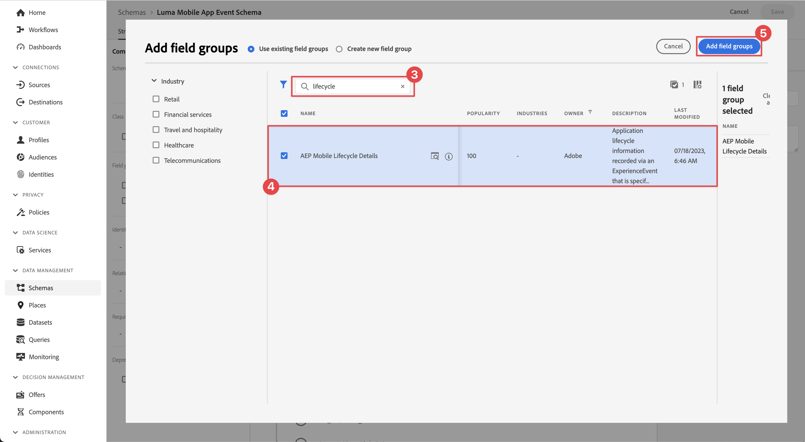

# Samla in livscykeldata

Lär dig hur du samlar in livscykeldata i en mobilapp.

Med Adobe Experience Platform Mobile SDK Lifecycle kan du samla in livscykeldata från din mobilapp. Adobe Experience Platform Edge Network-tillägget skickar dessa livscykeldata till Platform Edge Network där de sedan vidarebefordras till andra program och tjänster enligt din datastream-konfiguration. Läs mer om [livscykeltillägget](https://developer.adobe.com/client-sdks/documentation/lifecycle-for-edge-network/) i produktdokumentationen.


## Förhandskrav

* App med SDK:er har installerats och konfigurerats. Som en del av den här lektionen har du redan påbörjat livscykelövervakning. Se [Installera SDK:er - Uppdatera AppDelegate](install-sdks.md#update-appdelegate) för granskning.
* Registrerade Assurance-tillägget enligt beskrivningen i [föregående lektion](install-sdks.md).

## Utbildningsmål

I den här lektionen kommer du att:

<!--
* Add lifecycle field group to the schema.
* -->
* Få korrekta livscykelvärden genom att starta/pausa korrekt när appen flyttas mellan förgrunden och bakgrunden.
* Skicka data från appen till Platform Edge Network.
* Validera i Assurance.

<!--
## Add lifecycle field group to schema

The Consumer Experience Event field group you added in the [previous lesson](create-schema.md) already contains the lifecycle fields, so you can skip this step. If you don't use Consumer Experience Event field group in your own app, you can add the lifecycle fields by doing the following:

1. Navigate to the schema interface as described in the [previous lesson](create-schema.md).
1. Open the **Luma Mobile App Event Schema** schema and select **[!UICONTROL Add]** next to Field groups.
    {zoomable="yes"}
1. In the search bar, enter "lifecycle".
1. Select the checkbox next to **[!UICONTROL AEP Mobile Lifecycle Details]**.
1. Select **[!UICONTROL Add field groups]**.
    {zoomable="yes"}
1. Select **[!UICONTROL Save]**.
    {zoomable="yes"}
-->

## Implementeringsändringar

Nu kan du uppdatera projektet för att registrera livscykelhändelserna.

>[!BEGINTABS]

>[!TAB iOS]

1. Navigera till **[!DNL Luma]** > **[!DNL Luma]** > **[!UICONTROL SceneDelegate]** i Xcode Project-navigatorn.

1. När appen startas kan iOS anropa din `sceneWillEnterForeground:`-delegeringsmetod om appen återupptas från ett bakgrundstillstånd och du vill använda den här metoden för att utlösa en starthändelse för livscykeln. Lägg till den här koden i `func sceneWillEnterForeground(_ scene: UIScene)`:

   ```swift
   // When in foreground start lifecycle data collection
   MobileCore.lifecycleStart(additionalContextData: nil)
   ```

1. När appen placeras i bakgrunden vill du pausa livscykeldatainsamlingen från appens `sceneDidEnterBackground:`-delegeringsmetod. Lägg till den här koden i `func sceneDidEnterBackground(_ scene: UIScene)`:

   ```swift
   // When in background pause lifecycle data collection
   MobileCore.lifecyclePause()
   ```

>[!TAB Android]

1. Navigera till **[!UICONTROL app]** > **[!UICONTROL kotlin+java]** > **[!UICONTROL com.adobe.luma.tutorial.android]** > **[!UICONTROL LumaApplication]** i Android Studio-navigatorn.

1. När appen startas kan Android anropa din åsidosättning `fun onActivityResumed function` om den återupptas från ett bakgrundstillstånd och du vill utlösa en starthändelse för livscykeln med den här funktionen. Lägg till den här koden i `override fun onActivityResumed(activity: Activity)`:

   ```kotlin
   // When in foreground start lifecycle data collection
   MobileCore.lifecycleStart(null)
   ```

1. När appen placeras i bakgrunden vill du pausa insamling av livscykeldata från appens `override fun onActivityPaused`-funktion. Lägg till den här koden i `override fun onActivityPaused(activity: Activity)`:

   ```kotlin
   // When in background pause lifecycle data collection
   MobileCore.lifecyclePause()
   ```

>[!ENDTABS]


## Validera med Assurance

1. Granska avsnittet [installationsanvisningar](assurance.md#connecting-to-a-session) för att ansluta simulatorn eller enheten till Assurance.
1. Skicka appen till bakgrunden. Sök efter **[!UICONTROL LifecyclePause]** händelser i Assurance-gränssnittet.
1. Ta appen till förgrunden. Sök efter **[!UICONTROL LifecycleResume]** händelser i Assurance-gränssnittet.
   {zoomable="yes"}


## Vidarebefordra data till Platform Edge Network

I föregående övning skickas för- och bakgrundshändelserna till Adobe Experience Platform Mobile SDK. Så här vidarebefordrar du dessa händelser till Platform Edge Network:

1. Välj **[!UICONTROL Rules]** i taggegenskapen.
   {zoomable="yes"}
1. Välj **[!UICONTROL Initial Build]** som det bibliotek som ska användas.
1. Välj **[!UICONTROL Create New Rule]**.
   {zoomable="yes"}
1. Ange **[!UICONTROL Create Rule]** för `Application Status` på skärmen **[!UICONTROL Name]**.
1. Välj  **[!UICONTROL Add]** nedan **[!UICONTROL EVENTS]**.
   {zoomable="yes"}
1. I steget **[!UICONTROL Event Configuration]**:
   1. Välj **[!UICONTROL Mobile Core]** som **[!UICONTROL Extension]**.
   1. Välj **[!UICONTROL Foreground]** som **[!UICONTROL Event Type]**.
   1. Välj **[!UICONTROL Keep Changes]**.
      {zoomable="yes"}
1. Gå tillbaka till skärmen **[!UICONTROL Create Rule]** och välj  **[!UICONTROL Add]** intill **[!UICONTROL Mobile Core - Foreground]**.
   {zoomable="yes"}
1. I steget **[!UICONTROL Event Configuration]**:
   1. Välj **[!UICONTROL Mobile Core]** som **[!UICONTROL Extension]**.
   1. Välj **[!UICONTROL Background]** som **[!UICONTROL Event Type]**.
   1. Välj **[!UICONTROL Keep Changes]**.
      {zoomable="yes"}
1. Gå tillbaka till skärmen **[!UICONTROL Create Rule]** och välj  **[!UICONTROL Add]** under **[!UICONTROL ACTIONS]**.

   {zoomable="yes"}

1. I steget **[!UICONTROL Action Configuration]**:
   1. Välj **[!UICONTROL Adobe Experience Edge Network]** som **[!UICONTROL Extension]**.
   1. Välj **[!UICONTROL Forward event to Edge Network]** som **[!UICONTROL Action Type]**.
   1. Välj **[!UICONTROL Keep Changes]**.
      {zoomable="yes"}
1. Välj **[!UICONTROL Save to Library]**.
   {zoomable="yes"}
1. Välj **[!UICONTROL Build]** om du vill återskapa biblioteket.
   {zoomable="yes"}

När du har skapat egenskapen skickas händelserna till Platform Edge Network och händelserna vidarebefordras till andra program och tjänster enligt din datastream-konfiguration.

Du bör se **[!UICONTROL Application Close (Background)]**- och **[!UICONTROL Application Launch (Foreground)]**-händelser som innehåller XDM-data i Assurance.

{zoomable="yes"}

>[!SUCCESS]
>
>Du har nu konfigurerat din app så att den skickar programtillståndshändelser (förgrund, bakgrund) till Adobe Experience Platform Edge Network och alla tjänster som du har definierat i din datastam.
>
> Tack för att du har lagt ned din tid på att lära dig om Adobe Experience Platform Mobile SDK. Om du har frågor, vill dela allmän feedback eller har förslag på framtida innehåll kan du dela dem i det här [Experience League Community-diskussionsinlägget](https://experienceleaguecommunities.adobe.com/t5/adobe-experience-platform-data/tutorial-discussion-implement-adobe-experience-cloud-in-mobile/td-p/443796)

Nästa: **[Spåra händelsedata](events.md)**
