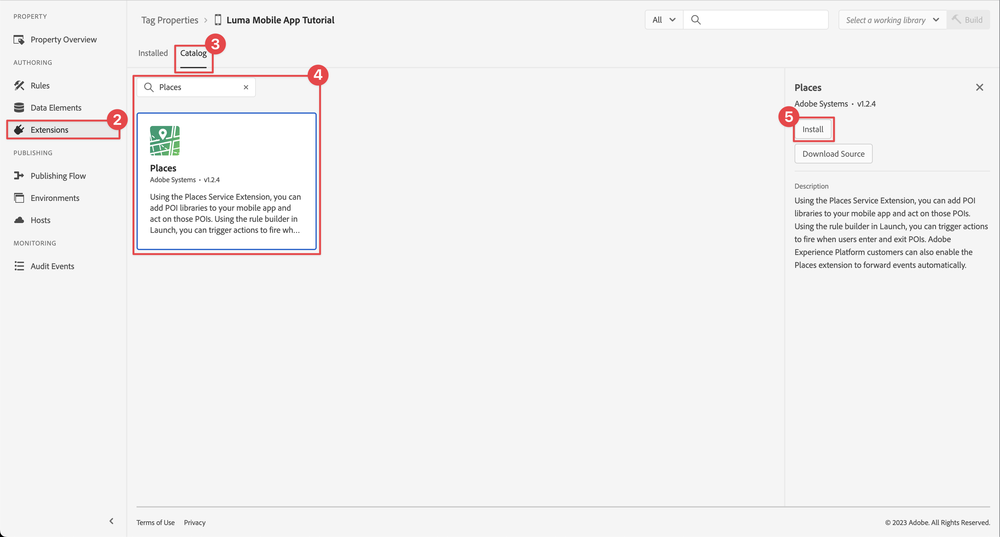

# Använd platser

Lär dig hur du använder platsens geopositioneringstjänst i din app.

Tjänsten Adobe Experience Platform Data Collection Places är en geopositioneringstjänst som gör det möjligt för mobilappar med platsmedvetenhet att förstå platskontexten. Tjänsten använder avancerade och lättanvända SDK-gränssnitt tillsammans med en flexibel databas med intressepunkter (POI).

## Förhandskrav

* Alla paketberoenden finns på plats i Xcode-projektet.
* Registrerade tillägg i AppDelegate.
* MobileCore har konfigurerats för att använda ditt utvecklingsprogram-ID.
* Importerade SDK:er.
* Programmet har skapats och körts med ändringarna ovan.

## Utbildningsmål

I den här lektionen ska du

* Lär dig hur du definierar intressepunkter i tjänsten Platser.
* Uppdatera taggegenskapen med tillägget Platser.
* Uppdatera ditt schema för att hämta geopositioneringshändelser.
* Validera inställningar i Assurance.
* Uppdatera programmet för att registrera Platser-tillägget.
* Implementera geopositioneringsspårning från platstjänsten i appen.


## Inställningar

För att platstjänsten ska fungera i din app och i Mobile SDK måste du göra några inställningar.

### Definiera platser

Du definierar några intressepunkter i tjänsten Platser.

1. Välj **[!UICONTROL Places]** i användargränssnittet för datainsamling.
1. Välj .
1. Välj **[!UICONTROL Manage Libraries]** på snabbmenyn.
   
1. Välj **[!UICONTROL New]** i dialogrutan **[!UICONTROL Manage Libraries]**.
1. I dialogrutan **[!UICONTROL Create Library]** anger du **[!UICONTROL Name]**, till exempel `Luma`.
1. Välj **[!UICONTROL Confirm]**.
   
1. Om du vill stänga dialogrutan **[!UICONTROL Manage Libraries]** väljer du **[!UICONTROL Close]**.
1. Gå tillbaka i **[!UICONTROL POI Management]**, välj **[!UICONTROL Import POIs]**.
1. Välj **[!UICONTROL Start]** i dialogrutan **[!UICONTROL Import Places]**.
1. Välj **[!DNL Luma]** i listan över bibliotek,
1. Välj **[!UICONTROL Next]**.
   
1. Hämta [Luma POIs ZIP-filen](assets/luma_pois.csv.zip) och extrahera den till en plats på datorn.
1. Dra och släpp den extraherade `luma_pois.csv`-filen på **[!UICONTROL Choose CSV File - Drag and Drop your File]** i dialogrutan **[!UICONTROL Import Places]**. Du bör se **[!UICONTROL Validation Success]** - **[!UICONTROL Successfully validated the CSV file]**.
1. Välj **[!UICONTROL Begin Import]**.  Du bör se **[!UICONTROL Success]** - **[!UICONTROL Successfully added 6 new POIs]**.
1. Välj **[!UICONTROL Done]**.
1. I **[!UICONTROL POI Management]** bör du se att sex nya Luma-butiker har lagts till i listan. Du kan växla mellan  och mappningsvyn .
   .


### Tillägg för Installera platser

1. Navigera till **[!UICONTROL Tags]** och hitta din mobila taggegenskap och öppna egenskapen.
1. Välj **[!UICONTROL Extensions]**.
1. Välj **[!UICONTROL Catalog]**.
1. Sök efter tillägget **[!UICONTROL Places]**.
1. Installera tillägget.

   

1. I dialogrutan **[!UICONTROL Install Extension]**:
   1. Välj **[!DNL Luma]** i listan **[!UICONTROL Select a Library]**.
   1. Kontrollera att du har valt ditt arbetsbibliotek, till exempel **[!UICONTROL Initial Build]**.
   1. Välj **[!UICONTROL Save to Library and Build]** från **[!UICONTROL Save to Library]**.
      .

1. Ditt bibliotek har byggts om.


### Verifiera ditt schema

Kontrollera om schemat, enligt definitionen i [Skapa schema](create-schema.md), innehåller de fältgrupper och klasser som krävs för att samla in POI- och geopositioneringsdata.

1. Navigera till gränssnittet för datainsamling och välj **[!UICONTROL Schemas]** i den vänstra listen.
1. Välj **[!UICONTROL Browse]** i det övre fältet.
1. Välj ditt schema för att öppna det.
1. Välj **[!UICONTROL Consumer Experience Event]** i schemaredigeraren.
1. Du ser ett **[!UICONTROL placeContext]**-objekt med objekt och fält för att hämta POI-interaktion och geopositioneringsdata.
   .


### Uppdatera taggegenskapen

Tillägget Platser för taggar innehåller funktioner för att övervaka geopositioneringshändelser och gör att du kan utlösa åtgärder som baseras på dessa händelser. Du kan använda den här funktionen för att minimera API-kodningen som du måste implementera i appen.

**Dataelement**

Först skapar du flera dataelement.

1. Gå till taggegenskapen i användargränssnittet för datainsamling.
1. Välj **[!UICONTROL Data Elements]** i den vänstra listen.
1. Välj **[!UICONTROL Add Data Element]**.
1. På skärmen **[!UICONTROL Create Data Element]** anger du ett namn, till exempel `Name - Entered`.
1. Välj **[!UICONTROL Places]** i listan **[!UICONTROL Extension]**.
1. Välj **[!UICONTROL Name]** i listan **[!UICONTROL Data Element Type]**.
1. Välj **[!UICONTROL Current POI]** under **[!UICONTROL TARGET]**.
1. Välj **[!UICONTROL Save to Library]**.
   

1. Upprepa steg 4-8 med hjälp av informationen från tabellen nedan för att skapa ytterligare dataelement.

   | Namn | Tillägg | Dataelementtyp | MÅL |
   |---|---|---|---|
   | `Name - Exited` | Platser | Namn | Senaste utgångna POI |
   | `Category - Current` | Platser | Kategori | Aktuell POI |
   | `Category - Exited` | Platser | Kategori | Senaste utgångna POI |
   | `City - Current` | Platser | Ort | Aktuell POI |
   | `City - Exited` | Platser | Ort | Senaste utgångna POI |

   Du bör ha följande lista över dataelement.

   

**Regler**

Därefter ska du definiera regler som ska användas med dessa dataelement.

1. Välj **[!UICONTROL Rules]** i den vänstra listen i taggegenskapen.
1. Välj **[!UICONTROL Add Rule]**.
1. På skärmen **[!UICONTROL Create Rule]** anger du ett namn för regeln, till exempel `POI - Entry`.
1. Välj  under **[!UICONTROL EVENTS]**.
   1. Välj **[!UICONTROL Places]** i listan **[!UICONTROL Extension]** och välj **[!UICONTROL Enter POI]** i listan **[!UICONTROL Event Type]**.
   1. Välj **[!UICONTROL Keep Changes]**.
      .
1. Välj  under **[!UICONTROL ACTIONS]**.
   1. Välj **[!UICONTROL Mobile Core]** i listan **[!UICONTROL Extension]** och välj **[!UICONTROL Attach Data]** i listan **[!UICONTROL Action Type]**. Den här åtgärden kopplar nyttolastdata.
   1. Klistra in följande nyttolast i **[!UICONTROL JSON Payload]**:

      ```json
      {
          "xdm": {
              "eventType": "location.entry",
              "placeContext": {
                  "geo": {
                      "city": "{%%City - Current%%}"
                  },
                  "POIinteraction": {
                      "poiDetail": {
                          "name": "{%%Name - Current%%}",
                          "category": "{%%Category - Current%%}"
                      },
                      "poiEntries": {
                          "value": 1
                      }
                  }
              }
          }
      }
      ```

      Du kan också infoga `{%% ... %%}` platshållarvärden för dataelement i JSON genom att markera . I en popup-dialogruta kan du välja valfritt dataelement som du har skapat.

   1. Välj **[!UICONTROL Keep Changes]**.
      

1. Välj  bredvid åtgärden **[!UICONTROL Mobile Core - Attach Data]**.
   1. Välj **[!UICONTROL Adobe Experience Platform Edge Network]** i listan **[!UICONTROL Extension]** och välj **[!UICONTROL Forward event to Edge Network]**. Den här åtgärden ser till att händelser och ytterligare nyttolastdata vidarebefordras till Platform Edge Network.
   1. Välj **[!UICONTROL Keep Changes]**.

1. Spara regeln genom att välja **[!UICONTROL Save to Library]**.

   

Låt oss skapa en annan regel

1. På skärmen **[!UICONTROL Create Rule]** anger du ett namn för regeln, till exempel `POI - Exit`.
1. Välj  under **[!UICONTROL EVENTS]**.
   1. Välj **[!UICONTROL Places]** i listan **[!UICONTROL Extension]** och välj **[!UICONTROL Exit POI]** i listan **[!UICONTROL Event Type]**.
   1. Välj **[!UICONTROL Keep Changes]**.
1. Välj  under **[!UICONTROL ACTIONS]**.
   1. Välj **[!UICONTROL Mobile Core]** i listan **[!UICONTROL Extension]** och välj **[!UICONTROL Attach Data]** i listan **[!UICONTROL Action Type]**.
   1. Klistra in följande nyttolast i **[!UICONTROL JSON Payload]**:

      ```json
      {
          "xdm": {
              "eventType": "location.exit",
              "placeContext": {
                  "geo": {
                      "city": "{%%City - Exited%%}"
                  },
                  "POIinteraction": {
                      "poiExits": {
                          "value": 1
                      },
                      "poiDetail": {
                          "name": "{%%Name - Exited%%}",
                          "category": "{%%Category - Exited%%}"
                      }
                  }
              }
          }
      }
      ```

   1. Välj **[!UICONTROL Keep Changes]**.

1. Välj  bredvid åtgärden **[!UICONTROL Mobile Core - Attach Data]**.
   1. Välj **[!UICONTROL Adobe Experience Platform Edge Network]** i listan **[!UICONTROL Extension]** och välj **[!UICONTROL Forward event to Edge Network]**.
   1. Välj **[!UICONTROL Keep Changes]**.

1. Spara regeln genom att välja **[!UICONTROL Save to Library]**.

   


För att säkerställa att alla ändringar i taggen publiceras

1. Välj **[!UICONTROL Initial Build]** som bibliotek att bygga.
1. Välj **[!UICONTROL Build]**.
   


## Validera inställningar i Assurance

Så här validerar du inställningarna i Assurance:

1. Gå till försäkringsgränssnittet.
1. Om den inte redan är tillgänglig i den vänstra listen markerar du **[!UICONTROL Configure]** i den vänstra listen och väljer  bredvid **[!UICONTROL Events]** och **[!UICONTROL Map & Simulate]** under **[!UICONTROL PLACES SERVICE]**.
1. Välj **[!UICONTROL Save]**.
1. Välj **[!UICONTROL Map & Simulate]** i den vänstra listen.
1. Flytta kartan till en plats för en av dina POI:n.
1. Välj  för att simulera inläsning av POI. Din POI identifieras med en cirkel och ett stift.
1. Välj POI.
1. Välj  **[!UICONTROL Simulate Entry Event]** på popup-menyn.
   
1. Välj **[!UICONTROL Events]** i den vänstra listen så ser du händelserna som du simulerade.
   


## Implementera platser i din app

Som tidigare nämnts tillhandahåller installation av ett mobiltaggtillägg bara konfigurationen. Därefter måste du installera och registrera Places SDK. Om de här stegen inte är tydliga går du igenom avsnittet [Installera SDK](install-sdks.md).

>[!NOTE]
>
>Om du har slutfört avsnittet [Installera SDK](install-sdks.md) är Platser SDK redan installerat och du kan hoppa över det här steget.
>

1. Kontrollera att [AEP-platser](https://github.com/adobe/aepsdk-places-ios) har lagts till i listan över paket i paketberoenden i Xcode. Se [Hanteraren för wift-paket](install-sdks.md#swift-package-manager).
1. Navigera till **[!DNL Luma]** > **[!DNL Luma]** > **[!DNL AppDelegate]** i Xcode Project-navigatorn.
1. Se till att `AEPPlaces` ingår i din lista över importer.

   ```swift
   import AEPPlaces
   ```

1. Kontrollera att `Places.self` är en del av den array med tillägg som du registrerar.

   ```swift
   let extensions = [
       AEPIdentity.Identity.self,
       Lifecycle.self,
       Signal.self,
       Edge.self,
       AEPEdgeIdentity.Identity.self,
       Consent.self,
       UserProfile.self,
       Places.self,
       Messaging.self,
       Optimize.self,
       Assurance.self
   ]
   ```

1. Navigera till **[!DNL Luma]** > **[!DNL Luma]** > **[!DNL Utils]** > **[!UICONTROL MobileSDK]** i Xcode Project-navigatorn och hitta funktionen `func processRegionEvent(regionEvent: PlacesRegionEvent, forRegion region: CLRegion) async`. Lägg till följande kod:

   ```swift
   // Process geolocation event
   Places.processRegionEvent(regionEvent, forRegion: region)
   ```

   Detta [`Places.processRegionEvent`](https://developer.adobe.com/client-sdks/documentation/places/api-reference/#processregionevent)-API kommunicerar geopositioneringsinformationen med platstjänsten.

1. Navigera till **[!DNL Luma]** > **[!DNL Luma]** > **[!DNL Views]** > **[!DNL Location]** > **[!DNL GeofenceSheet]** i Xcodes projektnavigerare.

   1. Ange följande kod för anmälningsknappen

   ```swift
   // Simulate geofence entry event
   Task {
       await MobileSDK.shared.processRegionEvent(regionEvent: .entry, forRegion: region)
   }
   ```

   1. Ange följande kod för knappen Avsluta:

   ```swift
   // Simulate geofence exit event
   Task {
       await MobileSDK.shared.processRegionEvent(regionEvent: .exit, forRegion: region)
   }
   ```

## Validera med din app

1. Öppna appen på en enhet eller i simulatorn.

1. Gå till fliken **[!UICONTROL Location]**.

1. Flytta (dra) runt kartan för att se till att den blå mittre cirkeln är ovanför en av dina POI:er, till exempel London.

1. Tryck  tills du ser kategorin och namnet visas i etiketten på den röda platsen med stiftet.

1. Tryck på etiketten för POI, som öppnar bladet **[!UICONTROL Nearby POI]**.

   

1. Tryck på knapparna **[!UICONTROL Entry]** eller **[!UICONTROL Exit]** för att simulera händelser för geostaktion och geostaktionsavslutning i appen.

   

1. Du bör se händelserna i försäkringsgränssnittet.


## Nästa steg

Nu bör du ha alla verktyg som behövs för att börja lägga till fler funktioner i geopositioneringsfunktionerna i appen. När du har vidarebefordrat händelserna till Edge Network bör du, när du har konfigurerat appen för [Experience Platform](platform.md), se upplevelsehändelserna för profilen som används i appen.

I Journey Optimizer-delen av den här självstudien ser du att upplevelsehändelser kan användas för att utlösa resor (se [push-meddelanden](journey-optimizer-inapp.md) och [meddelanden i appen](journey-optimizer-push.md) med Journey Optimizer). Det vanliga exemplet med att skicka ett push-meddelande till en appanvändare med en produktbefordran när den användaren fyller i en fysisk butik.

Du har sett en implementering av funktionalitet för din app, som till största delen styrs av tjänsten Platser samt dataelement och regler som du har definierat i taggegenskapen. Därför bör du minimera koden i appen. Du kan också implementera samma funktioner direkt i appen med API:t [`Edge.sendEvent`](https://developer.adobe.com/client-sdks/documentation/edge-network/api-reference/#sendevent) (se [Händelser](events.md) för mer information) med en XDM-nyttolast som innehåller ett fyllt `placeContext` -objekt.

>[!SUCCESS]
>
>Du har nu aktiverat appen för geopositioneringstjänster med tillägget Platser i Experience Platform Mobile SDK.
>
>Tack för att du lade ned din tid på att lära dig om Adobe Experience Platform Mobile SDK. Om du har frågor, vill dela allmän feedback eller har förslag på framtida innehåll kan du dela dem i det här [Experience League-diskussionsinlägget](https://experienceleaguecommunities.adobe.com/t5/adobe-experience-platform-data/tutorial-discussion-implement-adobe-experience-cloud-in-mobile/td-p/443796).

Nästa: **[Mappa data till Adobe Analytics](analytics.md)**
