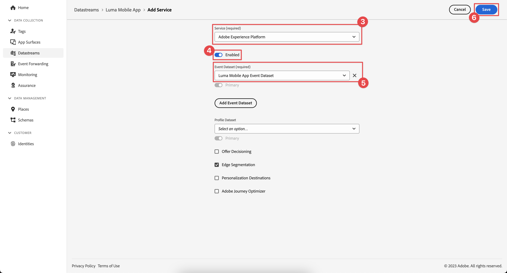

# Skicka data till Experience Platform

Lär dig hur du skickar mobilappsdata till Adobe Experience Platform.

Den här valfria lektionen gäller alla kunder som har Real-time Customer Data Platform (Real-Time CDP), Journey Optimizer och Customer Journey Analytics. Experience Platform, grundvalen för Experience Cloud-produkter, är ett öppet system som omvandlar alla era data (Adobe och inte Adobe) till robusta kundprofiler. Dessa kundprofiler uppdateras i realtid och använder AI-baserade insikter för att hjälpa er att leverera rätt upplevelser i alla kanaler.

Data för [event](events.md), [lifecycle](lifecycle-data.md) och [identity](identity.md) som du har samlat in och skickat till Platform Edge Network i tidigare lektioner vidarebefordras till de tjänster som konfigurerats i ditt datastam, inklusive Adobe Experience Platform.

## Förhandskrav

Din organisation måste etableras och behörigheter beviljas för Adobe Experience Platform.

Om du inte har åtkomst kan du [hoppa över den här lektionen](install-sdks.md).

## Utbildningsmål

I den här lektionen kommer du att:

* Skapa en Experience Platform-datauppsättning.
* Konfigurera dataströmmen för att vidarebefordra data till Experience Platform.
* Validera data i datauppsättningen.
* Aktivera ditt schema och din datauppsättning för kundprofil i realtid.
* Validera data i kundprofilen i realtid.
* Validera data i identitetsdiagrammet.

## Skapa en datauppsättning

Alla data som har inhämtats till Adobe Experience Platform lagras i datasjön som datauppsättningar. En datauppsättning är en lagrings- och hanteringskonstruktion för en datamängd (vanligtvis en tabell) som innehåller ett schema (kolumner) och fält (rader). Datauppsättningar innehåller också metadata som beskriver olika aspekter av de data som lagras. Mer information finns i [dokumentationen](https://experienceleague.adobe.com/docs/experience-platform/catalog/datasets/overview.html).

1. Navigera till gränssnittet Experience Platform genom att markera det på menyn Appar  i det övre högra hörnet.

1. Välj **[!UICONTROL Datasets]** på den vänstra navigeringsmenyn.

1. Välj  **[!UICONTROL Create dataset]**.

1. Välj **[!UICONTROL Create dataset from schema]**.
   

1. Sök efter ditt schema. till exempel använda `Luma Mobile` i sökfältet.
1. Välj ditt schema, till exempel **[!DNL Luma Mobile App Event Schema]**.

1. Välj **[!UICONTROL Next]**.
   

1. Ange en **[!UICONTROL Name]**, till exempel `Luma Mobile App Events Dataset` och en **[!UICONTROL Description]**.

1. Välj **[!UICONTROL Finish]**.
   

## Lägg till Adobe Experience Platform datastream-tjänst

Om du vill skicka XDM-data från Edge Network till Adobe Experience Platform lägger du till Adobe Experience Platform-tjänsten i det datastream som du konfigurerade som en del av [Skapa ett datastream](create-datastream.md).

>[!IMPORTANT]
>
>Du kan bara aktivera Adobe Experience Platform-tjänsten när du har skapat en händelsedatamängd.

1. I användargränssnittet för datainsamling väljer du **[!UICONTROL Datastreams]** och ditt datastream.

1. Välj sedan  **[!UICONTROL Add Service]**.

1. Välj **[!UICONTROL Adobe Experience Platform]** i listan [!UICONTROL Service].

1. Aktivera tjänsten genom att aktivera **[!UICONTROL Enabled]**.

1. Markera **[!UICONTROL Event Dataset]** som du skapade tidigare, till exempel **[!DNL Luma Mobile App Event Dataset]**.

1. Välj **[!UICONTROL Save]**.

   
1. Den slutliga konfigurationen bör se ut ungefär så här.

   

## Validera data i datauppsättningen

Nu när du har skapat en datauppsättning och uppdaterat dataströmmen för att skicka data till Experience Platform vidarebefordras alla XDM-data som skickas till Platform Edge Network till Platform och körningar i datauppsättningen.

Öppna appen och navigera till skärmar där du spårar händelser. Du kan också utlösa livscykelvärden.

Öppna datauppsättningen i plattformsgränssnittet. Du bör se data som anländer i grupper till datauppsättningen. Data hämtas vanligtvis i mikrobatchar var 15:e minut, så du kanske inte ser dina data direkt.

Du bör också kunna se exempelposter och -fält med funktionen **[!UICONTROL Preview dataset]**:

Ett robustare verktyg för datavalidering är plattformens [frågetjänst](https://experienceleague.adobe.com/docs/platform-learn/tutorials/queries/explore-data.html).

## Aktivera kundprofil i realtid

Med Experience Platform Real-Time Customer Profile kan ni skapa en helhetsbild av varje enskild kund som kombinerar data från flera kanaler, inklusive online-, offline-, CRM- och tredjepartsdata. Med hjälp av en profil kan ni sammanställa olika kunddata i en enhetlig vy som ger ett användbart, tidsstämplat konto för varje kundinteraktion.

### Aktivera schemat

1. Öppna ditt schema, till exempel **[!DNL Luma Mobile App Event Schema]**.
1. Aktivera **[!UICONTROL Profile]**.
1. Välj **[!UICONTROL Data for this schema will contain a primary identity in the identityMap field.]** i dialogrutan.
1. **[!UICONTROL Save]** schemat.

   

### Aktivera datauppsättningen

1. Öppna din datauppsättning, till exempel **[!DNL Luma Mobile App Event Dataset]**.
1. Aktivera **[!UICONTROL Profile]**.

   

### Validera data i profilen

Öppna appen och navigera till skärmar där du spårar händelser, till exempel: logga in på Luma-appen och gör ett köp.

Använd Assurance för att hitta en av identiteterna som skickas i identityMap (Email, lumaCrmId eller ECID), till exempel CRM-ID:t.

I plattformsgränssnittet

1. Navigera till **[!UICONTROL Profiles]** och välj **[!UICONTROL Browse]** i det övre fältet.
1. Ange den identitetsinformation som du just har gripit, till exempel `Luma CRM ID` för **[!UICONTROL Identity namespace]** och det värde som du kopierade för **[!UICONTROL Identity value]**. Välj sedan **[!UICONTROL View]**.
1. Om du vill visa information väljer du profilen.

På skärmen **[!UICONTROL Detail]** kan du se grundläggande information om användaren, inklusive **[!UICONTROL **&#x200B; länkade identiteter &#x200B;**]**:

På **[!UICONTROL Events]** kan du se händelser som samlats in från din mobilappsimplementering för den här användaren:

Från profilinformationsskärmen:

1. Om du vill visa identitetsdiagrammet klickar du på länken eller navigerar till **[!UICONTROL Identities]** och väljer sedan **[!UICONTROL Identity Graph]** i det övre fältet.
1. Om du vill söka efter identitetsvärdet anger du `Luma CRM ID` som **[!UICONTROL Identity namespace]** och det kopierade värdet som **[!UICONTROL Identity value]**. Välj sedan **[!UICONTROL View]**.

   Den här visualiseringen visar alla identiteter som är sammankopplade i en profil och deras ursprung. Här är ett exempel på ett identitetsdiagram som består av data som samlats in från en slutversion av både den här SDK-självstudiekursen (Data Source 2) och [Web SDK-självstudiekursen](https://experienceleague.adobe.com/docs/platform-learn/implement-web-sdk/overview.html) (Data Source 1):

   

## Nästa steg

Det finns mycket mer som marknadsförare och analytiker kan göra med data som samlats in i Experience Platform, inklusive att analysera dem i Customer Journey Analytics och bygga segment i Real-time Customer Data Platform. Du ska börja bra!

>[!SUCCESS]
>
>Du har nu konfigurerat appen så att den skickar data inte bara till Edge Network utan även till Adobe Experience Platform. Tack för att du har lagt ned din tid på att lära dig om Adobe Experience Platform Mobile SDK. Om du har frågor, vill dela allmän feedback eller har förslag på framtida innehåll kan du dela dem i det här [Experience League-diskussionsinlägget](https://experienceleaguecommunities.adobe.com/t5/adobe-experience-platform-data/tutorial-discussion-implement-adobe-experience-cloud-in-mobile/td-p/443796).

Nästa: **[Skapa och skicka push-meddelanden](journey-optimizer-push.md)**
