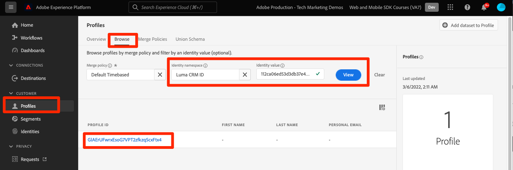
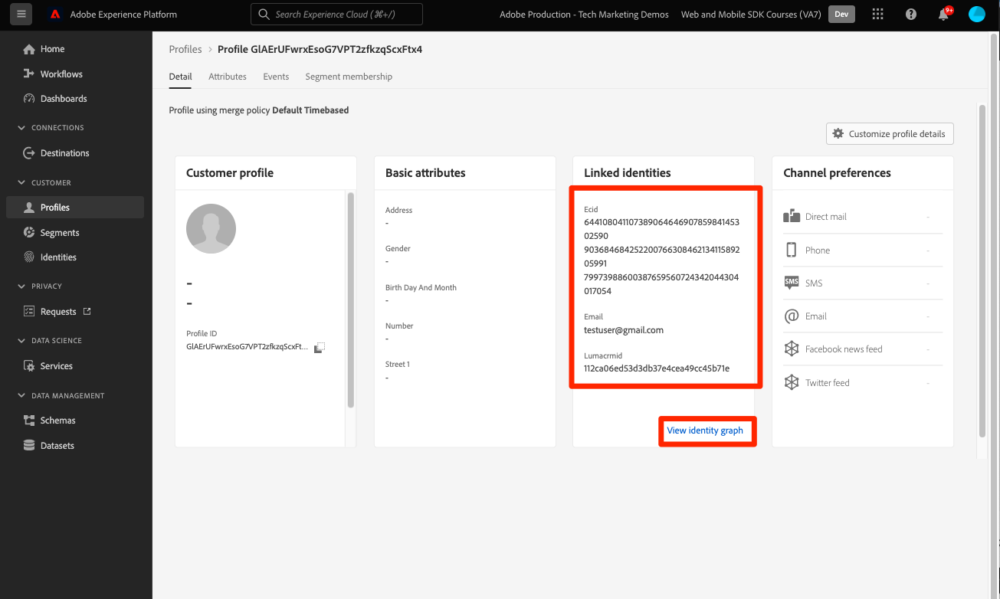

# Skicka data till Adobe Experience Platform

Lär dig skicka data till Adobe Experience Platform.

>[!INFO]
>
> Den här självstudiekursen kommer att ersättas med en ny självstudiekurs om hur du använder en ny exempelapp i slutet av november 2023

Den här valfria lektionen gäller alla kunder som har Real-time Customer Data Platform (Real-Time CDP), Journey Optimizer och Customer Journey Analytics. Experience Platform, som är grunden för Experience Cloud-produkterna, är ett öppet system som omvandlar alla era data - Adobe och icke-Adobe - till stabila kundprofiler som uppdateras i realtid och använder AI-baserade insikter för att hjälpa er att leverera rätt upplevelse i alla kanaler.

The [event](events.md), [livscykel](lifecycle-data.md)och [identity](identity.md) data som du har samlat in och skickat till Platform Edge Network i tidigare lektioner vidarebefordras till de tjänster som konfigurerats i ditt datastam, inklusive Adobe Experience Platform.

## Förutsättningar

Din organisation måste etableras och behörigheter beviljas för Adobe Experience Platform.

Om du inte har tillgång till [hoppa över den här lektionen](install-sdks.md).

## Utbildningsmål

I den här lektionen kommer du att:

* Skapa en Experience Platform-datauppsättning.
* Validera data i datauppsättningen.
* Aktivera ditt schema och din datauppsättning för kundprofil i realtid.
* Validera data i kundprofilen i realtid.
* Validera data i identitetsdiagrammet.

## Skapa en datauppsättning

Alla data som har inhämtats till Adobe Experience Platform lagras i datasjön som datauppsättningar. En datauppsättning är en lagrings- och hanteringskonstruktion för en datamängd, vanligtvis en tabell, som innehåller ett schema (kolumner) och fält (rader). Datauppsättningar innehåller också metadata som beskriver olika aspekter av de data som lagras. Se [dokumentation](https://experienceleague.adobe.com/docs/experience-platform/catalog/datasets/overview.html) för information.

1. Navigera till gränssnittet Experience Platform genom att markera det på menyn 3x3 längst upp till höger.
   

1. Välj **[!UICONTROL Datauppsättningar]** från den vänstra navigeringsmenyn.

1. **[!UICONTROL Skapa datauppsättning]**.
   

1. Välj **[!UICONTROL Skapa datauppsättning från schema]**.
   

1. Sök efter ditt schema och välj.

1. Välj **[!UICONTROL Nästa]**.
   

1. Ange en **[!UICONTROL Namn]**, **[!UICONTROL Beskrivning]** och markera **[!UICONTROL Slutför]**.
   

## Uppdatera datastream

När du har skapat datauppsättningen ska du se till att [uppdatera din datastream](create-datastream.md) för att lägga till Adobe Experience Platform. Den här uppdateringen säkerställer dataflöden till plattformen.

## Validera data i datauppsättningen

Nu när du har skapat en datauppsättning och uppdaterat dataströmmen för att skicka data till Experience Platform vidarebefordras alla XDM-data som skickas till Platform Edge Network till Platform och landar i datauppsättningen.

Öppna appen och navigera till skärmar där du spårar händelser. Du kan också utlösa livscykelvärden.

Öppna datauppsättningen i plattformsgränssnittet. Du bör se data som anländer i grupper till datauppsättningen

Du bör också kunna se exempelposter och -fält med **[!UICONTROL Förhandsgranska datauppsättning]** funktion:

Ett robustare verktyg för datavalidering är plattformens [frågetjänst](https://experienceleague.adobe.com/docs/platform-learn/tutorials/queries/explore-data.html).

## Aktivera kundprofil i realtid

Med Experience Platform Real-Time Customer Profile kan ni skapa en helhetsbild av varje enskild kund som kombinerar data från flera kanaler, inklusive online-, offline-, CRM- och tredjepartsdata. Med hjälp av en profil kan ni sammanställa olika kunddata i en enhetlig vy som ger ett användbart, tidsstämplat konto för varje kundinteraktion.

### Aktivera schemat

1. Öppna ditt schema
1. Aktivera **[!UICONTROL Profil]**
1. Välj **[!UICONTROL Data för det här schemat kommer att innehålla en primär identitet i identityMap-fältet.]** i modala
1. **[!UICONTROL Spara]** schemat

   

### Aktivera datauppsättningen

1. Öppna din datauppsättning
1. Aktivera **[!UICONTROL Profil]**

   

### Validera data i profilen

Öppna appen och navigera till skärmar där du spårar händelser. Logga in på Luma-appen och gör ett köp.

Använd Assurance för att hitta en av identiteterna som skickas i identityMap (Email, lumaCrmId eller ECID):

>[!TIP]
>
>   Värdet för `lumaCrmId` är `112ca06ed53d3db37e4cea49cc45b71e`

Navigera till **[!UICONTROL Profiler]** > **[!UICONTROL Bläddra]**, sök efter identitetsvärdet som du just har gripit och öppna profilen:

På **[!UICONTROL Detalj]** på skärmen kan du se grundläggande information om användaren, inklusive **[!UICONTROL ** länkade identiteter **]**:

På **[!UICONTROL Händelser]** kan du se de händelser som samlats in från din mobilappsimplementering för den här användaren:

Klicka på länken på profildetaljskärmen för att visa identitetsdiagrammet eller navigera till **[!UICONTROL Identiteter]** > **[!UICONTROL Identitetsdiagram]** och söka efter identitetsvärdet. Den här visualiseringen visar alla identiteter som är sammankopplade i en profil och deras ursprung. Här är ett exempel på ett identitetsdiagram som består av data som samlats in från den här självstudiekursen för Mobile SDK (datakälla 2) och [Web SDK, genomgång](https://experienceleague.adobe.com/docs/platform-learn/implement-web-sdk/overview.html) (datakälla 1):

Det finns mycket mer som marknadsförare och analytiker kan göra med data som samlats in i Experience Platform, inklusive att analysera dem i Customer Journey Analytics och bygga segment i Real-time Customer Data Platform. Du ska börja bra!

Nästa: **[Skicka meddelanden med Journey Optimizer](journey-optimizer-push.md)**

>[!NOTE]
>
>Tack för att du lade ned din tid på att lära dig om Adobe Experience Platform Mobile SDK. Om du har frågor, vill dela allmän feedback eller har förslag på framtida innehåll kan du dela med dig av dem om detta [Experience League diskussionsinlägg](https://experienceleaguecommunities.adobe.com/t5/adobe-experience-platform-launch/tutorial-discussion-implement-adobe-experience-cloud-in-mobile/td-p/443796)
