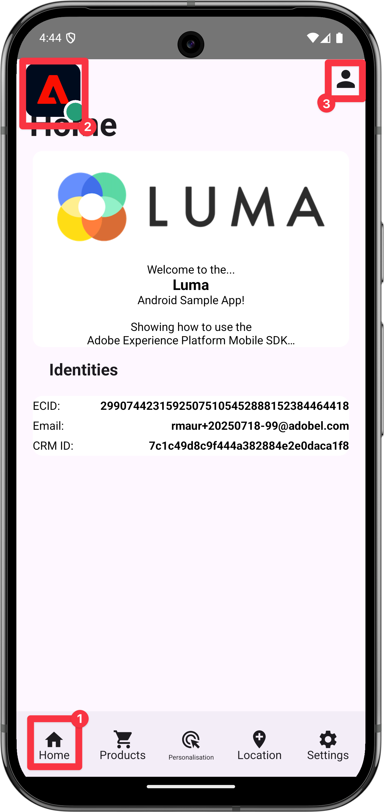

# Samla in profildata

Lär dig hur du samlar in profildata i en mobilapp.

Du kan använda profiltillägget för att lagra attribut om användaren på klienten. Den här informationen kan användas senare för att målinrikta och personalisera meddelanden i online- eller offlinescenarier, utan att du behöver ansluta till en server för optimala prestanda.

Profiltillägget hanterar CSOP (Client-Side Operation Profile), ger ett sätt att reagera på API:er, uppdatera attribut för användarprofiler och delar attribut för användarprofiler med resten av systemet som en genererad händelse.

Profildata används av andra tillägg för att utföra profilrelaterade åtgärder. Ett exempel är tillägget Regelmotor som förbrukar profildata och kör regler baserat på profildata. Läs mer om [profiltillägget](https://developer.adobe.com/client-sdks/documentation/profile/) i dokumentationen

>[!IMPORTANT]
>
>Profilfunktionerna som beskrivs i den här lektionen skiljer sig från kundprofilfunktionerna i realtid i Adobe Experience Platform och plattformsbaserade program.


## Förhandskrav

* App med SDK:er har installerats och konfigurerats.

## Utbildningsmål

I den här lektionen kommer du att:

* Ange eller uppdatera användarattribut.
* Hämta användarattribut.


## Ange och uppdatera användarattribut

Det skulle vara praktiskt för målgruppsanpassning och personalisering i appen att snabbt veta om en användare har köpt något tidigare eller nyligen. Låt oss konfigurera det i Luma-appen.

>[!BEGINTABS]

>[!TAB iOS]

1. Navigera till **[!DNL Luma]** > **[!DNL Luma]** > **[!DNL Utils]** > **[!DNL MobileSDK]** i Xcode Project-navigatorn och hitta funktionen `func updateUserAttribute(attributeName: String, attributeValue: String)`. Lägg till följande kod:

   ```swift
   // Create a profile map, add attributes to the map and update profile using the map
   var profileMap = [String: Any]()
   profileMap[attributeName] = attributeValue
   UserProfile.updateUserAttributes(attributeDict: profileMap)
   ```

   Den här koden:

   1. Ställer in en tom ordlista med namnet `profileMap`.

   1. Lägger till ett element i ordlistan med `attributeName` (till exempel `isPaidUser`) och `attributeValue` (till exempel `yes`).

   1. Använder `profileMap`-ordlistan som ett värde för parametern `attributeDict` i API-anropet [`UserProfile.updateUserAttributes`](https://developer.adobe.com/client-sdks/documentation/profile/api-reference/#updateuserattributes).

1. Navigera till **[!DNL Luma]** > **[!DNL Luma]** > **[!DNL Views]** > **[!DNL Products]** > **[!DNL ProductView]** i Xcode-projektnavigeraren och sök efter anropet till `updateUserAttributes` (i koden för knappen  ). Lägg till följande kod:

   ```swift
   // Update attributes
   MobileSDK.shared.updateUserAttribute(attributeName: "isPaidUser", attributeValue: "yes")
   ```

>[!TAB Android]

1. Navigera till **[!UICONTROL Android]**  > **[!DNL app]** > **[!DNL kotlin+java]** > **[!DNL com.adobe.luma.tutorial.android]** > **[!UICONTROL models]** > **[!UICONTROL MobileSDK]** i Android Studio-navigatorn och hitta funktionen `func updateUserAttribute(attributeName: String, attributeValue: String)`. Lägg till följande kod:

   ```kotlin
   // Create a profile map, add attributes to the map and update profile using the map
   val profileMap = mapOf(attributeName to attributeValue)
   UserProfile.updateUserAttributes(profileMap)
   ```

   Den här koden:

   1. Ställer in en tom karta med namnet `profileMap`.

   1. Lägger till ett element i kartan med `attributeName` (till exempel `isPaidUser`) och `attributeValue` (till exempel `yes`).

   1. Använder kartan `profileMap` som ett värde för parametern `attributeDict` i API-anropet [`UserProfile.updateUserAttributes`](https://developer.adobe.com/client-sdks/documentation/profile/api-reference/#updateuserattributes).

1. Navigera till **[!UICONTROL Android]**  > **[!DNL app]** > **[!DNL kotlin+java]** > **[!DNL com.adobe.luma.tutorial.android]** > **[!UICONTROL views]** > **[!UICONTROL ProductView.kt]** och hitta anropet till `updateUserAttributes` (i koden för knappen Köp  ). Lägg till följande kod:

   ```kotlin
   // Update attributes
   MobileSDK.shared.updateUserAttribute("isPaidUser", "yes")
   ```

>[!ENDTABS]

## Hämta användarattribut

När du har uppdaterat en användares attribut är det tillgängligt för andra Adobe SDK:er, men du kan även hämta attribut explicit, så att appen fungerar som du vill.

>[!BEGINTABS]

>[!TAB iOS]

1. Navigera till **[!DNL Luma]** > **[!DNL Luma]** > **[!DNL Views]** > **[!DNL General]** > **[!DNL HomeView]** i Xcode Project-navigatorn och hitta modifieraren `.onAppear`. Lägg till följande kod:

   ```swift
   // Get attributes
   UserProfile.getUserAttributes(attributeNames: ["isPaidUser"]) { attributes, error in
       if attributes?.count ?? 0 > 0 {
           if attributes?["isPaidUser"] as? String == "yes" {
               showBadgeForUser = true
           }
           else {
               showBadgeForUser = false
           }
       }
   }
   ```

   Den här koden:

   1. Anropar [`UserProfile.getUserAttributes`](https://developer.adobe.com/client-sdks/documentation/profile/api-reference/#getuserattributes)-API:t med attributnamnet `isPaidUser` som ett element i arrayen `attributeNames`.
   1. Kontrollerar sedan värdet för attributet `isPaidUser` och placerar ett märke på ikonen `yes`UserCheckedOut används.

>[!TAB Android]

1. Navigera till **[!UICONTROL Android]**  > **[!DNL app]** > **[!DNL kotlin+java]** > **[!DNL com.adobe.luma.tutorial.androi]** > **[!DNL views]** > **[!DNL HomeView.kt]** i projektnavigeraren i Android Studio och hitta modifieraren `.onAppear`. Lägg till följande kod:

   ```kotlin
   // Get attributes
   UserProfile.getUserAttributes(listOf("isPaidUser")) { attributes ->
       showBadgeForUser = attributes?.get("isPaidUser") == "yes"
   }
   ```

   Den här koden:

   1. Anropar [`UserProfile.getUserAttributes`](https://developer.adobe.com/client-sdks/documentation/profile/api-reference/#getuserattributes)-API:t med attributnamnet `isPaidUser` som ett element i arrayen `attributeNames`.
   1. Söker sedan efter värdet för attributet `isPaidUser`. När `yes` används ersätter koden personikonen med en ikon i verktygsfältet högst upp till höger.

>[!ENDTABS]

Mer information finns i [API-referensen](https://developer.adobe.com/client-sdks/documentation/profile/api-reference/#getuserattributes).

## Validera med Assurance

1. Granska avsnittet [installationsanvisningar](assurance.md#connecting-to-a-session) för att ansluta simulatorn eller enheten till Assurance.
1. Kör appen för att logga in och interagera med en produkt.

>[!BEGINTABS]

>[!TAB iOS]

1. Välj **[!UICONTROL Home]** i flikfältet.
1. Flytta ikonen Assurance åt vänster.
1. Om du vill öppna inloggningsbladet klickar du på knappen  .

   

1. Om du vill infoga ett slumpmässigt e-postmeddelande och ett kund-ID väljer du knappen **[!UICONTROL A |]** .
1. Välj **[!UICONTROL Login]**.

   

1. Välj **[!DNL Products]** i flikfältet.
1. Välj en produkt.
1. Välj .
1. Välj .
1. Välj .

   

1. Återgå till skärmen **[!UICONTROL Home]**. Du bör se att ett märke har lagts till .

   


>[!TAB Android]

1. Välj **[!UICONTROL Home]** i flikfältet.
1. Flytta ikonen Assurance åt vänster.
1. Om du vill öppna inloggningsbladet klickar du på knappen  .

   

1. Välj **[!UICONTROL Generate Random Email]** om du vill infoga ett slumpmässigt e-postmeddelande och ett kund-ID.
1. Välj **[!UICONTROL Login]**.

   

1. Välj **[!DNL Products]** i flikfältet.
1. Välj en produkt.
1. Välj 
1. Välj .
1. Välj .

   

1. Återgå till skärmen **[!UICONTROL Home]**. Du bör se att personikonen uppdateras.

   

>[!ENDTABS]


I Assurance-gränssnittet bör du se en **[!UICONTROL UserProfileUpdate]**- och **[!UICONTROL getUserAttributes]**-händelse med det uppdaterade `profileMap`-värdet.

{zoomable="yes"}

>[!SUCCESS]
>
>Du har nu konfigurerat din app för att uppdatera profilattribut i Edge Network och (när den har konfigurerats) med Adobe Experience Platform.
>
>Tack för att du har lagt ned din tid på att lära dig om Adobe Experience Platform Mobile SDK. Om du har frågor, vill dela allmän feedback eller har förslag på framtida innehåll kan du dela dem i det här [Experience League Community-diskussionsinlägget](https://experienceleaguecommunities.adobe.com/t5/adobe-experience-platform-data/tutorial-discussion-implement-adobe-experience-cloud-in-mobile/td-p/443796).

Nästa: **[Använd platser](places.md)**
