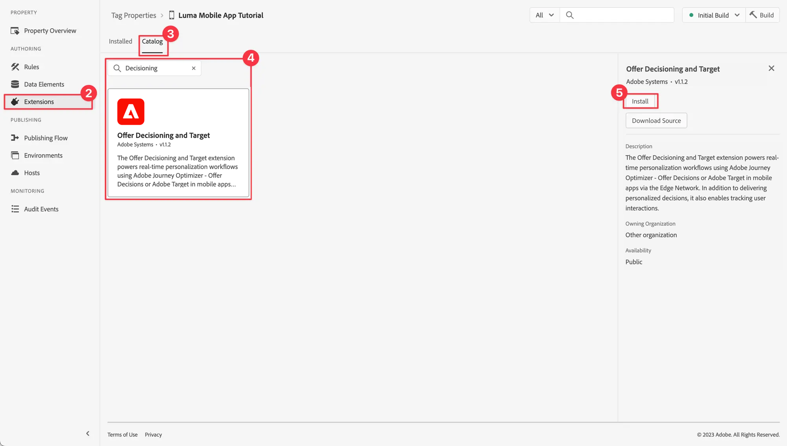
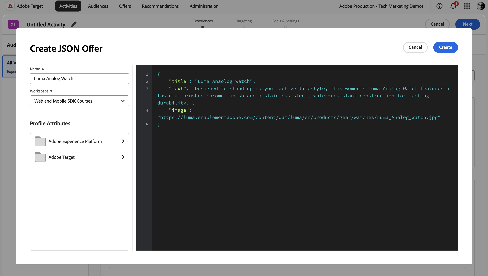

# Optimera och personalisera med Adobe Target

Lär dig hur du optimerar och personaliserar upplevelserna i dina mobilappar med Platform Mobile SDK och Adobe Target.

Target innehåller allt som ni behöver för att skräddarsy och personalisera kundernas upplevelser. Target hjälper er att maximera intäkterna från era webbplatser och mobilsajter, appar, sociala medier och andra digitala kanaler. Target kan utföra A/B-tester, multivariata tester, rekommendera produkter och innehåll, målinrikta innehåll, anpassa innehåll automatiskt med AI och mycket annat. Fokus i den här lektionen ligger på A/B-testfunktionen i Target. Mer information finns i [Översikt över A/B-tester](https://experienceleague.adobe.com/sv/docs/target/using/activities/abtest/test-ab).

{zoomable="yes"}

Innan du kan utföra A/B-tester med Target måste du se till att rätt konfigurationer och integreringar finns på plats.

>[!NOTE]
>
>Den här lektionen är valfri och gäller endast för Adobe Target-användare som vill utföra A/B-tester.


## Förhandskrav

* App med SDK:er har installerats och konfigurerats.
* Åtkomst till Adobe Target med [behörigheter, korrekt konfigurerade roller, arbetsytor och egenskaper](https://experienceleague.adobe.com/sv/docs/target/using/administer/manage-users/enterprise/property-channel).


## Utbildningsmål

I den här lektionen kommer du att:

* Uppdatera ditt datastream för Target-integrering.
* Uppdatera taggegenskaperna med Offer Decisioning- och Target-tilläggen.
* Uppdatera ditt schema för att hämta förslagshändelser.
* Validera konfigurationen i Assurance.
* Skapa ett enkelt A/B-test i Target.
* Uppdatera appen och registrera tillägget Optimizer.
* Implementera A/B-testet i din app.
* Validera implementeringen i Assurance.


## Inställningar

>[!TIP]
>
>Om du redan har konfigurerat ditt program som en del av [Journey Optimizer erbjuder](journey-optimizer-offers.md)-lektionen kanske du redan har utfört några av stegen i det här konfigurationsavsnittet.

### Uppdatera datastream-konfiguration

#### Adobe Target

Om du vill vara säker på att data som skickas från din mobilapp till Experience Platform Edge Network vidarebefordras till Adobe Target, måste du uppdatera din datastream-konfiguration.

1. I användargränssnittet för datainsamling väljer du **[!UICONTROL Datastreams]** och markerar ditt datastream, till exempel **[!DNL Luma Mobile App]**.
1. Välj **[!UICONTROL Add Service]** och välj **[!UICONTROL Adobe Target]** i listan **[!UICONTROL Service]**.
1. Om du är Target Premium-kund och vill använda egenskapstoken anger du det **[!UICONTROL Property Token]**-målvärde som du vill använda för den här integreringen. Target Standard-användare kan hoppa över det här steget.

   Du hittar dina egenskaper i målgränssnittet i **[!UICONTROL Administration]** > **[!UICONTROL Properties]**. Välj  för att visa egenskapstoken för den egenskap som du vill använda. Egenskapstoken har formatet `"at_property": "xxxxxxxx-xxxx-xxxxx-xxxx-xxxxxxxxxxxx"`. Du får bara ange värdet `xxxxxxxx-xxxx-xxxxx-xxxx-xxxxxxxxxxxx`.

   Du kan också ange ett ID för målmiljö. Använd miljöer för att ordna era webbplatser och förproduktionsmiljöer för enkel hantering och separat rapportering. I förinställda miljöer ingår produktion, mellanlagring och utveckling. Mer information finns i [Miljö](https://experienceleague.adobe.com/sv/docs/target/using/administer/environments) och [Målmiljö-ID](https://experienceleague.adobe.com/sv/docs/platform-learn/implement-web-sdk/applications-setup/setup-target).

   Du kan också ange ett namnutrymme för ett tredjeparts-ID för mål som stöder profilsynkronisering i ett identitetsnamnområde (till exempel CRM-ID). Mer information finns i [Namnområde för tredje parts-ID för mål](https://experienceleague.adobe.com/sv/docs/platform-learn/implement-web-sdk/applications-setup/setup-target).

1. Välj **[!UICONTROL Save]**.

   {zoomable="yes"}


#### Adobe Journey Optimizer

För att säkerställa att data som skickas från din mobilapp till Edge Network vidarebefordras till Journey Optimizer - Beslutshantering uppdaterar du din datastream-konfiguration.

1. I användargränssnittet för datainsamling väljer du **[!UICONTROL Datastreams]** och markerar ditt datastream, till exempel **[!DNL Luma Mobile App]**.
1. Välj  för **[!UICONTROL Experience Platform]** och välj  **[!UICONTROL Edit]** på snabbmenyn.
1. Kontrollera att **[!UICONTROL Datastreams]**,  är markerade på skärmen **[!UICONTROL Adobe Experience Platform]** > **[!UICONTROL Offer Decisioning]** Mapp **[!UICONTROL Edge Segmentation]** > **[!UICONTROL Personalization Destinations]**. Om du även följer lektionerna från Journey Optimizer väljer du **[!UICONTROL Adobe Journey Optimizer]**. Mer information finns i [Adobe Experience Platform-inställningar](https://experienceleague.adobe.com/sv/docs/experience-platform/datastreams/configure).
1. Välj **[!UICONTROL Save]** om du vill spara dataströmskonfigurationen.

   {zoomable="yes"}


### Installera taggtillägget Offer Decisioning och Target

Även om den här lektionen handlar om A/B-tester i Target ses resultatet av ett test som ett erbjudande och implementeras i Adobe infrastruktur med taggtilläggen Adobe Offer Decisioning och Target. Tillägget hanterar både erbjudanden från Journey Optimizer och Target.

1. Navigera till **[!UICONTROL Tags]**, hitta din mobila taggegenskap och öppna egenskapen.
1. Välj **[!UICONTROL Extensions]**.
1. Välj **[!UICONTROL Catalog]**.
1. Sök efter tillägget **[!UICONTROL Offer Decisioning and Target]**.
1. Installera tillägget. Tillägget kräver ingen ytterligare konfiguration.

   {zoomable="yes"}


### Uppdatera ditt schema

1. Navigera till gränssnittet för datainsamling och välj **[!UICONTROL Schemas]** i den vänstra listen.
1. Välj **[!UICONTROL Browse]** i det övre fältet.
1. Välj ditt schema för att öppna det.
1. Välj  **[!UICONTROL Add]** intill **[!UICONTROL Field groups]** i schemaredigeraren.
1. I dialogrutan **[!UICONTROL Add field groups]** söker du efter `proposition`, väljer **[!UICONTROL Experience Event - Proposition Interactions]** och väljer **[!UICONTROL Add field groups]**.
   {zoomable="yes"}
1. Om du vill spara ändringarna i ditt schema väljer du **[!UICONTROL Save]**.


### Validera inställningar i Assurance

Så här validerar du konfigurationen i Assurance:

1. Gå till Assurance användargränssnitt.
1. Markera **[!UICONTROL Configure]** i den vänstra listen och välj  intill **[!UICONTROL Validate Setup]** under **[!UICONTROL OFFER DECISIONING AND TARGET]**.
1. Välj **[!UICONTROL Save]**.
1. Välj **[!UICONTROL Validate Setup]** i den vänstra listen. Både datastream-konfigurationen valideras och SDK-konfigurationen i ditt program.
   {zoomable="yes"}

## Skapa ett A/B-test

Det finns många typer av aktiviteter som du kan skapa i Adobe Target och implementera i en mobilapp, vilket nämndes i inledningen. I den här lektionen implementerar du ett A/B-test.

1. Välj **[!UICONTROL Activities]** i det övre fältet i målgränssnittet.
1. Välj **[!UICONTROL Create Activity]** och **[!UICONTROL A/B Test]** på snabbmenyn.
1. I dialogrutan **[!UICONTROL Create A/B Test Activity]** väljer du **[!UICONTROL Mobile]** som **[!UICONTROL Type]** och väljer en arbetsyta i listan **[!UICONTROL Choose Workspace]**. Välj din egenskap i listan **[!UICONTROL Choose property]** om du är Target Premium-kund och har angett en egenskapstoken i datastream.
1. Välj **[!UICONTROL Create]**.
   {zoomable="yes"}

1. På skärmen **[!UICONTROL Untitled Activity]**, i steget **[!UICONTROL Experiences]**:

   1. Ange `luma-mobileapp-abtest` i **[!UICONTROL Select Location]** under **[!UICONTROL Location 1]**. Det här platsnamnet (kallas ofta mbox) används senare i programimplementeringen.
   1. Välj  bredvid **[!UICONTROL Content]** och välj **[!UICONTROL Create JSON Offer]** på snabbmenyn.
   1. Klistra in följande JSON i dialogrutan **[!UICONTROL Create JSON Offer]**.

      ```json
      { 
          "title": "Luma Anaolog Watch",
          "text": "Designed to stand up to your active lifestyle, this women's Luma Analog Watch features a tasteful brushed chrome finish and a stainless steel, water-resistant construction for lasting durability.", 
          "image": "https://luma.enablementadobe.com/content/dam/luma/en/products/gear/watches/Luma_Analog_Watch.jpg" 
      }
      ```

      {zoomable="yes"}

      Välj **[!UICONTROL Create]**.

   1. Välj **[!UICONTROL +]** bredvid **[!UICONTROL Experiences]** om du vill lägga till **[!UICONTROL Experience B]**.


   1. Upprepa steg b och c för upplevelsen Experience B, men använd i stället `Aim Analog Watch` som titel och klistra in följande JSON:

      ```json
      { 
          "title": "Aim Analog Watch",
          "text": "The flexible, rubberized strap is contoured to conform to the shape of your wrist for a comfortable all-day fit. The face features three illuminated hands, a digital read-out of the current time, and stopwatch functions.", 
          "image": "https://luma.enablementadobe.com/content/dam/luma/en/products/gear/watches/Aim_Watch.jpg" 
      }
      ```


1. Granska konfigurationen av A/B-testet i steget **[!DNL Targeting]**. Som standard fördelas båda erbjudandena lika till alla besökare. Välj **[!UICONTROL Next]** om du vill fortsätta.

   {zoomable="yes"}

1. I steget **[!UICONTROL Goals & Settings]**:

   1. Byt namn på din namnlösa aktivitet, till exempel till `Luma Mobile SDK Tutorial - A/B Test Example`.
   1. Ange **[!UICONTROL Objective]** som A/B-test, till exempel `A/B Test for Luma mobile app tutorial`.
   1. Välj **[!UICONTROL Conversion]**, **[!UICONTROL Viewed an mbox]** i rutan **[!UICONTROL Goal Metric]** > **[!UICONTROL MY PRIMARY GOAL]** och ange ditt platsnamn (mbox), till exempel `luma-mobileapp-abtest`.
   1. Välj **[!UICONTROL Save & Close]**.

      {zoomable="yes"}

1. Tillbaka på skärmen **[!UICONTROL All Activities]**:

   1. Välj  i din aktivitet.
   1. Välj  **[!UICONTROL Activate]** för att aktivera A/B-testet.

   {zoomable="yes"}


## Implementera mål i din app

Som tidigare nämnts tillhandahåller installation av ett mobiltaggtillägg bara konfigurationen. Därefter måste du installera och registrera Optimera SDK. Om de här stegen inte är tydliga går du igenom avsnittet [Installera SDK](install-sdks.md).

>[!NOTE]
>
>Om du har slutfört avsnittet [Installera SDK:er](install-sdks.md) är SDK redan installerat och du kan hoppa över det här steget.
>

>[!BEGINTABS]

>[!TAB iOS]

1. Kontrollera att [AEP Optimize](https://github.com/adobe/aepsdk-messaging-ios) har lagts till i listan över paket i paketberoenden i Xcode. Se [Hanteraren för wift-paket](install-sdks.md#swift-package-manager).
1. Navigera till **[!DNL Luma]** > **[!DNL Luma]** > **[!DNL AppDelegate]** i Xcode Project-navigatorn.
1. Se till att `AEPOptimize` ingår i din lista över importer.

   `import AEPOptimize`

1. Kontrollera att `Optimize.self` är en del av den array med tillägg som du registrerar.

   ```swift
   let extensions = [
       AEPIdentity.Identity.self,
       Lifecycle.self,
       Signal.self,
       Edge.self,
       AEPEdgeIdentity.Identity.self,
       Consent.self,
       UserProfile.self,
       Places.self,
       Messaging.self,
       Optimize.self,
       Assurance.self
   ]
   ```

1. Navigera till **[!DNL Luma]** > **[!DNL Luma]** > **[!DNL Utils]** > **[!DNL MobileSDK]** i Xcode Project-navigatorn. Hitta funktionen ` func updatePropositionAT(ecid: String, location: String) async`. Lägg till följande kod:

   ```swift
   // set up the XDM dictionary, define decision scope and call update proposition API
   Task {
       let ecid = ["ECID" : ["id" : ecid, "primary" : true] as [String : Any]]
       let identityMap = ["identityMap" : ecid]
       let xdmData = ["xdm" : identityMap]
       let decisionScope = DecisionScope(name: location)
       Optimize.clearCachedPropositions()
       Optimize.updatePropositions(for: [decisionScope], withXdm: xdmData) { data, error in
           if let error = error {
               Logger.aepMobileSDK.error("MobileSDK - updatePropositionsAT: Error updating propositions: \(error.localizedDescription)")
           }
       }
   }
   ```

   Den här funktionen:

   * skapar en XDM-ordlista `xdmData` som innehåller ECID för att identifiera den profil som du måste presentera A/B-testet för, och
   * definierar en `decisionScope`, en matris med platser där A/B-testet ska presenteras.

   Sedan anropar funktionen två API:er: [`Optimize.clearCachedPropositions`](https://developer.adobe.com/client-sdks/documentation/adobe-journey-optimizer-decisioning/api-reference/#clearpropositions) och [`Optimize.updatePropositions`](https://developer.adobe.com/client-sdks/documentation/adobe-journey-optimizer-decisioning/api-reference/#updatepropositions). Dessa funktioner rensar alla cachelagrade offerter och uppdaterar propositionerna för den här profilen. Ett förslag i det här sammanhanget är upplevelsen (erbjudandet) som väljs från målaktiviteten (ditt A/B-test) och som du definierade i [Skapa ett A/B-test](#create-an-ab-test).

1. Navigera till **[!DNL Luma]** > **[!DNL Luma]** > **[!DNL Views]** > **[!DNL Personalization]** > **[!DNL TargetOffersView]** i Xcode Project-navigatorn. Hitta funktionen `func onPropositionsUpdateAT(location: String) async {` och kontrollera koden för den här funktionen. Den viktigaste delen av den här funktionen är API-anropet [`Optimize.onPropositionsUpdate`](https://developer.adobe.com/client-sdks/documentation/adobe-journey-optimizer-decisioning/api-reference/#onpropositionsupdate) som:
   * hämtar förslagen för den aktuella profilen baserat på beslutsomfånget (den plats du har definierat i A/B-testet),
   * hämtar erbjudandet från erbjudandet,
   * frigör innehållet i erbjudandet så att det kan visas korrekt i appen, och
   * utlöser åtgärden `displayed()` för erbjudandet som skickar en händelse tillbaka till Platform Edge Network som informerar om att erbjudandet visas.

1. I **[!DNL TargetOffersView]** lägger du till följande kod i modifieraren `.onFirstAppear`. Den här koden ser till att callback-funktionen för uppdatering av erbjudanden registreras endast en gång.

   ```swift
   // Invoke callback for offer updates
   Task {
       await self.onPropositionsUpdateAT(location: location)
   }
   ```

1. I **[!DNL TargetOffersView]** lägger du till följande kod i modifieraren `.task`. Den här koden uppdaterar erbjudandena när vyn uppdateras.

   ```swift
   // Clear and update offers
   await self.updatePropositionsAT(ecid: currentEcid, location: location)
   ```

>[!TAB Android]

1. I Android Studio kontrollerar du att [aepsdk-optimize-android](https://github.com/adobe/aepsdk-optimize-android) är en del av beroendena i **[!UICONTROL build.gradle.kts]** i **[!UICONTROL Android]**  > **[!UICONTROL Gradle Scripts]**. Se [Gradle](install-sdks.md#gradle).
1. Navigera till **[!DNL app]** > **[!DNL kotlin+java]** > **[!UICONTROL com.adobe.luma.tutorial.android]** > **[!UICONTROL MainActivity]** i Android Studio-navigatorn.
1. Se till att `Optimize` ingår i din lista över importer.

   ```kotlin
   import com.adobe.marketing.mobile.optimize.Optimize
   ```

1. Kontrollera att `Optimize.EXTENSION` är en del av den array med tillägg som du registrerar.

   ```kotlin
   val extensions = listOf(
      Identity.EXTENSION,
      Lifecycle.EXTENSION,
      Signal.EXTENSION,
      Edge.EXTENSION,
      Consent.EXTENSION,
      UserProfile.EXTENSION,
      Places.EXTENSION,
      Messaging.EXTENSION,
      Optimize.EXTENSION,
      Assurance.EXTENSION
   )
   ```

1. Navigera till **[!UICONTROL Android]**  > **[!DNL app]** > **[!DNL kotlin+java]** > **[!DNL com.adobe.luma.tutorial.android]** > **[!DNL models]** > **[!UICONTROL MobileSDK]** i Android Studio-navigatorn. Hitta funktionen ` suspend fun updatePropositionsAT(ecid: String, location: String)`. Lägg till följande kod:

   ```kotlin
   // set up the XDM dictionary, define decision scope and call update proposition API
   withContext(Dispatchers.IO) {
       val ecidMap = mapOf("ECID" to mapOf("id" to ecid, "primary" to true))
       val identityMap = mapOf("identityMap" to ecidMap)
       val xdmData = mapOf("xdm" to identityMap)
       val decisionScope = DecisionScope(location)
       Optimize.clearCachedPropositions()
       Optimize.updatePropositions(listOf(decisionScope), xdmData, null, object :
           AdobeCallbackWithOptimizeError<MutableMap<DecisionScope?, OptimizeProposition?>?> {
           override fun fail(optimizeError: AEPOptimizeError?) {
               val responseError = optimizeError
               Log.i("MobileSDK", "updatePropositionsAT error: ${responseError}")
           }
           override fun call(propositionsMap: MutableMap<DecisionScope?, OptimizeProposition?>?) {
               val responseMap = propositionsMap
               Log.i("MobileSDK", "updatePropositionsOD call: ${responseMap}")
           }
       })
   }
   ```

   Den här funktionen:

   * skapar en XDM-ordlista `xdmData` som innehåller ECID för att identifiera den profil som du måste presentera A/B-testet för, och
   * definierar en `decisionScope`, en matris med platser där A/B-testet ska presenteras.

   Funktionen anropar sedan två API:er: [`Optimize.clearCachedPropositions`](https://developer.adobe.com/client-sdks/documentation/adobe-journey-optimizer-decisioning/api-reference/#clearpropositions) och [`Optimize.updatePropositions`](https://developer.adobe.com/client-sdks/documentation/adobe-journey-optimizer-decisioning/api-reference/#updatepropositions). Dessa funktioner rensar alla cachelagrade offerter och uppdaterar propositionerna för den här profilen. Ett förslag i det här sammanhanget är upplevelsen (erbjudandet) som väljs från målaktiviteten (ditt A/B-test) och som du definierade i [Skapa ett A/B-test](#create-an-ab-test).

1. Navigera till **[!DNL app]** > **[!DNL kotlin+java]** > **[!DNL com.adobe.luma.tutorial.android]** > **[!DNL views]** > **[!DNL TargetOffers.kt]** i Android Studio-navigatorn. Hitta funktionen `fun onPropositionsUpdateAT(location: String): List<OfferItem>` och kontrollera koden för den här funktionen. Den viktigaste delen av den här funktionen är API-anropet [`Optimize.onPropositionsUpdate`](https://developer.adobe.com/client-sdks/documentation/adobe-journey-optimizer-decisioning/api-reference/#onpropositionsupdate) som:
   * hämtar förslagen för den aktuella profilen baserat på beslutsomfånget (den plats du har definierat i A/B-testet),
   * hämtar erbjudandet från erbjudandet,
   * frigör innehållet i erbjudandet så att det kan visas korrekt i appen, och
   * returnerar erbjudandet.

1. I **[!DNL TargetOffers.kt]** lägger du till funktionen `LaunchedEffect` för att se till att erbjudandena uppdateras när du startar fliken Personalization.

   ```kotlin
   // recompose the view when the number of received offers changes
   LaunchedEffect(offersAT.count()) {
       updatePropositionsAT(currentEcid, MobileSDK.shared.targetLocation.value)
       offersAT = onPropositionsUpdateAT(MobileSDK.shared.targetLocation.value)
   }
   ```

>[!ENDTABS]

Du kan skicka ytterligare Target-parametrar (som mbox-, profile-, product- eller order-parametrar) i en begäran om en personaliseringsfråga till Experience Edge-nätverket genom att lägga till dem i en dataordlista när du anropar [`Optimize.updatePropositions`](https://developer.adobe.com/client-sdks/documentation/adobe-journey-optimizer-decisioning/api-reference/#updatepropositions) -API:t. Mer information finns i [Målparametrar](https://developer.adobe.com/client-sdks/documentation/adobe-journey-optimizer-decisioning/#target-parameters).


## Validera med appen

>[!BEGINTABS]

>[!TAB iOS]

1. Återskapa och kör appen i simulatorn eller på en fysisk enhet från Xcode med .

1. Gå till fliken **[!UICONTROL Personalization]**.

1. Bläddra nedåt och se ett av de två erbjudanden som du har definierat i A/B-testet som visas i **[!UICONTROL TARGET]**-rutan.

   


>[!TAB Android]

1. Återskapa och kör appen i simulatorn eller på en fysisk enhet från Android Studio med .

1. Gå till fliken **[!DNL Personalization]**.

1. Ett av de två erbjudandena som du har definierat i A/B-testet visas i den nedre rutan i rutan **[!UICONTROL TARGET]**.

   


>[!ENDTABS]

## Validera implementering i Assurance

Så här validerar du A/B-testet i Assurance:

1. Granska avsnittet [installationsanvisningar](assurance.md#connecting-to-a-session) för att ansluta simulatorn eller enheten till Assurance.
1. Markera **[!UICONTROL Configure]** i den vänstra listen och välj  intill **[!UICONTROL Review & Simulate]** under **[!UICONTROL OFFER DECSIONING AND TARGET]**.
1. Välj **[!UICONTROL Save]**.
1. Välj **[!UICONTROL Review & Simulate]** i den vänstra listen. Både datastream-konfigurationen valideras och SDK-konfigurationen i ditt program.
1. Välj **[!UICONTROL Requests]** i det övre fältet. Du ser dina **[!DNL Target]**-begäranden.
   {zoomable="yes"}

1. Du kan utforska flikarna **[!UICONTROL Simulate]** och **[!UICONTROL Event List]** om du vill ha ytterligare funktioner som hjälper dig att validera konfigurationen av dina Target-erbjudanden.

## Nästa steg

Nu bör du ha alla verktyg du behöver för att börja lägga till fler A/B-tester eller andra Target-aktiviteter (som Experience Targeting, Multivariate Test), där det är relevant och tillämpligt, i din app. Det finns mer detaljerad information i [GitHub-rapporten för tillägget Optimera](https://github.com/adobe/aepsdk-optimize-ios) där du också kan hitta en länk till en dedikerad [självstudiekurs](https://opensource.adobe.com/aepsdk-optimize-ios/#/tutorials/README) om hur du spårar Adobe Target-erbjudanden.

>[!SUCCESS]
>
>Du har aktiverat appen för A/B-tester och visat resultatet av ett A/B-test med Offer Decisioning- och Target-tillägget för Adobe Experience Platform Mobile SDK.
>
>Tack för att du har lagt ned din tid på att lära dig om Adobe Experience Platform Mobile SDK. Om du har frågor, vill dela allmän feedback eller har förslag på framtida innehåll kan du dela dem i det här [Experience League Community-diskussionsinlägget](https://experienceleaguecommunities.adobe.com/t5/adobe-experience-platform-data/tutorial-discussion-implement-adobe-experience-cloud-in-mobile/td-p/443796?profile.language=sv).

Nästa: **[Slutsats och nästa steg](conclusion.md)**
