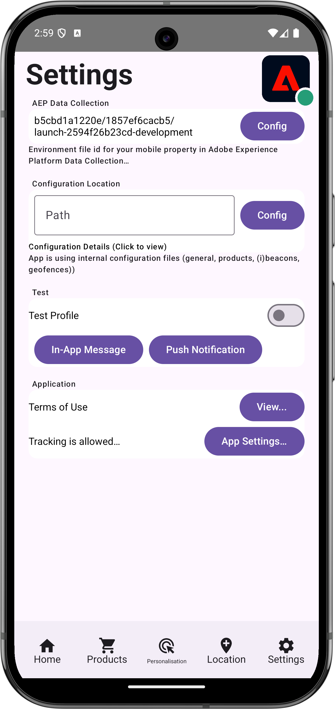

# Hantera WebViews

Lär dig hur du hanterar datainsamling med WebViews i en mobilapp.

## Förhandskrav

* App med SDK:er har installerats och konfigurerats.

## Utbildningsmål

I den här lektionen kommer du att:

* Förstå varför du måste ta särskild hänsyn till WebViews i din app.
* Förstå koden som krävs för att förhindra spårningsproblem.

## Potentiella spårningsproblem

Separata (Experience Cloud Identity) ECID:n genereras när du skickar data från den inbyggda delen av programmet och från en WebView i programmet. Dessa separata ECID:n resulterar i frånkopplade träffar och uppblåsta besöksdata. Mer information om ECID finns i [ECID-översikten](https://experienceleague.adobe.com/sv/docs/experience-platform/identity/features/ecid).

Om du vill lösa problem med uppkopplade träffar och uppblåsta data måste du skicka användarens ECID från den inbyggda delen av appen till en WebView som du kanske vill använda i appen.

AEP Edge Identity-tillägget som används i WebView samlar in det aktuella ECID:t och lägger till det i URL:en i stället för att skicka en begäran till Adobe om ett nytt ID. Implementeringen använder sedan detta ECID för att begära URL:en.

## Implementering

Så här implementerar du webbvyn:

>[!BEGINTABS]

>[!TAB iOS]

Navigera till **[!DNL Luma]** > **[!DNL Luma]** > **[!DNL Views]** > **[!DNL Info]** > **[!DNL TermsOfServiceSheet]** och leta upp funktionen `func loadUrl()` i klassen `final class SwiftUIWebViewModel: ObservableObject`. Lägg till följande anrop för att hantera webbvyn:

```swift
// Handle web view
AEPEdgeIdentity.Identity.getUrlVariables {(urlVariables, error) in
    if let error = error {
        print("Error with Webview", error)
        return;
    }
    
    if let urlVariables: String = urlVariables {
        urlString.append("?" + urlVariables)
        guard let url = URL(string: urlString) else {
            return
        }
        DispatchQueue.main.async {
            self.webView.load(URLRequest(url: url))
        }
    }
    Logger.aepMobileSDK.info("Successfully retrieved urlVariables for WebView, final URL: \(urlString)")
}
```

API:t [`AEPEdgeIdentity.Identity.getUrlVariables`](https://developer.adobe.com/client-sdks/documentation/identity-for-edge-network/api-reference/#geturlvariables) ställer in variablerna för URL:en så att de innehåller all relevant information, som ECID, med mera. I exemplet använder du en lokal fil, men samma koncept gäller för fjärrsidor.

Du kan läsa mer om API:t `Identity.getUrlVariables` i referenshandboken för API:t för tillägget [Identitet för Edge Network](https://developer.adobe.com/client-sdks/documentation/identity-for-edge-network/api-reference/#geturlvariables).


>[!TAB Android]

Navigera till **[!UICONTROL Android]**  > **[!DNL app]** > **[!DNL kotlin+java]** > **[!DNL com.adobe.luma.tutorial.android]** > **[!DNL views]** > **[!DNL WebViewModel]** och leta upp funktionen `fun loadUrl()` i `class WebViewModel: ViewModel()`. Lägg till följande anrop för att hantera webbvyn:

```kotlin
// Handle web view
Identity.getUrlVariables {
    urlVariables = it
    val baseUrl = getHtmlFileUrl("tou.html")

    val finalUrl = if (urlVariables.isNotEmpty()) {
        "$baseUrl?$urlVariables"
    } else {
        baseUrl
    }

    Handler(Looper.getMainLooper()).post {
        webView.loadUrl(finalUrl)
    }
    MobileSDK.shared.logInfo("TermsOfServiceSheet - loadUrl: Successfully loaded WebView with URL: $finalUrl")
}
```

API:t [`Identity.getUrlVariables`](https://developer.adobe.com/client-sdks/documentation/identity-for-edge-network/api-reference/#geturlvariables) ställer in variablerna för URL:en så att de innehåller all relevant information, som ECID, med mera. I exemplet använder du en lokal fil, men samma koncept gäller för fjärrsidor.

Du kan läsa mer om API:t `Identity.getUrlVariables` i referenshandboken för API:t för tillägget [Identitet för Edge Network](https://developer.adobe.com/client-sdks/documentation/identity-for-edge-network/api-reference/#geturlvariables).

>[!ENDTABS]

## Validera i appen

Så här kör du koden:

1. Granska avsnittet [installationsanvisningar](assurance.md#connecting-to-a-session) för att ansluta simulatorn eller enheten till Assurance.
1. Gå till **[!UICONTROL Settings]** i appen
1. Tryck på knappen **[!DNL View...]** för att visa **[!DNL Terms of Use]**.

>[!BEGINTABS]

>[!TAB iOS]

 

>[!TAB Android]

 

>[!ENDTABS]


## Validera med Assurance

1. I Assurance UI söker du efter händelsen **[!UICONTROL Edge Identity Response URL Variables]** från leverantören **[!UICONTROL com.adobe.griffon.mobile]**.
1. Markera händelsen och granska fältet **[!UICONTROL urlvariable]** i objektet **[!UICONTROL ACPExtensionEventData]**, vilket bekräftar att följande parametrar finns i URL:en: `adobe_mc`, `mcmid` och `mcorgid`.

   {zoomable="yes"}

   Ett exempel på `urvariables`-fält visas nedan:

   * Original (med escape-tecken)

     ```html
     adobe_mc=TS%3D1636526122%7CMCMID%3D79076670946787530005526183384271520749%7CMCORGID%3D7ABB3E6A5A7491460A495D61%40AdobeOrg
     ```

   * Fantastisk

     ```html
     adobe_mc=TS=1636526122|MCMID=79076670946787530005526183384271520749|MCORGID=7ABB3E6A5A7491460A495D61@AdobeOrg
     ```

Tyvärr är felsökningen av webbsessionen begränsad. Du kan till exempel inte använda Adobe Experience Platform Debugger i webbläsaren för att fortsätta felsöka webbvisningssessionen.

>[!NOTE]
>
>Besökarsytning via dessa URL-parametrar stöds i Platform Web SDK (version 2.11.0 eller senare) och när `VisitorAPI.js` används.


>[!SUCCESS]
>
>Du har nu konfigurerat din app så att den visar innehåll baserat på en URL i en webbvy med samma ECID som det ECID som redan utfärdats av Adobe Experience Platform Mobile SDK.
>
>Tack för att du har lagt ned din tid på att lära dig om Adobe Experience Platform Mobile SDK. Om du har frågor, vill dela allmän feedback eller har förslag på framtida innehåll kan du dela dem i det här [Experience League Community-diskussionsinlägget](https://experienceleaguecommunities.adobe.com/t5/adobe-experience-platform-data/tutorial-discussion-implement-adobe-experience-cloud-in-mobile/td-p/443796?profile.language=sv)

Nästa: **[Identitet](identity.md)**
