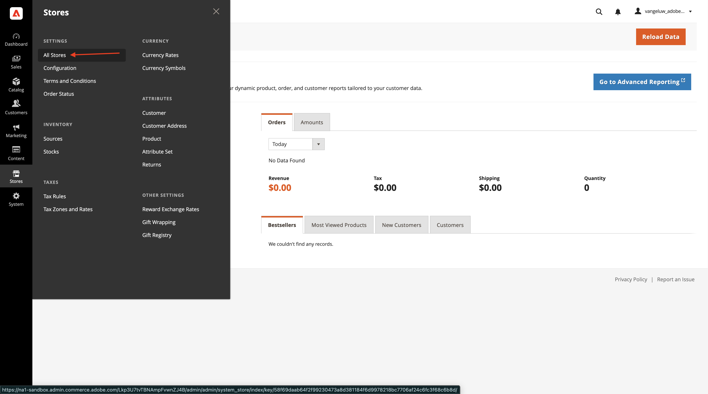
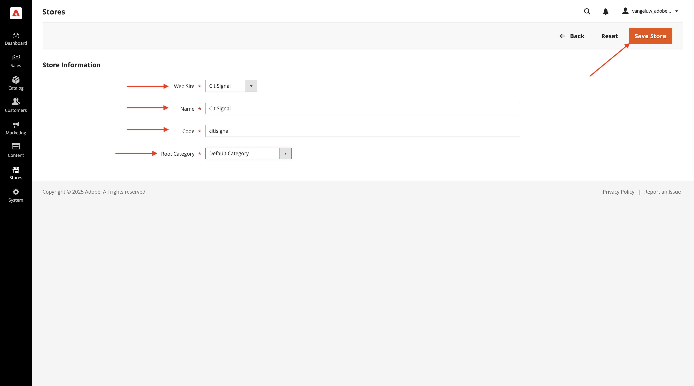
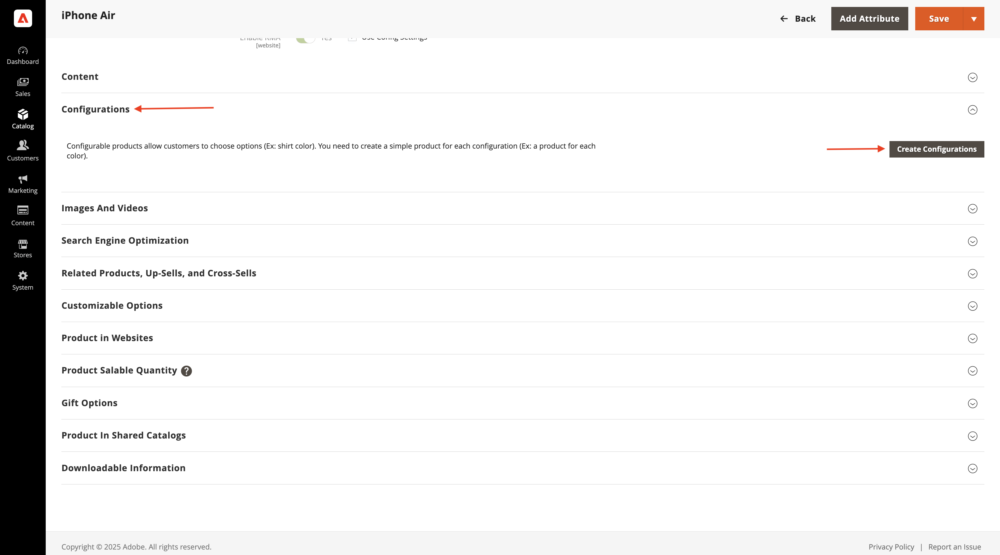

# 1.5.1 Komma igång med Adobe Commerce as a Cloud Service

Gå till [https://experience.adobe.com/](https://experience.adobe.com/){target="_blank"}. Kontrollera att du är i rätt miljö, som bör ha namnet `--aepImsOrgName--`. Klicka på **Commerce**.

## 1.5.1.1 Skapa en ACCS-instans

Du borde se det här då. Klicka på **+ Lägg till instans**.

Fyll i fälten så här:

- **Instansnamn**: `--aepUserLdap-- - ACCS`
- **Miljö**: `Sandbox`
- **Region**: `North America`

Klicka på **Lägg till instans**.

Du håller på att skapas. Detta kan ta 5-10 minuter.

När instansen är klar klickar du på instansen för att öppna den.

## 1.5.1.2 Konfigurera ditt CitiSignal-arkiv

Du borde se det här då. Klicka på **Logga in med Adobe ID** och logga sedan in.

När du är inloggad bör du se den här hemsidan. Det första steget är att konfigurera din CitiSignal-butik i Commerce. Klicka på **Lagrar**.

Klicka på **Alla butiker**.

Klicka på **Skapa webbplats**.

Fyll i fälten så här:

- **Namn**: `CitiSignal`
- **Kod**: `citisignal`

Klicka på **Spara webbplats**.

Du borde vara tillbaka här. Klicka på **Skapa butik**.

Fyll i fälten så här:

- **Webbplats**: `CitiSignal`
- **Namn**: `CitiSignal`
- **Kod**: `citisignal`
- **Rotkategori**: `Default Category`

Klicka på **Spara butik**.

Du borde vara tillbaka här. Klicka på **Skapa butiksvy**.

Fyll i fälten så här:

- **Butik**: `CitiSignal`
- **Namn**: `CitiSignal`
- **Kod**: `citisignal`
- **Status**: `Enabled`

Klicka på **Spara butiksvy**.

Du bör då se det här meddelandet. Klicka på **OK**.

Du borde vara tillbaka här.

## 1.5.1.3 Konfigurera kategorier och produkter

Gå till **Katalog** och välj sedan **Kategorier**.

Välj **Standardkategori** och klicka sedan på **Lägg till underkategori**.

Ange namnet `Phones` och klicka sedan på **Spara**.

Välj **Standardkategori** och klicka sedan på **Lägg till underkategori** igen.

Ange namnet `Watches` och klicka sedan på **Spara**.

Du bör sedan skapa två kategorier.

Gå sedan till **Katalog** och välj **Produkter**.

Du borde se det här då. Klicka på **Lägg till produkt**.

Konfigurera din produkt så här:

- **Produktnamn**: `iPhone Air`
- **SKU**: `iPhone-Air`
- **Pris**: `999`
- **Kvantitet**: `10000`
- **Kategorier**: välj `Phones`

Klicka på **Spara**.

Bläddra ned till **Konfigurationer** och klicka på **Skapa konfigurationer**.

Du borde se det här då. Klicka på **Skapa nytt attribut**.

Ange **standardetiketten** till `Storage` och klicka sedan på **Lägg till alternativ** under **Hantera alternativ**.

Konfigurera det första alternativet med namnet `256GB` i alla tre kolumnerna och klicka sedan på **Lägg till alternativ** igen.

Konfigurera det andra alternativet med namnet `512GB` i alla tre kolumnerna och klicka sedan på **Lägg till alternativ** igen.

Konfigurera det tredje alternativet med namnet `1TB` i alla tre kolumnerna och klicka sedan på **Lägg till alternativ** igen.

Bläddra ned till **Egenskaper för Storefront**. Ange följande alternativ till **Ja**:

- **Använd i sökning**
- **Tillåt HTML-taggar på Storefront**
- **Visas på katalogsidor på Storefront**
- **Använd i produktlista**

Bläddra uppåt och klicka på **Spara attribut**.

Du borde se det här då. Välj båda attributen för **color** och **storage** och klicka på **Next**.

Du borde se det här då. Nu måste du lägga till de tillgängliga färgalternativen. Det gör du genom att klicka på **Skapa nytt värde**.

Ange värdet `Sky-Blue` och klicka på **Skapa nytt värde**.

Ange värdet `Light-Gold` och klicka på **Skapa nytt värde**.

Ange värdet `Cloud-White` och klicka på **Skapa nytt värde**.

Ange värdet `Space-Black`. Klicka på **Markera alla**

Välj alla tre alternativen under **Lagring** och klicka på **Nästa**.

Lämna standardinställningarna och klicka på **Nästa**.

Du borde se det här då. Klicka på **Skapa produkter**.

Klicka på **Spara**.

Bläddra ned till **Produkt på webbplatser** och markera kryssrutan för **CitiSignal**.

Klicka på **Spara**.

Klicka på **Bekräfta**.

Du borde se det här då. Klicka på **Bakåt**.

Du ser nu produkten **iPhone Air** och dess varianter i produktkatalogen.

Nästa steg: [Anslut ACCS till AEM Sites CS/EDS Storefront](./ex2.md){target="_blank"}

Gå tillbaka till [Adobe Commerce as a Cloud Service](./accs.md){target="_blank"}

[Gå tillbaka till alla moduler](./../../../overview.md){target="_blank"}
