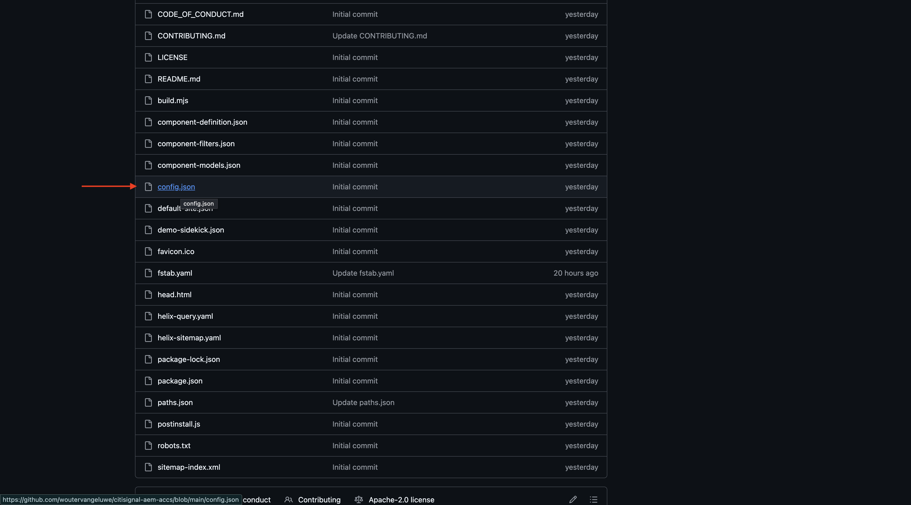

# 1.5.2 Ansluta ACCS till AEM Sites CS/EDS Storefront

>[!IMPORTANT]
>
>För att kunna genomföra denna övning måste du ha tillgång till en fungerande AEM Sites och Assets CS med EDS-miljö.
>
>Om du inte har någon sådan miljö än går du till [Adobe Experience Manager Cloud Service &amp; Edge Delivery Services](./../../../modules/asset-mgmt/module2.1/aemcs.md){target="_blank"}. Följ instruktionerna där så får du tillgång till en sådan miljö.

>[!IMPORTANT]
>
>Om du tidigare har konfigurerat ett AEM CS-program med en AEM Sites- och Assets CS-miljö kan det bero på att din AEM CS-sandlåda är i viloläge. Eftersom det tar 10-15 minuter att dölja en sådan sandlåda, är det en bra idé att starta separationsprocessen nu så att du inte behöver vänta på den vid ett senare tillfälle.

I den här övningen ska du länka AEM Sites CS/EDS Storefront till ACCS-serverdelen. När du öppnar AEM Sites CS/EDS Storefront och går till listsidan för **telefoner** ser du inga produkter än.

När du är klar med övningen bör du se vilka produkter du konfigurerade i den föregående övningen på listsidan för **telefoner** på din AEM Sites CS/EDS Storefront.

Gå till [https://experience.adobe.com/](https://experience.adobe.com/){target="_blank"}. Kontrollera att du är i rätt miljö, som bör ha namnet `--aepImsOrgName--`. Klicka på **Commerce**.

Klicka på ikonen **info** bredvid ACCS-instansen, som ska ha namnet `--aepUserLdap-- - ACCS`.

Du borde se det här då. Kopiera **GraphQL-slutpunkten**.

Gå till [https://da.live/app/adobe-commerce/storefront-tools/tools/config-generator/config-generator](https://da.live/app/adobe-commerce/storefront-tools/tools/config-generator/config-generator). Du måste nu generera en config.json-fil som ska användas för att länka din AEM Sites CS Storefront till din ACCS-backend.

Klistra in **GraphQL-slutpunkts**-URL:en som du kopierade på sidan **Config Generator**.

Klicka på **Generera**.

Kopiera den fullständiga genererade JSON-nyttolasten.

Gå till GitHub-databasen som skapades när du konfigurerade din AEM Sites CS/EDS-miljö. Databasen skapades i övningen [1.1.2 Konfigurera din AEM CS-miljö](./../../../modules/asset-mgmt/module2.1/ex3.md){target="_blank"} och bör ha namnet **citisign-aem-accs**.

I rotkatalogen bläddrar du nedåt och klickar för att öppna filen **config.json**.

Klicka på ikonen **Redigera** .

Ta bort all aktuell text och ersätt den genom att klistra in den JSON-nyttolast som du kopierade på sidan **Config Generator**.

Klicka på **Genomför ändringar..**.

Klicka på **Genomför ändringar**.

Filen **config.json** har uppdaterats. Du bör se ändringarna på webbplatsen inom några minuter. Du kan kontrollera om ändringarna har plockats upp korrekt genom att gå till produktsidan **Telefoner**. Nu bör du se **iPhone Air** visas på sidan.

Om du vill komma åt din webbplats måste du gå till `main--citisignal-aem-accs--XXX.aem.page` och/eller `main--citisignal-aem-accs--XXX.aem.live` efter att du har ersatt XXX med ditt GitHub-användarkonto, som i det här exemplet är `woutervangeluwe`.

I det här exemplet blir den fullständiga URL:en följande:
`https://main--citisignal-aem-accs--woutervangeluwe.aem.page` och/eller `https://main--citisignal-aem-accs--woutervangeluwe.aem.live`.

Det finns ingen bild tillgänglig för produkten just nu, men den visas nu. Du kommer att lägga upp länken till AEM Assets CS för produktbilder i nästa arbete.

Nästa steg: [Ansluta ACCS till AEM Assets CS](./ex3.md){target="_blank"}

Gå tillbaka till [Adobe Commerce as a Cloud Service](./accs.md){target="_blank"}

[Gå tillbaka till alla moduler](./../../../overview.md){target="_blank"}
