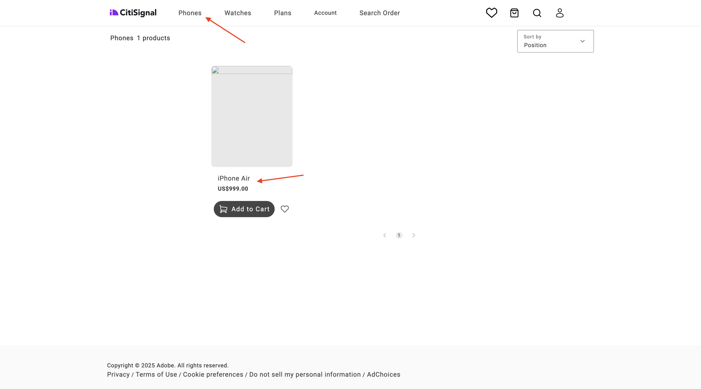
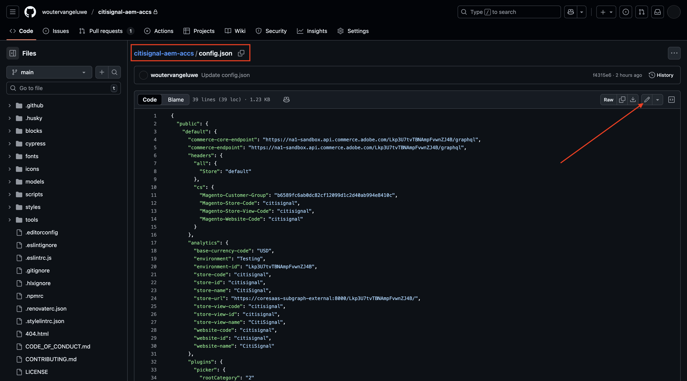
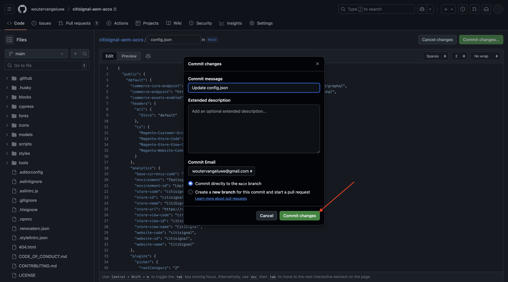
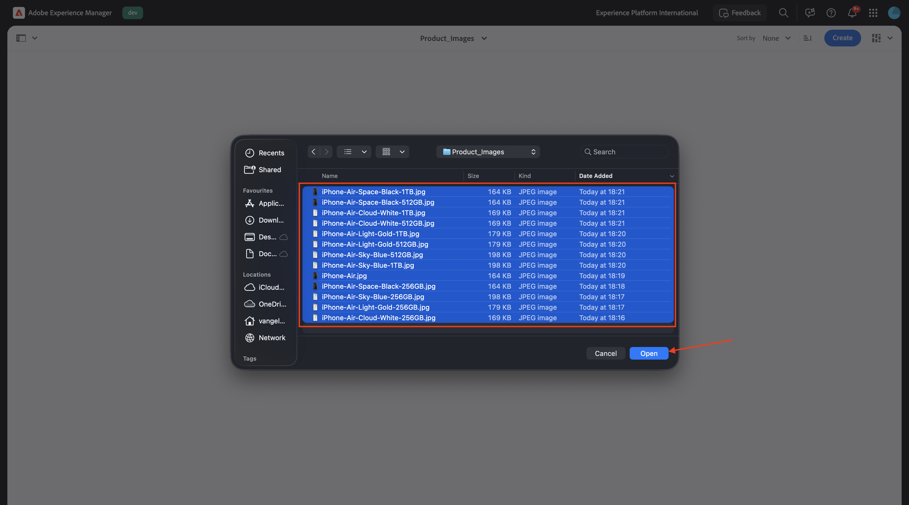

# 1.5.3 Ansluta ACCS till AEM Assets CS

>[!IMPORTANT]
>
>För att kunna genomföra denna övning måste du ha tillgång till en fungerande AEM Sites och Assets CS med EDS-miljö.
>
>Om du inte har någon sådan miljö än går du till [Adobe Experience Manager Cloud Service &amp; Edge Delivery Services](./../../../modules/asset-mgmt/module2.1/aemcs.md){target="_blank"}. Följ instruktionerna där så får du tillgång till en sådan miljö.

>[!IMPORTANT]
>
>Om du tidigare har konfigurerat ett AEM CS-program med en AEM Sites- och Assets CS-miljö kan det bero på att din AEM CS-sandlåda är i viloläge. Eftersom det tar 10-15 minuter att dölja en sådan sandlåda, är det en bra idé att starta separationsprocessen nu så att du inte behöver vänta på den vid ett senare tillfälle.

När du är klar med den föregående övningen kunde du se en produkt som ACCS returnerade till din webbplats, men den hade ingen bild än. När du är klar med övningen bör du också se en bild som returneras.



## 1.5.3.1 Uppdatera pipeline-konfiguration

Gå till [https://my.cloudmanager.adobe.com](https://my.cloudmanager.adobe.com){target="_blank"}. Organisationen som du bör välja är `--aepImsOrgName--`.

Klicka för att öppna ditt Cloud Manager-program, som ska kallas `--aepUserLdap-- - CitiSignal AEM+ACCS`.


Skala ned lite och klicka sedan på **Åtkomst till replikinformation** på fliken **Pipelines** .


Du borde se det här då. Klicka på **Skapa lösenord**.


Klicka på **Generera lösenord** igen.


Du bör sedan ha ett lösenord tillgängligt. Klicka sedan på ikonen **copy** bredvid fältet **Git-kommandorad** .


Skapa en ny katalog på en valfri plats på datorn och ge den namnet **AEM Pipeline GitHub**.


Högerklicka på mappen och välj sedan **Ny terminal i mappen**.


Du borde se det här då.


Klistra in kommandot **Git-kommandorad** som du kopierade tidigare i terminalfönstret.


Du måste ange ett användarnamn. Kopiera användarnamnet från Cloud Manager program Pipeline **Åtkomst till replikinformation** och tryck på **ange**.


Sedan måste du ange lösenordet. Kopiera lösenordet från Cloud Manager Program Pipeline **Åtkomst till replikinformation** och tryck på **ange**.


Detta kan ta en minut. När du är klar har du en lokal kopia av Git-repliken som är kopplad till ditt programs pipeline.


En ny katalog visas i katalogen **AEM Pipeline GitHub**. Öppna den katalogen.


Markera alla filer i den katalogen och ta bort alla.


Kontrollera att katalogen är tom.


Gå till [https://github.com/ankumalh/assets-commerce](https://github.com/ankumalh/assets-commerce).

Kopiera sedan filen **assets-commerce-main.zip** till skrivbordet och zippa upp den. Öppna mappen **assets-commerce-main**.


Kopiera alla filer från katalogen **assets-commerce-main** till den tomma katalogen i programmets Pipeline-databas.


Öppna sedan **Microsoft Visual Studio Code** och öppna mappen som innehåller programmets Pipeline-databas i **Microsoft Visual Studio Code**.


Gå till **Sök** i den vänstra menyn och sök efter `<my-app>`. Du måste ersätta alla förekomster av `<my-app>` med `--aepUserLdap--citisignalaemaccs`.

Klicka på ikonen **Ersätt alla** .


Klicka på **Ersätt**.


De nya filerna är nu klara att överföras tillbaka till Git Repo som är länkad till ditt programs Pipeline-databas. Det gör du genom att öppna mappen **AEM Pipeline GitHub** och högerklicka på den mapp som innehåller de nya filerna. Välj **Ny terminal i mappen**.


Du borde se det här då. Klistra in kommandot `git add .` och tryck på **enter**.


Du borde se det här då. Klistra in kommandot `git commit -m "add assets integration"` och tryck på **enter**.


Du borde se det här då. Klistra in kommandot `git push origin main` och tryck på **enter**.


Du borde se det här då. Ändringarna har nu distribuerats till ditt programs Git-svar för pipeline.


Gå tillbaka till Cloud Manager och klicka på **Stäng**.


När du har gjort ändringar i Git Repo för pipeline måste du köra pipelinen **Distribuera till Dev** igen. Klicka på de tre punkterna **..** och välj **Kör**.


Klicka på **Kör**. Det kan ta 10-15 minuter att köra en pipeline-distribution. Du måste vänta tills pipeline-distributionen har slutförts innan du kan fortsätta.


## 1.5.3.2 Aktivera AEM Assets-integrering i ACCS

Gå tillbaka till ACCS-instansen. Gå till **Store** på den vänstra menyn och välj sedan **Konfiguration**.


Bläddra nedåt på menyn till **ADOBE-TJÄNSTER** och öppna sedan **AEM Assets-integrering**. Du borde se det här då.


Fyll i följande variabler:

- **AEM Assets Program-ID**: Du kan hämta program-ID från AEM CS Author URL. I det här exemplet är program-ID `166717`.


- **AEM Assets miljö-ID**: Du kan hämta miljö-ID från AEM CS Author URL. I det här exemplet är miljö-ID `1786231`.


- **IMS-klient-ID för resursväljare**: inställt på `1`
- **Synkronisering aktiverad**: inställd på `Yes`
- **Visualiseringsägare**: `AEM Assets`
- **Resursmatchningsregel**: `Match by product SKU`
- **Matcha efter produkt-SKU-attributnamn**: `commerce:skus`

Klicka på **Spara konfiguration**.


Du borde se det här då.


## 1.5.3.3 Uppdatera config.json

Gå till GitHub-databasen som skapades när du konfigurerade din AEM Sites CS/EDS-miljö. Databasen skapades i övningen [1.1.2 Konfigurera din AEM CS-miljö](./../../../modules/asset-mgmt/module2.1/ex3.md){target="_blank"} och bör ha namnet **citisign-aem-accs**.

I rotkatalogen bläddrar du nedåt och klickar för att öppna filen **config.json**. Klicka på ikonen **redigera** för att göra ändringar i filen.



Lägg till nedanstående kodfragment under rad 5 `"commerce-endpoint": "https://na1-sandbox.api.commerce.adobe.com/XXX/graphql",`:

```json
 "commerce-assets-enabled": "true",
```

Klicka på **Verkställ ändringar..**.


Klicka på **Verkställ ändringar**.



Ändringen har sparats och kommer att publiceras snart. Det kan ta några minuter innan ändringen syns i butiken.


## 1.5.3.4 Verifiera Commerce-fält i AEM Assets CS

Logga in i AEM CS Author och gå till **Assets**.


Gå till **Filer**.


Öppna mappen **CitiSignal**.


Håll pekaren över en resurs och klicka på ikonen **info** .


Nu bör du se en **Commerce**-flik som innehåller två nya metadataattribut.


Din AEM Assets CS-miljö har nu stöd för integrering med Commerce. Du kan nu börja överföra produktbilder.

## 1.5.3.4 Överför Assets och länk till produkter

[Hämta produktbilderna här](./images/Product_Images.zip). När du har hämtat filerna exporterar du dem till skrivbordet.


Klicka på **Skapa** och välj sedan **Mapp**.


Ange värdet **Product_Images** för fälten **Title** och **Name**. Klicka på **Skapa**.


Klicka för att öppna den mapp du just skapade.


Klicka på **Skapa** och välj sedan **Filer**.


Navigera till mappen **Product_Images** på skrivbordet, markera alla filer och klicka sedan på **Öppna**.



Klicka på **Överför**.


Dina bilder kommer då att vara tillgängliga i din mapp. Håll pekaren över produkten **iPhone-Air-Light-Gold.png** och klicka på ikonen **Egenskaper** .


Bläddra nedåt och ange fältet **Granskningsstatus** till **Godkänd**. Integreringen av AEM Assets CS - ACCS fungerar bara för godkända bilder.


Bläddra uppåt, gå till fliken **Commerce** och klicka sedan på **Lägg till** under **Produktskus**.


Lägg till följande SKU:er för den här produkten:

| Nyckel | Värde | Användning |
|:-------------:| :---------------:| :---------------:| 
| `iPhone-Air-Light-Gold` | `1` | `thumbnail, image, swatch_image, small_image` |
| `iPhone-Air-Light-Gold-256GB` | `1` | `thumbnail, image, swatch_image, small_image` |
| `iPhone-Air-Light-Gold-512GB` | `1` | `thumbnail, image, swatch_image, small_image` |
| `iPhone-Air-Light-Gold-1TB` | `1` | `thumbnail, image, swatch_image, small_image` |

Du borde ha den här då. Klicka på **Spara och stäng**.


Håll pekaren över produkten **iPhone-Air-Space-Black.png** och klicka på ikonen **Egenskaper** .


Bläddra nedåt och ange fältet **Granskningsstatus** till **Godkänd**. Integreringen av AEM Assets CS - ACCS fungerar bara för godkända bilder.


Bläddra uppåt, gå till fliken **Commerce** och klicka sedan på **Lägg till** under **Produktskus**.


Lägg till följande SKU:er för den här produkten:

| Nyckel | Värde | Användning |
|:-------------:| :---------------:| :---------------:| 
| `iPhone-Air-Space-Black` | `1` | `thumbnail, image, swatch_image, small_image` |
| `iPhone-Air-Space-Black-256GB` | `1` | `thumbnail, image, swatch_image, small_image` |
| `iPhone-Air-Space-Black-512GB` | `1` | `thumbnail, image, swatch_image, small_image` |
| `iPhone-Air-Space-Black-1TB` | `1` | `thumbnail, image, swatch_image, small_image` |
| `iPhone-Air` | `1` | `thumbnail, image, swatch_image, small_image` |

Du borde ha den här då. Klicka på **Spara och stäng**.


Håll pekaren över produkten **iPhone-Air-Sky-Blue.png** och klicka på ikonen **Egenskaper** .


Bläddra nedåt och ange fältet **Granskningsstatus** till **Godkänd**. Integreringen av AEM Assets CS - ACCS fungerar bara för godkända bilder.


Bläddra uppåt, gå till fliken **Commerce** och klicka sedan på **Lägg till** under **Produktskus**.


Lägg till följande SKU:er för den här produkten:

| Nyckel | Värde | Användning |
|:-------------:| :---------------:| :---------------:| 
| `iPhone-Air-Sky-Blue` | `1` | `thumbnail, image, swatch_image, small_image` |
| `iPhone-Air-Sky-Blue-256GB` | `1` | `thumbnail, image, swatch_image, small_image` |
| `iPhone-Air-Sky-Blue-512GB` | `1` | `thumbnail, image, swatch_image, small_image` |
| `iPhone-Air-Sky-Blue-1TB` | `1` | `thumbnail, image, swatch_image, small_image` |

Du borde ha den här då. Klicka på **Spara och stäng**.


Hovra över produkten **iPhone-Air-Cloud-White.png** och klicka på ikonen **Egenskaper** .


Bläddra nedåt och ange fältet **Granskningsstatus** till **Godkänd**. Integreringen av AEM Assets CS - ACCS fungerar bara för godkända bilder.


Bläddra uppåt, gå till fliken **Commerce** och klicka sedan på **Lägg till** under **Produktskus**.


Lägg till följande SKU:er för den här produkten:

| Nyckel | Värde | Användning |
|:-------------:| :---------------:| :---------------:| 
| `iPhone-Air-Cloud-White` | `1` | `thumbnail, image, swatch_image, small_image` |
| `iPhone-Air-Cloud-White-256GB` | `1` | `thumbnail, image, swatch_image, small_image` |
| `iPhone-Air-Cloud-White-512GB` | `1` | `thumbnail, image, swatch_image, small_image` |
| `iPhone-Air-Cloud-White-1TB` | `1` | `thumbnail, image, swatch_image, small_image` |

Du borde ha den här då. Klicka på **Spara och stäng**.


Varje **iPhone Air**-bild bör nu ha en **grön tumme uppåt**, vilket anger att resursen har godkänts.


## 1.5.3.5 Verifiera produktbilder på AEM Sites CS/EDS Storefront

>[!NOTE]
>
>Det kan ta upp till 15 minuter innan ändringarna som du gjorde ovan har distribuerats. Om du inte ser bilden som visas ännu, vänta 15 minuter och försök sedan igen.

För att bekräfta att integreringen fungerar måste du öppna din CitiSignal-webbplats.

Om du vill komma åt din webbplats går du till `main--citisignal-aem-accs--XXX.aem.page` och/eller `main--citisignal-aem-accs--XXX.aem.live` efter att du har ersatt XXX med ditt GitHub-användarkonto, som i det här exemplet är `woutervangeluwe`.

I det här exemplet blir den fullständiga URL:en:
`https://main--citisignal-aem-accs--woutervangeluwe.aem.page` och/eller `https://main--citisignal-aem-accs--woutervangeluwe.aem.live`.

Du borde se det här då. Gå till **Telefoner**.


Du bör då se en produktbild som visas för **iPhone Air**. Klicka på **iPhone Air**.


Du borde se det här då. Ändra färg och lagringsalternativ så ser du bilderna ändras dynamiskt baserat på de val du har gjort.


Här är ett exempel på hur du ändrar färgen till **Light-Gold** och lagringsstorleken till **256 GB**.


Nästa steg: [Sammanfattning och fördelar](./summary.md){target="_blank"}

Gå tillbaka till [Adobe Commerce as a Cloud Service](./accs.md){target="_blank"}

[Gå tillbaka till alla moduler](./../../../overview.md){target="_blank"}
