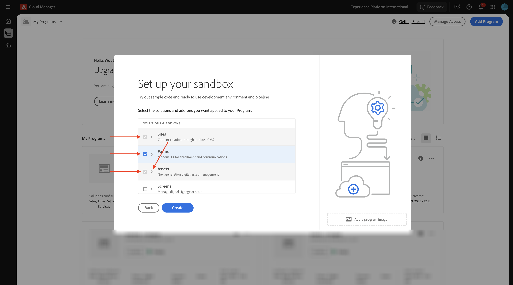

# 1.1.1 Skapa ett Cloud Manager-program

Gå till [https://my.cloudmanager.adobe.com](https://my.cloudmanager.adobe.com){target="_blank"}. Organisationen som du bör välja är `--aepImsOrgName--`. Då ser du något sådant här. Klicka på **Lägg till program**.

{zoomable="yes"}

Använd `--aepUserLdap-- - CitiSignal` för **programnamnet**. Klicka på **Fortsätt**.

{zoomable="yes"}

Kontrollera att följande alternativ är markerade:

- Webbplatser
- Resurser
- Edge-leveranstjänster

Klicka på **Skapa**.

{zoomable="yes"}

Det kan ta 10-20 minuter att skapa miljöer.

{zoomable="yes"}

Under tiden du väntar kan du redan börja med övning [1.1.2 Skapa din dokumentbaserade webbplats](./ex2.md){target="_blank"}.

När miljöerna har skapats och är klara att användas får du en bekräftelse via e-post, varefter du kan komma tillbaka hit.

{zoomable="yes"}

När du har fått din e-postbekräftelse går du tillbaka till [https://my.cloudmanager.adobe.com](https://my.cloudmanager.adobe.com){target="_blank"}. Du kommer då att se att status för ditt program har ändrats till **Ready**. Klicka på programmet för att öppna det.

{zoomable="yes"}

Ta en titt på fliken **Pipelines**. Klicka på de tre punkterna **..** och sedan på **Kör**.

{zoomable="yes"}

Klicka på **Kör**.

{zoomable="yes"}

Klicka sedan på de 3 punkterna **..** på fliken **Miljö** och klicka på **Visa detaljer**.

{zoomable="yes"}

Du kommer då att se din miljöinformation, inklusive URL:en för din **författarmiljö** som du behöver i nästa övning.

{zoomable="yes"}

När din pipeline är klar kan du fortsätta med nästa övning.

Nästa steg: [1.1.2 Skapa en dokumentbaserad webbplats](./ex2.md){target="_blank"}

Gå tillbaka till [Adobe Experience Manager Cloud Service &amp; Edge Delivery Services](./aemcs.md){target="_blank"}

[Gå tillbaka till alla moduler](./../../../overview.md){target="_blank"}
