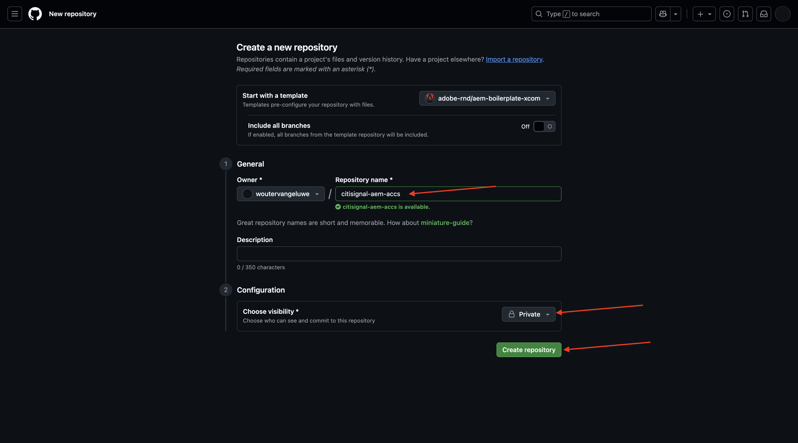
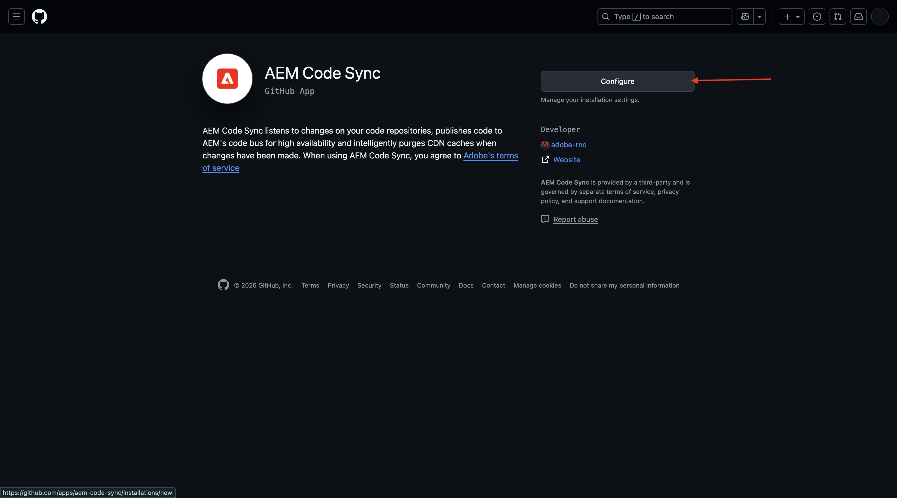
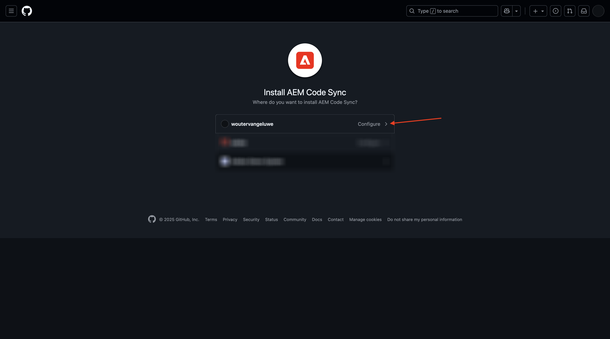
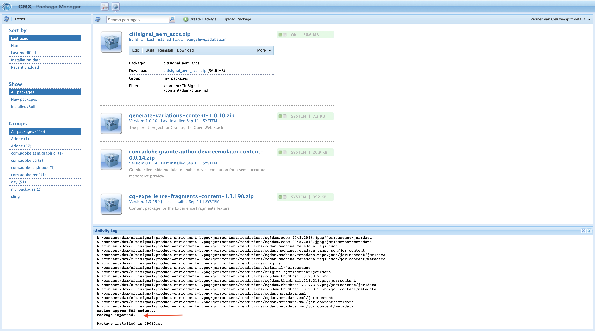
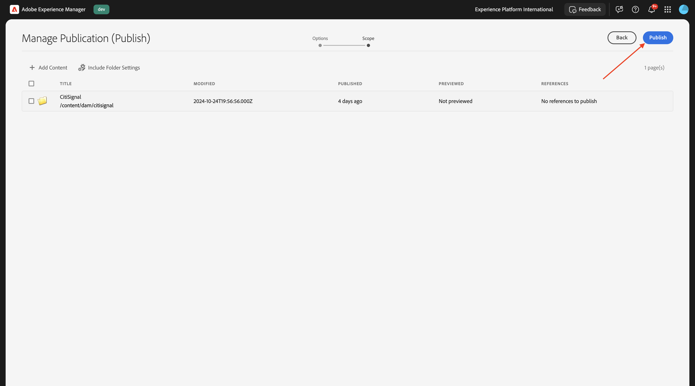
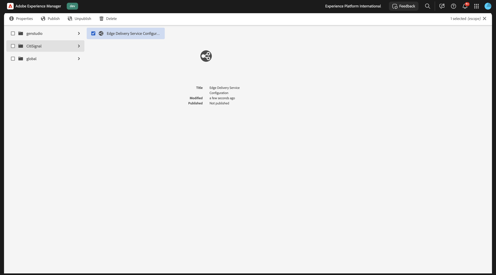
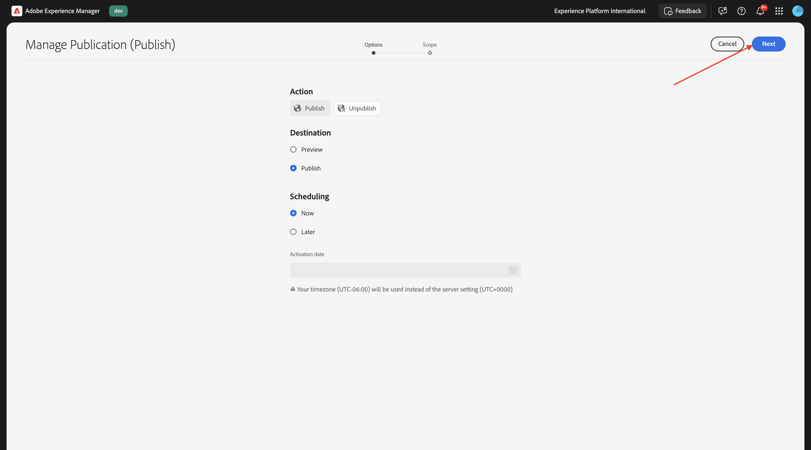

# 1.1.2 Konfigurera AEM CS-miljön

## 1.1.2.1 Konfigurera GitHub-repo

Gå till [https://github.com](https://github.com){target="_blank"}. Klicka på **Logga in**.

Ange dina inloggningsuppgifter. Klicka på **Logga in**.

När du har loggat in visas din GitHub-instrumentpanel.

Gå till [https://github.com/adobe-rnd/aem-boilerplate-xcom](https://github.com/adobe-rnd/aem-boilerplate-xcom){target="_blank"}. Då ser du det här. Klicka på **Använd den här mallen** och sedan på **Skapa en ny databas**.

Använd **som** databasnamn`citisignal-aem-accs`. Ange synligheten till **Privat**. Klicka på **Skapa databas**.

Efter några sekunder har du skapat databasen.

Gå sedan till [https://github.com/apps/aem-code-sync](https://github.com/apps/aem-code-sync){target="_blank"}. Klicka på **Installera** eller **Konfigurera**.

Klicka på knappen **Fortsätt** bredvid ditt GitHub-användarkonto.

Klicka på **Konfigurera** bredvid ditt GitHub-användarkonto.

Klicka på **Välj bara databaser** och lägg sedan till databasen som du just har skapat.

Bläddra nedåt och klicka på **Spara**.

Du får då den här bekräftelsen.

## 1.1.2.2 Uppdatera filen fstab.yaml

Öppna filen `fstab.yaml` genom att klicka på den i GitHub-repon.

Klicka på ikonen **redigera** .

Du måste nu uppdatera värdet för fältet **url** på rad 3.

Du måste ersätta det aktuella värdet med URL:en för din specifika AEM Sites CS-miljö i kombination med inställningarna för GitHub-repon.

Detta är det aktuella värdet för URL:en: `https://author-p130360-e1272151.adobeaemcloud.com/bin/franklin.delivery/adobe-rnd/aem-boilerplate-xcom/main`.

Det finns tre delar av URL:en som behöver uppdateras

`https://XXX/bin/franklin.delivery/YYY/ZZZ/main`

XXX bör ersättas av URL:en till AEM CS Author environment.

YYY ska ersättas med ditt GitHub-användarkonto.

ZZZ ska ersättas med namnet på GitHub-databasen som du använde i föregående övning.

Du kan hitta URL:en till din AEM CS-redigeringsmiljö genom att gå till [https://my.cloudmanager.adobe.com](https://my.cloudmanager.adobe.com){target="_blank"}. Klicka på ditt **program** för att öppna det.

Klicka sedan på de 3 punkterna **..** på fliken **Miljö** och klicka på **Visa detaljer**.

Du kommer då att se din miljöinformation, inklusive URL:en för din **författarmiljö** . Kopiera URL-adressen.

XXX = `author-p166717-e1786231.adobeaemcloud.com`

För GitHub-användarkontonamnet hittar du det enkelt i webbläsarens URL. I det här exemplet är användarkontonamnet `woutervangeluwe`.

YYY = `woutervangeluwe`

För GitHub-databasnamnet kan du även hitta det i webbläsarfönstret som du har öppnat i GitHub. I det här fallet är databasnamnet `citisignal`.

ZZZ = `citisignal-aem-accs`

Dessa tre värden tillsammans leder till den nya URL-adressen som måste konfigureras i filen `fstab.yaml`.

`https://author-p166717-e1786231.adobeaemcloud.com/bin/franklin.delivery/woutervangeluwe/citisignal-aem-accs/main`

Klicka på **Verkställ ändringar..**.

Klicka på **Verkställ ändringar**.

Filen `fstab.yaml` har uppdaterats.

## 1.1.2.3 Överför CitiSignal-resurser och -plats

Gå till [https://my.cloudmanager.adobe.com](https://my.cloudmanager.adobe.com){target="_blank"}. Klicka på ditt **program** för att öppna det.

Klicka sedan på URL:en till din författarmiljö.

Klicka på **Logga in med Adobe**.

Därefter visas din författarmiljö.

URL:en ser ut så här: `https://author-p166717-e1786231.adobeaemcloud.com/ui#/aem/aem/start.html?appId=aemshell`

Du måste nu komma åt **CRX Package Manager**-miljön i AEM. Det gör du genom att ta bort `ui#/aem/aem/start.html?appId=aemshell` från URL:en och ersätta den med `crx/packmgr`, vilket innebär att URL:en ska se ut så här nu:
`https://author-p166717-e1786231.adobeaemcloud.com/crx/packmgr`.
Tryck på **Enter** för att läsa in pakethanterarmiljön

Klicka sedan på **Överför paket**.

Klicka på **Bläddra** för att hitta det paket som ska överföras.

Paketet som ska överföras kallas **citisign-assets.zip** och kan hämtas här: [https://one-adobe-tech-insiders.s3.us-west-2.amazonaws.com/one-adobe/citisignal_aem_accs.zip](https://one-adobe-tech-insiders.s3.us-west-2.amazonaws.com/one-adobe/citisignal_aem_accs.zip){target="_blank"}.

Markera paketet `citisignal_aem_accs.zip` och klicka på **Öppna**.

Klicka sedan på **OK**.

Paketet kommer sedan att överföras. Klicka sedan på **Installera** på det paket som du just överförde.

Klicka på **Installera**.

Efter några minuter installeras ditt paket.

Du kan nu stänga det här fönstret.

## 1.1.2.4 Publicera CitiSignal-resurser

Gå till [https://my.cloudmanager.adobe.com](https://my.cloudmanager.adobe.com){target="_blank"}. Klicka på ditt **program** för att öppna det.

Klicka sedan på URL:en till din författarmiljö.

Klicka på **Logga in med Adobe**.

Därefter visas din författarmiljö. Klicka på **Assets**.

Klicka på **Filer**.

Klicka för att markera mappen **CitiSignal** och klicka sedan på **Hantera publikation**.

Klicka på **Nästa**.

Klicka på **Publicera**.

Dina resurser har nu publicerats.

## 1.1.2.5 Publicera CitiSignal-webbplats

Klicka på produktnamnet **Adobe Experience Manager** i det övre vänstra hörnet av skärmen och klicka sedan på **pilen** bredvid **Assets**.

Klicka sedan på **Webbplatser**.

Du bör sedan se webbplatsen **CitiSignal** som skapades när paketet installerades tidigare.

Om du vill länka din plats till GitHub-databasen som du skapade tidigare måste du skapa en **Edge Delivery Services-konfiguration**.

Det första steget att göra det är att skapa en **molnkonfiguration**.

Det gör du genom att klicka på **Adobe Experience Manager**-produktnamnet i det övre vänstra hörnet av skärmen, klicka på **verktygsikonen** och sedan på **Allmänt** . Klicka för att öppna **Konfigurationsläsaren**.

Du borde se det här då. Klicka på **Skapa**

Ställ in fälten **Titel** och **Namn** på `CitiSignal`. Aktivera kryssrutan för **molnkonfigurationer**.

Klicka på **Skapa**.

Du borde ha den här då.

Därefter måste du uppdatera några fält i den **molnkonfiguration** som du nyss skapade.

Det gör du genom att klicka på produktnamnet **Adobe Experience Manager** i det övre vänstra hörnet på skärmen, klicka på ikonen **tools** och sedan välja **molntjänster** . Klicka för att öppna **Edge Delivery Services Configuration**.

Välj **CitiSignal**, klicka på **Skapa** och välj **Konfiguration**.

Du måste nu fylla i fälten **Organisation** och **Platsnamn**. Om du vill göra det måste du först ha en sökväg till URL:en för din GitHub-databas.

- **Organisation**: använd namnet på din GitHub-organisation, i det här exemplet är det `woutervangeluwe`
- **Platsnamn**: använd namnet på GitHub-databasen som ska vara `citisignal-aem-accs`.

Klicka på **Spara och stäng**.

Du borde ha den här då. Markera kryssrutan framför din nya Edge Cloud-konfiguration och klicka på **Publicera**.

## 1.1.2.6 Uppdatera filsökvägar.json

Öppna filen `paths.json` genom att klicka på den i GitHub-repon.

Klicka på ikonen **redigera** .

Du måste nu uppdatera ersättningstexten `aem-boilerplate-commerce` med `CitiSignal` på raderna 3, 4, 5, 6, 7 och 10.

Klicka på **Verkställ ändringar**.

Klicka på **Verkställ ändringar**.

Filen `paths.json` har uppdaterats.

## 1.1.2.7 Publicera CitiSignal-webbplats

Klicka på **Adobe Experience Manager**-produktnamnet i skärmens övre vänstra hörn och välj sedan **Webbplatser**.

Klicka sedan på kryssrutan framför **CitiSignal**. Klicka sedan på **Hantera publikation**.

Klicka på **Nästa**.

Klicka på **Inkludera underordnade inställningar**.

Klicka för att markera kryssrutan **Inkludera underordnade** och klicka sedan för att avmarkera de andra kryssrutorna. Klicka på **OK**.

Klicka på **Publicera**.

Du kommer då att skickas tillbaka hit. Klicka på **CitiSignal**, markera kryssrutan framför **index** och klicka sedan på **Redigera**.

Din webbplats öppnas sedan i **Universal Editor**.

Du kan nu komma åt din webbplats genom att gå till `main--citisignal-aem-accs--XXX.aem.page` och/eller `main--citisignal-aem-accs--XXX.aem.live` efter att du ersatt XXX med ditt GitHub-användarkonto, som i det här exemplet är `woutervangeluwe`.

I det här exemplet blir den fullständiga URL:en följande:
`https://main--citisignal-aem-accs--woutervangeluwe.aem.page` och/eller `https://main--citisignal-aem-accs--woutervangeluwe.aem.live`.

Det kan ta en stund innan alla resurser visas korrekt, eftersom de måste publiceras först.

Då ser du det här:

## 1.1.2.8 Testa sidprestanda

Gå till [https://pagespeed.web.dev/](https://pagespeed.web.dev/){target="_blank"}. Ange din URL och klicka på **Analysera**.

Då ser du att er webbplats, både i mobilvisualisering och i datorvisualisering, får högsta poäng:

**Mobil**:

**Skrivbord**:

Nästa steg: [Utveckla ett anpassat block](./ex3.md){target="_blank"}

Gå tillbaka till [Adobe Experience Manager Cloud Service &amp; Edge Delivery Services](./aemcs.md){target="_blank"}

[Gå tillbaka till alla moduler](./../../../overview.md){target="_blank"}
