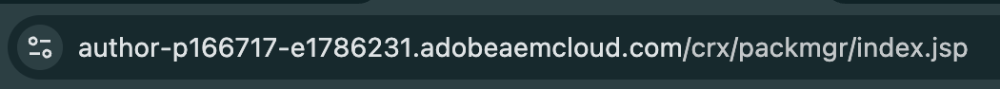
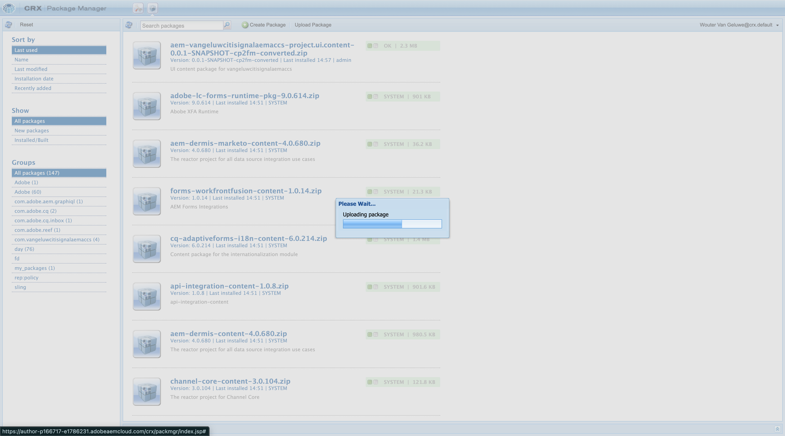
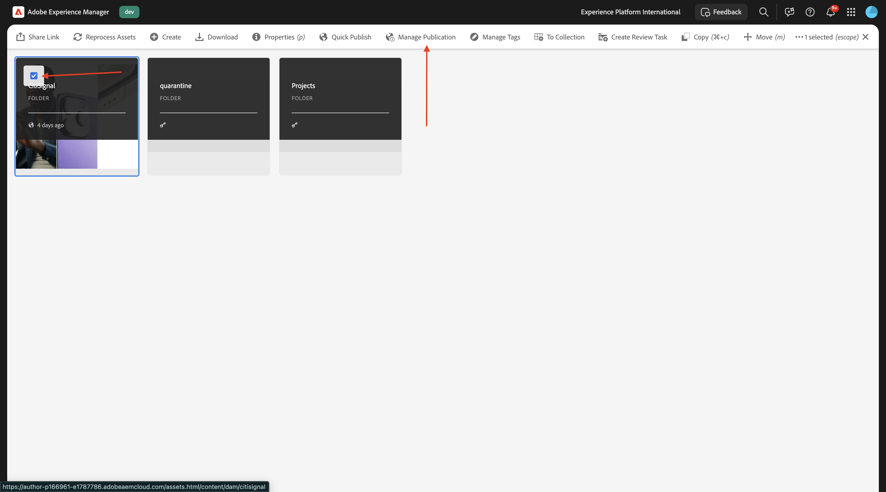
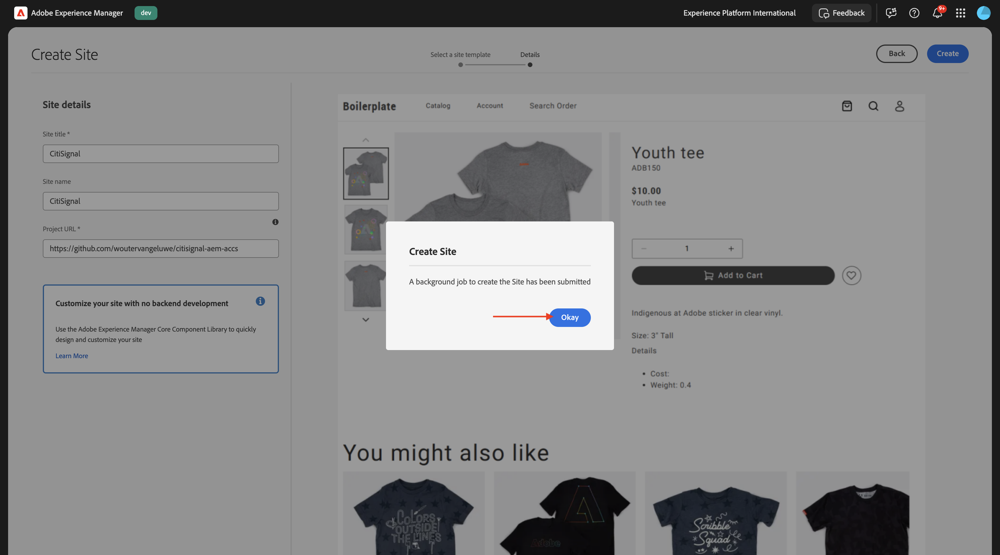

# 1.1.3 Konfigurera AEM CS-miljön

## 1.1.3.1 Konfigurera GitHub-repo

Gå till [https://github.com](https://github.com){target="_blank"}. Klicka på **Logga in**.

{zoomable="yes"}

Ange dina inloggningsuppgifter. Klicka på **Logga in**.

{zoomable="yes"}

När du har loggat in visas din GitHub-instrumentpanel.

{zoomable="yes"}

Gå till [https://github.com/AdobeDevXSC/citisignal-one](https://github.com/AdobeDevXSC/citisignal-one){target="_blank"}. Då ser du det här. Klicka på **Använd den här mallen** och sedan på **Skapa en ny databas**.

{zoomable="yes"}

Använd `citisignal` som **databasnamn**. Ange synligheten till **Privat**. Klicka på **Skapa databas**.

{zoomable="yes"}

Efter några sekunder har du skapat databasen.

{zoomable="yes"}

Gå sedan till [https://github.com/apps/aem-code-sync](https://github.com/apps/aem-code-sync){target="_blank"}. Klicka på **Konfigurera**.

{zoomable="yes"}

Klicka på ditt GitHub-konto.

{zoomable="yes"}

Klicka på **Välj bara databaser** och lägg sedan till databasen som du just har skapat. Klicka sedan på **Installera**.

{zoomable="yes"}

Du får då den här bekräftelsen.

{zoomable="yes"}

## 1.1.3.2 Uppdatera filen fstab.yaml

Öppna filen `fstab.yaml` genom att klicka på den i GitHub-repon.

{zoomable="yes"}

Klicka på ikonen **redigera** .

{zoomable="yes"}

Du måste nu uppdatera värdet för fältet **url** på rad 4.

{zoomable="yes"}

Du måste ersätta det aktuella värdet med URL:en för din specifika AEM CS-miljö i kombination med inställningarna för GitHub-repon.

Detta är det aktuella värdet för URL:en: `https://author-p131639-e1282833.adobeaemcloud.com/bin/franklin.delivery/adobedevxsc/citisignal-one/main`.

Det finns tre delar av URL:en som behöver uppdateras

`https://XXX/bin/franklin.delivery/YYY/ZZZ/main`

XXX bör ersättas av URL:en till AEM CS Author environment.

YYY ska ersättas med ditt GitHub-användarkonto.

ZZZ ska ersättas med namnet på GitHub-databasen som du använde i föregående övning.

Du kan hitta URL:en till din AEM CS-redigeringsmiljö genom att gå till [https://my.cloudmanager.adobe.com](https://my.cloudmanager.adobe.com){target="_blank"}. Klicka på ditt **program** för att öppna det.

{zoomable="yes"}

Klicka sedan på de 3 punkterna **..** på fliken **Miljö** och klicka på **Visa detaljer**.

{zoomable="yes"}

Du kommer då att se din miljöinformation, inklusive URL:en för din **författarmiljö** . Kopiera URL-adressen.

{zoomable="yes"}

XXX = `author-p148073-e1511503.adobeaemcloud.com`

För GitHub-användarkontonamnet hittar du det enkelt i webbläsarens URL. I det här exemplet är användarkontonamnet `woutervangeluwe`.

YYY = `woutervangeluwe`

{zoomable="yes"}

För GitHub-databasnamnet kan du även hitta det i webbläsarfönstret som du har öppnat i GitHub. I det här fallet är databasnamnet `citisignal`.

ZZZ = `citisignal`

{zoomable="yes"}

Dessa tre värden tillsammans leder till den nya URL-adressen som måste konfigureras i filen `fstab.yaml`.

`https://author-p148073-e1511503.adobeaemcloud.com/bin/franklin.delivery/woutervangeluwe/citisignal/main`

Klicka på **Verkställ ändringar..**.

{zoomable="yes"}

Klicka på **Verkställ ändringar**.

{zoomable="yes"}

Filen `fstab.yaml` har uppdaterats.

## 1.1.3.3 Överför CitiSignal-resurser

Gå till [https://my.cloudmanager.adobe.com](https://my.cloudmanager.adobe.com){target="_blank"}. Klicka på ditt **program** för att öppna det.

{zoomable="yes"}

Klicka sedan på URL:en till din författarmiljö.

{zoomable="yes"}

Klicka på **Logga in med Adobe**.

{zoomable="yes"}

Därefter visas din författarmiljö.

{zoomable="yes"}

URL:en ser ut så här: `https://author-p148073-e1511503.adobeaemcloud.com/ui#/aem/aem/start.html?appId=aemshell`

Du måste nu komma åt **CRX Package Manager**-miljön i AEM. Det gör du genom att ta bort `ui#/aem/aem/start.html?appId=aemshell` från URL:en och ersätta den med `crx/packmgr`, vilket innebär att URL:en ska se ut så här nu:
`https://author-p148073-e1511503.adobeaemcloud.com/crx/packmgr`.
Tryck på **Enter** för att läsa in pakethanterarmiljön

{zoomable="yes"}

Klicka sedan på **Överför paket**.

{zoomable="yes"}

Klicka på **Bläddra** för att hitta det paket som ska överföras.

Paketet som ska överföras kallas **citisign-assets.zip** och kan hämtas här: [https://tech-insiders.s3.us-west-2.amazonaws.com/one-adobe/citisignal-assets.zip](https://tech-insiders.s3.us-west-2.amazonaws.com/one-adobe/citisignal-assets.zip){target="_blank"}.

{zoomable="yes"}

Markera paketet och klicka på **Öppna**.

{zoomable="yes"}

Klicka sedan på **OK**.

{zoomable="yes"}

Paketet kommer sedan att överföras.

{zoomable="yes"}

Klicka sedan på **Installera** på det paket som du just överförde.

{zoomable="yes"}

Klicka på **Installera**.

{zoomable="yes"}

Efter några minuter installeras ditt paket.

{zoomable="yes"}

Du kan nu stänga det här fönstret.

## 1.1.3.4 Publicera CitiSignal-resurser

Gå till [https://my.cloudmanager.adobe.com](https://my.cloudmanager.adobe.com){target="_blank"}. Klicka på ditt **program** för att öppna det.

{zoomable="yes"}

Klicka sedan på URL:en till din författarmiljö.

{zoomable="yes"}

Klicka på **Logga in med Adobe**.

{zoomable="yes"}

Därefter visas din författarmiljö. Klicka på **Assets**.

{zoomable="yes"}

Klicka på **Filer**.

{zoomable="yes"}

Klicka för att markera mappen **CitiSignal** och klicka sedan på **Hantera publikation**.

{zoomable="yes"}

Klicka på **Nästa**.

{zoomable="yes"}

Klicka på **Publicera**.

{zoomable="yes"}

Dina resurser har nu publicerats.

## 1.1.3.5 Skapa CitiSignal-webbplats

Gå till [https://my.cloudmanager.adobe.com](https://my.cloudmanager.adobe.com){target="_blank"}. Klicka på ditt **program** för att öppna det.

{zoomable="yes"}

Klicka sedan på URL:en till din författarmiljö.

{zoomable="yes"}

Klicka på **Logga in med Adobe**.

{zoomable="yes"}

Därefter visas din författarmiljö. Klicka på **Webbplatser**.

{zoomable="yes"}

Klicka på **Skapa** och sedan på **Plats från mall**.

{zoomable="yes"}

Klicka på **Importera**.

{zoomable="yes"}

Nu måste du importera en förkonfigurerad mall för platsen. Du kan hämta mallen [här](./../../../assets/aem/citisignal-edge-delivery-services-template-0.0.4.zip){target="_blank"}. Spara filen på skrivbordet.

Markera sedan filen `citisignal-edge-delivery-services-template-0.0.4.zip` och klicka på **Öppna**.

{zoomable="yes"}

Då ser du det här. Klicka för att välja mallen som du just överförde och klicka sedan på **Nästa**.

{zoomable="yes"}

Nu måste du fylla i några detaljer.

- Platstitel: använd **CitiSignal**
- Platsnamn: använd **citisign-one**
- GitHub-URL: kopiera URL:en för GitHub-repo som du använde tidigare

{zoomable="yes"}

Du får den här då. Klicka på **Skapa**.

{zoomable="yes"}

Webbplatsen håller på att skapas. Det här kan ta några minuter. Klicka på **OK**.

{zoomable="yes"}

Uppdatera skärmen efter några minuter så ser du din nya CitiSignal-webbplats.

{zoomable="yes"}

## 1.1.3.6 Publicera CitiSignal-webbplats

Klicka sedan på kryssrutan framför **CitiSignal**. Klicka sedan på **Hantera publikation**.

{zoomable="yes"}

Klicka på **Nästa**.

{zoomable="yes"}

Klicka på **Inkludera underordnade inställningar**.

{zoomable="yes"}

Klicka för att markera kryssrutan **Inkludera underordnade** och klicka sedan för att avmarkera de andra kryssrutorna. Klicka på **OK**.

{zoomable="yes"}

Klicka på **Publicera**.

{zoomable="yes"}

Du kommer då att skickas tillbaka hit. Navigera till **CitiSignal** > **us** > **en**. Klicka i kryssrutan framför **index** och klicka sedan på **Redigera**.

{zoomable="yes"}

Din webbplats öppnas sedan i **Universal Editor**.

{zoomable="yes"}

Du kan nu komma åt din webbplats genom att gå till `main--citisignal--XXX.aem.page/us/en/` och/eller `main--citisignal--XXX.aem.live/us/en/` efter att du ersatt XXX med ditt GitHub-användarkonto, som i det här exemplet är `woutervangeluwe`.

I det här exemplet blir den fullständiga URL:en följande:
`https://main--citisignal--woutervangeluwe.aem.page/us/en/` och/eller `https://main--citisignal--woutervangeluwe.aem.live/us/en/`.

Det kan ta en stund innan alla resurser visas korrekt, eftersom de måste publiceras först.

Då ser du det här:

{zoomable="yes"}

Efter några minuter läses alla resurser in korrekt.

{zoomable="yes"}

## 1.1.3.7 Testa sidprestanda

Gå till [https://pagespeed.web.dev/](https://pagespeed.web.dev/){target="_blank"}. Ange din URL och klicka på **Analysera**.

{zoomable="yes"}

Då ser du att er webbplats, både i mobilvisualisering och i datorvisualisering, får högsta poäng:

**Mobil**:

{zoomable="yes"}

**Skrivbord**:

{zoomable="yes"}

Nästa steg: [1.1.4 Konfigurera ett anpassat block](./ex4.md){target="_blank"}

Gå tillbaka till [Adobe Experience Manager Cloud Service &amp; Edge Delivery Services](./aemcs.md){target="_blank"}

[Gå tillbaka till alla moduler](./../../../overview.md){target="_blank"}
