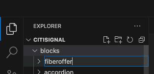
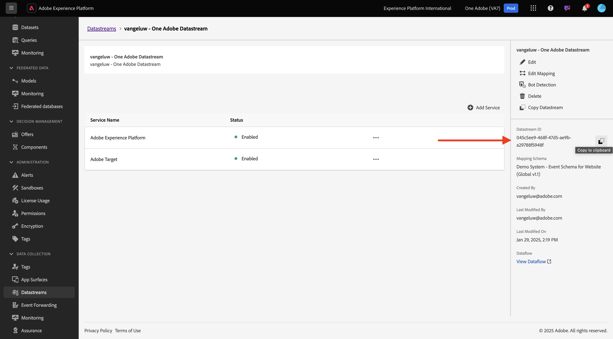
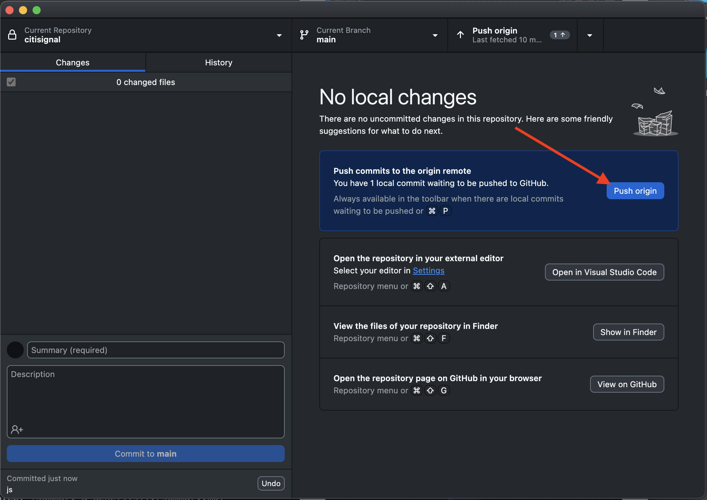

# 1.1.4 Avancerat anpassat block

I föregående övning konfigurerade du ett enkelt anpassat block med namnet **Fibre Offer** som visar fält som **Erbjud text**, **Erbjud CTA** och **Erbjud bild** på din webbplats.

Du kan nu fortsätta arbeta med det här blocket.

{zoomable="yes"}

## 1.1.4.1 Formatera blocket

Nu när du har ett fungerande **fiberoffer** -block kan du formatera det.

Gå tillbaka till Visual Studio Code och öppna mappen **blocks**. Nu bör du se flera mappar där varje mapp refererar till ett visst block. Du måste skapa en mapp för det anpassade blocket för att kunna göra ditt **fiberoffer**-block mer avancerat.

{zoomable="yes"}

Markera mappen **block** och klicka sedan på ikonen **Skapa ny mapp** .

{zoomable="yes"}

Namnge mappen `fiberoffer` och tryck på **enter**.

{zoomable="yes"}

Markera den nya mappen **defiffer** och klicka på ikonen **Skapa ny fil** .

{zoomable="yes"}

En ny fil skapas. Ange namnet **fiberoffer.js** och tryck på Retur.

{zoomable="yes"}

Nu kan du implementera blockdekoration genom att lägga till följande JavaScript i filen **fiberopoffer.js**.

Spara filen.

```js
export default function decorate(block) {
  const offerText = block.children[0];
  const offerCTA = block.children[1];
  const offerImage = block.children[2];

  offerText.id = 'offerText';
  offerText.className = 'offerText';
  offerCTA.id = 'offerCTA';
  offerCTA.className = 'offerCTA';
  offerImage.id = 'offerImage';
  offerImage.className = 'offerImage';
}
```

{zoomable="yes"}

Markera den nya mappen **defiffer** och klicka på ikonen **Skapa ny fil** igen.

{zoomable="yes"}

En ny fil skapas. Ange namnet **defioffer.css** och tryck på Retur.

{zoomable="yes"}

Kopiera och klistra in följande CSS-kod i den nyligen skapade filen.

```js
.offerText, .offerCTA, .offerImage{
    color: #14161A;
    font-size: 30px;
    padding: 0 0 24px;
    display: flex;
    flex-direction: column;
    margin: 1rem 0;
    text-align: center;
}
```

Spara ändringarna.

{zoomable="yes"}

Du har nu gjort flera ändringar i ditt projekt som behöver implementeras i GitHub-databasen igen. Öppna **GitHub Desktop** om du vill göra det.

Du bör sedan se de två filer som du just redigerade under **Ändringar**. Granska ändringarna.

Ange ett namn för din PR, `js css`. Klicka på **Verkställ för huvudsidan**.

{zoomable="yes"}

Du borde se det här då. Klicka på **Push origin**.

{zoomable="yes"}

Gå till ditt GitHub-konto i webbläsaren och till databasen som du skapade för CitiSignal. Du bör då se något liknande och visa att dina ändringar har tagits emot.

{zoomable="yes"}

Du kan nu visa ändringarna av din webbplats genom att gå till `main--citisignal--XXX.aem.page/us/en/` och/eller `main--citisignal--XXX.aem.live/us/en/` efter att du ersatt XXX med ditt GitHub-användarkonto, som i det här exemplet är `woutervangeluwe`.

I det här exemplet blir den fullständiga URL:en följande:
`https://main--citisignal--woutervangeluwe.aem.page/us/en/` och/eller `https://main--citisignal--woutervangeluwe.aem.live/us/en/`.

Du bör då se det här med formateringen tillämpad på sidan.

{zoomable="yes"}

## 1.1.4.2 Lägg till logik och läsa in data från en extern slutpunkt

I den här övningen kommer du att göra en&quot;raw&quot;-konfiguration av Adobe Web SDK och du kommer att begära nästa bästa erbjudande från Adobe Journey Optimizer Offer Decisioning.

För att vara tydlig: detta är inte avsett som en implementering av Web SDK för AEM as a Cloud Service. I nästa övning kommer du att implementera datainsamling med ett specifikt plugin-program som utvecklats för detta.

Den här övningen är avsedd att visa dig några grundläggande saker i JavaScript, som att läsa in ett externt JS-bibliotek med biblioteket **alloy.js** , skicka en begäran och mycket mer.

Biblioteket **alloy.js** är biblioteket bakom Web SDK, vilket gör det möjligt att skicka begäranden från en webbplats till Adobe Edge Network, och därifrån även program som Adobe Experience Platform, Adobe Analytics, Adobe Target med flera.

Lägg till den här koden under föregående kod som du lade till för formateringen av blocket:

```javascript
var script1 = document.createElement('script');
  script1.text = "!function(n,o){o.forEach(function(o){n[o]||((n.__alloyNS=n.__alloyNS||[]).push(o),n[o]=function(){var u=arguments;return new Promise(function(i,l){n[o].q.push([i,l,u])})},n[o].q=[])})}(window,['alloy']);"
  document.head.appendChild(script1);

  var script2 = document.createElement('script');
  script2.async = true;
  script2.src = "https://cdn1.adoberesources.net/alloy/2.14.0/alloy.min.js";
  document.head.appendChild(script2);

  alloy("configure", {
    "edgeConfigId": "045c5ee9-468f-47d5-ae9b-a29788f5948f",
    "orgId": "907075E95BF479EC0A495C73@AdobeOrg",
    "defaultConsent": "in"
  });
```

Du borde ha den här då.

Den första script-taggen (script1) som du har lagt till är en funktion som används av Web SDK och som skapar ett window-objekt med namnet **alloy**.

Den andra script-taggen (script2) läser asynkront in alloy.js-biblioteket från Adobe CDN.

Det tredje kodblocket konfigurerar i princip legeringsobjektet för att skicka data till en viss Adobe IMS-organisation och datastream.

I modulen **Komma igång** har du redan konfigurerat ett datastream med namnet `--aepUserLdap-- - One Adobe Datastream`. Fältet **edgeConfigId** i ovanstående kod refererar till ID:t för den konfigurerade datastreamen.

Du behöver inte ändra fältet **edgeConfigId** för tillfället. I nästa övning kan du göra detta med plugin-programmet **MarTech**.

{zoomable="yes"}

Du borde ha den här nu.

{zoomable="yes"}

Lägg sedan till det här blocket under den föregående koden som du lade till i.

```javascript
var ECID = "";

  alloy("getIdentity")
    .then(function (result) {
      // The command succeeded.
      console.log("ECID:", result.identity.ECID);
      ECID = result.identity.ECID;
      getOffer(ECID);

    })
    .catch(function (error) {
      // The command failed.
      // "error" will be an error object with additional information.
    });
```

Det här kodblocket används för att hämta värdet för Experience Cloud ID (ECID). ECID är webbläsarens unika enhets-ID.

Som du kan se i ovanstående kod anropas en annan funktion när ECID har hämtats. Den här funktionen kallas **getOffer()** som du lägger till härnäst.

{zoomable="yes"}

Lägg sedan till nedanstående kod under

```javascript
async function getOffer(ECID) {
  var url = "https://edge.adobedc.net/ee/irl1/v1/interact?configId=045c5ee9-468f-47d5-ae9b-a29788f5948f";

  var timestamp = new Date().toISOString();

  var offerRequest = {
    "events": [
      {
        "xdm": {
          "eventType": "decisioning.propositionDisplay",
          "timestamp": timestamp,
          "_experienceplatform": {
            "identification": {
              "core": {
                "ecid": ECID
              }
            }
          },
          "identityMap": {
            "ECID": [
              {
                "id": ECID
              }
            ]
          }
        },
        "query": {
          "personalization": {
            "schemas": [
              "https://ns.adobe.com/personalization/default-content-item",
              "https://ns.adobe.com/personalization/html-content-item",
              "https://ns.adobe.com/personalization/json-content-item",
              "https://ns.adobe.com/personalization/redirect-item",
              "https://ns.adobe.com/personalization/ruleset-item",
              "https://ns.adobe.com/personalization/message/in-app",
              "https://ns.adobe.com/personalization/message/content-card",
              "https://ns.adobe.com/personalization/dom-action"
            ],
            "decisionScopes": [
              "eyJ4ZG06YWN0aXZpdHlJZCI6ImRwczpvZmZlci1hY3Rpdml0eToxYTI3ODk3NzAzYTY5NWZmIiwieGRtOnBsYWNlbWVudElkIjoiZHBzOm9mZmVyLXBsYWNlbWVudDoxYTI0ZGM2MWJmYjJlMjIwIn0=",
              "eyJ4ZG06YWN0aXZpdHlJZCI6ImRwczpvZmZlci1hY3Rpdml0eToxYTI3ODk3NzAzYTY5NWZmIiwieGRtOnBsYWNlbWVudElkIjoiZHBzOm9mZmVyLXBsYWNlbWVudDoxYTI0ZGM0MzQyZjJlMjFlIn0="
            ]
          }
        }
      }
    ]
  }

  try {
    const response = await fetch(url, {
      method: "POST",
      headers: {
        "Content-Type": "application/json"
      },
      body: JSON.stringify(offerRequest),
    });

    if (response.status === 200) {
      var body = await response.json();
      console.log("Offer Decisioning Response: ", body);

      const decisions = body["handle"];

      decisions.forEach(decision => {
        if (decision["type"] == "personalization:decisions") {
          console.log("Offer Decisioning decision detail: ", decision);
          const payloads = decision["payload"];

          if (payloads === undefined || payloads.length == 0) {
            //do nothing
          } else {
            payloads.forEach(payload => {
              if (payload["placement"]["name"] == "Web - Image") {
                console.log("Web-Image payload");
                const items = payload["items"];
                items.forEach(item => {
                  if (item["id"].includes("dps:fallback-offer")) {
                    console.log("Item details: ", item);
                    const deliveryURL = item["data"]["deliveryURL"];

                    document.querySelector("#offerImage").innerHTML = "";
                  } else if (item["id"].includes("dps:personalized-offer")) {
                    console.log("Item details: ", item);
                    const deliveryURL = item["data"]["deliveryURL"];
                    console.log("Web-Image Personalized Offer Content: ", deliveryURL)

                    document.querySelector("#offerImage").innerHTML = "";
                  }
                });
              } else if (payload["placement"]["name"] == "Web - JSON") {
                console.log("Web-JSON payload");
                const items = payload["items"];
                items.forEach(item => {
                  if (item["id"].includes("dps:fallback-offer")) {
                    const content = JSON.parse(item["data"]["content"]);

                    console.log("Web-JSON Fallback Content: ", content)

                    document.querySelector("#offerText").innerHTML = content.text;
                    document.querySelector("#offerCTA").innerHTML = content.cta;
                  } else if (item["id"].includes("dps:personalized-offer")) {
                    const content = JSON.parse(item["data"]["content"]);

                    console.log("Web-JSON Personalized Offer Content: " + content);

                    document.querySelector("#offerText").innerHTML = content.text;
                    document.querySelector("#offerCTA").innerHTML = content.cta;
                  }
                });
              }
            });
          }
          document.querySelector("#offerImage").style.display = "block";
          document.querySelector("#offerText").style.display = "block";
          document.querySelector("#offerCTA").style.display = "block";
        }
      });
    } else {
      console.warn("Offer Decisioning Response unsuccessful:", response.body);
    }
  } catch (error) {
    console.error("Error when getting Offer Decisioning Response:", error);
  }
}
```

Det är viktigt att kodblocket klistras in under den avslutande parentesen som du kan se på rad 42 i det här exemplet. Koden som du just klistrade in är en separat funktion som behöver en egen plats i den här filen och kan inte kapslas i **standardfunktionen** ovan.

{zoomable="yes"}

Kodblocket som du just klistrat in simulerar en begäran som normalt skulle göras av SDK/alloy.js. I det här exemplet kommer en **fetch**-begäran att göras till **edge.adobedc.net**.

I begäran anges 2 **beslutsomfattningar** som ber Adobe Journey Optimizer Offer Decisioning att fatta ett beslut om vilket erbjudande som ska ses av detta ECID.

När svaret har tagits emot tolkar koden svaret och filtrerar bort sådant som URL:en för den bild som ska visas samt JSON-svaret som innehåller sådant som Erbjudandetext och Erbjudande CTA, varefter koden visar dessa på webbplatsen.

Kom ihåg - den här metoden används endast i aktiveringssyfte och är inte det bästa sättet att genomföra datainsamling.

Spara ändringarna. Öppna sedan **Github Desktop**, ge din PR ett namn och klicka på **Verkställ för huvudsidan**.

{zoomable="yes"}

Klicka sedan på **Push origin**.

{zoomable="yes"}

Du kan nu visa ändringarna av din webbplats genom att gå till `main--citisignal--XXX.aem.page/us/en/` och/eller `main--citisignal--XXX.aem.live/us/en/` efter att du ersatt XXX med ditt GitHub-användarkonto, som i det här exemplet är `woutervangeluwe`.

I det här exemplet blir den fullständiga URL:en följande:
`https://main--citisignal--woutervangeluwe.aem.page/us/en/` och/eller `https://main--citisignal--woutervangeluwe.aem.live/us/en/`.

Du borde se det här då.

{zoomable="yes"}

Nästa steg: [AEM Edge Delivery Services MarTech-plugin](./ex5.md){target="_blank"}

Gå tillbaka till [Adobe Experience Manager Cloud Service &amp; Edge Delivery Services](./aemcs.md){target="_blank"}

[Gå tillbaka till alla moduler](./../../../overview.md){target="_blank"}
