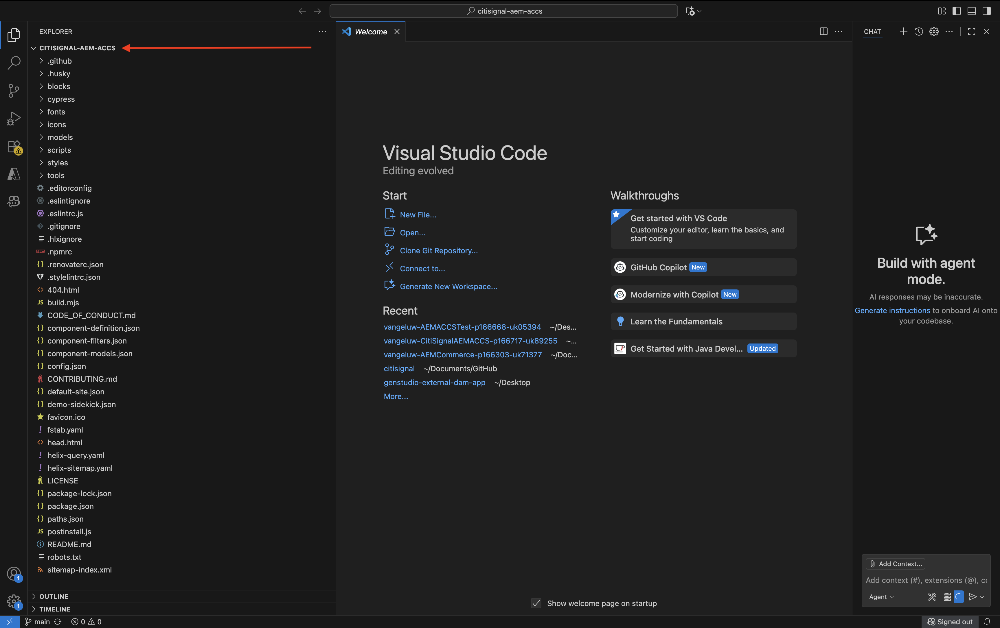
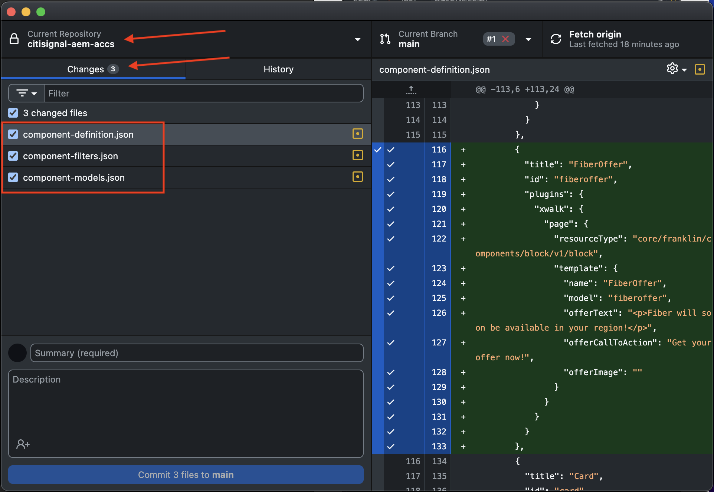
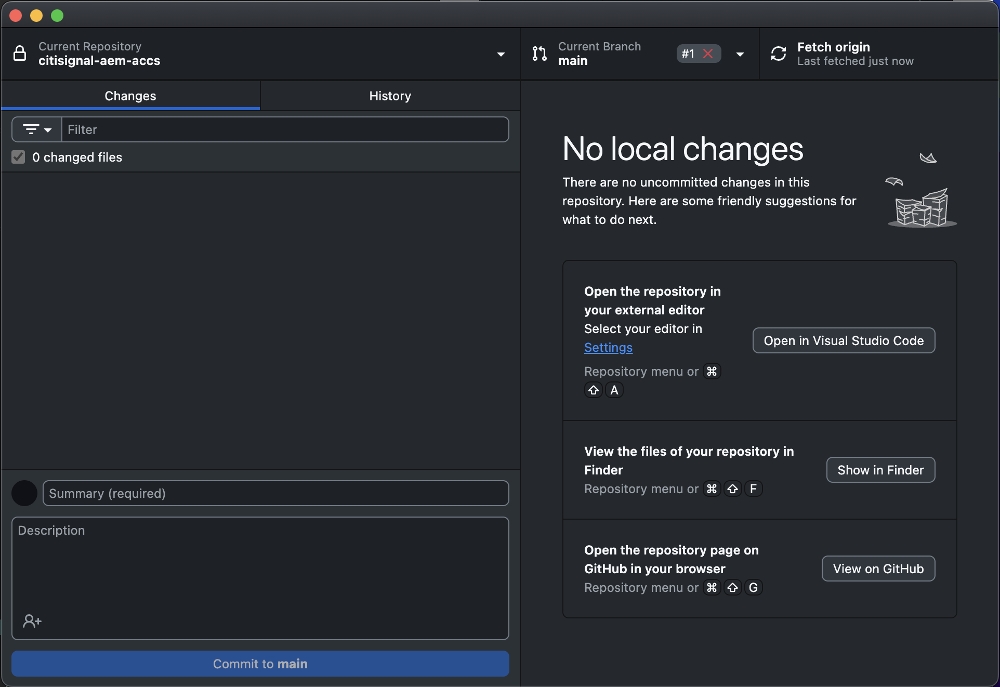
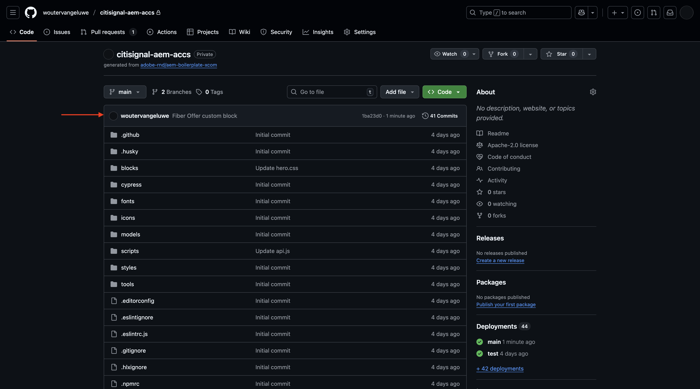
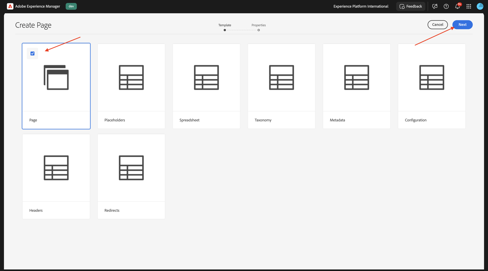

# 1.1.4 Utveckla ett enkelt anpassat block

## 1.1.4.1 Konfigurera din lokala utvecklingsmiljö

Gå till [https://desktop.github.com/download/](https://desktop.github.com/download/){target="_blank"}, hämta och installera **Github Desktop**.

{zoomable="yes"}

När du har installerat Github Desktop går du till GitHub-versionen som du skapade i föregående övning. Klicka på **&lt;> Kod** och sedan på **Öppna med GitHub Desktop**.

{zoomable="yes"}

Din GitHub-repo öppnas sedan i GitHub Desktop. Du kan ändra den **lokala sökvägen**. Klicka på **Klona**.

{zoomable="yes"}

En lokal mapp kommer nu att skapas.

{zoomable="yes"}

Öppna Visual Studio-kod. Gå till **Arkiv** > **Öppna mapp**.

{zoomable="yes"}

Välj den mapp som används av GitHub-konfigurationen för **citisignal**.

{zoomable="yes"}

Nu ser du att mappen är öppen i Visual Studio Code. Nu kan du skapa ett nytt block.

{zoomable="yes"}

## 1.1.4.2 Skapa ett enkelt anpassat block

Adobe rekommenderar att du utvecklar block i tre faser:

- Skapa definitionen och modellen för blocket, granska det och ta det till produktion.
- Skapa innehåll med det nya blocket.
- Implementera dekoration och stilar för det nya blocket.

### component-definition.json

Öppna filen **component-definition.json** i Visual Studio Code.

{zoomable="yes"}

Bläddra nedåt tills du ser komponenten **Quote**. Placera markören bredvid den sista komponentens avslutande parentes.

{zoomable="yes"}

Klistra in den här koden och ange ett kommatecken **,** efter kodblocket:

```json
{
  "title": "FiberOffer",
  "id": "fiberoffer",
  "plugins": {
    "xwalk": {
      "page": {
        "resourceType": "core/franklin/components/block/v1/block",
        "template": {
          "name": "FiberOffer",
          "model": "fiberoffer",
          "offerText": "<p>Fiber will soon be available in your region!</p>",
          "offerCallToAction": "Get your offer now!",
          "offerImage": ""
        }
      }
    }
  }
}
```

Spara ändringarna.

{zoomable="yes"}

### component-models.json

Öppna filen **component-models.json** i Visual Studio Code.

{zoomable="yes"}

Bläddra nedåt tills du ser det sista objektet. Placera markören bredvid den sista komponentens avslutande parentes.

{zoomable="yes"}

Ange ett kommatecken **,**, tryck sedan på Retur och klistra in koden på nästa rad:

```json
{
  "id": "fiberoffer",
  "fields": [
     {
       "component": "richtext",
       "name": "offerText",
       "value": "",
       "label": "Offer Text",
       "valueType": "string"
     },
     {
       "component": "richtext",
       "valueType": "string",
       "name": "offerCallToAction",
       "label": "Offer CTA",
       "value": ""
     },
     {
       "component": "reference",
       "valueType": "string",
       "name": "offerImage",
       "label": "Offer Image",
        "multi": false
     }
   ]
}
```

Spara ändringarna.

{zoomable="yes"}

### component-filters.json

Öppna filen **component-filters.json** i Visual Studio-koden.

{zoomable="yes"}

Under **section** anger du ett kommatecken **,** och ID:t för din komponent, **defiffer**, efter den aktuella sista raden.

Spara ändringarna.

{zoomable="yes"}

## 1.1.4.3 Genomför dina ändringar

Du har nu gjort flera ändringar i ditt projekt som behöver implementeras i GitHub-databasen igen. Öppna **GitHub Desktop** om du vill göra det.

Du bör sedan se de 3 filer som du just redigerade under **Ändringar**. Granska ändringarna.

{zoomable="yes"}

Ange ett namn för din PR, `Fiber Offer custom block`. Klicka på **Verkställ för huvudsidan**.

{zoomable="yes"}

Du borde se det här då. Klicka på **Push origin**.

{zoomable="yes"}

Efter några sekunder har dina ändringar överförts till din GitHub-databas.

{zoomable="yes"}

Gå till ditt GitHub-konto i webbläsaren och till databasen som du skapade för CitiSignal. Du bör då se något liknande och visa att dina ändringar har tagits emot.

{zoomable="yes"}

## 1.1.4.4 Lägg till blocket på en sida

Nu när ditt grundläggande offertblock har definierats och implementerats i CitiSignal-projektet kan du lägga till ett **fiberoffer** -block på en befintlig sida.

Gå till [https://my.cloudmanager.adobe.com](https://my.cloudmanager.adobe.com){target="_blank"}. Klicka på ditt **program** för att öppna det.

{zoomable="yes"}

Klicka sedan på de 3 punkterna **..** på fliken **Miljö** och klicka på **Visa detaljer**.

{zoomable="yes"}

Du kommer då att se din miljöinformation. Klicka på URL:en för din **författarmiljö**.

>[!NOTE]
>
>Det är möjligt att din miljö är i viloläge. Om så är fallet måste du avviloera din miljö först.

{zoomable="yes"}

Du bör då se din AEM Author-miljö. Gå till **Webbplatser**.

{zoomable="yes"}

Gå till **CitiSignal** > **us** > **en**.

{zoomable="yes"}

Klicka på **Skapa** och välj **Sida**.

{zoomable="yes"}

Välj **Sida** och klicka på **Nästa**.

{zoomable="yes"}

Ange följande värden:

- Titel: **CitiSignal Fiber**
- Namn: **citisign-fiber**
- Sidrubrik: **CitiSignal Fiber**

Klicka på **Skapa**.

{zoomable="yes"}

Du borde se det här då.

{zoomable="yes"}

Klicka i det tomma området för att markera komponenten **section**. Klicka sedan på plusikonen **+** på den högra menyn.

{zoomable="yes"}

Du bör sedan se ditt anpassade block visas i listan med tillgängliga block. Klicka för att markera den.

{zoomable="yes"}

Då visas fält som **Erbjud text**, **Erbjud CTA** och **Erbjud bild** som läggs till i redigeraren. Klicka på **+ Lägg till** i fältet **Erbjud bild** för att välja en bild.

{zoomable="yes"}

Du borde se det här då. Klicka för att öppna mappen **citisign**.

{zoomable="yes"}

Välj bilden **product-enrichment-1.png**. Klicka på **Markera**.

{zoomable="yes"}

Du borde ha den här då. Klicka på **Publicera**.

{zoomable="yes"}

Klicka på **Publicera** igen.

{zoomable="yes"}

Din nya sida har publicerats.

## 1.1.4.5 Lägg till din nya sida på navigeringsmenyn

Gå till **CitiSignal** > **Fragment** i AEM Sites-översikten och markera kryssrutan för **Header**. Klicka på **Redigera**.

{zoomable="yes"}

Lägg till ett menyalternativ på navigeringsmenyn med texten `Fiber`. Markera texten **Fiber** och klicka på ikonen **link** .

{zoomable="yes"}

Ange den här för **URL** `/us/en//citisignal-fiber` och klicka på ikonen **V** för att bekräfta.

{zoomable="yes"}

Du borde ha den här då. Klicka på **Publicera**.

{zoomable="yes"}

Klicka på **Publicera** igen.

{zoomable="yes"}

Du kan nu visa ändringarna av din webbplats genom att gå till `main--citisignal--XXX.aem.page/us/en/` och/eller `main--citisignal--XXX.aem.live/us/en/` efter att du ersatt XXX med ditt GitHub-användarkonto, som i det här exemplet är `woutervangeluwe`.

I det här exemplet blir den fullständiga URL:en följande:
`https://main--citisignal--woutervangeluwe.aem.page/us/en/` och/eller `https://main--citisignal--woutervangeluwe.aem.live/us/en/`.

Du borde se det här då. Klicka på **Fiber**.

{zoomable="yes"}

Här är ditt grundläggande anpassade block, men det återges nu på webbplatsen.

{zoomable="yes"}

Nästa steg: [1.1.5 Avancerat anpassat block](./ex5.md){target="_blank"}

Gå tillbaka till [Adobe Experience Manager Cloud Service &amp; Edge Delivery Services](./aemcs.md){target="_blank"}

[Gå tillbaka till alla moduler](./../../../overview.md){target="_blank"}
