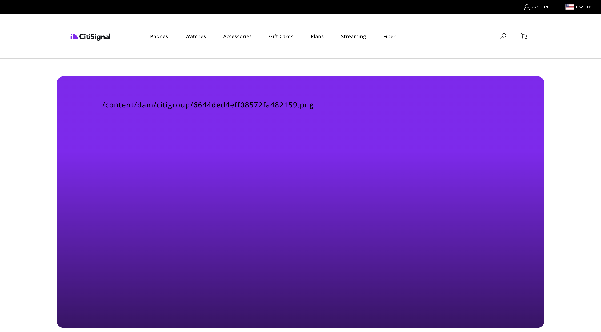

# 1.1.6 AEM Edge Delivery Services MarTech-plugin

Med pluginen AEM MarTech kan du snabbt skapa en komplett MarTech-hög för ditt AEM-projekt.

>[!NOTE]
>
>Denna plugin är tillgänglig för kunder i samarbete med AEM Engineering via projekt för saminnovation. Mer information finns på [https://github.com/adobe-rnd/aem-martech](https://github.com/adobe-rnd/aem-martech).

## 1.1.6.1 Lägg till plugin-programmet i ditt svar

Navigera till mappen som du använder för din **citisign** GitHub-databas. Högerklicka på mappnamnet och välj sedan **Ny terminal i mappen**.

{zoomable="yes"}

Då ser du det här. Klistra in följande kommando och tryck på **enter**.

```
git subtree add --squash --prefix plugins/martech https://github.com/adobe-rnd/aem-martech.git main
```

Du borde se det här då.

{zoomable="yes"}

Navigera till mappen som du använder för din **citisign** GitHub-databas och öppna mappen **plugins**. Du bör nu se en mapp med namnet **martech**.

{zoomable="yes"}

## 1.1.6.2 head.html

Öppna filen **head.html** i Visual Studio-koden. Kopiera koden nedan och klistra in den i filen **head.html**.

```javascript
<link rel="preload" as="script" crossorigin="anonymous" href="/plugins/martech/src/index.js"/>
<link rel="preload" as="script" crossorigin="anonymous" href="/plugins/martech/src/alloy.min.js"/>
<link rel="preconnect" href="https://edge.adobedc.net"/>
<!-- change to adobedc.demdex.net if you enable third party cookies -->
```

Spara ändringarna.

{zoomable="yes"}

## 1.1.6.3 scripts.js

I Visual Studio Code går du till mappen **scripts** och öppnar filen **scripts.js**. Kopiera koden nedan och klistra in den i filen **scripts.js**, under de befintliga importskripten.

```javascript
import {
  initMartech,
  updateUserConsent,
  martechEager,
  martechLazy,
  martechDelayed,
} from '../plugins/martech/src/index.js';
```

Spara ändringarna.

{zoomable="yes"}

I Visual Studio Code, i filen **scripts.js**, hittar du följande kod:

```javascript
const AUDIENCES = {
  mobile: () => window.innerWidth < 600,
  desktop: () => window.innerWidth >= 600,
  // define your custom audiences here as needed
};
```

Under **const AUDIENCES = {..};** klistrar du in nedanstående kod:

```javascript
  const isConsentGiven = true;
  const martechLoadedPromise = initMartech(
    // The WebSDK config
    // Documentation: https://experienceleague.adobe.com/sv/docs/experience-platform/web-sdk/commands/configure/overview#configure-js
    {
      datastreamId: "XXX",
      orgId: "XXX",
      defaultConsent: 'in',
      onBeforeEventSend: (payload) => {
        // set custom Target params 
        // see doc at https://experienceleague.adobe.com/sv/docs/platform-learn/migrate-target-to-websdk/send-parameters#parameter-mapping-summary
        payload.data.__adobe.target ||= {};

        // set custom Analytics params
        // see doc at https://experienceleague.adobe.com/sv/docs/analytics/implementation/aep-edge/data-var-mapping
        payload.data.__adobe.analytics ||= {};
      },

      // set custom datastream overrides
      // see doc at:
      // - https://experienceleague.adobe.com/sv/docs/experience-platform/web-sdk/commands/datastream-overrides
      // - https://experienceleague.adobe.com/sv/docs/experience-platform/datastreams/overrides
      edgeConfigOverrides: {
        // Override the datastream id
        // datastreamId: '...'

        // Override AEP event datasets
        // com_adobe_experience_platform: {
        //   datasets: {
        //     event: {
        //       datasetId: '...'
        //     }
        //   }
        // },

        // Override the Analytics report suites
        // com_adobe_analytics: {
        //   reportSuites: ['...']
        // },

        // Override the Target property token
        // com_adobe_target: {
        //   propertyToken: '...'
        // }
      },
    },
    // The library config
    {
      launchUrls: ["XXX"],
      personalization: !!getMetadata('target') && isConsentGiven,
    },
  );
```

{zoomable="yes"}

Det finns några variabler som du behöver ersätta i ovanstående kod med din egen miljös variabler:

- `datastreamId: "XXX"`
- `orgId: "XXX"`
- `launchUrls: ["XXX"]`

Du kan hitta dessa variabler genom att följa dessa instruktioner:

### datastreamId

Gå till [https://platform.adobe.com/](https://platform.adobe.com/) och gå sedan till **Datastreams** i den vänstra menyn. Kontrollera att du befinner dig i rätt sandlåda, som ska vara `--aepSandboxName--`. Sök i datastream som skapades i avsnittet Komma igång i den här självstudiekursen, som bör ha namnet `--aepUserLdap-- - One Adobe Datastream`. Klicka på ikonen **copy** om du vill kopiera **DataStream ID** och klistra in det i Visual Studio-kod i filen **scripts.js** genom att ersätta platshållarvärdet `XXX` bredvid `datastreamId:`.

{zoomable="yes"}

### orgId

Gå till [https://platform.adobe.com/](https://platform.adobe.com/) och gå sedan till **Frågor** i den vänstra menyn. Under **Autentiseringsuppgifter** hittar du **IMS-organisation-ID** som **användarnamn**. Klicka på ikonen **copy** om du vill kopiera **IMS-organisation-ID:t** och klistra in det i Visual Studio-koden i filen **scripts.js** genom att ersätta platshållarvärdet `XXX` bredvid `orgId:`.

{zoomable="yes"}

### launchUrls

Gå till [https://platform.adobe.com/](https://platform.adobe.com/) och gå sedan till **Taggar** i den vänstra menyn. Sök efter din egenskap med LDAP, som ska vara `--aepUserLdap--`. Öppna din webbegenskap.

{zoomable="yes"}

Gå till **Miljöer** på den vänstra menyn och klicka sedan på ikonen **Installera** för **utvecklingsmiljön** .

{zoomable="yes"}

Du hittar sedan den URL du behöver, men den finns inuti en HTML `<script></script>`-tagg. Du bör bara kopiera den del som börjar `https` till `.min.js`.

{zoomable="yes"}

URL:en ser ut så här: `https://assets.adobedtm.com/b754ed1bed61/b9f7c7c484de/launch-5fcd90e5b482-development.min.js`. Se till att ingen annan text kopieras eftersom det skulle orsaka fel. I Visual Studio Code ersätter du platshållarvärdet `XXX` i arrayen `launchUrls:` i filen **scripts.js**.

Du har nu de tre variabler du behöver. Filen `scripts.js` ska nu se ut så här:

{zoomable="yes"}

Sök sedan efter det här kodblocket:

```javascript
const main = doc.querySelector('main');
  if (main) {
    decorateMain(main);
    document.body.classList.add('appear');
    await loadSection(main.querySelector('.section'), waitForFirstImage);	
  }
```

{zoomable="yes"}

Ersätt det med det här kodblocket:

```javascript
const main = doc.querySelector('main');
  if (main) {
    decorateMain(main);
    document.body.classList.add('appear');
    await Promise.all([
      martechLoadedPromise.then(martechEager),
      loadSection(main.querySelector('.section'), waitForFirstImage)
    ]);
  }
```

{zoomable="yes"}

Sök efter och bläddra nedåt till `async function loadLazy(doc) {`.

{zoomable="yes"}

Lägg till följande kodrad under raden `autolinkModals(doc);`:

```javascript
await martechLazy();
```

{zoomable="yes"}

Sök efter och bläddra nedåt till raden `function loadDelayed() {`.

{zoomable="yes"}

Lägg till det här kodblocket under raden `// load anything that can be postponed to the latest here`.

```javascript
window.setTimeout(() => {
    martechDelayed();
    return import('./delayed.js');
  }, 3000);
```

{zoomable="yes"}

Sök efter och gå sedan till raden som innehåller `window.adobeDataLayer.push`.

{zoomable="yes"}

Objektet `pageContext` definieras så här. Du måste nu lägga till två objekt under `pageContext`.

```javascript
	pageContext: {
      pageType,
      pageName: document.title,
      eventType: 'visibilityHidden',
      maxXOffset: 0,
      maxYOffset: 0,
      minXOffset: 0,
      minYOffset: 0,
    }
```

Det här är koden som måste läggas till:

```javascript
	,
    _experienceplatform: {
      identification:{
        core:{
          ecid: sessionStorage.getItem("com.adobe.reactor.dataElements.ECID")
        }
      }
    },
    web: {
      webPageDetails:{
        name: document.title,
        URL: window.location.href
      }
    }
```

**window.adobeDataLayer.push** ska nu se ut så här:

```javascript
  window.adobeDataLayer.push({
    pageContext: {
      pageType,
      pageName: document.title,
      eventType: 'visibilityHidden',
      maxXOffset: 0,
      maxYOffset: 0,
      minXOffset: 0,
      minYOffset: 0,
    },
    _experienceplatform: {
      identification:{
        core:{
          ecid: sessionStorage.getItem("com.adobe.reactor.dataElements.ECID")
        }
      }
    },
    web: {
      webPageDetails:{
        name: document.title,
        URL: window.location.href
      }
    }
  });
```

{zoomable="yes"}

Du har nu gjort alla nödvändiga ändringar i filen **scripts.js**.

Öppna GitHub Desktop-klienten och verkställ ändringarna.

{zoomable="yes"}

Klicka på **Push origin** om du vill överföra dina ändringar till GitHub-databasen.

{zoomable="yes"}

## 1.1.6.4 ACDL-tillägg i taggegenskapen

För att AEM Edge Delivery Services MarTech-pluginprogrammet ska fungera på rätt sätt måste du lägga till tillägget för

Gå till [https://experience.adobe.com/#/data-collection/](https://experience.adobe.com/#/data-collection/). Sök efter och öppna sedan taggegenskapen för webben med namnet `--aepUserLdap-- - One Adobe (DD/MM/YYYY)`.

{zoomable="yes"}

Gå till **Tillägg**, till **Katalog**. Klicka på tillägget **Adobe Client Data Layer** och sedan på **Installera**.

{zoomable="yes"}

Du borde se det här då. Det finns inget behov av att ändra någonting just nu. Klicka på **Spara i bibliotek**.

{zoomable="yes"}

Tillägget läggs sedan till i taggegenskapen.

{zoomable="yes"}

Gå till **Publiceringsflöde** och öppna ditt **huvudbibliotek**. Klicka på **Lägg till alla ändrade resurser** och sedan på **Spara och skapa i utveckling**.

{zoomable="yes"}

Ändringarna är nu distribuerade.

## 1.1.6.5 Skicka data till Adobe Experience Platform Edge Network

Du kan nu visa ändringarna av din webbplats genom att gå till `main--citisignal--XXX.aem.page/us/en` och/eller `main--citisignal--XXX.aem.live/us/en` efter att du ersatt XXX med ditt GitHub-användarkonto, som i det här exemplet är `woutervangeluwe`.

I det här exemplet blir den fullständiga URL:en följande:
`https://main--citisignal--woutervangeluwe.aem.page/us/en` och/eller `https://main--citisignal--woutervangeluwe.aem.live/us/en`.

>[!NOTE]
>
>Överväg att öppna en inkognitiv webbsida för att försäkra dig om att du börjar samla in data med en ny, ren profil. Det är enklare att felsöka och felsöka.

{zoomable="yes"}

Öppna **Utvecklarverktyg** i Chrome genom att gå till **Fler verktyg** > **Utvecklarverktyg**.

{zoomable="yes"}

I vyn **Konsol** visas ett antal rader som börjar med `[alloy]`. Ta en titt på förfrågningarna, en av dem bör se ut så här och ha den begärandetext som anges i bilden.

`[alloy] Request 55a9ddbc-0521-4ba3-b527-3da2cb35328a: Sending request.`

Öppna nyttolasten och gå ned till fältet `events[0].xdm._experienceplatform.identification.core.ecid` och kopiera ECID:t.

{zoomable="yes"}

## 1.1.6.6 Visa kundprofil i Adobe Experience Platform

Logga in på Adobe Experience Platform via följande URL: [https://experience.adobe.com/platform](https://experience.adobe.com/platform).

När du har loggat in loggar du in på Adobe Experience Platform hemsida.

{zoomable="yes"}

Innan du fortsätter måste du välja en **sandlåda**. Sandlådan som ska markeras har namnet ``--aepSandboxName--``. När du har valt rätt sandlåda ser du skärmändringen och nu befinner du dig i din dedikerade sandlåda.

{zoomable="yes"}

Gå till **Kund** > **Profiler** > **Bläddra** på den vänstra menyn. Markera **Identitetsnamnrymden** för **ECID** och sedan förbi **ECID** som du kopierade i föregående steg. Klicka på **Visa**. Du bör då se en profil som visas i listan. Klicka för att öppna den.

{zoomable="yes"}

Därefter visas översikten **Profilinstrumentpanel** som visar ECID. Gå sedan till **Händelser**.

{zoomable="yes"}

Under **Händelser** visas flera Experience Events, inklusive en händelse med eventType **web.webpagedetails.pageViews**. Klicka på **Visa JSON** om du vill visa alla händelser som samlades in.

{zoomable="yes"}

I vyn **JSON** verifierar du händelsen med eventType **web.webpagedetails.pageViews** för att se saker som **Sidnamn** och **sid-URL**.

{zoomable="yes"}

Du har nu avslutat den här övningen.

Nästa steg: [Sammanfattning och fördelar](./summary.md){target="_blank"}

Gå tillbaka till [Adobe Experience Manager Cloud Service &amp; Edge Delivery Services](./aemcs.md){target="_blank"}

[Gå tillbaka till alla moduler](./../../../overview.md){target="_blank"}
