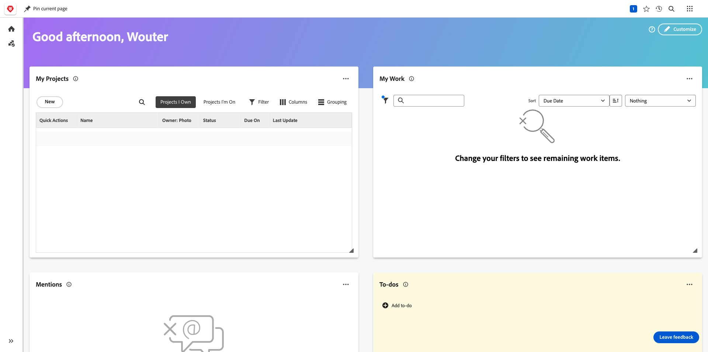
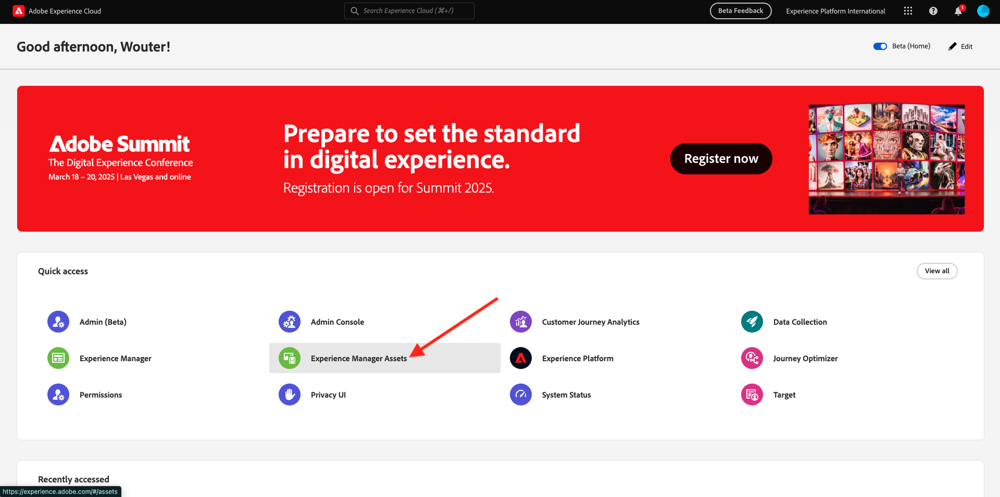
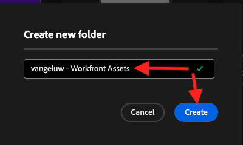
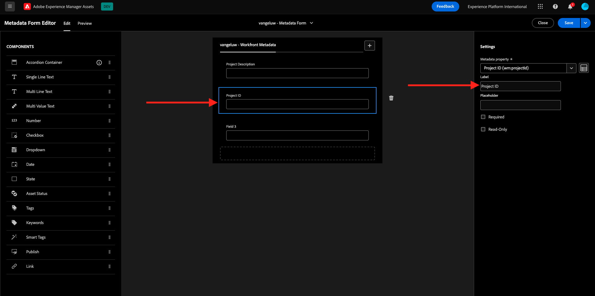
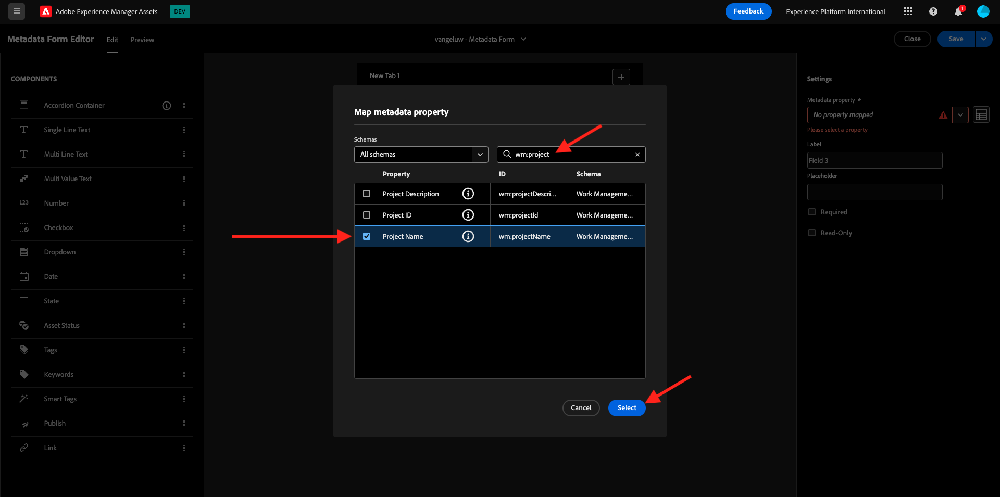
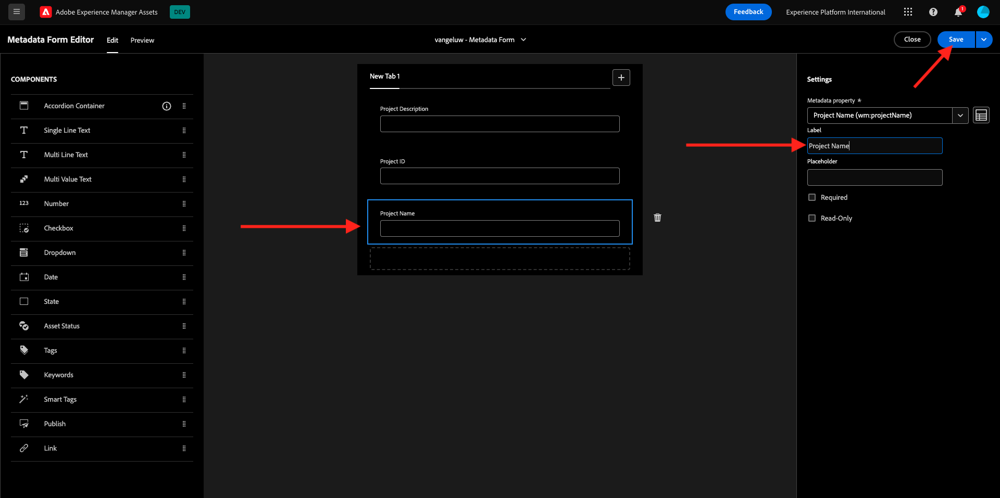
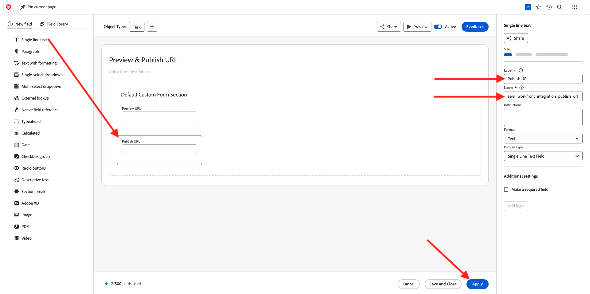

# 1.2.1 Komma igång med Workfront

Logga in på Adobe Workfront på [https://experienceplatform.my.workfront.com/](https://experienceplatform.my.workfront.com/){target="_blank"}.

Då ser du det här.

## 1.2.1.1 Konfigurera din AEM Assets-integrering

Klicka på ikonen **hamburger** med nio punkter och välj sedan **Konfigurera**.

Bläddra nedåt till **Dokument** på den vänstra menyn och klicka sedan på **Experience Manager Assets**.

Klicka på **+ Lägg till Experience Manager-integrering**.

Använd `--aepUserLdap-- - Citi Signal AEM` för integreringens namn.

Öppna listrutan **Experience Manager-databas** och välj din AEM CS-instans, som bör ha namnet `--aepUserLdap-- - Citi Signal`.

Konfigurera följande mappning under **Metadata**:

| Workfront Field | Experience Manager Assets |
| --------------- | ------------------------------ | 
| **Dokument** > **Namn** | **wm:documentName** |
| **Projekt** > **Beskrivning** | **wm:projectDescription** |
| **Aktivitet** > **Namn** | **wm:taskName** |
| **Aktivitet** > **Beskrivning** | **wm:taskDescription** |

Aktivera växeln för **Synkronisera objektmetadata**.

Klicka på **Spara**.

Din integrering från Workfront till AEM Assets CS är nu konfigurerad.

## 1.2.1.2 Konfigurera metadataintegrering med AEM Assets

Därefter måste du konfigurera AEM Assets så att metadatafälten från resursen i Workfront delas med AEM.

Gå till [https://experience.adobe.com/](https://experience.adobe.com/) om du vill göra det. Klicka på **Experience Manager Assets**.

Klicka för att välja din AEM Assets-miljö, som ska få namnet `--aepUserLdap-- - Citi Signal dev`.

Du borde se det här då. Gå till **Assets** på den vänstra menyn och klicka på **Skapa mapp**.

Namnge mappen `--aepUserLdap-- - Workfront Assets` och klicka på **Skapa**.

Gå sedan till **Metadata Forms** i den vänstra menyn och klicka på **Skapa**.

Använd namnet `--aepUserLdap-- - Metadata Form` och klicka på **Skapa**.

Lägg till tre nya **enkelradiga textfält** i formuläret och markera det första fältet. Klicka sedan på ikonen **Schema** bredvid fältet **Metadata-egenskap** .

Ange `wm:project` i sökfältet och markera sedan fältet **Projektbeskrivning**. Klicka på **Markera**.

Ändra fältets etikett till **Projektbeskrivning**.

Markera sedan det andra **enkelradiga textfältet** och klicka på ikonen **Schema** bredvid fältet **Metadata-egenskap** igen.

Du kommer då att se den här popup-rutan igen. Ange `wm:project` i sökfältet och markera sedan fältet **Projekt-ID**. Klicka på **Markera**.

Ändra fältets etikett till **projekt-ID**.

Markera det tredje fältet **Enkelradig text** och klicka på ikonen **Schema** bredvid fältet **Metadataegenskap** igen.

Du kommer då att se den här popup-rutan igen. Ange `wm:project` i sökfältet och markera sedan fältet **Projektnamn**. Klicka på **Markera**.

Ändra etiketten för fältet till **Projektnamn**. Klicka på **Spara**.

Ändra **fliknamnet** i formuläret till `--aepUserLdap-- - Workfront Metadata`. Klicka på **Spara** och **Stäng**.

**Metadataformuläret** har konfigurerats.

Därefter måste du tilldela metadataformuläret till mappen som du skapade tidigare. Markera kryssrutan för ditt metadataformulär och klicka på **Tilldela till mapp(ar)**.

Välj din mapp som ska ha namnet `--aepUserLdap-- - Workfront Assets`. Klicka på **Tilldela**.

Metadataformuläret har nu tilldelats mappen.

## 1.2.1.2 Konfigurera din AEM Sites-integrering

>[!NOTE]
>
>Det här plugin-programmet är för närvarande i läget **Tidig åtkomst** och är inte allmänt tillgängligt än.
>
>Detta plugin-program kan redan vara installerat i den Workfront-instans som du använder. Om den redan är installerad kan du läsa instruktionerna nedan, men du behöver inte ändra något i konfigurationen då.

Gå till [https://experience.adobe.com/#/@experienceplatform/aem/extension-manager/universal-editor](https://experience.adobe.com/#/@experienceplatform/aem/extension-manager/universal-editor){target="_blank"}.

Kontrollera att **toggle** för det här plugin-programmet är inställt på **Enabled**. Klicka sedan på ikonen **kugghjulet** .

En popup-meny för **tilläggskonfiguration** visas. Konfigurera följande fält för att använda det här plugin-programmet.

| Nyckel | Värde |
| --------------- | ------------------------------ | 
| **`IMS_ENV`** | **PROD** |
| **`WORKFRONT_INSTANCE_URL`** | **https://experienceplatform.my.workfront.com** |
| **`SHOW_CUSTOM_FORMS`** | **&#39;{&quot;previewUrl&quot;: true, &quot;publishUrl&quot;: true}&#39;** |

Klicka på **Spara**.

Gå tillbaka till ditt Workfront-gränssnitt och klicka på ikonen **hamburger** med nio punkter. Välj **Konfigurera**.

Gå till **Anpassad Forms** på den vänstra menyn och välj **Formulär**. Klicka på **+ Nytt anpassat formulär**.

Välj **Aktivitet** och klicka på **Fortsätt**.

Då visas ett tomt anpassat formulär. Ange formulärnamnet `Content Fragment & Integration ID`.

Dra och släpp ett nytt **enkelradigt textfält** på arbetsytan.

Konfigurera det nya fältet så här:

- **Etikett**: **Innehållsfragment**
- **Namn**: **`aem_workfront_integration_content_fragment`**

Lägg till ett nytt **enradigt textfält** på arbetsytan och konfigurera det nya fältet så här:

- **Etikett**: **Integrerings-ID**
- **Namn**: **`aem_workfront_integration_id`**

Klicka på **Använd**.

Nu måste du konfigurera ett andra anpassat formulär. Klicka på **+ Nytt anpassat formulär**.

Välj **Aktivitet** och klicka på **Fortsätt**.

Då visas ett tomt anpassat formulär. Ange formulärnamnet `Preview & Publish URL`.

Dra och släpp ett nytt **enkelradigt textfält** på arbetsytan.

Konfigurera det nya fältet så här:

- **Etikett**: **URL för förhandsgranskning**
- **Namn**: **`aem_workfront_integration_preview_url`**

Lägg till ett nytt **enradigt textfält** på arbetsytan och konfigurera det nya fältet så här:

- **Etikett**: **Publicera URL**
- **Namn**: **`aem_workfront_integration_publish_url`**

Klicka på **Använd**.

Du bör sedan ha 2 anpassade formulär tillgängliga.

Nästa steg: [1.2.2 Korrektur med Workfront](./ex2.md){target="_blank"}

Gå tillbaka till [Arbetsflödeshantering med Adobe Workfront](./workfront.md){target="_blank"}

[Gå tillbaka till alla moduler](./../../../overview.md){target="_blank"}
