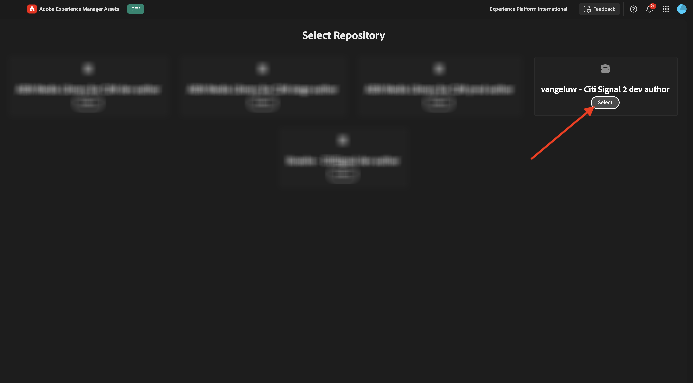

# 1.2.1 Komma igång med AEM Assets

Gå till [https://experience.adobe.com/](https://experience.adobe.com/){target="_blank"}. Kontrollera att du är i rätt miljö, som bör ha namnet `--aepImsOrgName--`.

Öppna **Adobe Experience Manager Assets**.

Välj den AEM Assets CS-miljö som du har tilldelats. I det här fallet är miljön som ska väljas `--aepUserLdap-- - CitiSignal dev author`.

Du borde se det här då. Gå till **Assets**.

Du bör använda en mapp med namnet `--aepUserLdap-- - CitiSignal Fiber Campaign`. Om den inte finns än klickar du på **Skapa mapp**.

Ange namnet `--aepUserLdap--` för mappen och klicka på **Skapa**.

Öppna mappen som du nyss skapade. I en av de tidigare övningarna skapade du 2 bilder med namnen `CitiSignal - Neon Rabbit - Get On Board Now!.png` och `CitiSignal - Neon Rabbit - Timetravel now!.png`. Du måste nu överföra dessa bilder till den här mappen om de inte finns där än.

Om du inte har dessa filer längre kan du hämta dem [här](./images/CitiSignal_Neon_Rabbit.zip){target="_blank"}.

Klicka på **Lägg till Assets**.

Markera de två bilderna som nämns ovan. Klicka på **Öppna**.

Klicka på **Överför**.

Klicka på en av bilderna för att markera den.

Klicka på **Information**.

Du ser nu tillgängliga metadata för den specifika filen.

Gå till **Återgivningar** på den högra menyn. Sedan visas ett antal fördefinierade återgivningar av bilden som du har valt, med möjlighet att hämta dem.

Klicka på ikonen **sax** på den högra menyn. Du hittar ett antal redigeringsåtgärder som är tillgängliga för dig och som drivs av Adobe Express. Klicka på **Ta bort bakgrund**.

Efter några sekunder bör du se något liknande, med möjlighet att antingen tillämpa ändringarna eller hämta den nya filen. Stäng popup-fönstret.

Beskär **bilden**.

Du kan testa olika variationer av olika beskärningsstorlekar.

Gå till **Uppgifter** på den högra menyn. Klicka på **Tilldela uppgifter**.

Ange **aktivitetstiteln** till `Review image & approve`. Tilldela dig själv. Klicka på **Skapa**.

Klicka på **Visa** i meddelandet.

Du kan även uppdatera skärmen så att du ser de nya uppgifterna i listan **Relaterade uppgifter**. Klicka på knappen **Öppna** om du vill visa information om aktiviteten.

Då borde du se något sådant här. Klicka på **Godkänn**.

Bekräfta genom att klicka på **Godkänn**.

Materialet har godkänts i AEM Assets.

Nästa steg: [Sammanfattning och fördelar](./summary.md){target="_blank"}

Gå tillbaka till [Adobe Experience Manager Assets](./aemassets.md){target="_blank"}

[Gå tillbaka till alla moduler](./../../../overview.md){target="_blank"}
