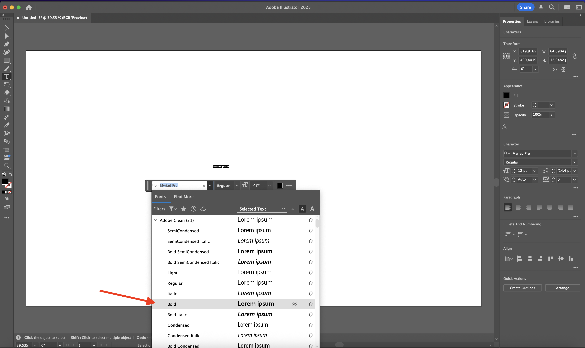
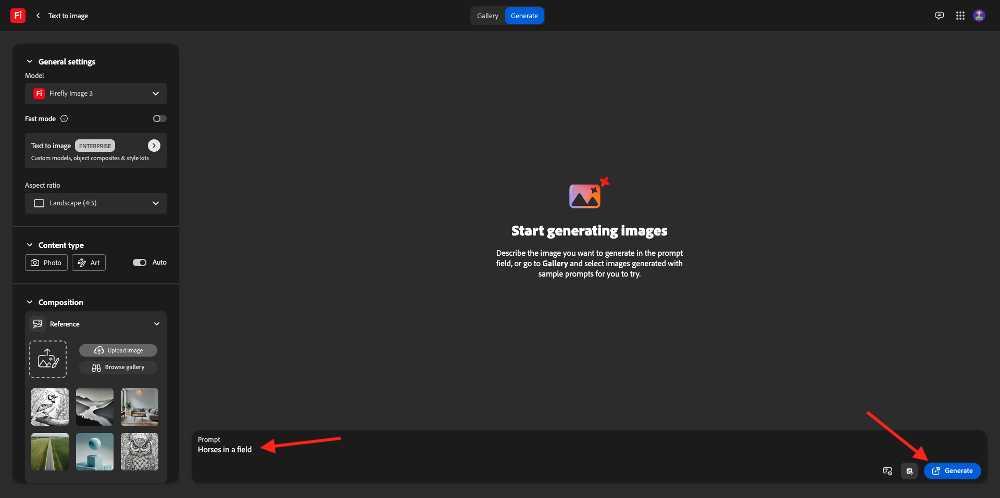
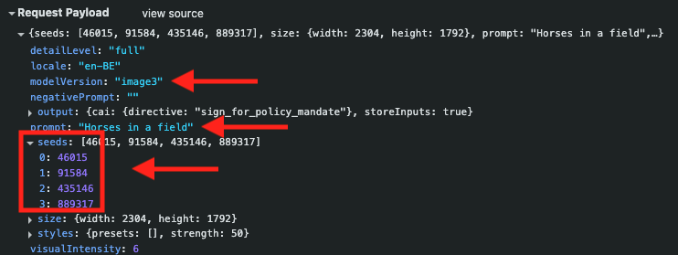
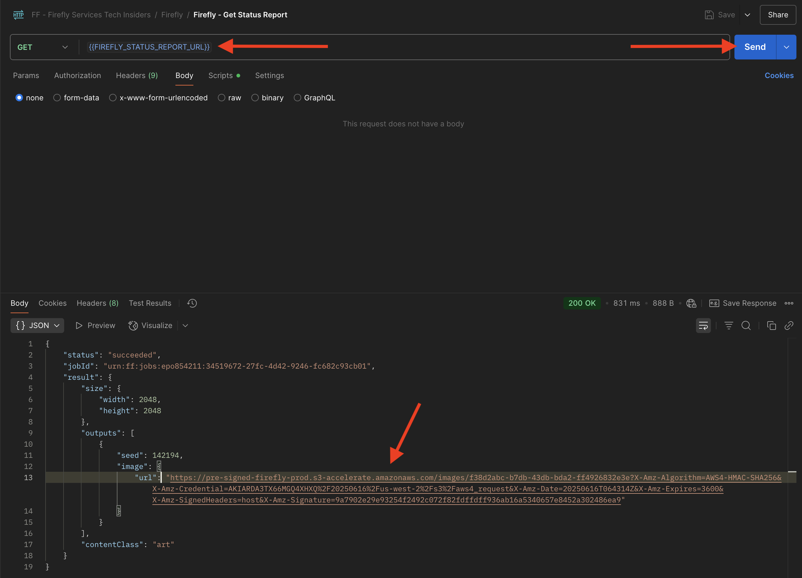
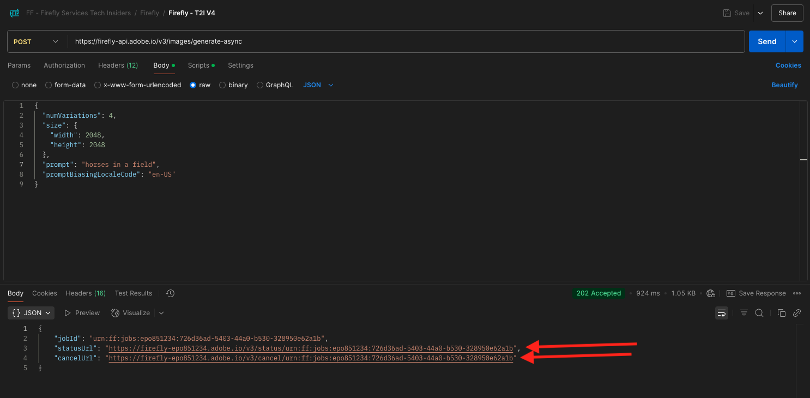
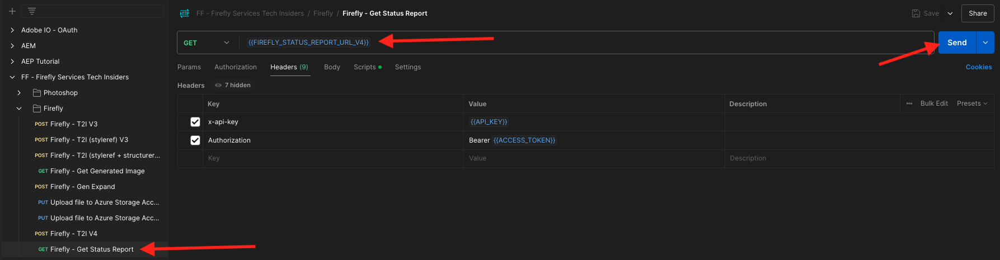

# 1.1.1 Komma igång med Firefly Services

Lär dig hur du använder Postman och Adobe I/O för att hämta Adobe Firefly Services API:er.

## Förutsättningar för 1.1.1.1

Innan du fortsätter med den här övningen måste du ha slutfört installationen av [ditt Adobe I/O-projekt](./../../../modules/getting-started/gettingstarted/ex6.md), och du måste också ha konfigurerat ett program för interaktion med API:er, som [Postman](./../../../modules/getting-started/gettingstarted/ex7.md) eller [PostBuster](./../../../modules/getting-started/gettingstarted/ex8.md).

## 1.1.1.2 Utforska firefly.adobe.com - steg 1

Låt oss börja utforska Adobe Firefly Services. Om du vill ta reda på mer kan du börja med ett exempel på hur CitiSignal-bilder genereras. Designteamet på CitiSignal vill generera en ny version av varumärket CitiSignal. De skulle vilja använda Adobe Firefly Services för att göra det.

Det första som krävs för att uppnå detta är en svartvit version av varumärket CitiSignal som ser ut så här:


### 1.1.1.2.1 Skapa din kompositionsreferensbild

Du kan använda [den här exempelbilden](./images/CitiSignal.jpg) eller skapa en egen text för att experimentera. Följ stegen nedan i Adobe Illustrator för att skapa en egen bildfil. Om du vill använda den fördefinierade bilden hoppar du över avsnittet nedan och går till steg **1.1.1.2.2 Generera bilden** direkt.

Öppna **Adobe Illustrator**. Klicka på **Ny fil**.


Välj **Webbstor 1 920 x 1 080 px**. Klicka på **Skapa**.


Du borde ha den här då. Klicka på textikonen **T**.


Du borde ha den här då.


Ändra teckensnittstypen till ett valfritt teckensnitt, i det här fallet är teckensnittstypen **Adobe Clean Bold**.



Ändra teckenstorleken till en valfri storlek, i det här fallet **250 pt**.


Du borde ha den här då.


Ändra texten som du vill, i det här fallet **CitiSignal**.


Centrera texten i filen.


Gå till **Arkiv > Exportera > Spara för webben (äldre)**


Du borde ha den här då. Klicka på **Spara**.


Ge filen ett namn och spara den på skrivbordet. Klicka på **Spara**.


### 1.1.1.2.2 Generera din bild

Gå till [https://firefly.adobe.com](https://firefly.adobe.com). Klicka på ikonen **profile** och kontrollera att du är inloggad på rätt **konto** som ska vara `--aepImsOrgName--`. Klicka vid behov på **Byt profil** för att växla till det kontot.


Ange uppmaningen `neon light lettering on a brick wall of a night club`. Klicka på **Generera**.


Du borde ha något liknande. De här bilderna är inte användbara än. Klicka på **Överför bild** under **Disposition**.


Markera bilden som du skapade tidigare, i det här fallet **CitiSignal.jpg**. Klicka på **Öppna** och sedan på **Generera**.


Du borde ha något liknande. Det är ännu inte bra att använda kompositionsreferensen. Om du vill ändra det ändrar du skjutreglaget **Styrka** till det högsta värdet. Klicka på **Generera** igen.


Du har nu flera bilder som visar en neonversion av CitiSignal-varumärkesnamnet, som du kan använda för att iterera vidare.


Nu har du lärt dig att använda Firefly för att lösa ett designproblem på några minuter.

## 1.1.1.3 Utforska firefly.adobe.com - steg 2

Gå till [https://firefly.adobe.com/generate/image](https://firefly.adobe.com/generate/image). Du borde se det här då. Klicka på listrutan **Modell**. Du kommer att märka att det finns tre tillgängliga versioner av Adobe Firefly Services:

- Firefly Image 3
- Firefly Image 4
- Firefly Image 4 Ultra


>[!NOTE]
>
>Firefly Image 3 och Image 4 är tillgängliga för alla som använder Adobe Firefly Services, medan Firefly Image 4 Ultra kräver en Firefly Pro-licens.

Klicka för att välja **Firefly Image 3** för den här övningen.


Skriv uppmaningen `Horses in a field` och klicka på **Generera**.



Du borde se något liknande.


Öppna sedan **Utvecklarverktygen** i webbläsaren.


Du borde se det här då. Gå till fliken **Nätverk**. Klicka sedan på **Generera** igen.


Ange söktermen **generate-async**. Du bör sedan se en begäran med namnet **generate-async**. Markera den och gå sedan till **Nyttolast** där du kan se information om begäran.


Begäran som visas här är den begäran som skickas till serverdelen av Firefly Services. Den innehåller flera viktiga parametrar:

- **fråga**: Detta är din fråga och begär vilken typ av bild Firefly ska generera

- **frön**: I den här begäran genererades frön på ett slumpmässigt sätt. När Firefly genererar en bild startar den processen som standard genom att välja ett slumpmässigt tal som kallas startvärde. Detta slumpmässiga tal bidrar till det som gör varje bild unik, vilket är bra när du vill generera ett stort antal bilder. Det kan dock finnas tillfällen när du vill generera bilder som liknar varandra över flera begäranden. När Firefly t.ex. skapar en bild som du vill ändra med andra alternativ i Firefly (t.ex. formatförinställningar, referensbilder), använder du den bildens startvärde i framtida HTTP-begäranden för att begränsa slumpmässigheten i framtida bilder och gör en justering i den önskade bilden.



Ta en titt på gränssnittet igen. Ändra **proportionen** till **Widescreen (16:9)**.


Bläddra ned till **Effekter**, gå till **Teman** och välj en effekt som **Art deco**.


Kontrollera att **Utvecklarverktyg** fortfarande är öppet i webbläsaren. Klicka sedan på **Generera** och kontrollera vilken nätverksbegäran som skickas.


När du granskar informationen om nätverksbegäran visas nu följande:

- **prompt** har inte ändrats jämfört med föregående begäran
- **seed** har ändrats jämfört med föregående begäran
- **size** har ändrats baserat på ändringen i **Proportionerna**.
- **format** har lagts till och har en referens till den **art_deco** -effekt som du har valt


För nästa övning måste du använda ett av **seed**-talen. Skriv ned ett startvärde.

>[!NOTE]
>
>Seed-nummer är slumpmässiga tal som väljs när du klickar på **Generera**. Om du vill ha ett konsekvent utseende och känsla för den genererade bilden i flera **Generate** -begäranden är det viktigt att komma ihåg och ange önskat **startvärde** i framtida begäranden.

I nästa övning ska du göra liknande saker med Firefly Services, men sedan med API:t i stället för användargränssnittet. I det här exemplet är startnumret **142194** för den första bilden, som har två hästar som tittar på varandra med sina huvuden vända mot varandra.

## 1.1.1.4 Adobe I/O - access_token

I samlingen **Adobe IO - OAuth** markerar du begäran **POST - Get Access Token** och väljer **Skicka**. Svaret ska innehålla en ny **accestoken**.


## 1.1.1.5 Firefly Services API, Text 2 Image, Bild 3

Nu när du har en giltig och ny åtkomsttoken kan du skicka din första begäran till Firefly Services API:er.

Välj begäran **POST - Firefly - T2I V3** i samlingen **FF - Firefly Services Tech Insiders** . Gå till **Body** och verifiera uppmaningen. Klicka på **Skicka**.

Den begäran som du använder här är en **synkron**-begäran som ger dig ett svar som innehåller den begärda bilden inom några sekunder.

>[!NOTE]
>
>I och med lanseringen av Firefly Image 4 och Image 4 Ultra kommer synkrona begäranden att tas bort till förmån för asynkrona begäranden. Du hittar övningar på asynkrona förfrågningar längre ned i den här självstudien.


Kopiera (eller klicka) bildens URL från svaret och öppna den i webbläsaren för att visa bilden.


Du bör se en vacker bild som visar `horses in a field`.


I **Body** i din begäran **POST - Firefly - T2I V3** lägger du till följande under fältet `"promptBiasingLocaleCode": "en-US"` och ersätter variabeln `XXX` med ett av de startvärden som slumpmässigt användes av Firefly Services-gränssnittet. I det här exemplet är **seed**-talet `142194`.

```json
,
  "seeds": [
    XXX
  ]
```

Klicka på **Skicka**. Du får sedan ett svar med en ny bild som genererats av Firefly Services. Öppna bilden för att visa den.


Du bör då se en ny bild med små skillnader, baserat på **seed** som användes. Utsädet `142194` hade två hästar som tittade på varandra med sina huvuden mot varandra.


I **Body** för din begäran **POST - Firefly - T2I V3** klistrar du sedan in **styles** nedan-objektet under **seed** -objektet. Detta ändrar den genererade bildens format till **art_deco**.

```json
,
  "contentClass": "art",
  "styles": {
    "presets": [
      "art_deco"
    ],
    "strength": 50
  }
```

Du borde ha den här då. Klicka på **Skicka**.


Klicka på bildens URL för att öppna den.



Bilden har ändrats en stund. När du använder formatförinställningar används inte längre startbilden på samma sätt som tidigare. Generativ AI innebär att det är mycket svårt att garantera att samma kombination av inpuntparametrar leder till att samma bild genereras.


Ta bort koden för objektet **seed** från **Body** i din begäran. Klicka på **Skicka** och sedan på den bild-URL som du får från svaret.

```json
,
  "seeds": [
    XXX
  ]
```


Bilden har ändrats lite igen.


## 1.1.1.6 Firefly Services-API, Gen-utökning

Välj begäran **POST - Firefly - Gen Expand** i samlingen **FF - Firefly Services Tech Insiders** och gå till **Body** för begäran.

- **size**: Ange önskad upplösning. Värdet som anges här måste vara större än bildens ursprungliga storlek och får inte vara större än 3999.
- **image.source.url**: Det här fältet kräver en länk till bilden som behöver expanderas. I det här exemplet används en variabel för att referera till bilden som skapades i föregående övning.

- **vågrät justering**: Godkända värden är: `"center"`,`"left`, `"right"`.
- **lodrät justering**: Godkända värden är: `"center"`,`"top`, `"bottom"`.


Klicka på den bild-URL som är en del av svaret.


Du kommer nu att se att bilden som skapades i föregående övning nu har utökats till upplösningen 3 999 × 3 999.


När du ändrar placeringens justering kommer utdata också att bli något annorlunda. I det här exemplet ändras placeringen till **left, bottom**. Klicka på **Skicka** och klicka sedan för att öppna den genererade bild-URL:en.


Du bör då se att originalbilden används på en annan plats, vilket påverkar hela bilden.


## 1.1.1.7 Firefly Services API, Text 2 Image, Image 4 &amp; Image 4 Ultra

### 1.1.1.7.1 image4_standard

Välj begäran med namnet **POST - Firefly - T2I V4** i samlingen **FF - Firefly Services Tech Insiders** och gå till **Headers** för begäran.

Du kommer att märka att URL:en för begäran skiljer sig från **Firefly Services API, Text 2 Image, Image 3** som var **https://firefly-api.adobe.io/v3/images/generate**. Denna URL pekar på **https://firefly-api.adobe.io/v3/images/generate-async**. Om du lägger till **-async** i URL:en används den asynkrona slutpunkten.

I variablerna **Header** kommer du att märka en ny variabel som heter **x-model-version**. Detta är ett obligatoriskt huvud när du interagerar med Firefly Image 4 och Image 4 Ultra. Om du vill använda Firefly Image 4 eller Image 4 Ultra när du genererar bilder bör du ange värdet för sidhuvudet till antingen `image4_standard` eller `image4_ultra`. I det här exemplet använder du `image4_standard`.


Gå till **brödtexten** för begäran. Du bör se att i brödtexten begärs fyra bildvariationer. Uppmaningen är oförändrad och begär fortfarande att **hästar i ett fält** ska genereras. Klicka på **Skicka**


Du får då ett omedelbart svar. I motsats till tidigare synkrona begäranden som du använde innehåller det här svaret inga bild-URL:er för genererade bilder. Den innehåller en URL för statusrapporten för det jobb som du startade och den innehåller en annan URL som gör att du kan avbryta det jobb som körs.



Om du vill kontrollera statusrapporten för ditt pågående jobb väljer du begäran **GET - Firefly - Hämta statusrapport** i samlingen **FF - Firefly Services Tech Insiders** . Klicka för att öppna den och klicka sedan på **Skicka**.



Därefter visas statusrapporten för det bildgenereringsjobb som du just har startat. Verifiera fältet **status**, eftersom det kan anges till **running**, vilket betyder att jobbet inte har slutförts än. I det här exemplet är jobbstatusen inställd på **success**, vilket innebär att bilderna du begärde har skapats.


Bläddra lite i svaret så ser du i totalt fyra bildvariationer som returneras av Adobe Firefly Services. Klicka på (eller kopiera) URL:en för en av bilderna och öppna den i webbläsaren.


Du bör då se en hyperrealistisk bild av **hästar i ett fält**.


### 1.1.1.7.2 image4_ultra

Gå tillbaka till begäran **POST - Firefly - T2I V4** från samlingen **FF - Firefly Services Tech Insiders** och gå till **Headers** för begäran.

Ändra variabeln **x-model-version** till `image4_ultra`. I det här exemplet använder du `image4_standard`.


Gå till **brödtexten** för begäran. I brödtexten ändrar du antalet bildvariationer till 1 på samma sätt som med Firefly Image 4 Ultra, men bara 1 bild kan genereras samtidigt. Uppmaningen är oförändrad och begär fortfarande att **hästar i ett fält** ska genereras. Klicka på **Skicka**


Svaret igen innehåller en URL-adress till statusrapporten för jobbet som du startade och innehåller en annan URL-adress som gör att du kan avbryta jobbet som körs.


Om du vill kontrollera statusrapporten för ditt pågående jobb väljer du begäran **GET - Firefly - Hämta statusrapport** i samlingen **FF - Firefly Services Tech Insiders** . Klicka för att öppna den och klicka sedan på **Skicka**.


Därefter visas statusrapporten för det bildgenereringsjobb som du just har startat. Verifiera fältet **status**, eftersom det kan anges till **running**, vilket betyder att jobbet inte har slutförts än. I det här exemplet är jobbstatusen inställd på **success**, vilket innebär att bilderna du begärde har skapats.


Du bör då se en hyperrealistisk bild av **hästar i ett fält**.


## Nästa steg

Gå till [Optimera din Firefly-process med Microsoft Azure och försignerade URL:er](./ex2.md){target="_blank"}

Gå tillbaka till [Översikt över Adobe Firefly Services](./firefly-services.md){target="_blank"}

Gå tillbaka till [Alla moduler](./../../../overview.md){target="_blank"}
