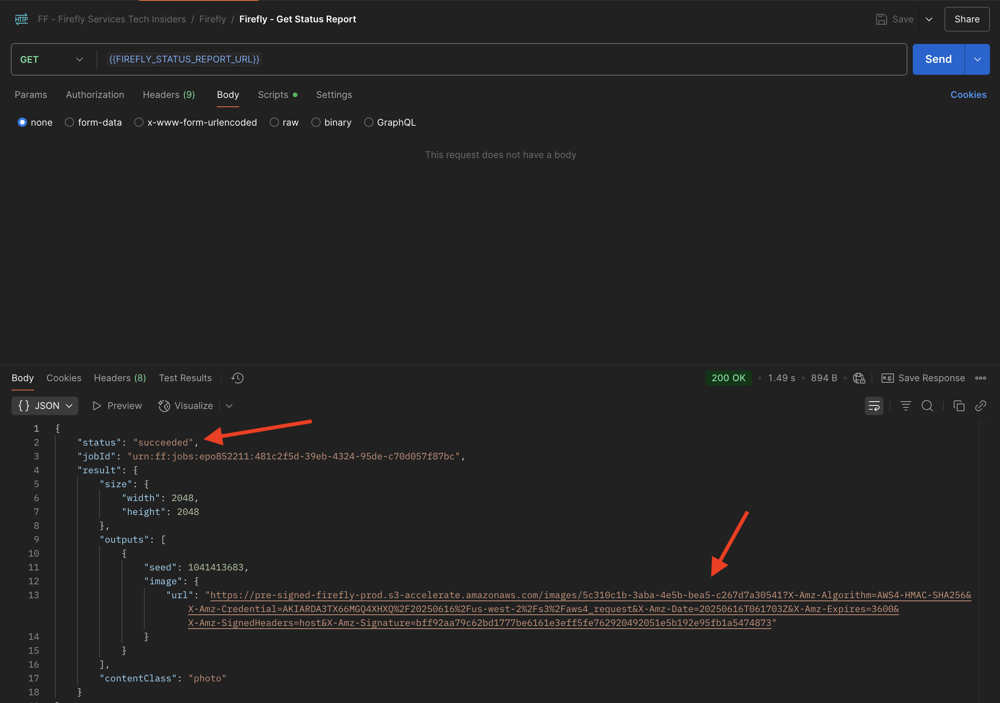

# 1.1.1 Komma igång med Firefly Services

Lär dig hur du använder Postman och Adobe I/O för att fråga Adobe Firefly Services API:er.

## Förutsättningar för 1.1.1.1

Innan du fortsätter med den här övningen måste du ha slutfört installationen av [ditt Adobe I/O-projekt](./../../../modules/getting-started/gettingstarted/ex6.md), och du måste också ha konfigurerat ett program för interaktion med API:er, som [Postman](./../../../modules/getting-started/gettingstarted/ex7.md) eller [PostBuster](./../../../modules/getting-started/gettingstarted/ex8.md).

## 1.1.1.1 firefly.adobe.com

Gå till [https://firefly.adobe.com](https://firefly.adobe.com). Klicka på ikonen **profile** och kontrollera att du är inloggad på rätt **konto** som ska vara `--aepImsOrgName--`. Klicka vid behov på **Byt profil** för att växla till det kontot.

{zoomable="yes"}

Skriv uppmaningen `Horses in a field` och klicka på **Generera**.

{zoomable="yes"}

Du borde se något liknande.

{zoomable="yes"}

Öppna sedan **Utvecklarverktygen** i webbläsaren.

{zoomable="yes"}

Du borde se det här då. Gå till fliken **Nätverk**.

{zoomable="yes"}

Ange söktermen **generera** och klicka sedan på **Generera** igen. Du bör sedan se en begäran med namnet **generate-async**. Markera den och gå sedan till **Nyttolast** där du kan se information om begäran.

{zoomable="yes"}

Begäran som visas här är den begäran som skickas till serverdelen av Firefly Services. Den innehåller flera viktiga parametrar:

- **fråga**: Detta är din fråga och begär vilken typ av bild Firefly ska generera

- **frön**: I den här begäran genererades frön på ett slumpmässigt sätt. När Firefly genererar en bild startar den processen som standard genom att välja ett slumpmässigt tal som kallas startvärde. Detta slumpmässiga tal bidrar till det som gör varje bild unik, vilket är bra när du vill generera ett stort antal bilder. Det kan dock finnas tillfällen när du vill generera bilder som liknar varandra över flera begäranden. När Firefly t.ex. skapar en bild som du vill ändra med andra alternativ i Firefly (t.ex. formatförinställningar, referensbilder), använder du den bildens startvärde i framtida HTTP-begäranden för att begränsa slumpmässigheten i framtida bilder och gör en justering i den önskade bilden.

{zoomable="yes"}

Ta en titt på gränssnittet igen. Ändra **proportionen** till **liggande (4:3)**.

{zoomable="yes"}

Bläddra ned till **Effekter**, gå till **Teman** och välj en effekt som **Seriebok**.

{zoomable="yes"}

Öppna **Utvecklarverktygen** i webbläsaren igen. Klicka sedan på **Generera** och kontrollera vilken nätverksbegäran som skickas.

{zoomable="yes"}

När du granskar informationen om nätverksbegäran visas nu följande:

- **prompt** har inte ändrats jämfört med föregående begäran
- **seed** har inte ändrats jämfört med föregående begäran
- **size** har ändrats baserat på ändringen i **Proportionerna**.
- **format** har lagts till och har en referens till effekten **serietidning_bok** som du markerade

{zoomable="yes"}

För nästa övning måste du använda ett av **seed**-talen. Skriv ned ett startvärde.

I nästa övning kommer du att göra liknande saker med Firefly Services, men sedan med API:t i stället för användargränssnittet. I det här exemplet är startnumret **45781**.

## 1.1.1.3 Adobe I/O - access_token

I samlingen **Adobe IO - OAuth** markerar du begäran **POST - Get Access Token** och väljer **Skicka**. Svaret ska innehålla en ny **accestoken**.

{zoomable="yes"}

## 1.1.1.4 Firefly Services API, bild 2

Nu när du har en giltig och ny access_token kan du skicka din första begäran till API:er för Firefly Services.

Välj begäran **POST - Firefly - T2I V3** i samlingen **FF - Firefly Services Tech Insiders** .

{zoomable="yes"}

Kopiera bild-URL:en från svaret och öppna den i webbläsaren för att visa bilden.

{zoomable="yes"}

Du bör se en vacker bild som visar `horses in a field`.

{zoomable="yes"}

I **Body** i din begäran **POST - Firefly - T2I V3** lägger du till följande under fältet `"promptBiasingLocaleCode": "en-US"` och ersätter variabeln `XXX` med ett av de dirigeringsnummer som slumpmässigt användes av Firefly Services-gränssnittet. I det här exemplet är **seed**-talet `45781`.

```json
,
  "seeds": [
    XXX
  ]
```

Klicka på **Skicka**. Du får sedan ett svar med en ny bild som genererats av Firefly Services. Öppna bilden för att visa den.

{zoomable="yes"}

Du bör då se en ny bild med små skillnader, baserat på **seed** som användes.

{zoomable="yes"}

I **Body** för din begäran **POST - Firefly - T2I V3** klistrar du sedan in **styles** nedan-objektet under **seed** -objektet. Detta ändrar den genererade bildens format till **serietidning_bok**.

```json
,
  "contentClass": "art",
  "styles": {
    "presets": [
      "comic_book"
    ],
    "strength": 50
  }
```

## Nästa steg

Gå till [Optimera din Firefly-process med Microsoft Azure och försignerade URL:er](./ex2.md){target="_blank"}

Gå tillbaka till [Översikt över Adobe Firefly Services](./firefly-services.md){target="_blank"}

Gå tillbaka till [Alla moduler](./../../../overview.md){target="_blank"}
