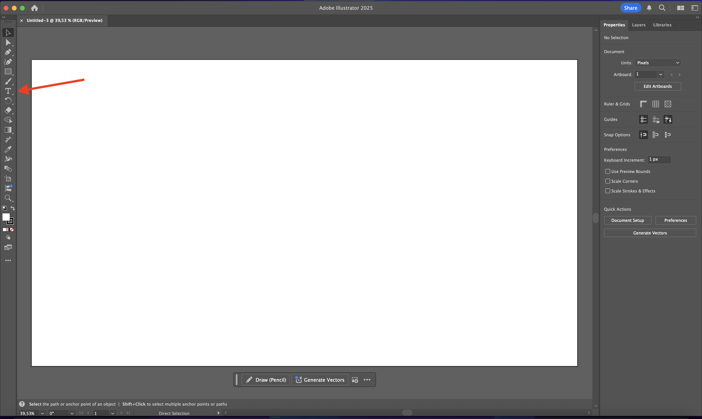
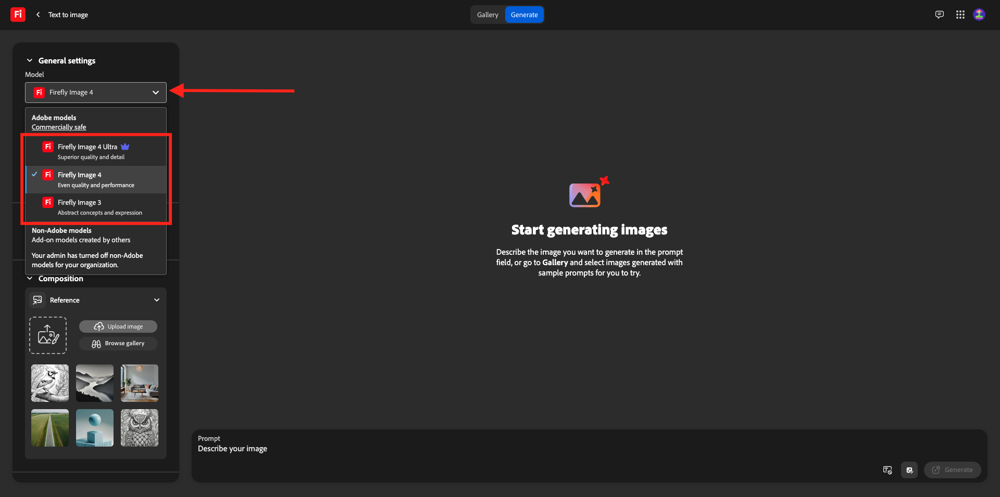
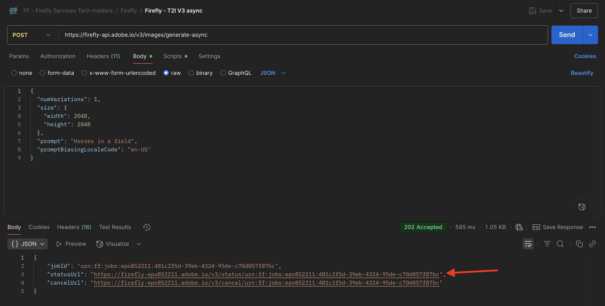
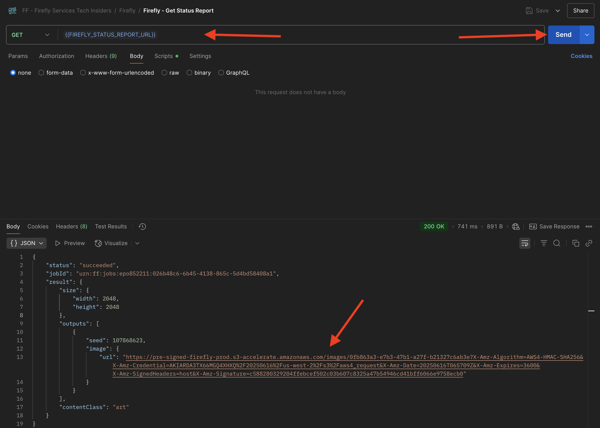
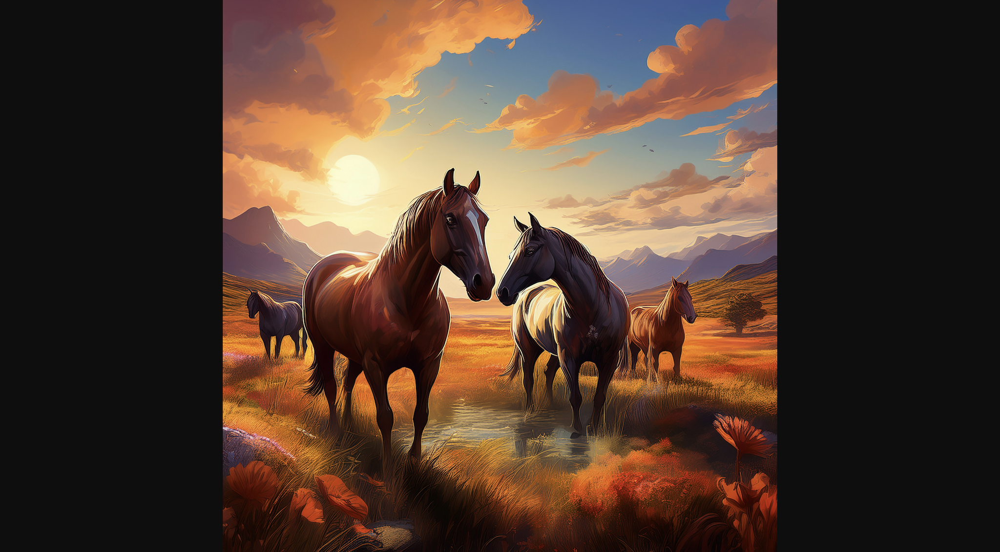
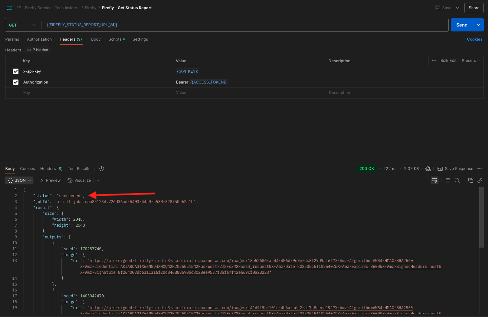

# 1.1.1 Komma igång med Firefly Services

Firefly Services innehåller **Firefly API:er**, **Lightroom API:er**, **Photoshop API:er**, **InDesign API:er** och **innehållstaggnings-API:er**.

Dessa API:er kombinerar kraften i Adobe kreativa verktyg som Photoshop och Lightroom med avancerade AI/ML-funktioner som Content Tagging, Generative Fill, Text to Image med flera.

Med Firefly Services skapar du inte bara - du automatiserar, skalar innehållsproduktionen och använder den senaste AI/ML-tekniken för att snabba upp arbetsflödena.

I den här övningen får du lära dig hur du använder Postman och Adobe I/O för att arbeta med de olika Adobe Firefly Services API:erna.

Den här övningen fokuserar särskilt på Firefly API:er, som:

- **Firefly Generate Images API**: detta API används för att generera bilder med Firefly Models
- **Firefly Generera API för liknande bilder**: detta API används för genererade bilder som liknar en befintlig bild
- **Firefly Expandera bild-API**: det här API:t används för att expandera en befintlig bild till ett större proportioner/en större storlek
- **Firefly Fill Image API**: detta API fyller i ett område i en befintlig bild baserat på bilder som Firefly genererar baserat på uppmaningen. Detta uppnås med en mask som definierar det område som behöver fyllas.
- **Firefly Generate Object Composite API**: Med detta API kan du själv tillhandahålla en indatabild, som sedan kombinerar din bild med bilder som genererats av Firefly för att skapa en sammansatt bild eller en scen.
- **Firefly API för anpassade modeller**: Med det här API:t kan du arbeta med egna anpassade Firefly-modeller för att generera nya bilder baserat på din anpassade Firefly-modell

## Förutsättningar för 1.1.1.1

Innan du fortsätter med den här övningen måste du ha slutfört installationen av [ditt Adobe I/O-projekt](./../../../modules/getting-started/gettingstarted/ex6.md), och du måste också ha konfigurerat ett program för interaktion med API:er, som [Postman](./../../../modules/getting-started/gettingstarted/ex7.md) eller [PostBuster](./../../../modules/getting-started/gettingstarted/ex8.md).

## Grunderna för 1.1.1.2 API

Det finns flera typer av API-begäranden:

- **GET**: Detta används vid försök att hämta information från en API-slutpunkt, som att hämta en statusrapport
- **POST**: Detta används när något nytt behöver göras, som att låta Adobe Firefly Services generera en ny bild
- **PUT**: Detta används för att helt uppdatera befintliga data
- **PATCH**: används för att selektivt uppdatera befintliga data
- **DELETE**: Detta används för att ta bort data

När du arbetar med API:er kommer du också att märka att svarskoder returneras av de olika API-slutpunkterna.

Det finns fem olika typer av svar som du kan förvänta dig:

- **1xx informationssvar**: begäran togs emot, bearbetningen fortsätter
- **2xx lyckades**: begäran togs emot, förståddes och accepterades
- **3xx-omdirigering**: ytterligare åtgärder måste vidtas för att slutföra begäran
- **4xx-klientfel**: begäran innehåller felaktig syntax eller kan inte fullföljas
- **5xx-serverfel**: Servern kunde inte slutföra en synbarligen giltig begäran

Här är ett exempel på vanliga svarskoder som du kan förvänta dig:

- **200 OK**: Det här är bra, din begäran har slutförts
- **201 Skapad**: Det här är bra, bilden har till exempel skapats
- **202 Accepterad**: Detta är bra, din begäran accepteras och kommer att behandlas
- **401 Obehörig**: Detta är inte bra, din åtkomsttoken är antagligen inte giltig
- **403 Ej tillåtet**: Detta är inte bra, du saknar antagligen nödvändig behörighet för åtgärden som du försöker köra
- **404 Det gick inte att hitta**: Det här är inte bra, det är troligt att URL:en du försöker nå inte finns
- **429 För många förfrågningar**: det här är inte bra, du har antagligen skickat till många förfrågningar under en kort period. Försök igen senare.

## 1.1.1.3 Utforska firefly.adobe.com - steg 1

Låt oss börja utforska Adobe Firefly Services. För att kunna utforska kan du börja med ett CitiSignal-exempel för bildgenerering. Designteamet på CitiSignal vill generera en ny version av varumärket CitiSignal. De skulle vilja använda Adobe Firefly Services för att göra det.

Det första som krävs för att uppnå detta är en svartvit version av varumärket CitiSignal som ser ut så här:


### 1.1.1.3.1 Skapa din kompositionsreferensbild

Du kan använda [den här exempelbilden](./images/CitiSignal.jpg) eller skapa en egen text för att experimentera. Följ stegen nedan i Adobe Illustrator för att skapa en egen bildfil. Om du vill använda den fördefinierade bilden hoppar du över avsnittet nedan och går till steg **1.1.1.3.2 Generera bilden** direkt.

Öppna **Adobe Illustrator**. Klicka på **Ny fil**.


Välj **Webbstor 1 920 x 1 080 px**. Klicka på **Skapa**.


Du borde ha den här då. Klicka på textikonen **T**.



Du borde ha den här då.


Ändra teckensnittstypen till ett valfritt teckensnitt, i det här fallet är teckensnittstypen **Adobe Clean Bold**.


Ändra teckenstorleken till en valfri storlek, i det här fallet **250 pt**.


Du borde ha den här då.


Ändra texten som du vill, i det här fallet **CitiSignal**.


Centrera texten i filen.


Gå till **Arkiv > Exportera > Spara för webben (äldre)**


Du borde ha den här då. Klicka på **Spara**.


Ge filen ett namn och spara den på skrivbordet. Klicka på **Spara**.


### 1.1.1.3.2 Generera din bild

Gå till [https://firefly.adobe.com](https://firefly.adobe.com). Klicka på ikonen **profile** och kontrollera att du är inloggad på rätt **konto** som ska vara `--aepImsOrgName--`. Klicka vid behov på **Byt profil** för att växla till det kontot.


Ange uppmaningen `neon light lettering on a brick wall of a night club`. Klicka på **Generera**.


Du borde ha något liknande. De här bilderna är inte användbara än. Klicka på **Överför bild** under **Disposition**.


Markera bilden som du skapade tidigare, i det här fallet **CitiSignal.jpg**. Klicka på **Öppna** och sedan på **Generera**.


Du borde ha något liknande. Det är ännu inte bra att använda kompositionsreferensen. Om du vill ändra det ändrar du skjutreglaget **Styrka** till det högsta värdet. Klicka på **Generera** igen.


Du har nu flera bilder som visar en neonversion av CitiSignal-varumärkesnamnet, som du kan använda för att iterera vidare.


Nu har du lärt dig att använda Firefly för att lösa ett designproblem på några minuter.

## 1.1.1.4 Utforska firefly.adobe.com - steg 2

Gå till [https://firefly.adobe.com/generate/image](https://firefly.adobe.com/generate/image). Du borde se det här då. Klicka på listrutan **Modell**. Du kommer att märka att det finns tre tillgängliga versioner av Adobe Firefly Services:

- Firefly Image 3
- Firefly Image 4
- Firefly Image 4 Ultra



>[!NOTE]
>
>Firefly Image 3 och bild 4 är tillgängliga för alla som använder Adobe Firefly Services, medan Firefly Image 4 Ultra kräver en Firefly Pro-licens.

Klicka för att välja **Firefly Image 3** för den här övningen.


Skriv uppmaningen `Horses in a field` och klicka på **Generera**.


Du borde se något liknande.


Öppna sedan **Utvecklarverktygen** i webbläsaren.


Du borde se det här då. Gå till fliken **Nätverk**. Klicka sedan på **Generera** igen.


Ange söktermen **generate-async**. Du bör sedan se en begäran med namnet **generate-async**. Markera den och gå sedan till **Nyttolast** där du kan se information om begäran.


Begäran som visas här är den begäran som skickas till serverdelen av Firefly Services. Den innehåller flera viktiga parametrar:

- **fråga**: Detta är din fråga och begär vilken typ av bild Firefly ska generera

- **frön**: I den här begäran genererades frön på ett slumpmässigt sätt. När Firefly genererar en bild startar den processen som standard genom att välja ett slumpmässigt tal som kallas startvärde. Detta slumpmässiga tal bidrar till det som gör varje bild unik, vilket är bra när du vill generera ett stort antal bilder. Det kan dock finnas tillfällen när du vill generera bilder som liknar varandra över flera begäranden. När Firefly t.ex. skapar en bild som du vill ändra med andra alternativ i Firefly (t.ex. formatförinställningar, referensbilder), använder du den bildens startvärde i framtida HTTP-begäranden för att begränsa slumpmässigheten i framtida bilder och gör en justering i den önskade bilden.


Ta en titt på gränssnittet igen. Ändra **proportionen** till **Widescreen (16:9)**.


Bläddra ned till **Effekter**, gå till **Teman** och välj en effekt som **Art deco**.


Kontrollera att **Utvecklarverktyg** fortfarande är öppet i webbläsaren. Klicka sedan på **Generera** och kontrollera vilken nätverksbegäran som skickas.


När du granskar informationen om nätverksbegäran visas nu följande:

- **prompt** har inte ändrats jämfört med föregående begäran
- **seed** har ändrats jämfört med föregående begäran
- **size** har ändrats baserat på ändringen i **Proportionerna**.
- **format** har lagts till och har en referens till den **art_deco** -effekt som du har valt


För nästa övning måste du använda ett av **seed**-talen. Skriv ned ett startvärde.

>[!NOTE]
>
>Seed-nummer är slumpmässiga tal som väljs när du klickar på **Generera**. Om du vill ha ett konsekvent utseende och känsla för den genererade bilden i flera **Generate** -begäranden är det viktigt att komma ihåg och ange önskat **startvärde** i framtida begäranden.

I nästa övning ska du göra liknande saker med Firefly Services, men sedan med API:t i stället för användargränssnittet. I det här exemplet är startnumret **142194** för den första bilden, som har två hästar som tittar på varandra med sina huvuden vända mot varandra.

## 1.1.1.5 Adobe I/O - access_token

I samlingen **Adobe IO - OAuth** markerar du begäran **POST - Get Access Token** och väljer **Skicka**. Svaret ska innehålla en ny **access_token**.


## 1.1.1.6 Firefly Services API, Text 2 Image, Bild 3

Nu när du har en giltig och ny åtkomsttoken kan du skicka din första begäran till Firefly Services API:er.

Den begäran som du använder här är en **asynkron**-begäran, som ger dig ett svar som innehåller URL:en för jobbet som har skickats, vilket innebär att du måste använda en andra begäran för att kontrollera statusen för jobbet och få åtkomst till bilden som skapades.

>[!NOTE]
>
>I och med lanseringen av Firefly Image 4 och Image 4 Ultra kommer synkrona begäranden att tas bort till förmån för asynkrona begäranden.

Välj begäran **POST - Firefly - T2I V3 async** i samlingen **FF - Firefly Services Tech Insiders**. Gå till **Sidhuvuden** och verifiera kombinationerna av nyckel/värde-par.

| Nyckel | Värde |
|:-------------:| :---------------:| 
| `x-api-key` | `{{API_KEY}}` |
| `Authorization` | `Bearer {{ACCESS_TOKEN}}` |

Båda värdena i den här begäran refererar till miljövariabler som har definierats i förväg. `{{API_KEY}}` refererar till fältet **Klient-ID** i ditt Adobe I/O-projekt. Som en del av avsnittet **Komma igång** i den här självstudiekursen konfigurerade du det i Postman.

Värdet för fältet **Authorization** är lite speciellt: `Bearer {{ACCESS_TOKEN}}`. Den innehåller en referens till **åtkomsttoken** som du skapade i föregående steg. När du fick din **åtkomsttoken** med hjälp av **POST - Get Access Token** i samlingen **Adobe IO - OAuth** kördes ett skript i Postman som lagrade fältet **access_token** som en miljövariabel, som nu refereras i begäran **POST - Firefly - T2I V3 async**. Observera det specifika tillägget av ordet **Bearer** och ett mellanslag före `{{ACCESS_TOKEN}}`. Ordet bärare är skiftlägeskänsligt och blanksteget krävs. Om detta inte görs korrekt returnerar Adobe I/O ett **401 Unauthorized** -fel eftersom det inte kommer att kunna behandla din **Access-token** korrekt.


Gå sedan till **Body** och verifiera uppmaningen. Klicka på **Skicka**.


Du får då ett omedelbart svar. Det här svaret innehåller inte bildens URL:er för den genererade bilden. Det innehåller i stället en URL-adress till statusrapporten för jobbet som du startade och en annan URL-adress som gör att du kan avbryta det jobb som körs.

>[!NOTE]
>
>Postman-samlingen som du använder har konfigurerats att använda dynamiska variabler. Fältet **statusUrl** har till exempel lagrats som en dynamisk variabel i Postman tack vare **skripten** som har konfigurerats i Postman.



Om du vill kontrollera statusrapporten för ditt pågående jobb väljer du begäran **GET - Firefly - Hämta statusrapport** i samlingen **FF - Firefly Services Tech Insiders** . Klicka för att öppna den och klicka sedan på **Skicka**. Välj URL-adressen för den genererade bilden och öppna den i webbläsaren.

>[!NOTE]
>
>Postman-samlingen som du använder har konfigurerats att använda dynamiska variabler. Fältet **statusUrl** för den föregående begäran lagrades som en dynamisk variabel i Postman och används nu som URL för **GET - Firefly - Get Status Report** -begäran.


Du borde ha fått ett liknande svar. Detta är en översikt över jobbet som kördes. Du kan se fältet **url** som innehåller den genererade bilden. Kopiera (eller klicka) bildens URL från svaret och öppna den i webbläsaren för att visa bilden.


Du bör se en vacker bild som visar `horses in a field`.


I **Body** i din begäran **POST - Firefly - T2I V3 async** lägger du till följande under fältet `"promptBiasingLocaleCode": "en-US"` och ersätter variabeln `XXX` med ett av de dirigeringsnummer som slumpmässigt användes av Firefly Services användargränssnitt. I det här exemplet är **seed**-talet `142194`.

```json
,
  "seeds": [
    XXX
  ]
```

Klicka på **Skicka**. Du får sedan ett svar igen med en länk till statusrapporten för jobbet du just skickat.


Om du vill kontrollera statusrapporten för ditt pågående jobb väljer du begäran **GET - Firefly - Hämta statusrapport** i samlingen **FF - Firefly Services Tech Insiders** . Klicka för att öppna den och klicka sedan på **Skicka**. Välj URL-adressen för den genererade bilden och öppna den i webbläsaren.


Du bör då se en ny bild med små skillnader, baserat på **seed** som användes. Utsädet `142194` hade två hästar som tittade på varandra med sina huvuden mot varandra.


I **Body** för din begäran **POST - Firefly - T2I V3 async** klistrar du sedan in **styles** nedan-objektet under **seed** -objektet. Detta ändrar den genererade bildens format till **art_deco**.

```json
,
  "contentClass": "art",
  "styles": {
    "presets": [
      "art_deco"
    ],
    "strength": 50
  }
```

Du borde ha den här då. Klicka på **Skicka**. Du får sedan ett svar igen med en länk till statusrapporten för jobbet du just skickat.


Om du vill kontrollera statusrapporten för ditt pågående jobb väljer du begäran **GET - Firefly - Hämta statusrapport** i samlingen **FF - Firefly Services Tech Insiders** . Klicka för att öppna den och klicka sedan på **Skicka**. Välj URL-adressen för den genererade bilden och öppna den i webbläsaren.


Bilden har ändrats en stund. När du använder formatförinställningar används inte längre startbilden på samma sätt som tidigare. Generativ AI innebär att det är mycket svårt att garantera att samma kombination av inpuntparametrar leder till att samma bild genereras.


Ta bort koden för **seed**-objektet från **Body** i din **POST - Firefly - T2I V3 async** -begäran. Klicka på **Skicka** och sedan på den bild-URL som du får från svaret. Du får sedan ett svar igen med en länk till statusrapporten för jobbet du just skickat.

```json
,
  "seeds": [
    XXX
  ]
```


Om du vill kontrollera statusrapporten för ditt pågående jobb väljer du begäran **GET - Firefly - Hämta statusrapport** i samlingen **FF - Firefly Services Tech Insiders** . Klicka för att öppna den och klicka sedan på **Skicka**. Välj URL-adressen för den genererade bilden och öppna den i webbläsaren.


Bilden har ändrats lite igen.


## 1.1.1.7 Firefly Services-API, Gen-utökning

Välj begäran **POST - Firefly - Gen Expandera asynkront** i samlingen **FF - Firefly Services Tech Insiders** och gå till **Body** för begäran.

- **size**: Ange önskad upplösning. Värdet som anges här måste vara större än bildens ursprungliga storlek och får inte vara större än 3999.
- **image.source.url**: Det här fältet kräver en länk till bilden som behöver expanderas. I det här exemplet används en variabel för att referera till bilden som skapades i föregående övning.

- **vågrät justering**: Godkända värden är: `"center"`,`"left`, `"right"`.
- **lodrät justering**: Godkända värden är: `"center"`,`"top`, `"bottom"`.


Du får sedan ett svar igen med en länk till statusrapporten för jobbet du just skickat.


Om du vill kontrollera statusrapporten för ditt pågående jobb väljer du begäran **GET - Firefly - Hämta statusrapport** i samlingen **FF - Firefly Services Tech Insiders** . Klicka för att öppna den och klicka sedan på **Skicka**. Välj URL-adressen för den genererade bilden och öppna den i webbläsaren.


Du kommer nu att se att bilden som skapades i föregående övning nu har utökats till upplösningen 3 999 × 3 999.


Generera en ny bild med begäran **Firefly - T2I V3 async** .


Om du vill kontrollera statusrapporten för ditt pågående jobb väljer du begäran **GET - Firefly - Hämta statusrapport** i samlingen **FF - Firefly Services Tech Insiders** . Klicka för att öppna den och klicka sedan på **Skicka**. Välj URL-adressen för den genererade bilden och öppna den i webbläsaren.



Du bör då se en liknande bild.



Välj begäran **POST - Firefly - Gen Expandera asynkront** i samlingen **FF - Firefly Services Tech Insiders** och gå till **Body** för begäran.

När du ändrar placeringens justering kommer utdata också att bli något annorlunda. I det här exemplet ändras placeringen till **left, bottom**. Klicka på **Skicka**. Du får sedan ett svar igen med en länk till statusrapporten för jobbet du just skickat.


Om du vill kontrollera statusrapporten för ditt pågående jobb väljer du begäran **GET - Firefly - Hämta statusrapport** i samlingen **FF - Firefly Services Tech Insiders** . Klicka för att öppna den och klicka sedan på **Skicka**. Välj URL-adressen för den genererade bilden och öppna den i webbläsaren.


Du bör då se att originalbilden används på en annan plats, vilket påverkar hela bilden.


## 1.1.1.8 Firefly Services API, Text 2 Image, Image 4 &amp; Image 4 Ultra

I den senaste utgåvan av Firefly Image Model 4 har flera förbättringar gjorts:

- Firefly Image Model 4 erbjuder 2K-upplösning med förbättrad definition och detaljrikedom.
- Firefly Image Model 4 ger avsevärda förbättringar vad gäller textåtergivning, människor, djur och arkitektur.
- Firefly Image Model 4 håller Adobe fast vid IP-vänlig och kommersiellt säker generativ AI.

Firefly Image Model 4 ger enastående bilder på människor, djur och detaljerade scener och du kan använda Image Model 4 Ultra för att generera bilder med hyperrealistiska interaktioner mellan människor, arkitektoniska element och komplexa landskap. &#x200B;

### 1.1.1.8.1 image4_standard

Välj begäran med namnet **POST - Firefly - T2I V4** i samlingen **FF - Firefly Services Tech Insiders** och gå till **Headers** för begäran.

Du kommer att märka att URL:en för begäran skiljer sig från **Firefly Services API, Text 2 Image, Image 3** som var **https://firefly-api.adobe.io/v3/images/generate**. Denna URL pekar på **https://firefly-api.adobe.io/v3/images/generate-async**. Om du lägger till **-async** i URL:en används den asynkrona slutpunkten.

I variablerna **Header** kommer du att märka en ny variabel som heter **x-model-version**. Detta är ett obligatoriskt huvud när du interagerar med Firefly Image 4 och Image 4 Ultra. Om du vill använda Firefly Image 4 eller Image 4 Ultra när du genererar bilder bör du ange värdet för sidhuvudet till antingen `image4_standard` eller `image4_ultra`. I det här exemplet använder du `image4_standard`.

Om du inte anger **x-model-version** till `image4_standard` eller `image4_ultra` använder Firefly Services `image3` som standard.


Gå till **brödtexten** för begäran. Du bör se att i brödtexten begärs fyra bildvariationer. Uppmaningen är oförändrad och begär fortfarande att **hästar i ett fält** ska genereras. Klicka på **Skicka**


Du får då ett omedelbart svar. Det här svaret innehåller inte bildens URL:er för den genererade bilden. Det innehåller i stället en URL-adress till statusrapporten för jobbet som du startade och en annan URL-adress som gör att du kan avbryta det jobb som körs.


Om du vill kontrollera statusrapporten för ditt pågående jobb väljer du begäran **GET - Firefly - Hämta statusrapport** i samlingen **FF - Firefly Services Tech Insiders** . Klicka för att öppna den och klicka sedan på **Skicka**.


Därefter visas statusrapporten för det bildgenereringsjobb som du just har startat. Verifiera fältet **status**, eftersom det kan anges till **running**, vilket betyder att jobbet inte har slutförts än. I det här exemplet är jobbstatusen inställd på **success**, vilket innebär att bilderna du begärde har skapats.



Bläddra lite i svaret så ser du i totalt fyra bildvariationer som returneras av Adobe Firefly Services. Klicka på (eller kopiera) URL:en för en av bilderna och öppna den i webbläsaren.


Du bör då se en hyperrealistisk bild av **hästar i ett fält**.


### 1.1.1.8.2 image4_ultra

Gå tillbaka till begäran **POST - Firefly - T2I V4** från samlingen **FF - Firefly Services Tech Insiders** och gå till **Headers** för begäran.

Ändra variabeln **x-model-version** till `image4_ultra`. I det här exemplet använder du `image4_ultra`.


Gå till **brödtexten** för begäran. I brödtexten ändrar du antalet bildvariationer till 1 på samma sätt som med Firefly Image 4 Ultra, men bara 1 bild kan genereras samtidigt. Uppmaningen är oförändrad och begär fortfarande att **hästar i ett fält** ska genereras. Klicka på **Skicka**


Svaret igen innehåller en URL-adress till statusrapporten för jobbet som du startade och innehåller en annan URL-adress som gör att du kan avbryta jobbet som körs.


Om du vill kontrollera statusrapporten för ditt pågående jobb väljer du begäran **GET - Firefly - Hämta statusrapport** i samlingen **FF - Firefly Services Tech Insiders** . Klicka för att öppna den och klicka sedan på **Skicka**.


Därefter visas statusrapporten för det bildgenereringsjobb som du just har startat. Verifiera fältet **status**, eftersom det kan anges till **running**, vilket betyder att jobbet inte har slutförts än. I det här exemplet är jobbstatusen inställd på **success**, vilket innebär att bilderna du begärde har skapats.


Du bör då se en hyperrealistisk bild av **hästar i ett fält**.


### Negativ fråga

Om du vill begära att Firefly inte ska inkludera något i bilden som ska genereras, kan du inkludera fältet `negativePrompt` när du använder API:t (det här alternativet visas för närvarande inte för användargränssnittet). Om du till exempel inte vill att några blommor ska inkluderas när uppmaningen **hästar i ett fält** körs, kan du ange detta i **Body** i din API-begäran:

```
"negativePrompt": "no flowers",
```

Gå till begäran **POST - Firefly - T2I V4** från samlingen **FF - Firefly Services Tech Insiders** och gå till **Body** för begäran. Klistra in texten ovan i texten i begäran. Klicka på **Skicka**.


Du borde se det här då.


Om du vill kontrollera statusrapporten för ditt pågående jobb väljer du begäran **GET - Firefly - Hämta statusrapport** i samlingen **FF - Firefly Services Tech Insiders** . Klicka för att öppna den och klicka sedan på **Skicka**. Välj URL-adressen för den genererade bilden och öppna den i webbläsaren.


Sedan visas den genererade bilden, som inte ska innehålla några blommor.


## Nästa steg

Gå till [Optimera din Firefly-process med Microsoft Azure och försignerade URL:er](./ex2.md){target="_blank"}

Gå tillbaka till [Översikt över Adobe Firefly Services](./firefly-services.md){target="_blank"}

Gå tillbaka till [Alla moduler](./../../../overview.md){target="_blank"}