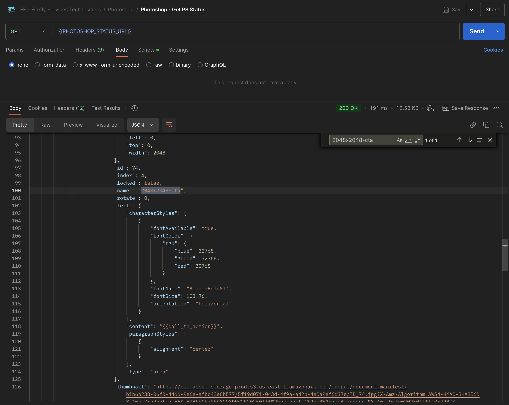
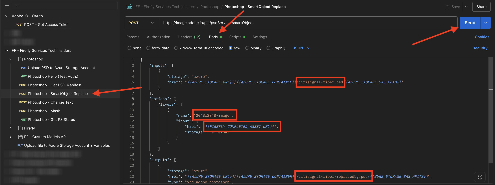

# 1.1.3 Arbeta med Photoshop API:er

Lär dig hur du arbetar med Photoshop API:er och Firefly Services.

## Förutsättningar för 1.1.3.1

Innan du fortsätter med den här övningen måste du ha slutfört installationen av [ditt Adobe I/O-projekt](./../../../modules/getting-started/gettingstarted/ex6.md), och du måste också ha konfigurerat ett program för interaktion med API:er, som [Postman](./../../../modules/getting-started/gettingstarted/ex7.md) eller [PostBuster](./../../../modules/getting-started/gettingstarted/ex8.md).

## 1.1.3.2 Adobe I/O - access_token

I samlingen **Adobe IO - OAuth** markerar du begäran **POST - Get Access Token** och väljer **Skicka**. Svaret ska innehålla en ny **accestoken**.


## 1.1.3.3 Interagera programmatiskt med en PSD-fil

Hämta [citisign-fiber.psd](./../../../assets/ff/citisignal-fiber.psd){target="_blank"} till skrivbordet.

Öppna **citisign-fiber.psd** i Photoshop.


I rutan **Lager** har fildesignern gett varje lager ett unikt namn. Du kan se lagerinformationen genom att öppna PSD-filen i Photoshop, men du kan också göra detta programmatiskt.

Låt oss skicka din första API-begäran till Photoshop API:er.

### Photoshop API - Hello World

Sedan hälsar vi på Photoshop API:er för att testa om alla behörigheter och all åtkomst är korrekt inställda.

I samlingen **Photoshop** öppnar du begäran **Photoshop Hello (Test Auth.)**. Välj **Skicka**.


Du bör få svaret **Välkommen till Photoshop API!**.


För att kunna interagera programmatiskt med PSD-filen **citisign-fiber.psd** måste du sedan överföra den till ditt lagringskonto. Du kan göra det manuellt - genom att dra och släppa det i behållaren med Azure Storage Explorer - men den här gången bör du göra det via API:t.

### Överför PSD till Azure

Öppna begäran **Överför PSD till Azure Storage-kontot** i Postman. I föregående övning konfigurerade du dessa miljövariabler i Postman, som du nu kommer att använda:

- `AZURE_STORAGE_URL`
- `AZURE_STORAGE_CONTAINER`
- `AZURE_STORAGE_SAS_READ`
- `AZURE_STORAGE_SAS_WRITE`

Som du kan se i begäran **Överför PSD till Azure Storage-konto**, är URL:en konfigurerad att använda dessa variabler.


I **Body** markerar du filen **citisign-fiber.psd**.


Skärmen bör se ut så här. Välj **Skicka**.


Du bör få tillbaka det här tomma svaret från Azure, vilket innebär att din fil lagras i din behållare i ditt Azure Storage-konto.


Om du använder Azure Storage Explorer för att titta på din fil måste du uppdatera din mapp.


### Photoshop API - skaffa manifest

Därefter måste du hämta manifestfilen för din PSD-fil.

I Postman öppnar du begäran **Photoshop - Hämta PSD Manifest**. Gå till **Body**.

Kroppen ska se ut så här:

```json
  {
    "inputs": [
      {
        "storage": "external",
        "href": "{{AZURE_STORAGE_URL}}/{{AZURE_STORAGE_CONTAINER}}/citisignal-fiber.psd{{AZURE_STORAGE_SAS_READ}}"
      }
    ],
    "options": {
      "thumbnails": {
        "type": "image/jpeg"
      }
    }
  }
```

Välj **Skicka**.

I svaret ser du nu en länk. När åtgärder i Photoshop ibland kan ta lite tid att slutföra, tillhandahåller Photoshop en statusfil som svar på de flesta inkommande begäranden. För att förstå vad som händer med din begäran måste du läsa statusfilen.


Om du vill läsa statusfilen öppnar du begäran **Photoshop - Hämta PS-status**. Du kan se att den här begäran använder en variabel som URL, vilket är en variabel som anges av den tidigare begäran som du skickade, **Photoshop - Hämta PSD-manifest**. Variabler anges i **Skript** för varje begäran. Välj **Skicka**.


Skärmen bör se ut så här. För närvarande är statusen inställd på **väntande**, vilket innebär att processen inte har slutförts än.


Markera Skicka några gånger till på **Photoshop - Hämta PS-status** tills statusen ändras till **Slutförd**. Det här kan ta några minuter.

När svaret är tillgängligt kan du se json-filen som innehåller information om alla lager i PSD-filen. Detta är användbar information eftersom exempelvis lagernamn eller lager-ID kan identifieras.


Sök till exempel efter texten `2048x2048-cta`. Skärmen bör se ut så här:




### Photoshop API - SmartObject-ersättning

Därefter måste du ändra bakgrunden för filen citisign-fiber.psd genom att använda bilden som du skapade med Firefly i en av de föregående övningarna.

Öppna begäran **Photoshop - SmartObject Replace** i Postman och gå till **Body**.

Skärmen bör se ut så här:

- först anges en indatafil: `citisignal-fiber.psd`
- därefter specificeras det lager som ska ändras, med den nya bakgrundsfilen som ska användas
- För det tredje har en utdatafil angetts: `citisignal-fiber-replacedbg.psd`

```json
  {
    "inputs": [
        {
            "storage": "azure",
            "href": "{{AZURE_STORAGE_URL}}/{{AZURE_STORAGE_CONTAINER}}/citisignal-fiber.psd{{AZURE_STORAGE_SAS_READ}}"
        }
    ],
    "options": {
        "layers": [
            {
                "name": "2048x2048-image",
                "input": {
                    "href": "{{FIREFLY_COMPLETED_ASSET_URL}}",
                    "storage": "external"
                }
            }
        ]
    },
    "outputs": [
        {
            "storage": "azure",
            "href": "{{AZURE_STORAGE_URL}}/{{AZURE_STORAGE_CONTAINER}}/citisignal-fiber-replacedbg.psd{{AZURE_STORAGE_SAS_WRITE}}",
            "type": "vnd.adobe.photoshop",
            "overwrite": true
        }
    ]
}
```

Utdatafilen har ett annat namn eftersom du inte vill åsidosätta den ursprungliga indatafilen.

Välj **Skicka**.



Precis som tidigare innehåller svaret en länk som pekar på statusfilen som håller reda på förloppet.


Om du vill läsa statusfilen öppnar du begäran **Photoshop - Hämta PS-status** och väljer **Skicka**. Om statusen inte är inställd på **success** omedelbart, vänta några sekunder och välj sedan **Skicka** igen.

Välj den URL som du vill hämta utdatafilen från.


Öppna **citisign-fiber-replacedbg.psd** när du har hämtat filen till datorn. Du bör se att bakgrundsbilden har ändrats till en liknande bild som nedan:


Du kan även se den här filen i din behållare med Azure Storage Explorer.


### Photoshop API - Ändra text

Därefter måste du ändra texten för call to action med API:erna.

Öppna begäran **Photoshop - Ändra text** i Postman och gå till **Brödtext**.

Skärmen bör se ut så här:

- först anges en indatafil: `citisignal-fiber-replacedbg.psd`, som är filen som skapades i föregående steg när du ändrade bakgrundsbilden
- därefter anges det lager som ska ändras, med texten som ska ändras till
- För det tredje har en utdatafil angetts: `citisignal-fiber-changed-text.psd`

```json
  {
  "inputs": [
    {
      "storage": "external",
      "href": "{{AZURE_STORAGE_URL}}/{{AZURE_STORAGE_CONTAINER}}/citisignal-fiber-replacedbg.psd{{AZURE_STORAGE_SAS_READ}}"
    }
  ],
  "options": {
    "layers": [
      {
        "name": "2048x2048-cta",
        "text": {
          "content": "Get Fiber now!"
        }
      }
    ]
  },
  "outputs": [
    {
      "storage": "azure",
      "href": "{{AZURE_STORAGE_URL}}/{{AZURE_STORAGE_CONTAINER}}/citisignal-fiber-changed-text.psd{{AZURE_STORAGE_SAS_WRITE}}",
      "type": "vnd.adobe.photoshop",
      "overwrite": true
    }
  ]
}
```

Utdatafilen har ett annat namn eftersom du inte vill åsidosätta den ursprungliga indatafilen.

Välj **Skicka**.


Precis som tidigare innehåller svaret en länk som pekar på statusfilen som håller reda på förloppet.


Om du vill läsa statusfilen öppnar du begäran **Photoshop - Hämta PS-status** och väljer **Skicka**. Om statusen inte är inställd på **success** omedelbart, vänta några sekunder och välj sedan **Skicka** igen.

Välj den URL som du vill hämta utdatafilen från.


Öppna **citisign-fiber-changed-text.psd** när du har hämtat filen till datorn. Platshållaren för call to action har ersatts av texten **Hämta nu!**.


Du kan även se den här filen i din behållare med Azure Storage Explorer.


## Nästa steg

Gå till [Firefly API för anpassade modeller](./ex4.md){target="_blank"}

Gå tillbaka till [Översikt över Adobe Firefly Services](./firefly-services.md){target="_blank"}

Gå tillbaka till [Alla moduler](./../../../overview.md){target="_blank"}