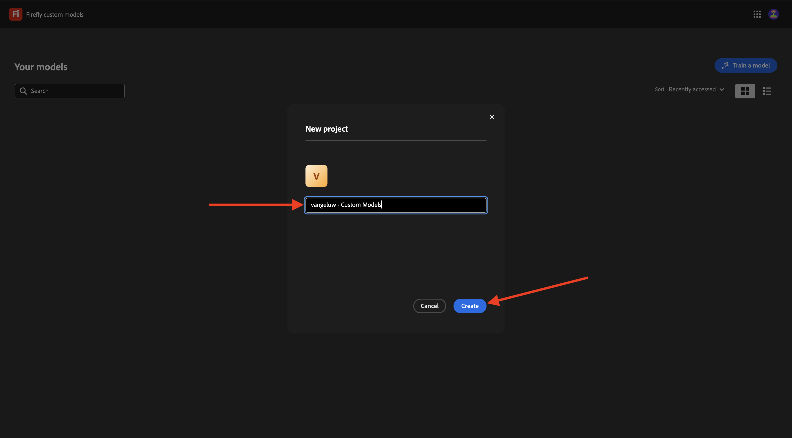
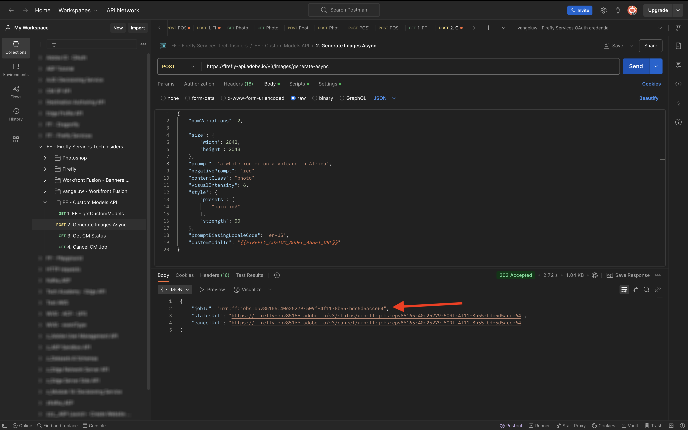
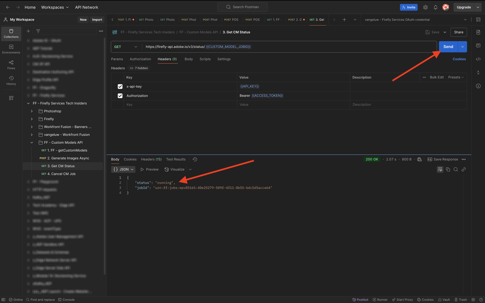

# 1.1.4 API för anpassade Firefly-modeller

## 1.1.4.1 Konfigurera din anpassade modell

Gå till [https://firefly.adobe.com/](https://firefly.adobe.com/). Klicka på **Egna modeller**.

{zoomable="yes"}

Du kanske ser det här meddelandet. Om du gör det klickar du på **Godkänn** för att fortsätta.

{zoomable="yes"}

Du borde se det här då. Klicka på **Utbilda en modell**.

{zoomable="yes"}

Konfigurera följande fält:

- **Namn**: använd `--aepUserLdap-- - Citi Signal Router Model`
- **Utbildningsläge**: välj **Ämne (förhandsversion av tekniker)**
- **Koncept**: ange `router`
- **Spara i**: öppna listrutan och klicka på **+ Skapa nytt projekt**

{zoomable="yes"}

Ge det nya projektet ett namn: `--aepUserLdap-- - Custom Models`. Klicka på **Skapa**.

{zoomable="yes"}

Du borde se det här då. Klicka på **Skapa**.

{zoomable="yes"}

Du måste nu ange referensbilderna för den anpassade modellen som ska tränas. Klicka på **Välj bilder från datorn**.

{zoomable="yes"}

Hämta referensbilderna [här](https://tech-insiders.s3.us-west-2.amazonaws.com/CitiSignal_router.zip). Zippa upp den nedladdade filen så får du den här.

{zoomable="yes"}

Navigera till mappen som innehåller de hämtade bildfilerna. Markera alla och klicka på **Öppna**.

{zoomable="yes"}

Då ser du att bilderna läses in.

{zoomable="yes"}

Efter några minuter läses bilderna in korrekt. Det kan bero på att bildtexten inte har genererats eller att bildtexten inte är tillräckligt lång. Granska varje bild med ett fel och ange en bildtext som uppfyller kraven och beskriver bilden.

{zoomable="yes"}

När alla bilder har bildtexter som uppfyller kraven måste du ändå ange en exempelfråga. Ange en uppmaning som använder ordet router. När du har gjort det kan du börja utbilda din modell. Klicka på **Tåg**.

{zoomable="yes"}

Då ser du det här. Det kan ta 20-30 minuter eller längre att utbilda modellen.

{zoomable="yes"}

Efter 20-30 minuter har din modell utbildats och kan publiceras. Klicka på **Publicera**.

{zoomable="yes"}

Klicka på **Publicera** igen.

{zoomable="yes"}

Stäng popup-fönstret **Dela anpassad modell**.

{zoomable="yes"}

## 1.1.4.2 Använda din anpassade modell i användargränssnittet

Gå till [https://firefly.adobe.com/cme/train](https://firefly.adobe.com/cme/train). Klicka på din anpassade modell för att öppna den.

{zoomable="yes"}

Klicka på **Förhandsgranska och testa**.

{zoomable="yes"}

Du kommer då att se exempelmeddelandet som du angav innan du kördes.

{zoomable="yes"}

## 1.1.4.3 Aktivera din anpassade modell för API:t för anpassade Firefly-tjänster

När din anpassade modell har tränats kan den också användas via API:t. I övning 1.1.1 har du redan konfigurerat ditt Adobe I/O-projekt för interaktion med Firefly Services via API:t.

Gå till [https://firefly.adobe.com/cme/train](https://firefly.adobe.com/cme/train). Klicka på din anpassade modell för att öppna den.

{zoomable="yes"}

Klicka på de tre punkterna **..** och sedan på **Dela**.

{zoomable="yes"}

Om du vill komma åt en anpassad Firefly-modell måste den anpassade modellen delas med **ID:t för tekniskt konto** i Adobe I/O-projektet.

Gå till [https://developer.adobe.com/console/projects](https://developer.adobe.com/console/projects) om du vill hämta ditt **tekniska konto-ID**. Klicka för att öppna projektet med namnet `--aepUserLdap-- Firefly`.

{zoomable="yes"}

Klicka på **OAuth Server-to-Server**.

{zoomable="yes"}

Klicka för att kopiera ditt **tekniska konto-ID**.

{zoomable="yes"}

Klistra in ditt **tekniska konto-ID** och klicka på **Bjud in för redigering**.

{zoomable="yes"}

**ID:t för det tekniska kontot** bör nu kunna komma åt den anpassade modellen.

{zoomable="yes"}

## 1.1.4.4 Interaktion med Firefly Services API för anpassade modeller

I Exercise 1.1.1 Komma igång med Firefly Services hämtade du den här filen: [postman-ff.zip](./../../../assets/postman/postman-ff.zip) till ditt lokala skrivbord och du importerade sedan samlingen i Postman.

Öppna Postman och gå till mappen **FF - API för anpassade modeller**.

{zoomable="yes"}

Öppna förfrågan **1. FF - getCustomModels** och klicka på **Skicka**.

{zoomable="yes"}

Du bör se den anpassade modell som du skapade tidigare, med namnet `--aepUserLdap-- - Citi Signal Router Model`, som en del av svaret. Fältet **assetId** är den unika identifieraren för din anpassade modell, som kommer att refereras i nästa begäran.

{zoomable="yes"}

Öppna förfrågan **2. Generera bilder asynkront**. I det här exemplet begär du två variationer som ska genereras baserat på din anpassade modell. Du kan uppdatera uppmaningen som i det här fallet är `a white router on a volcano in Africa`.

Klicka på **Skicka**.

{zoomable="yes"}

Svaret innehåller fältet **jobId**. Jobbet för att generera dessa två bilder körs nu och du kan kontrollera statusen genom att använda nästa begäran.

{zoomable="yes"}

Öppna förfrågan **3. Hämta CM-status** och klicka på **Skicka**. Du bör då se att statusen är inställd på att köras.

{zoomable="yes"}

Efter några minuter klickar du på **Skicka** igen för begäran **3. Hämta CM-status**. Du bör då se att statusen har ändrats till **Succas** och du bör se två bild-URL:er som en del av utdata. Klicka för att öppna båda filerna.

{zoomable="yes"}

Detta är den första bilden som genererades i det här exemplet.

{zoomable="yes"}

Detta är den andra bilden som genererades i det här exemplet.

{zoomable="yes"}

Du har nu avslutat den här övningen.

## Nästa steg

Gå till [Sammanfattning och förmåner](./summary.md){target="_blank"}

Gå tillbaka till [Arbeta med Photoshop API:er](./ex3.md){target="_blank"}

Gå tillbaka till [Översikt över Adobe Firefly Services](./firefly-services.md){target="_blank"}
