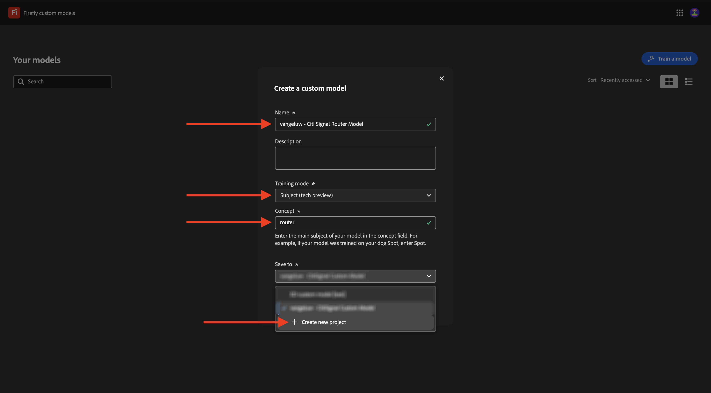
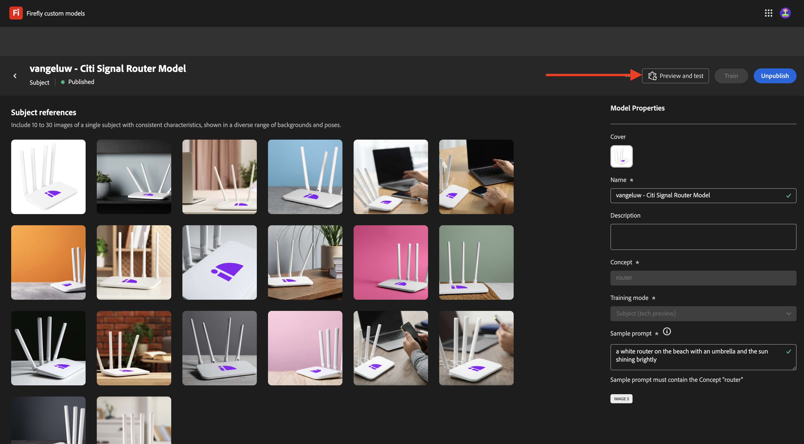
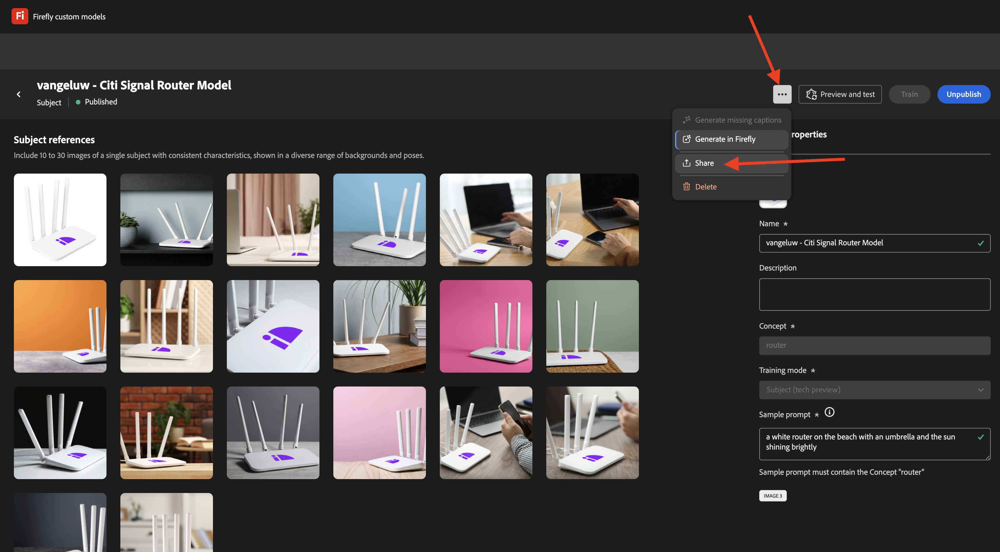
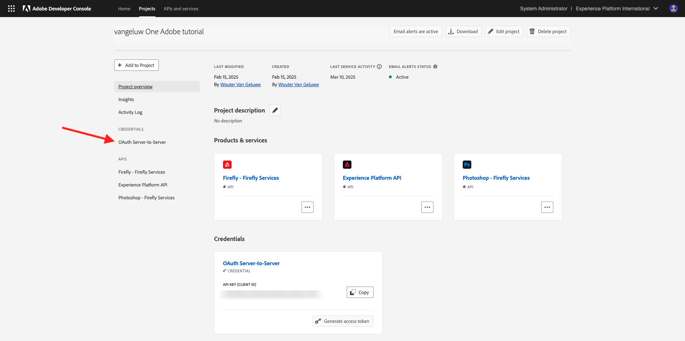

# 1.1.4 API för anpassade Firefly-modeller

## 1.1.4.1 Vad är anpassade Firefly-modeller?

Med Firefly egna modeller kan du generera bildvariationer som är anpassade efter ditt varumärke med funktionen Text till bild. Genom att utbilda dessa modeller med egna bilder kan ni generera innehåll som speglar ert varumärkes identitet.
Omvandla din stil eller ditt motiv till att utforska nya idéer, visualisera olika miljöer, generera innovativt innehåll och skräddarsy innehållet efter specifika segment.

Med Firefly anpassade modeller kan du ...

- Skapa varumärkesanpassade idéer och koncept
- Skapa teckenteman med enhetliga format
- Skapa enhetliga varumärkesstilar för att snabbt utöka kampanjer

För att uppnå detta har Firefly anpassade modeller stöd:

- Egna ämnesmodeller
- Anpassade formatmallar

### Egna ämnesmodeller

När man utbildar egna modeller i ett specifikt ämne - vare sig det handlar om objekt eller tecken - är målet att identifiera personens viktigaste funktioner och att hjälpa modellen att återge dem i olika sammanhang och på olika platser.

Leta efter bilder med följande egenskaper när du utbildar en ämnesmodell:

- Objektkonsekvens: Tillhandahåll bilder med samma märke och modell som motivet, samtidigt som du ser till att motivet inte ser så annorlunda ut i alla bilder. Undvik att blanda flera färger och säkerställa ett gemensamt tema eller mönster mellan bilder. Objektet kan dock variera mellan olika motiv, attityder, kläder och bakgrund.
- Objektfokus: använd bilder av motivet i tydligt fokus utan onödiga störande funktioner. Behåll motivet nära bildens mitt och se till att det upptar minst 25 % av bildens yta.
- Miljösammanhang: Tillhandahåll bilder av motivet i olika vyer och sammanhang och visa dem i en mängd olika ljusförhållanden. Även om bilder med vita eller genomskinliga bakgrunder kan användas är det bäst att ha en blandning med mer komplexa miljöer.
- Undvik andra objekt: Undvik stora objekt i bakgrunden eller som är kopplade till tecknet. Alla stora objekt som visas i bilderna memoreras av modellen och visas i de genererade bilderna, som liknar samma objekt i utbildningsdatauppsättningen.

### Anpassade formatmallar

Anpassade modeller som har tränats på en stil identifierar utseendet och känslan hos resurserna för att generera liknande bilder när de uppmanas till det.

Så här utbildar du en effektiv formatmodell:

- Ge liknande estetik: Inkludera bilder som visar olika scener och objekt samtidigt som samma utseende och känsla bevaras.
- Använd olika bilder: Använd så många bilder du kan för att förhindra att modellen fokuserar för mycket på oönskade objekt eller ämnen.
- Undvik fasta fraser: Ett fast mönster har större vikt än andra fraser. Om till exempel alla bildtexter innehåller&quot;Bakgrunden är helsvart&quot; eller&quot;söta tecknade format&quot; beror modellen på den här frasen och eventuella testkommandon utan den genererar inte önskat resultat.

## 1.1.4.2 Konfigurera din anpassade modell

Gå till [https://firefly.adobe.com/](https://firefly.adobe.com/). Klicka på **Egna modeller**.

{zoomable="yes"}

Du kanske ser det här meddelandet. Om du gör det klickar du på **Godkänn** för att fortsätta.

{zoomable="yes"}

Du borde se det här då. Klicka på **Utbilda en modell**.

{zoomable="yes"}

Konfigurera följande fält:

- **Namn**: använd `--aepUserLdap-- - Citi Signal Router Model`
- **Utbildningsläge**: välj **Ämne (förhandsversion av tekniker)**
- **Koncept**: ange `router`
- **Spara i**: öppna listrutan och klicka på **+ Skapa nytt projekt**

{zoomable="yes"}

Ge det nya projektet ett namn: `--aepUserLdap-- - Custom Models`. Klicka på **Skapa**.

{zoomable="yes"}

Du borde se det här då. Klicka på **Skapa**.

{zoomable="yes"}

Du måste nu ange referensbilderna för den anpassade modellen som ska tränas. Klicka på **Välj bilder från datorn**.

{zoomable="yes"}

Hämta referensbilderna [här](https://tech-insiders.s3.us-west-2.amazonaws.com/CitiSignal_router.zip). Zippa upp den nedladdade filen så får du den här.

{zoomable="yes"}

Navigera till mappen som innehåller de hämtade bildfilerna. Markera alla och klicka på **Öppna**.

{zoomable="yes"}

Då ser du att bilderna läses in.

{zoomable="yes"}

Efter några minuter läses bilderna in korrekt. Det kan bero på att bildtexten inte har genererats eller att bildtexten inte är tillräckligt lång. Granska varje bild med ett fel och ange en bildtext som uppfyller kraven och beskriver bilden.

{zoomable="yes"}

När alla bilder har bildtexter som uppfyller kraven måste du ändå ange en exempelfråga. Ange en uppmaning som använder ordet router. När du har gjort det kan du börja utbilda din modell. Klicka på **Tåg**.

{zoomable="yes"}

Då ser du det här. Det kan ta 20-30 minuter eller längre att utbilda modellen.

{zoomable="yes"}

Efter 20-30 minuter har din modell utbildats och kan publiceras. Klicka på **Publicera**.

{zoomable="yes"}

Klicka på **Publicera** igen.

{zoomable="yes"}

Stäng popup-fönstret **Dela anpassad modell**.

{zoomable="yes"}

## 1.1.4.3 Använd din anpassade modell i användargränssnittet

Gå till [https://firefly.adobe.com/cme/train](https://firefly.adobe.com/cme/train). Klicka på din anpassade modell för att öppna den.

{zoomable="yes"}

Klicka på **Förhandsgranska och testa**.

{zoomable="yes"}

Du kommer då att se exempelmeddelandet som du angav innan du kördes.

{zoomable="yes"}

## 1.1.4.4 Aktivera din anpassade modell för Firefly Services API för anpassade modeller

När din anpassade modell har tränats kan den också användas via API:t. I övning 1.1.1 har du redan konfigurerat ditt Adobe I/O-projekt för interaktion med Firefly Services via API:t.

Gå till [https://firefly.adobe.com/cme/train](https://firefly.adobe.com/cme/train). Klicka på din anpassade modell för att öppna den.

{zoomable="yes"}

Klicka på de tre punkterna **..** och sedan på **Dela**.

{zoomable="yes"}

Om du vill komma åt en anpassad Firefly-modell måste den anpassade modellen delas med e-postadressen **för det tekniska kontot** i ditt Adobe I/O-projekt.

Gå till [https://developer.adobe.com/console/projects](https://developer.adobe.com/console/projects) om du vill hämta e-postadressen för ditt **tekniska konto**. Klicka för att öppna projektet med namnet `--aepUserLdap-- One Adobe tutorial`.

{zoomable="yes"}

Klicka på **OAuth Server-to-Server**.

{zoomable="yes"}

Klicka för att kopiera e-postadressen till ditt **tekniska konto**.

{zoomable="yes"}

Klistra in e-postadressen till ditt **tekniska konto** och klicka på **Bjud in för redigering**.

{zoomable="yes"}

**E-postadressen för det tekniska kontot** bör nu kunna komma åt den anpassade modellen.

{zoomable="yes"}

## 1.1.4.5 Interagera med Firefly Services API för anpassade modeller

I Exercise 1.1.1 Komma igång med Firefly Services hämtade du den här filen: [postman-ff.zip](./../../../assets/postman/postman-ff.zip) till ditt lokala skrivbord och du importerade sedan samlingen i Postman.

Öppna Postman och gå till mappen **FF - API för anpassade modeller**.

{zoomable="yes"}

Öppna förfrågan **1. FF - getCustomModels** och klicka på **Skicka**.

{zoomable="yes"}

Du bör se den anpassade modell som du skapade tidigare, med namnet `--aepUserLdap-- - Citi Signal Router Model`, som en del av svaret. Fältet **assetId** är den unika identifieraren för din anpassade modell, som kommer att refereras i nästa begäran.

{zoomable="yes"}

Öppna förfrågan **2. Generera bilder asynkront**. I det här exemplet begär du två variationer som ska genereras baserat på din anpassade modell. Du kan uppdatera uppmaningen som i det här fallet är `a white router on a volcano in Africa`.

Klicka på **Skicka**.

{zoomable="yes"}

Svaret innehåller fältet **jobId**. Jobbet för att generera dessa två bilder körs nu och du kan kontrollera statusen genom att använda nästa begäran.

{zoomable="yes"}

Öppna förfrågan **3. Hämta CM-status** och klicka på **Skicka**. Du bör då se att statusen är inställd på att köras.

{zoomable="yes"}

Efter några minuter klickar du på **Skicka** igen för begäran **3. Hämta CM-status**. Du bör då se att statusen har ändrats till **Succas** och du bör se två bild-URL:er som en del av utdata. Klicka för att öppna båda filerna.

{zoomable="yes"}

Detta är den första bilden som genererades i det här exemplet.

{zoomable="yes"}

Detta är den andra bilden som genererades i det här exemplet.

{zoomable="yes"}

Du har nu avslutat den här övningen.

## Nästa steg

Gå till [Sammanfattning och förmåner](./summary.md){target="_blank"}

Gå tillbaka till [Arbeta med Photoshop API:er](./ex3.md){target="_blank"}

Gå tillbaka till [Översikt över Adobe Firefly Services](./firefly-services.md){target="_blank"}
