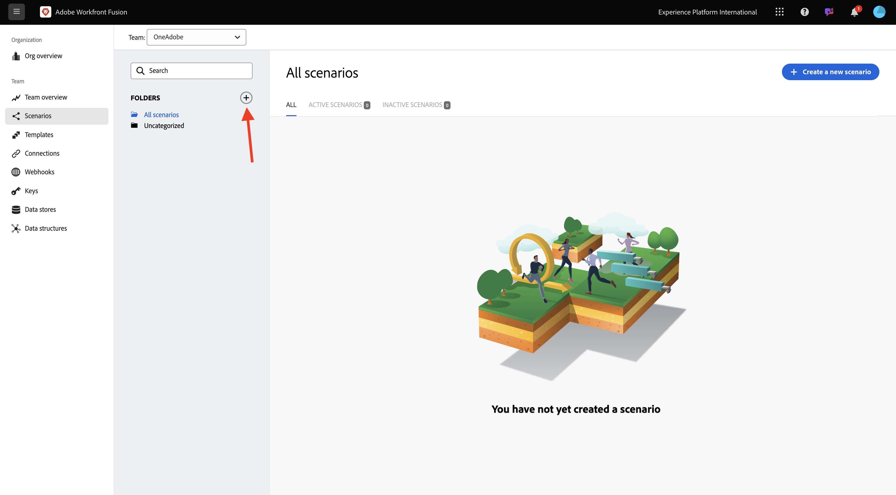
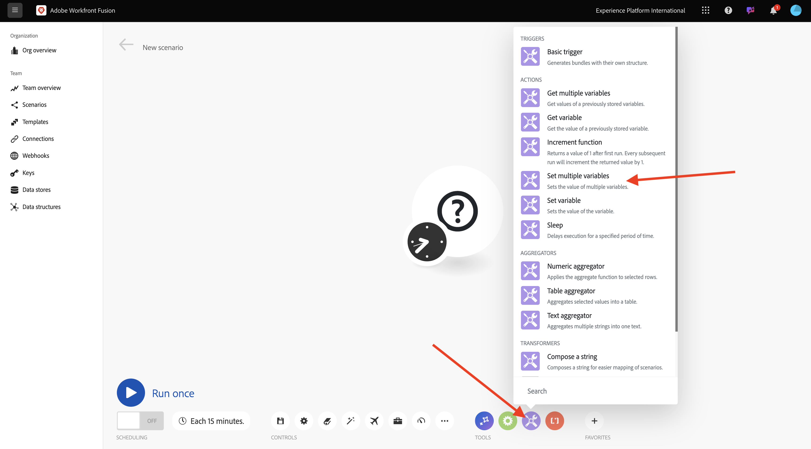
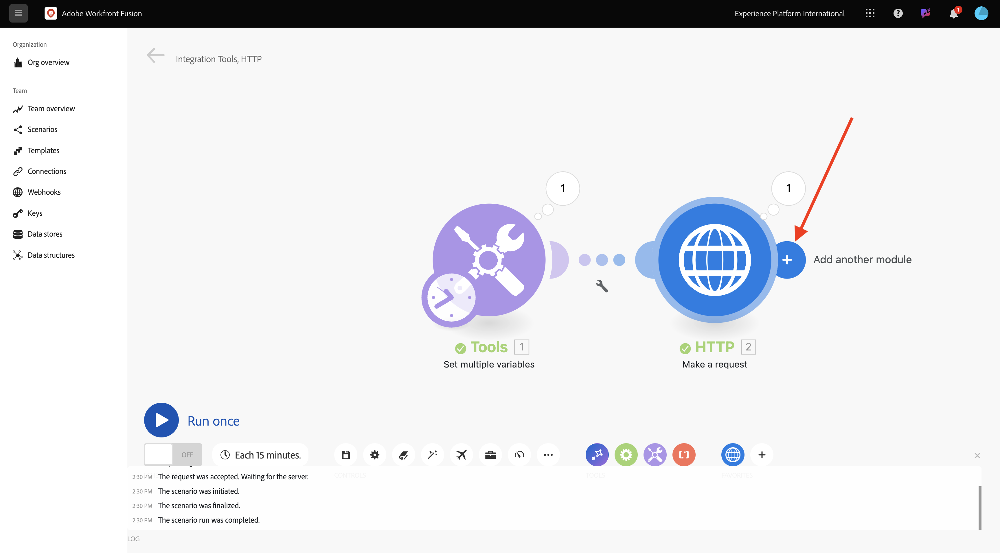
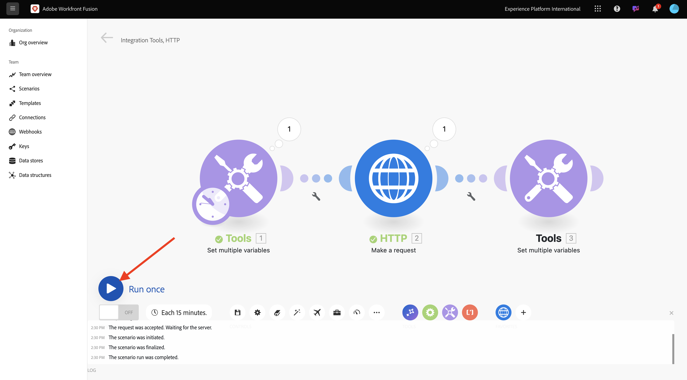

# 1.2.1 Komma igång med Workfront Fusion

Lär dig hur du använder Workfront Fusion och Adobe I/O för att hämta Adobe Firefly Services API:er.

## 1.2.1.1 Skapa nytt scenario

1. Gå till [https://experience.adobe.com/](https://experience.adobe.com/). Öppna **Workfront Fusion**.

   

1. Gå till **scenarier**.

   

1. Välj **Skapa nytt scenario**.

   

1. Namnge mappen `--aepUserLdap--` och välj **Spara**.

   

1. Markera mappen och välj sedan **Skapa nytt scenario**.

   

1. Ett tomt scenario visas. Välj **verktyg** och välj **Ange flera variabler**.

   

1. Flytta ikonen **klocka** till **Ange flera variabler**.

   

   Skärmen bör se ut så här.

   

1. Högerklicka på frågetecknet och välj **Ta bort modul**.

   

1. Högerklicka sedan på **Ange flera variabler** och välj **Inställningar**.

   

## 1.2.1.2 Konfigurera Adobe I/O-autentisering

Nu måste du konfigurera de variabler som behövs för att autentisera mot Adobe I/O. I föregående övning skapade du ett Adobe I/O-projekt. Variablerna i det Adobe I/O-projektet måste nu definieras i Workfront Fusion.

Följande variabler måste definieras:

| Nyckel | Värde |
|:-------------:| :---------------:| 
| `CONST_client_id` | ditt Adobe I/O-projekt klient-ID |
| `CONST_client_secret` | ditt Adobe I/O-projekt Client Secret |
| `CONST_scope` | ditt Adobe I/O-projekts omfång |

1. Du hittar dessa variabler genom att gå till [https://developer.adobe.com/console/projects](https://developer.adobe.com/console/projects) och öppna ditt Adobe I/O-projekt, som har namnet `--aepUserLdap-- Firefly`.

   

1. I ditt projekt väljer du **OAuth Server-Server** för att se värdena för tangenterna ovan.

   

1. Med tangenterna och värdena ovan kan du konfigurera objektet **Set multiple variables** . Välj **Lägg till objekt**.

   

1. Ange **variabelnamnet**: **CONST_client_id** och dess **variabelvärde**, välj **Lägg till**.

   

1. Välj **Lägg till objekt**.

   

1. Ange **Variabelnamn**: **CONST_client_secrets** och dess **variabelvärde**, välj **Lägg till**.

   

1. Välj **Lägg till objekt**.

   

1. Ange **Variabelnamn**: **CONST_scope** och dess **Variabelvärde**, välj **Lägg till**.

   

1. Välj **OK**.

   

1. Håll pekaren över **Ange flera variabler** och välj den stora ikonen **+** om du vill lägga till ytterligare en modul.

   

   Skärmen bör se ut så här.

   

1. Ange **http** i sökfältet. Välj **HTTP** för att öppna den.

   

1. Välj **Gör en förfrågan**.

   

   | Nyckel | Värde |
   |:-------------:| :---------------:| 
   | `URL` | `https://ims-na1.adobelogin.com/ims/token/v3` |
   | `Method` | `POST` |
   | `Body Type` | `x-www-form-urlencoded` |

1. Välj **Lägg till objekt**.

   

1. Lägg till objekt för vart och ett av värdena nedan:

   | Nyckel | Värde |
   |:-------------:| :---------------:| 
   | `client_id` | din fördefinierade variabel för `CONST_client_id` |
   | `client_secret` | din fördefinierade variabel för `CONST_client_secret` |
   | `scope` | din fördefinierade variabel för `CONST_scope` |
   | `grant_type` | `client_credentials` |

1. Konfiguration för `client_id`:

   

1. Konfiguration för `client_secret`.

   

1. Konfiguration för `scope`.

   

1. Konfiguration för `grant_type`.

   

1. Rulla ned och markera rutan för **Analysera svar**. Välj **OK**.

   

1. Skärmen bör se ut så här. Välj **Kör en gång**.

   

   När scenariot har körts bör skärmen se ut så här:

   

1. Markera ikonen **frågetecken** på objektet **Ange flera variabler** för att se vad som hände när objektet kördes.

   

1. Välj ikonen **frågetecken** på **HTTP - Gör en begäran** om du vill se vad som hände när objektet kördes. I **OUTPUT** ser du **access_token** som returneras av Adobe I/O.

   

1. Hovra över **HTTP - Gör en förfrågan** och välj ikonen **+** för att lägga till en till modul.

   

1. Sök efter `tools` i sökfältet. Välj **Verktyg**.

   

1. Välj **Ange flera variabler**.

   

1. Välj **Lägg till objekt**.

   

1. Ange **Variabelnamn** till `bearer_token`. Välj `access_token` som dynamiskt **variabelvärde**. Välj **Lägg till**.

   

1. Skärmen bör se ut så här. Välj **OK**.

   

1. Välj **Kör en gång** igen.

   

1. När scenariot körs väljer du ikonen **frågetecken** på det sista **Ange flera variabler** -objektet. Du bör se att access_token lagras i variabeln `bearer_token`.

   

1. Högerklicka sedan på det första objektet **Ange flera värden** och välj **Byt namn**.

   

1. Ange namnet **Initiera konstanter**. Välj **OK**.

   

1. Byt namn på det andra objektet till **Autentisera till Adobe I/O**. Välj **OK**.

   

1. Byt namn på det tredje objektet till **Ange Bearer-token**. Välj **OK**.

   

   Skärmen bör se ut så här:

   

1. Ändra sedan namnet på ditt scenario till `--aepUSerLdap-- - Adobe I/O Authentication`.

   

1. Välj **Spara**.

   

## Nästa steg

Gå till [Använd Adobe API:er i Workfront Fusion](./ex2.md){target="_blank"}

Gå tillbaka till [Automatisera Adobe Firefly-tjänster](./automation.md){target="_blank"}

Gå tillbaka till [Alla moduler](./../../../overview.md){target="_blank"}
