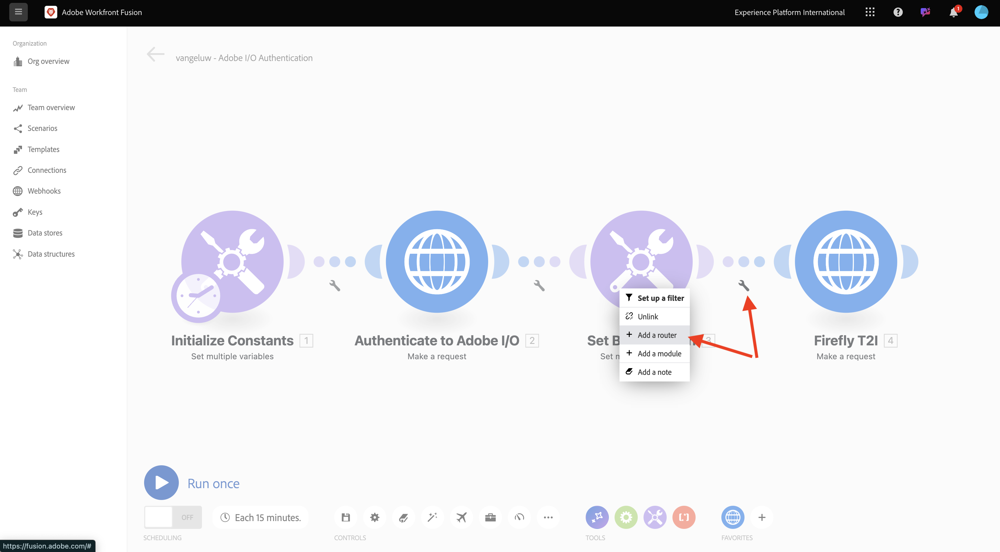
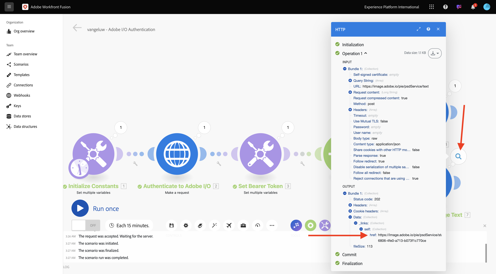
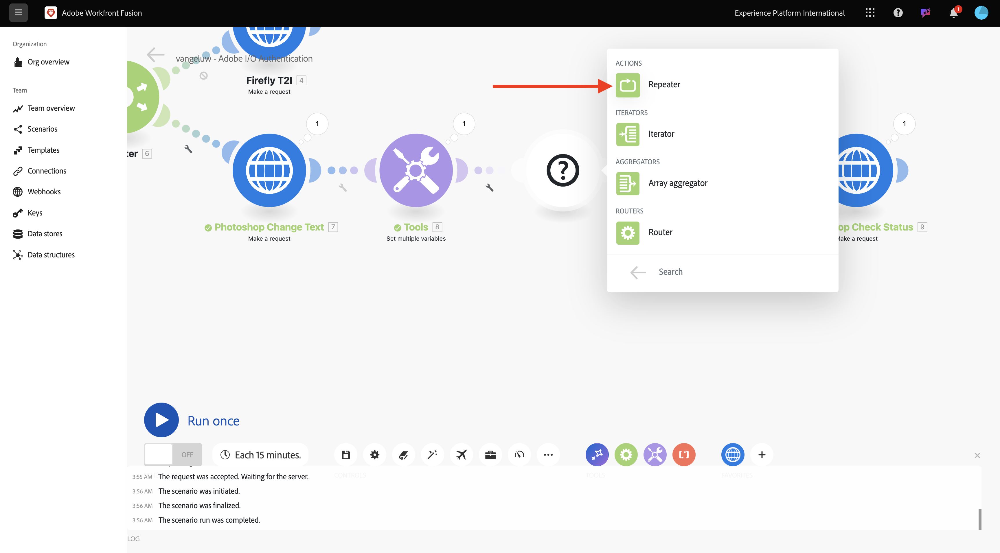
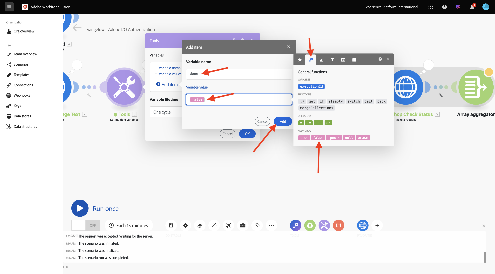
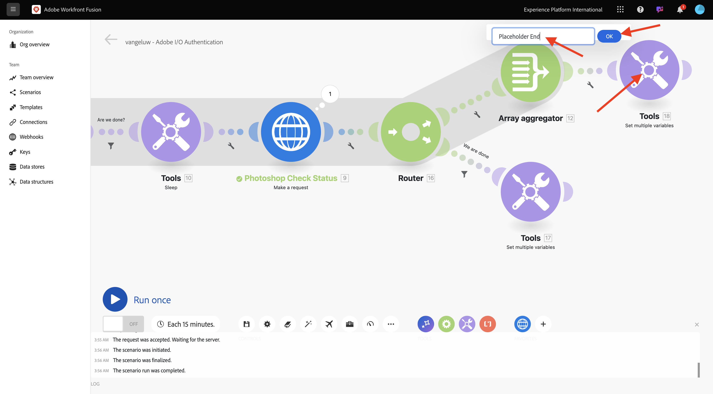

# 1.2.2 Använda Adobe API:er i Workfront Fusion

Lär dig hur du använder Adobe API:er i Workfront Fusion.

## 1.2.2.1 Använd Firefly Text To Image API med Workfront Fusion

Håll pekaren över den andra **Ange flera variabler**-noden och välj **+** om du vill lägga till en annan modul.


Sök efter **http** och välj **HTTP**.


Välj **Gör en förfrågan**.


Välj dessa variabler:

- **URL**: `https://firefly-api.adobe.io/v3/images/generate`
- **Metod**: `POST`

Välj **Lägg till en rubrik**.


Ange följande rubriker:

| Nyckel | Värde |
|:-------------:| :---------------:| 
| `x-api-key` | din lagrade variabel för `CONST_client_id` |
| `Authorization` | `Bearer ` + din lagrade variabel för `bearer_token` |
| `Content-Type` | `application/json` |
| `Accept` | `*/*` |

Ange information för `x-api-key`. Välj **Lägg till**.


Välj **Lägg till en rubrik**.


Ange information för `Authorization`. Välj **Lägg till**.


Välj **Lägg till en rubrik**. Ange information för `Content-Type`. Välj **Lägg till**.


Välj **Lägg till en rubrik**. Ange information för `Accept`. Välj **Lägg till**.


Ange **Brödtyp** till **Raw**. För **innehållstyp** väljer du **JSON (program/json)**.


Klistra in den här nyttolasten i fältet **Begär innehåll**.

```json
{
	"numVariations": 1,
	"size": {
		"width": 2048,
      "height": 2048
    },
    "prompt": "Horses in a field",
    "promptBiasingLocaleCode": "en-US"
}
```

Markera rutan för **Analysera svar**. Välj **OK**.


Välj **Kör en gång**.


Skärmen bör se ut så här.


Välj ?**&#x200B;** på den fjärde noden, HTTP, för att se svaret. Du bör se en bildfil i svaret.


Kopiera bildens URL och öppna den i ett webbläsarfönster. Skärmen bör se ut så här:


Högerklicka på **HTTP** och byt namn till **Firefly T2I**.


Välj **Spara** för att spara ändringarna.


## 1.2.2.2 Använda Photoshop API med Workfront Fusion

Välj **skiftnyckel** mellan noderna **Ange rikttoken** och **Firefly T2I**. Välj **Lägg till en router**.



Högerklicka på **Firefly T2I**-objektet och välj **Klona**.


Dra och släpp det klonade objektet nära **Router** -objektet. Det ansluter automatiskt till **Router**. Skärmen bör se ut så här:


Du har nu en identisk kopia baserad på HTTP-begäran **Firefly T2I**. Vissa av inställningarna för HTTP-begäran **Firefly T2I** liknar de som du behöver för att interagera med **Photoshop API** som sparar tid. Nu behöver du bara ändra variablerna som inte är desamma, som begärande-URL:en och nyttolasten.

Ändra **URL** till `https://image.adobe.io/pie/psdService/text`.


Ersätt **Begär innehåll** med nyttolasten nedan:

```json
  {
    "inputs": [
      {
        "storage": "external",
        "href": "{{AZURE_STORAGE_URL}}/{{AZURE_STORAGE_CONTAINER}}/citisignal-fiber.psd{{AZURE_STORAGE_SAS_READ}}"
      }
    ],
    "options": {
      "layers": [
        {
          "name": "2048x2048-button-text",
          "text": {
            "content": "Click here"
          }
        },
        {
          "name": "2048x2048-cta",
          "text": {
            "content": "Buy this stuff"
          }
        }
      ]
    },
    "outputs": [
      {
        "storage": "azure",
        "href": "{{AZURE_STORAGE_URL}}/{{AZURE_STORAGE_CONTAINER}}/citisignal-fiber-changed-text.psd{{AZURE_STORAGE_SAS_WRITE}}",
        "type": "vnd.adobe.photoshop",
        "overwrite": true
      }
    ]
  }
```


För att **Request-innehållet** ska fungera korrekt saknas vissa variabler:

- `AZURE_STORAGE_URL`
- `AZURE_STORAGE_CONTAINER`
- `AZURE_STORAGE_SAS_READ`
- `AZURE_STORAGE_SAS_WRITE`

Gå tillbaka till din första nod, välj **Initiera konstanter** och välj sedan **Lägg till objekt** för var och en av dessa variabler.


| Nyckel | Exempelvärde |
|:-------------:| :---------------:| 
| `AZURE_STORAGE_URL` | `https://vangeluw.blob.core.windows.net` |
| `AZURE_STORAGE_CONTAINER` | `vangeluw` |
| `AZURE_STORAGE_SAS_READ` | `?sv=2023-01-03&st=2025-01-13T07%3A36%3A35Z&se=2026-01-14T07%3A36%3A00Z&sr=c&sp=rl&sig=4r%2FcSJLlt%2BSt9HdFdN0VzWURxRK6UqhB8TEvbWkmAag%3D` |
| `AZURE_STORAGE_SAS_WRITE` | `?sv=2023-01-03&st=2025-01-13T17%3A21%3A09Z&se=2025-01-14T17%3A21%3A09Z&sr=c&sp=racwl&sig=FD4m0YyyqUj%2B5T8YyTFJDi55RiTDC9xKtLTgW0CShps%3D` |

Du kan hitta dina variabler genom att gå tillbaka till Postman och öppna dina **miljövariabler**.


Kopiera dessa värden till Workfront Fusion och lägg till ett nytt objekt för var och en av dessa fyra variabler.

Skärmen bör se ut så här. Välj **OK**.


Gå sedan tillbaka till den klonade HTTP-begäran för att uppdatera **Request-innehållet**. Observera de svarta variablerna i **Request content**, som är de variabler du kopierade över från Postman. Du måste ändra variablerna som du just definierade i Workfront Fusion. Ersätt varje variabel en i taget genom att ta bort den svarta texten och ersätta den med rätt variabel.


Gör dessa 3 ändringar i avsnittet **input**. Välj **OK**.


Gör dessa 3 ändringar i avsnittet **output**. Välj **OK**.


Högerklicka på den klonade noden och välj **Byt namn**. Ändra namnet till **Photoshop Change Text**.


Skärmen bör se ut så här:


Välj **Kör en gång**.


Markera ikonen **sök** på noden **Photoshop Change Text** för att visa svaret. Du bör ha ett svar som ser ut så här, med en länk till en statusfil.



Innan du fortsätter med Photoshop API-interaktionen måste du inaktivera vägen till **Firefly T2I** -noden så att inga API-anrop som inte behövs skickas till API-slutpunkten. Markera ikonen **skiftnyckel** och välj sedan **Inaktivera flöde**.


Skärmen bör se ut så här:


Lägg sedan till en annan **Set multiple variables**-nod.


Placera den efter noden **Photoshop Change Text** .


Markera noden **Ange flera variabler** och välj **Lägg till objekt**. Select the variable value from the response of the previous request.

| Variabelnamn | Variable value |
|:-------------:| :---------------:| 
| `psdStatusUrl` | `data > _links > self > href` |

Välj **Lägg till**.


Välj **OK**.


Högerklicka på noden Ändra text **i** Photoshop och välj **Klona**.


Dra den klonade HTTP-begäran efter **noden Ange flera variabler** som du nyss skapade.


Högerklicka på den klonade HTTP-begäran, välj **Byt namn** och ändra namnet till **Photoshop Check Status**.


Välj att öppna HTTP-begäran. Ändra URL-adressen så att den refererar till variabeln som du skapade i föregående steg och ange **Method** som **GET**.


Ta bort **brödtexten** genom att markera det tomma alternativet.


Välj **OK**.


Välj **Kör en gång**.


Ett svar som innehåller fältet **status** med statusen **running** visas. Det tar några sekunder för Photoshop att slutföra processen.


Nu när du vet att svaret behöver lite mer tid att slutföra, kan det vara en bra idé att lägga till en timer framför denna HTTP-begäran så att den inte körs omedelbart.

Markera noden **Verktyg** och välj sedan **Strömsparläge**.


Placera noden **Strömsparläge** mellan **Ange flera variabler** och **Photoshop Check Status**. Ange **Fördröjning** till **5** sekunder. Välj **OK**.


Skärmen bör se ut så här. Utmaningen med konfigurationen nedan är att 5 sekunders väntan kan vara tillräckligt, men det kanske inte räcker. I verkligheten är det bättre att ha en mer intelligent lösning som en do.. while-slinga som kontrollerar statusen var femte sekund tills statusen är lika med **Succas**. Så du kan implementera en sådan taktik i nästa steg.


Välj ikonen **skiftnyckel** mellan **Ange flera variabler** och **viloläge**. Välj **Lägg till modul**.


Sök efter `flow` och välj sedan **Flödeskontroll**.


Välj **Upprepare**.



Ange **Upprepningar** till **20**. Välj **OK**.


Välj sedan **+** på **Photoshop Check Status** för att lägga till en annan modul.


Sök efter **flöde** och välj **Flödeskontroll**.


Välj **Matrisaggregering**.


Ange **Source Module** som **Repeater**. Välj **OK**.


Skärmen bör se ut så här:


**Välj skiftnyckelsikonen** och välj **Lägg till en modul**.


Sök efter **verktyg** och välj **Verktyg**.


Välj **Hämta flera variabler**.


Välj **+ Lägg till objekt** och ange **variabelnamnet** till `done`.


Välj **OK**.


Select the **Set multiple variables** node that you configured before. In order to initialize the variable **done**, you need to set it to `false` here. Select **+ Add item**.


Använd `done` för variabelnamnet **&#x200B;**

För att ställa in statusen behövs ett booleskt värde. Om du vill hitta det booleska värdet väljer du **kugghjul** och sedan .`false` Välj **Lägg till**.



Välj **OK.**


Välj sedan ikonen **wrench** efter noden **Hämta flera variabler** som du konfigurerade.


Välj **Konfigurera ett filter**. Du måste nu kontrollera värdet för variabeln **klar**. Om värdet är **false** måste nästa del av slingan köras. Om värdet är **true** betyder det att processen redan har slutförts, så du behöver inte fortsätta med nästa del av slingan.


Använd **Är vi klara för etiketten?**. Ange **Villkor** med den redan befintliga variabeln **made**, ange operatorn till **Lika med** och värdet ska vara den booleska variabeln `false`. Välj **OK**.


Sedan kan du skapa utrymme mellan noderna **Photoshop Check Status** och **Array aggregator**. Välj sedan ikonen **skiftnyckel** och välj **Lägg till en router**. Du gör detta eftersom det ska finnas två sökvägar när du har kontrollerat Photoshop-filens status. Om statusen är `succeeded` ska variabeln **done** anges till `true`. Om statusen inte är lika med `succeeded` ska slingan fortsätta. Routern gör det möjligt att kontrollera och ställa in detta.


När du har lagt till routern markerar du ikonen **skiftnyckel** och väljer **Konfigurera ett filter**.


Använd **Vi är klara** för etiketten. Ange **Villkor** med svaret från noden **Photoshop Check Status** genom att välja svarsfältet **data.outputs[].status**, operatorn ska vara **Lika med** och värdet ska vara `succeeded`. Välj **OK**.


Markera sedan den tomma noden med frågetecknet och sök efter **verktyg**. Välj sedan **Verktyg**.


Välj **Ange flera variabler**.


När den här grenen av routern används betyder det att statusen för att skapa Photoshop-filen har slutförts. Detta innebär att de gör... medan loop inte längre behöver fortsätta att kontrollera statusen i Photoshop, så du bör ställa in variabeln `done` till `true`.

**För variabelnamnet** använder du `done`.

**För variabelvärdet** bör du använda det booleska värdet `true`. Välj kugghjulsikonen **&#x200B;**&#x200B;och välj `true`sedan. Välj **Lägg till**.


Välj **OK.**


Högerklicka sedan på noden Ange flera variabler **som** du just skapade och välj **Klona**.


Dra den klonade noden så att den ansluter till **matrisaggregatorn**. Högerklicka sedan på noden och välj **Byt namn** och ändra namnet till `Placeholder End`.



Ta bort den befintliga variabeln och välj **+ Lägg till objekt**. Använd `placeholder` för **variabelvärdet** för **använd `end`.** Välj **Lägg till** och välj sedan **OK**.


Välj **Spara** för att spara scenariot. Välj   **sedan Kör en gång**.


Ditt scenario körs sedan och bör slutföras. Lägg märke till att de gör... while-loop som du har konfigurerat fungerar bra. I körningen nedan kan du se att **repeatern** kördes 20 gånger baserat på bubblan på noden **Verktyg > Hämta flera variabler** . Efter den noden konfigurerade du ett filter som kontrollerade statusen och endast om statusen inte var lika med **lyckades** kördes nästa noder. In this run, the part after the filter only ran once, because the status was already **succeeded** in the first run.


Du kan kontrollera status för skapandet av din nya Photoshop-fil genom att klicka på bubblan i HTTP-begäran **Photoshop Check Status** och gå ned till fältet **status**.


Du har nu konfigurerat den grundläggande versionen av ett repeterbart scenario som automatiserar ett antal steg. I nästa övning kommer du att fortsätta med det genom att öka komplexiteten.

## Nästa steg

Go to [Process automation with Workfront Fusion](./ex3.md){target="_blank"}

Gå tillbaka till [Creative Workflow Automation med Workfront Fusion](./automation.md){target="_blank"}

Gå tillbaka till [Alla moduler](./../../../overview.md){target="_blank"}
