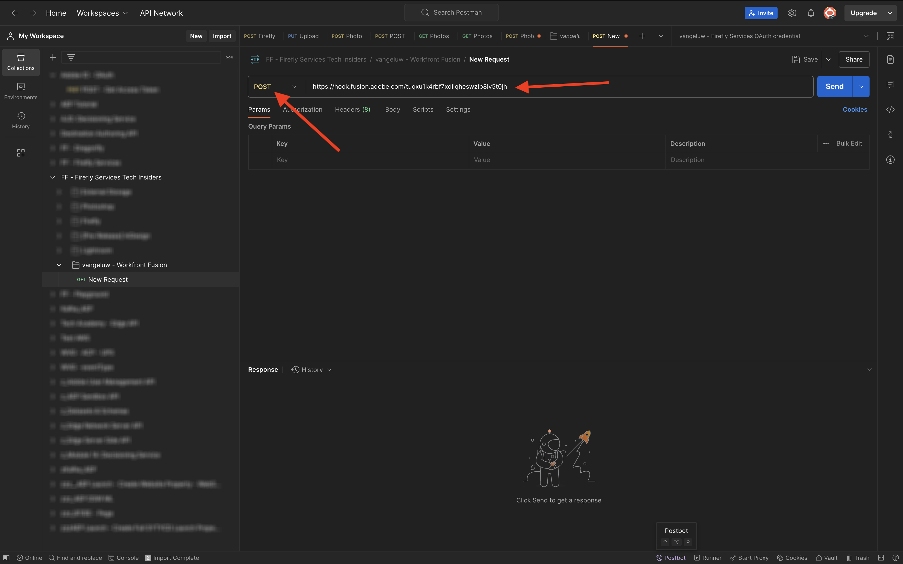
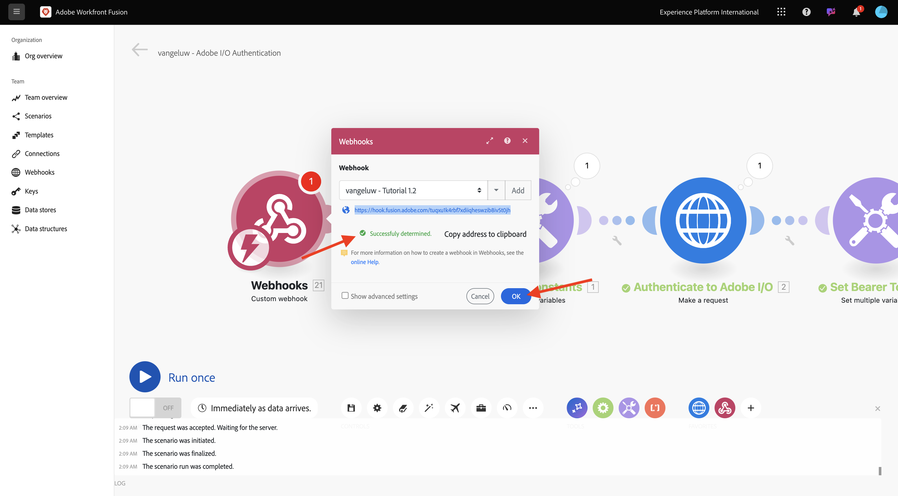
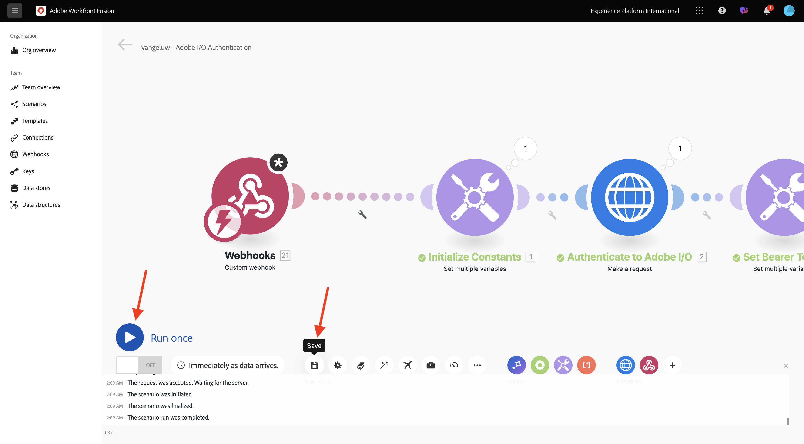
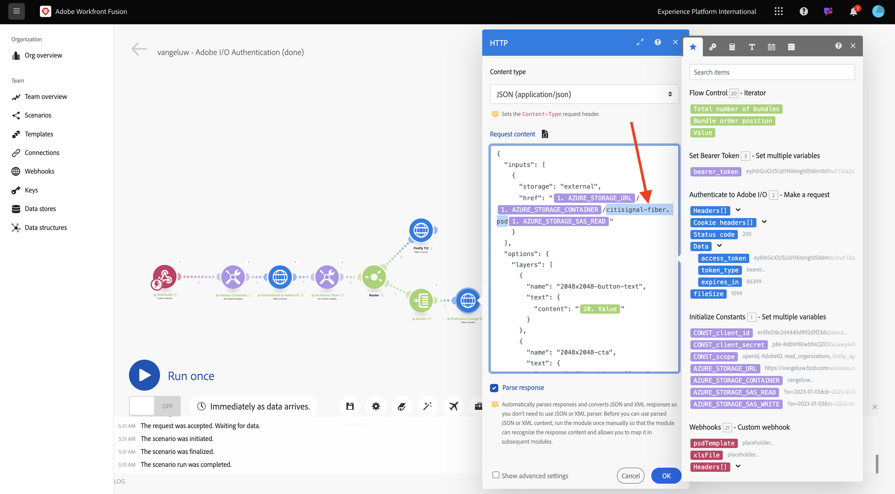
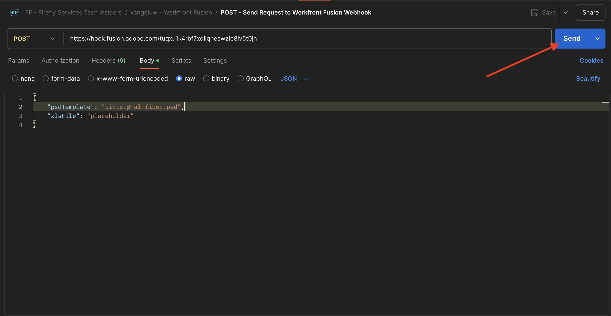

# 1.2.3 Processautomatisering med Workfront Fusion

Lär dig automatisera processer med Workfront Fusion.

## 1.2.3.1 itererar över flera värden

Scenariot bör se ut så här:


Hittills har du ändrat text i en Photoshop-fil med ett statiskt värde. Om du vill skala och automatisera arbetsflödena för att skapa innehåll måste du iterera över en lista med värden och infoga dessa värden dynamiskt i Photoshop-filen. I nästa steg ska du lägga till en funktion för att iterera över värden i ditt befintliga scenario.

Mellan noden **Router** och noden **Photoshop Change Text** markerar du ikonen **wrench** och väljer **Lägg till en modul**.


Sök efter `flow` och välj **Flödeskontroll**.


Välj **Iterator**.


Skärmen bör se ut så här:


Även om det går att läsa indatafiler som CSV-filer måste du för närvarande använda en grundläggande version av en CSV-fil genom att definiera en textsträng och dela upp textfilen.

Du kan hitta funktionen **split** genom att markera ikonen **T** , där du ser alla tillgängliga funktioner för att ändra textvärden. Välj funktionen **split** och se det här.


Delningsfunktionen förväntar sig en array med värden före semikolon och förväntar sig att du anger avgränsaren efter semikolon. För det här testet bör du använda en enkel array med två fält, **Köp nu** och **Klicka här**, och avgränsaren är **,**.

Ange detta i fältet **Array** genom att ersätta den för närvarande tomma funktionen **split**: `{{split("Buy now, Click here "; ",")}}`. Välj **OK**.


Välj **Photoshop Change Text** om du vill lägga till i vissa variabler i stället för statiska värden för in- och utdatafälten.


I **Request content** är texten **Click here**. Den här texten måste ersättas med värden som kommer från arrayen.


Ta bort texten **Klicka här** och ersätt den genom att välja variabeln **Value** från noden **Intervator**. Detta säkerställer att texten på knappen i ditt Photoshop-dokument uppdateras dynamiskt.


Du måste också uppdatera filnamnet som används för att skriva filen i ditt Azure Storage-konto. Om filnamnet är statiskt skriver varje ny åtgärd över den tidigare filen och förlorar därför de anpassade filerna. Det aktuella statiska filnamnet är **citisign-fiber-changed-text.psd** och du måste nu uppdatera det.

Placera markören bakom ordet `text`.


Lägg först till ett bindestreck `-` och markera sedan värdet **Paketordningsposition**. Detta garanterar att Workfront Fusion lägger till `-1` i filnamnet för den första upprepningen, `-2` osv. Välj **OK**.


Spara ditt scenario och välj sedan **Kör en gång**.


När scenariot har körts går du tillbaka till Azure Storage Explorer och uppdaterar mappen. Du bör sedan se de två nyskapade filerna.


Hämta och öppna varje fil. Du bör skriva olika texter på knapparna. Det här är filen `citisignal-fiber-changed-text-1.psd`.


Det här är filen `citisignal-fiber-changed-text-2.psd`.


## 1.2.3.2 Aktivera ditt scenario med en webkrok

Hittills har du kört ditt scenario manuellt för att testa. Nu uppdaterar vi ditt scenario med en webkrok, så att det kan aktiveras från en extern miljö.

Välj **+**, sök efter **webkrok** och välj sedan **Webhooks**.


Välj **Anpassad webkrok**.

Dra och anslut noden **Anpassad webkrok** så att den ansluter till den första noden på arbetsytan, som kallas **Initiera konstanter**.


Välj noden **Anpassad webkrok**. Välj sedan **Lägg till**.


Ange **Webkrok-namnet** till `--aepUserLdap-- - Tutorial 1.2`.


Markera rutan för **Hämta begäranderubriker**. Välj **Spara**.


Din webkroks-URL är nu tillgänglig. Kopiera URL-adressen.


Öppna Postman och lägg till en ny mapp i samlingen **FF - Firefly Services Tech Insiders**.


Namnge mappen `--aepUserLdap-- - Workfront Fusion`.


Markera de tre punkterna **..** i mappen som du just skapade och välj **Lägg till begäran**.


Ange **Metodtypen** till **POST** och klistra in URL:en för din webkrok i adressfältet.



Du måste skicka en anpassad brödtext så att variabelelementen kan tillhandahållas från en extern källa till ditt Workfront Fusion-scenario.

Gå till **Brödtext** och välj **Raw**.


Klistra in texten nedan i texten i din begäran. Välj **Skicka**.

```json
{
	"psdTemplate": "placeholder",
	"xlsFile": "placeholder"
}
```


I Workfront Fusion visas ett meddelande på din anpassade webkrok som säger: **Klart fastställt**.



Välj **Spara** och sedan **Kör en gång**. Scenariot är nu aktivt men kan inte köras förrän du väljer **Skicka** igen i Postman.



I Postman väljer du **Skicka** igen.


Scenariot körs igen och de två filerna skapas precis som förut.


Ändra namnet på din Postman-begäran till `POST - Send Request to Workfront Fusion Webhook`.


Nu måste du börja använda variabeln **psdTemplate**. I stället för att hårdkoda indatafilens plats i noden **Photoshop Change Text** används den inkommande variabeln från Postman-begäran.

Öppna noden **Photoshop Change Text** och gå till **Request content**. Markera det hårdkodade filnamnet **citisign-fiber.psd** under **input** och ta bort det.



Markera variabeln **psdTemplate**. Välj **OK** och spara sedan ditt scenario.


Välj **ON** för att aktivera ditt scenario. Scenariot körs nu utan stopp.


I Postman anger du filnamnet `citisignal-fiber.psd` som värde för variabeln **psdTemplate** och väljer **Skicka** igen för att köra scenariot igen.



Genom att ange PSD-mallen som en variabel som tillhandahålls av ett externt system har du nu skapat ett återanvändbart scenario.

Nu har du avslutat den här övningen.

## Nästa steg

Gå till [1.2.4 Automatisering med anslutningar](./ex4.md){target="_blank"}

Gå tillbaka till [Creative Workflow Automation med Workfront Fusion](./automation.md){target="_blank"}

Gå tillbaka till [Alla moduler](./../../../overview.md){target="_blank"}
