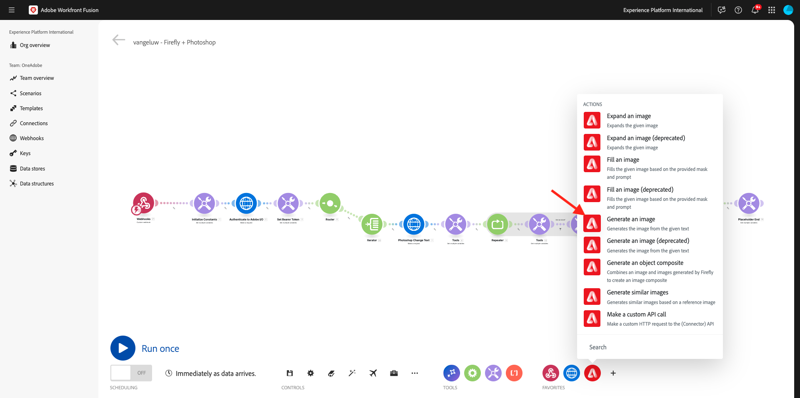
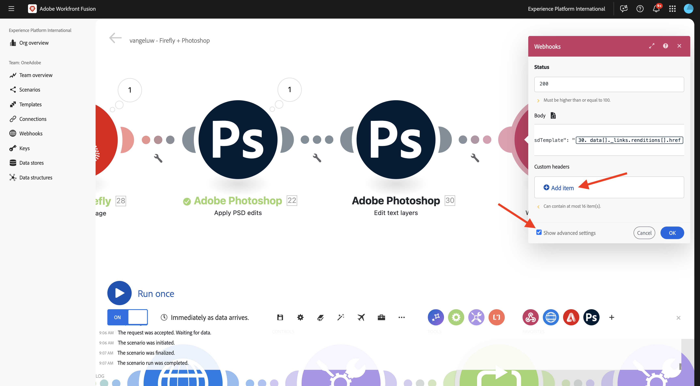

# 1.2.4 Automatisering med kontakter

Du kommer nu att börja använda de färdiga anslutningarna i Workfront Fusion för Photoshop och du kopplar ihop Firefly Text-2-Image-begäran och Photoshop-förfrågningarna till ett enda scenario.

## 1.2.4.1 Uppdatera variabler

Innan du fortsätter med anslutningskonfigurationen måste följande variabler läggas till i modulen **Initiera konstanter**.

- `AZURE_STORAGE_URL`
- `AZURE_STORAGE_CONTAINER`
- `AZURE_STORAGE_SAS_READ`
- `AZURE_STORAGE_SAS_WRITE`

Gå tillbaka till din första nod, välj **Initiera konstanter** och välj sedan **Lägg till objekt** för var och en av dessa variabler.


| Nyckel | Exempelvärde |
|:-------------:| :---------------:| 
| `AZURE_STORAGE_URL` | `https://vangeluw.blob.core.windows.net` |
| `AZURE_STORAGE_CONTAINER` | `vangeluw` |
| `AZURE_STORAGE_SAS_READ` | `?sv=2023-01-03&st=2025-01-13T07%3A36%3A35Z&se=2026-01-14T07%3A36%3A00Z&sr=c&sp=rl&sig=4r%2FcSJLlt%2BSt9HdFdN0VzWURxRK6UqhB8TEvbWkmAag%3D` |
| `AZURE_STORAGE_SAS_WRITE` | `?sv=2023-01-03&st=2025-01-13T17%3A21%3A09Z&se=2025-01-14T17%3A21%3A09Z&sr=c&sp=racwl&sig=FD4m0YyyqUj%2B5T8YyTFJDi55RiTDC9xKtLTgW0CShps%3D` |

Du kan hitta dina variabler genom att gå tillbaka till Postman och öppna dina **miljövariabler**.


Kopiera dessa värden till Workfront Fusion och lägg till ett nytt objekt för var och en av dessa fyra variabler.

Skärmen bör se ut så här. Välj **OK**.


## 1.2.4.2 Aktivera ditt scenario med en webkrok

Hittills har du kört ditt scenario manuellt för att testa. Nu uppdaterar vi ditt scenario med en webkrok, så att det kan aktiveras från en extern miljö.

Välj **+**, sök efter **webkrok** och välj sedan **Webhooks**.


Välj **Anpassad webkrok**.


Dra modulen **Anpassad webkrok** till början av ditt scenario. Välj sedan ikonen **klocka** och dra den till modulen **Anpassad webkrok** .


Du borde se det här då. Dra sedan den röda punkten i den första modulen mot den lila punkten i den andra modulen.


Du borde se det här då. Klicka på modulen **Anpassad webkrok**.


Klicka på **Lägg till**.


Ange **Webkrok-namnet** till `--aepUserLdap-- - Firefly + Photoshop Webhook`. Klicka på **Spara**.


Din webkroks-URL är nu tillgänglig. Klicka på **Kopiera adress till Urklipp** för att kopiera URL:en.


Öppna Postman och lägg till en ny mapp i samlingen **FF - Firefly Services Tech Insiders**.


Namnge mappen `--aepUserLdap-- - Workfront Fusion`.


Markera de tre punkterna **..** i mappen som du just skapade och välj **Lägg till begäran**.


Ange **Metodtypen** till **POST** och klistra in URL:en för din webkrok i adressfältet.


Du måste skicka en anpassad brödtext så att variabelelementen kan tillhandahållas från en extern källa till ditt Workfront Fusion-scenario.

Gå till **Brödtext** och välj **Raw**.


Klistra in texten nedan i texten i din begäran. Välj **Skicka**.

```json
{
    "psdTemplate": "citisignal-fiber.psd",
    "xlsFile": "placeholder",
    "prompt":"misty meadows",
    "cta": "Buy this now!",
    "button": "Click here to buy!"
}
```


I Workfront Fusion visas ett meddelande på din anpassade webkrok som säger: **Klart fastställt**.


## 1.2.4.3 Adobe Firefly Connector

Klicka på ikonen **+** för att lägga till en ny modul.


Ange söktermen `Adobe Firefly` och välj sedan **Adobe Firefly**.


Välj **Generera en bild**.



Klicka på modulen **Adobe Firefly** för att öppna den och klicka sedan på **Lägg till** för att skapa en ny anslutning.


Fyll i följande fält:

- **Anslutningsnamn**: använd `--aepUserLdap-- - Firefly connection`.
- **Miljö**: använd **Produktion**.
- **Typ**: använd **Personligt konto**.
- **Klient-ID**: kopiera **klient-ID** från ditt Adobe I/O-projekt med namnet `--aepUserLdap-- - One Adobe tutorial`.
- **Klienthemlighet**: kopiera **Klienthemlighet** från ditt Adobe I/O-projekt med namnet `--aepUserLdap-- - One Adobe tutorial`.

Du hittar **klient-ID** och **Klienthemlighet** för ditt Adobe I/O-projekt [här](https://developer.adobe.com/console/projects.){target="_blank"}.


När du har fyllt i alla fält klickar du på **Fortsätt**. Anslutningen valideras sedan automatiskt.


Välj sedan variabeln **prompt** som tillhandahålls till scenariot av den inkommande **anpassade webkroken**.


Ange **modellversion** **prompt** till **image4-standard**. Klicka på **OK**.


Klicka på **Spara** för att spara ändringarna och klicka sedan på **Kör en gång** för att testa konfigurationen.


Gå till Postman, verifiera frågan i din begäran och klicka sedan på **Skicka**.


När du klickat på Skicka går du tillbaka till Workfront Fusion och klickar på bubbleikonen i modulen **Adobe Firefly** för att verifiera informationen.


Gå till **OUTPUT** till **Detaljer** > **url** för att hitta URL:en för bilden som genererades av **Adobe Firefly**.


Kopiera URL-adressen och skicka den till webbläsaren. Nu bör du se en bild som representerar den fråga du skickade från Postman-begäran, i det här fallet **mister meadows**.


## 1.2.4.2 Ändra bakgrund för PSD-filen

Du kommer nu att uppdatera ditt scenario så att det blir smartare med fler färdiga anslutningar. Du kommer också att ansluta utdata från Firefly till Photoshop så att bakgrundsbilden av PSD-filen ändras dynamiskt med hjälp av utdata från Firefly Generate Image-åtgärden.

Du borde se det här då. Håll sedan pekaren över modulen **Adobe Firefly** och klicka på ikonen **+** .


Ange `Photoshop` på sökmenyn och klicka sedan på åtgärden **Adobe Photoshop** .


Välj **Använd PSD-redigeringar**.


Du borde se det här då. Klicka på **Lägg till** för att lägga till en ny anslutning till Adobe Photoshop.


Konfigurera anslutningen enligt följande:

- Anslutningstyp: välj **Adobe Photoshop (Server-till-server)**
- Anslutningsnamn: ange `--aepUserLdap-- - Adobe I/O`
- Klient-ID: klistra in klient-ID
- Klienthemlighet: klistra in din klienthemlighet

Klicka på **Fortsätt**.


Om du vill hitta ditt **klient-ID** och **klienthemlighet** går du till [https://developer.adobe.com/console/home](https://developer.adobe.com/console/home){target="_blank"} och öppnar ditt Adobe I/O-projekt, som har namnet `--aepUserLdap-- One Adobe tutorial`. Gå till **OAuth Server-to-Server** för att hitta ditt klient-ID och din klienthemlighet. Kopiera dessa värden och klistra in dem i anslutningsinställningarna i Workfront Fusion.


När du har klickat på **Fortsätt** visas ett popup-fönster under tiden som dina autentiseringsuppgifter verifieras. När du är klar, borde du se det här.


Nu måste du ange filplatsen för den PSD-fil som du vill att Fusion ska arbeta med. För **Lagring** väljer du **Azure** och för **Filplats** anger du `{{1.AZURE_STORAGE_URL}}/{{1.AZURE_STORAGE_CONTAINER}}/{{1.AZURE_STORAGE_SAS_READ}}`. Placera markören bredvid den andra `/`. Titta sedan på de tillgängliga variablerna och bläddra nedåt för att hitta variabeln **psdTemplate**. Klicka på variabeln **psdTemplate** för att markera den.


Du borde se det här då.


Bläddra ända ned till **Lager**. Klicka på **Lägg till objekt**.


Du borde se det här då. Nu måste du ange namnet på det lager i Photoshop PSD-mallen som används för filens bakgrund.


I filen **citisign-fiber.psd** hittar du det lager som användes för bakgrunden. I det här exemplet heter det lagret **2048x2048-background**.


Klistra in namnet **2048x2048-background** i dialogrutan Workfront Fusion.


Bläddra nedåt tills du ser **indata**. Nu måste du definiera vad som ska infogas i bakgrundslagret. I det här fallet måste du välja utdata från modulen **Adobe Firefly** som innehåller den dynamiskt genererade bilden.

För **Lagring** väljer du **Extern**. För **filplats** måste du kopiera och klistra in variabeln `{{XX.details[].url}}` från utdata från **Adobe Firefly**-modulen, men du måste ersätta **XX** i variabeln med sekvensnumret för **Adobe Firefly**-modulen, som i det här exemplet är **5**.


Bläddra sedan nedåt tills du ser **Redigera**. Ange **Redigera** till **Ja** och ange **Typ** till **Lager**. Klicka på **Lägg till**.


Du borde se det här då. Därefter måste du definiera åtgärdens utdata. Klicka på **Lägg till objekt** under **utdata**.


Välj **Azure** för **Lagring**, klistra in `{{1.AZURE_STORAGE_URL}}/{{1.AZURE_STORAGE_CONTAINER}}/citisignal-fiber-replacedbg.psd{{1.AZURE_STORAGE_SAS_WRITE}}` under **Filplats** och välj **vnd.adobe.photoshop** under **Typ**. Klicka för att aktivera **Visa avancerade inställningar**.


Under **Avancerade inställningar** väljer du **Ja** om du vill skriva över filer med samma namn.
Klicka på **Lägg till**.


Du borde ha den här då. Klicka på **OK**.


Klicka på **Spara** för att spara ändringarna och klicka sedan på **Kör en gång** för att testa konfigurationen.


Gå till Postman, verifiera frågan i din begäran och klicka sedan på **Skicka**.


Du borde se det här då. Klicka på bubblan i modulen **Adobe Photoshop - Tillämpa PSD-redigeringar** .


Du kan nu se att en ny PSD-fil har skapats och sparats i ditt Microsoft Azure Storage-konto.


## 1.2.4.3 Ändra textlager i PSD-filen

Håll sedan pekaren över modulen **Adobe Photoshop - Tillämpa PSD-redigeringar** och klicka på ikonen **+** .


Välj **Adobe Photoshop**.


Välj **Redigera textlager**.


Du borde se det här då. Välj först din tidigare konfigurerade Adobe Photoshop-anslutning, som ska heta `--aepUserLdap-- Adobe I/O`.


För **indatafilen** väljer du **Azure** för **indatafilens lagringsutrymme** och ser till att du väljer utdata från den tidigare begäran, **Adobe Photoshop - Tillämpa PSD-redigeringar**, som du kan definiera så här: ``{{XX.data[].`_links`.renditions[].href}}`` (ersätt XX med sekvensnumret för den tidigare modulen Adobe Photoshop - Tillämpa PSD-redigeringar).

Klicka sedan på **+Lägg till objekt** under **Lager** för att börja lägga till de textlager som behöver uppdateras.


Det finns två ändringar att göra, CTA-texten och knapptexten i filen **citisign-fiber.psd** måste uppdateras.

Om du vill hitta lagernamnen öppnar du filen **citisign-fiber.psd**. I filen kommer du att märka att lagret som innehåller call to action har namnet **2048x2048-cta**.


I filen **citisign-fiber.psd** kommer du också att märka att lagret som innehåller call to action har namnet **2048x2048-button-text**.


Du måste först konfigurera de ändringar som ska göras i lagret **2048x2048-cta**. Ange namnet **2048x2048-cta** under **Namn** i dialogrutan.


Bläddra nedåt tills du ser **Text** > **Innehåll**. Välj variabeln **cta** från Webkroks nyttolast. Klicka på **Lägg till**.


Du borde se det här då. Klicka på **+Lägg till objekt** under **Lager** för att börja lägga till nästa textlager som behöver uppdateras.


Ange namnet **2048x2048-button-text** under **Namn** i dialogrutan.


Bläddra nedåt tills du ser **Text** > **Innehåll**. Välj variabeln **button** från Webkroks nyttolast. Klicka på **Lägg till**.


Du borde se det här då.


Bläddra nedåt tills du ser **Utdata**. För **Lagring** väljer du **Azure**. Ange platsen nedan för **filplatsen**. Observera att variabeln `{{timestamp}}` har lagts till i filnamnet, som används för att säkerställa att alla filer som genereras har ett unikt namn. Ange även **Type** som **vnd.adobe.photoshop**.

`{{1.AZURE_STORAGE_URL}}/{{1.AZURE_STORAGE_CONTAINER}}/citisignal-fiber-changed-text-{{timestamp}}.psd{{1.AZURE_STORAGE_SAS_WRITE}}`

Ange **Type** till **vnd.adobe.photoshop**. Klicka på **OK**.


Klicka på **Spara** för att spara ändringarna.


## 1.2.4.4 Webkrok-svar

När du har tillämpat dessa ändringar i din Photoshop-fil måste du nu konfigurera ett **Webkrok-svar** som skickas tillbaka till det program som aktiverat det här scenariot.

Håll pekaren över modulen **Adobe Photoshop - Redigera textlager** och klicka på ikonen **+** .


Sök efter `webhooks` och välj **Webkrok**.


Välj **Webkrok-svar**.


Du borde se det här då. Klistra in nyttolasten nedan i **Body**.

```json
{
    "newPsdTemplate": ""
}
```


Kopiera och klistra in variabeln `{{XX.data[]._links.renditions[].href}}` och ersätt **XX** med sekvensnumret för den sista **Adobe Photoshop - Redigera textlager** -modulen, som i det här fallet är **7**.


Aktivera kryssrutan för **Visa avancerade inställningar** och klicka sedan på **Lägg till objekt**.



Ange **i fältet** Nyckel`Content-Type`. Ange **i fältet** Värde`application/json`. Klicka på **Lägg till**.


Du borde ha den här då. Klicka på **OK**.


Klicka på **Autojustera**.


Du borde se det här då. Klicka på **Spara** för att spara ändringarna och klicka sedan på **Kör en gång** för att testa scenariot.


Gå tillbaka till Postman och klicka på **Skicka**. Uppmaningen som används här är **mister-metadata**.


Scenariot aktiveras sedan och efter en stund visas ett svar i Postman som innehåller URL:en för den nyligen skapade PSD-filen.


Som en påminnelse: när scenariot har körts i Workfront Fusion kan du visa information om varje modul genom att klicka på bubblan ovanför varje modul.


Med Azure Storage Explorer kan du sedan hitta och öppna den nya PSD-filen genom att dubbelklicka på den i Azure Storage Explorer.


Filen bör sedan se ut så här, med bakgrunden som ersätts av en bakgrund med **mister-metadata**.


Om du kör ditt scenario en gång till och sedan skickar en ny begäran från Postman via en annan uppmaning, kommer du att se hur enkelt och återanvändbart ditt scenario har blivit. I det här exemplet används den nya uppmaningen **solöde**.


Några minuter senare har en ny PSD-fil skapats med en ny bakgrund.


## Nästa steg

Gå till [1.2.5 Frame.io och Workfront Fusion](./ex5.md){target="_blank"}

Gå tillbaka till [Creative Workflow Automation med Workfront Fusion](./automation.md){target="_blank"}

Gå tillbaka till [Alla moduler](./../../../overview.md){target="_blank"}
