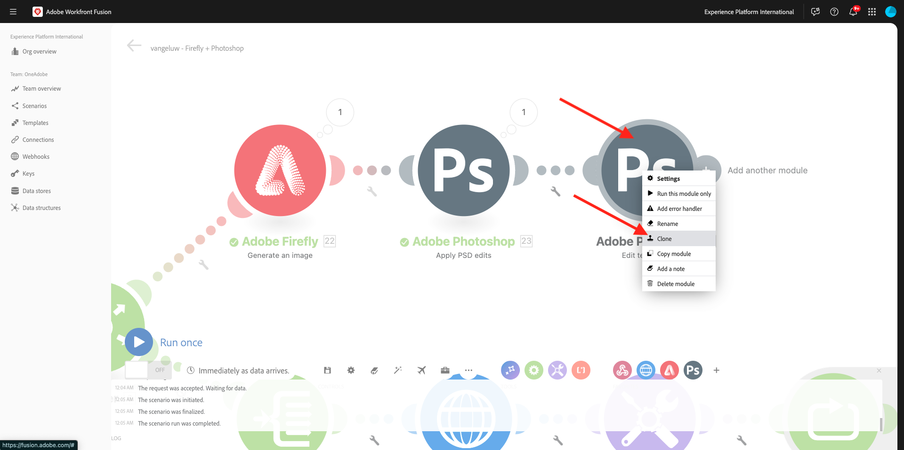
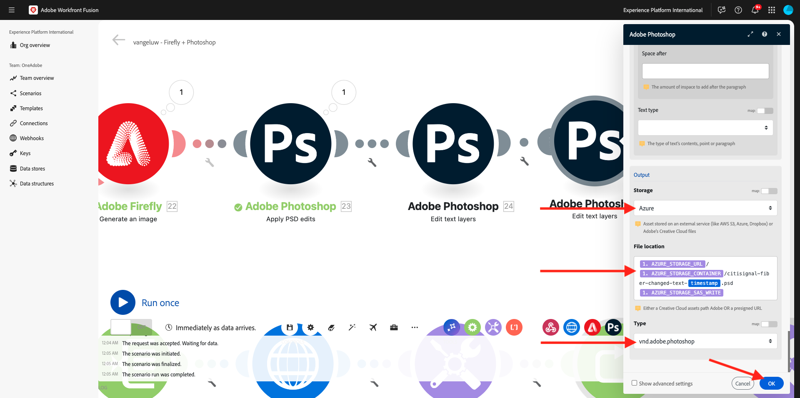

# 1.2.4 Automatisering med kontakter

Du kommer nu att börja använda de färdiga anslutningarna i Workfront Fusion för Photoshop och du kopplar ihop Firefly Text-2-Image-begäran och Photoshop-förfrågningarna till ett enda scenario.

## 1.2.4.1 Duplicera och förbered ditt scenario

Gå till **Scenarier** på den vänstra menyn och markera mappen `--aepUserLdap--`. Du bör sedan se scenariot som du skapade tidigare, med namnet `--aepUSerLdap-- - Adobe I/O Authentication`.


Klicka på pilen för att öppna listrutan och välj **Klona**.


Ange **namnet** för det klonade scenariot till `--aepUserLdap-- - Firefly + Photoshop` och välj lämpligt **målteam**. Klicka på **Lägg till** om du vill lägga till en ny webkrok.


Ange **Webkrok-namnet** till `--aepUserLdap-- - Firefly + Photoshop Webhook`. Klicka på **Spara**.


Du borde se det här då. Klicka på **Spara**.


Du borde se det här då. Klicka på noden **Webkrok**.


Klicka på **Kopiera adress till Urklipp** och klicka sedan på **Kontrollera datastrukturen igen**.


Öppna Postman. Lägg till en ny begäran i samma mapp som du använde tidigare.


Kontrollera att följande inställningar används:

- Namn på begäran: `POST - Send Request to Workfront Fusion Webhook Firefly + Photoshop`
- Typ av begäran: `POST`
- Begär URL: klistra in den URL du kopierade från webkroken i ditt Workfront Fusion Scenario.

Gå till **Body** och ställ in **Body Type** på **raw** - **JSON**. Klistra in följande nyttolast i **Body**.

```json
{
    "psdTemplate": "citisignal-fiber.psd",
    "xlsFile": "placeholder",
    "prompt":"misty meadows",
    "cta": "Buy this now!",
    "button": "Click here to buy!"
}
```

Denna nya nyttolast säkerställer att all variabelinformation tillhandahålls utanför scenariot i stället för att den hårdkodas i scenariot. I ett företagsscenario måste ett scenario definieras på ett återanvändbart sätt, vilket innebär att ett antal variabler måste anges som indatavariabler i stället för att de ska vara hårdkodade i scenariot.

Du borde ha den här då. Klicka på **Skicka**.


Workfront Fusion-webbkroken väntar fortfarande på indata.


När du har klickat på **Skicka** bör meddelandet ändra tp **har identifierats**. Klicka på **OK**.


## 1.2.4.2 Uppdatera Firefly T2I-nod

Klicka på noden **Firefly T2I**. Du borde se det här då. Frågepanelen i den här begäran har tidigare hårdkodats för **hästar i ett fält**. Du kommer nu att ta bort den hårdkodade texten och ersätta den med ett fält som kommer från webbkroken.


Ta bort texten **hästar i ett fält** och ersätt den med variabeln **prompt** som finns under **Webkroks** -variablerna. Klicka på **OK** om du vill spara ändringarna.


## 1.2.4.2 Ändra bakgrund för PSD-filen

Du kommer nu att uppdatera ditt scenario så att det blir smartare med färdiga anslutningar. Du kommer också att ansluta utdata från Firefly till Photoshop så att bakgrundsbilden av PSD-filen ändras dynamiskt med hjälp av utdata från Firefly Generate Image-åtgärden.

I föregående övning hade du inaktiverat **Firefly T2I**-vägen. Du borde nu ångra det. Klicka på ikonen **stop** för att aktivera vägen igen.


Du kommer då att se att ikonen **stop** försvinner. Klicka sedan på ikonen **skiftnyckel** på den andra vägen mot konfigurationen för föregående övning och välj **Inaktivera flöde**.


Du borde se det här då. Håll sedan markören över **Firefly T2I**-noden och klicka på ikonen **+** .


Ange `Photoshop` på sökmenyn och klicka sedan på åtgärden **Adobe Photoshop** .


Välj **Använd PSD-redigeringar**.


Du borde se det här då. Klicka på **Lägg till** för att lägga till en ny anslutning till Adobe Photoshop.


Konfigurera anslutningen enligt följande:

- Anslutningstyp: välj **Adobe Photoshop (Server-till-server)**
- Anslutningsnamn: ange `--aepUserLdap-- - Adobe IO`
- Klient-ID: klistra in klient-ID
- Klienthemlighet: klistra in din klienthemlighet

Klicka på **Fortsätt**.


Om du vill hitta ditt **klient-ID** och **klienthemlighet** går du till [https://developer.adobe.com/console/home](https://developer.adobe.com/console/home){target="_blank"} och öppnar ditt Adobe I/O-projekt, som har namnet `--aepUserLdap-- One Adobe tutorial`. Gå till **OAuth Server-to-Server** för att hitta ditt klient-ID och din klienthemlighet. Kopiera dessa värden och klistra in dem i anslutningsinställningarna i Workfront Fusion.


När du har klickat på **Fortsätt** visas ett popup-fönster under tiden som dina autentiseringsuppgifter verifieras. När du är klar, borde du se det här.


Nu måste du ange filplatsen för den PSD-fil som du vill att Fusion ska arbeta med. För **Lagring** väljer du **Azure** och för **Filplats** anger du `{{1.AZURE_STORAGE_URL}}/{{1.AZURE_STORAGE_CONTAINER}}/{{1.AZURE_STORAGE_SAS_READ}}`. Placera markören bredvid den andra `/`. Titta sedan på de tillgängliga variablerna och bläddra nedåt för att hitta variabeln **psdTemplate**. Klicka på variabeln **psdTemplate** för att markera den.


Du borde se det här då.


Bläddra ända ned till **Lager**. Klicka på **Lägg till objekt**.


Du borde se det här då. Nu måste du ange namnet på det lager i Photoshop PSD-mallen som används för filens bakgrund.


I filen **citisign-fiber.psd** hittar du det lager som användes för bakgrunden. I det här exemplet heter det lagret **2048x2048-background**.


Klistra in namnet **2048x2048-background** i dialogrutan Workfront Fusion.


Bläddra nedåt tills du ser **indata**. Nu måste du definiera vad som ska infogas i bakgrundslagret. I det här fallet måste du välja utdata för Firefly T2I-objektet, som innehåller den dynamiskt genererade bilden.

För **Lagring** väljer du **Extern**. Sök efter och hitta variabeln `data.outputs[].image.url` från utdata för **Firefly T2I** -begäran för **filplatsen**.


Bläddra sedan nedåt tills du ser **Redigera**. Ange **Redigera** till **Ja** och ange **Typ** till **Lager**. Klicka på **Lägg till**.


Du borde se det här då. Därefter måste du definiera åtgärdens utdata. Klicka på **Lägg till objekt** under **utdata**.


Välj **Azure** för **Lagring**, klistra in `{{1.AZURE_STORAGE_URL}}/{{1.AZURE_STORAGE_CONTAINER}}/citisignal-fiber-replacedbg.psd{{1.AZURE_STORAGE_SAS_WRITE}}` under **Filplats** och välj **vnd.adobe.photoshop** under **Typ**. Klicka för att aktivera **Visa avancerade inställningar**.


Under **Avancerade inställningar** väljer du **Ja** om du vill skriva över filer med samma namn.
Klicka på **Lägg till**.


Du borde ha den här då. Klicka på **OK**.


## 1.2.4.3 Ändra textlager i PSD-filen

### Text för uppmaning

Håll sedan pekaren över noden **Adobe Photoshop - Tillämpa PSD-redigeringar** och klicka på ikonen **+** .


Välj **Adobe Photoshop**.


Välj **Redigera textlager**.


Du borde se det här då. Välj först din tidigare konfigurerade Adobe Photoshop-anslutning, som ska heta `--aepUserLdap-- Adobe IO`.

Du måste nu definiera platsen för **indatafilen**, som är utdata från föregående steg och under **Lager**, måste du ange **namnet** för textlagret som du vill ändra.


För **indatafilen** väljer du **Azure** för **indatafilens lagringsutrymme** och ser till att du väljer utdata från den tidigare begäran, **Adobe Photoshop - Tillämpa PSD-redigeringar**, som du kan hämta här: `data[]._links.renditions[].href`


Öppna filen **citisign-fiber.psd**. I filen kommer du att märka att lagret som innehåller anropet till åtgärd har namnet **2048x2048-cta**.


Ange namnet **2048x2048-cta** under **Namn** i dialogrutan.


Bläddra nedåt tills du ser **Text** > **Innehåll**. Välj variabeln **cta** från Webkroks nyttolast.


Bläddra nedåt tills du ser **Utdata**. För **Lagring** väljer du **Azure**. Ange platsen nedan för **filplatsen**. Observera att variabeln `{{timestamp}}` har lagts till i filnamnet, som används för att säkerställa att alla filer som genereras har ett unikt namn. Ange även **Type** som **vnd.adobe.photoshop**. Klicka på **OK**.

`{{1.AZURE_STORAGE_URL}}/{{1.AZURE_STORAGE_CONTAINER}}/citisignal-fiber-changed-text-{{timestamp}}.psd{{1.AZURE_STORAGE_SAS_WRITE}}`


### Knapptext

Högerklicka på noden som du just skapade och välj **Klona**. Detta skapar ett andra liknande objekt.



Du borde se det här då. Välj först din tidigare konfigurerade Adobe Photoshop-anslutning, som ska heta `--aepUserLdap-- Adobe IO`.

Du måste nu definiera platsen för **indatafilen**, som är utdata från föregående steg och under **Lager**, måste du ange **namnet** för textlagret som du vill ändra.


För **indatafilen** väljer du **Azure** för **indatafilens lagringsutrymme** och ser till att du väljer utdata från den tidigare begäran, **Adobe Photoshop - Redigera textlager**, som du kan ta här: `data[]._links.renditions[].href`

Öppna filen **citisign-fiber.psd**. I filen kommer du att märka att lagret som innehåller anropet till åtgärd har namnet **2048x2048-button-text**.


Ange namnet **2048x2048-cta** under **Namn** i dialogrutan.


Bläddra nedåt tills du ser **Text** > **Innehåll**. Välj variabeln **cta** från Webkroks nyttolast.


Bläddra nedåt tills du ser **Utdata**. För **Lagring** väljer du **Azure**. Ange platsen nedan för **filplatsen**. Observera att variabeln `{{timestamp}}` har lagts till i filnamnet, som används för att säkerställa att alla filer som genereras har ett unikt namn. Ange även **Type** som **vnd.adobe.photoshop**. Klicka på **OK**.

`{{1.AZURE_STORAGE_URL}}/{{1.AZURE_STORAGE_CONTAINER}}/citisignal-fiber-changed-text-{{timestamp}}.psd{{1.AZURE_STORAGE_SAS_WRITE}}`



Klicka på **Spara** för att spara ändringarna.


## 1.2.4.4 Webkrok-svar

När du har tillämpat dessa ändringar i din Photoshop-fil måste du nu konfigurera ett **Webkrok-svar** som skickas tillbaka till det program som aktiverat det här scenariot.

Håll pekaren över noden **Adobe Photoshop - Redigera textlager** och klicka på ikonen **+** .


Sök efter **webkrok** och välj **Webkrok**.


Välj **Webkrok-svar**.


Du borde se det här då. Klistra in nyttolasten nedan i **Body**.

```json
{
    "newPsdTemplate": ""
}
```


Välj sökvägen `data[]._links.renditions[].href` från utdata från föregående begäran. Aktivera kryssrutan för **Visa avancerade inställningar** och klicka sedan på **Lägg till objekt**.


Ange `Content-Type` i fältet **Nyckel**. Ange `application/json` i fältet **Värde**. Klicka på **Spara**.


Du borde ha den här då. Klicka på **OK**.


Klicka på **Autojustera**.


Du borde se det här då. Klicka på **Kör en gång**.


Gå tillbaka till Postman och klicka på **Skicka**. Uppmaningen som används här är **mister-metadata**.


Scenariot aktiveras sedan och efter en stund visas ett svar i Postman som innehåller URL:en för den nyligen skapade PSD-filen.


Som en påminnelse: när scenariot har körts i Workfront Fusion kan du visa information om varje nod genom att klicka på bubblan ovanför varje nod.


Med Azure Storage Explorer kan du sedan hitta och öppna den nya PSD-filen genom att dubbelklicka på den i Azure Storage Explorer.


Filen bör sedan se ut så här, med bakgrunden som ersätts av en bakgrund med **mister-metadata**.


Om du kör ditt scenario en gång till och sedan skickar en ny begäran från Postman via en annan uppmaning, kommer du att se hur enkelt och återanvändbart ditt scenario har blivit. I det här exemplet används den nya uppmaningen **solöde**.


Några minuter senare har en ny PSD-fil skapats med en ny bakgrund.


## Nästa steg

Gå till [Sammanfattning och fördelar med Firefly Services Automation](./summary.md){target="_blank"}

Gå tillbaka till [Automatisera Adobe Firefly-tjänster](./automation.md){target="_blank"}

Gå tillbaka till [Alla moduler](./../../../overview.md){target="_blank"}
