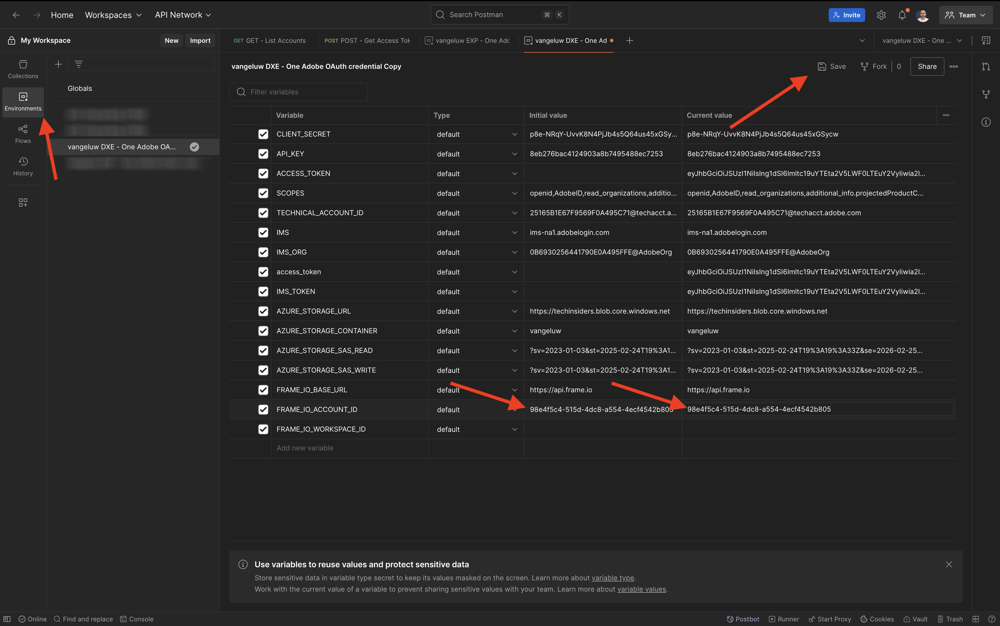
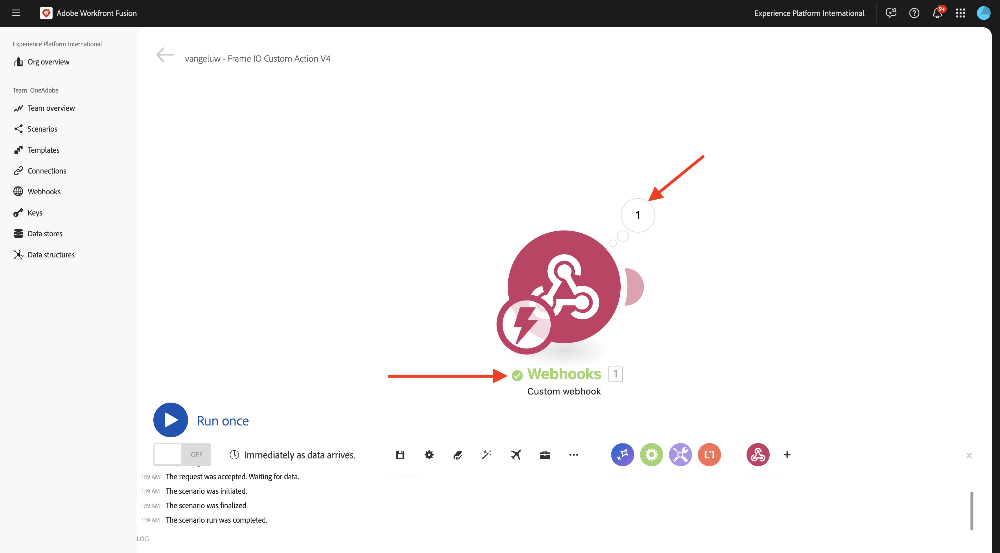
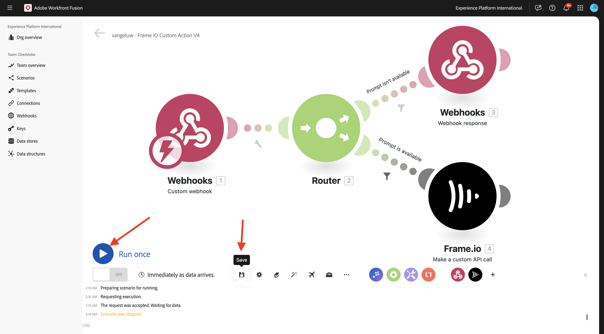

# 1.2.5 Frame.io och Workfront Fusion

I den föregående övningen konfigurerade du scenariot `--aepUserLdap-- - Firefly + Photoshop` och konfigurerade en inkommande webkrok för att utlösa scenariot och ett webkrossvar när scenariot slutfördes. Sedan använde du Postman för att utlösa det scenariot. Postman är ett bra verktyg för testning, men i ett verkligt affärsscenario skulle företagsanvändare inte använda Postman för att utlösa ett scenario. De använder istället ett annat program och förväntar sig att ett annat program ska aktivera ett scenario i Workfront Fusion. I den här övningen är det precis vad du kommer att göra med Frame.io.

>[!NOTE]
>
>Den här övningen skapades för Frame.io V4. Vissa av funktionerna nedan som används i övningen är för närvarande alfabetiska och är inte allmänt tillgängliga än.

## Förutsättningar för 1.2.5.1

Innan du fortsätter med den här övningen måste du ha slutfört installationen av [ditt Adobe I/O-projekt](./../../../modules/getting-started/gettingstarted/ex6.md), inklusive att lägga till **Frame.io-API:t** i ditt Adobe I/O-projekt, och du måste också ha konfigurerat ett program för interaktion med API:er som [Postman](./../../../modules/getting-started/gettingstarted/ex7.md) eller [PostBuster](./../../../modules/getting-started/gettingstarted/ex8.md).

## 1.2.5.2 använder Frame.io

Gå till [https://next.frame.io/](https://next.frame.io/){target="_blank"}.


Kontrollera vilken instans du är inloggad på genom att klicka på instansikonen. Välj den instans som du har fått åtkomst till, som ska vara `--aepImsOrgName--`.

Klicka på det **+ nya projektet** för att skapa ett eget projekt i Frame.io.


Välj mallen **Tom** och ange sedan namnet `--aepUserLdap--` för projektet. Klicka på **Skapa nytt projekt**.


Sedan visas ditt projekt i den vänstra menyn. Klicka på ikonen **+** och välj sedan **Ny mapp**.


Ange namnet `CitiSignal Fiber Campaign` och dubbelklicka sedan på mappen för att öppna den.


Klicka på **Överför**.


I en av de tidigare övningarna laddade du ned [citisign-fiber.psd](./../../../assets/ff/citisignal-fiber.psd){target="_blank"}. Markera filen och klicka på **Öppna**.


Filen **citisign-fiber.psd** kommer sedan att vara tillgänglig i den mapp som du nyss skapade.


## 1.2.5.3 Workfront Fusion och Frame.io

I den föregående övningen skapade du scenariot `--aepUserLdap-- - Firefly + Photoshop`, som började med en anpassad webkrok och som slutade med ett webkrossvar. Användningen av webbhookar testades sedan med Postman, men självklart ska poängen med ett sådant scenario anropas av ett externt program. Som tidigare nämnts är Frame.io den övningen, men mellan Frame.io och `--aepUserLdap-- - Firefly + Photoshop` behövs ett annat Workfront Fusion-scenario. du kommer nu att konfigurera det scenariot.

Gå till [https://experience.adobe.com/](https://experience.adobe.com/){target="_blank"}. Öppna **Workfront Fusion**.


Gå till **Scenarier** på den vänstra menyn och markera mappen `--aepUserLdap--`. Klicka på **Skapa ett nytt scenario**.


Använd namnet `--aepUserLdap-- - Frame IO Custom Action V4`.


Klicka på **frågeteckenobjektet** på arbetsytan. Ange texten `webhook` i sökrutan och klicka på **Webhooks**.


Klicka på **Anpassad webkrok**.


Klicka på **Lägg till** för att skapa en ny webkrok-URL.


Använd `--aepUserLdap-- - Frame IO Custom Action Webhook` för **Webkrok-namnet**. Klicka på **Spara**.


Du borde se det här då. Lämna den här skärmen öppen och orörd så som du behöver den i nästa steg. Du måste kopiera webboks-URL:en i ett nästa steg genom att klicka på **Kopiera adress till Urklipp**.


## 1.2.5.4 API för anpassade åtgärder för Frame.io V4

Gå till Postman och öppna begäran **POST - Get Access Token** i samlingen **Adobe IO - OAuth**. Verifiera fältet **scope** under **Params**. Fältet **scope** ska innehålla scope `frame.s2s.all`. Om den saknas, lägg till den. Klicka sedan på **Skicka** för att begära en ny **access_token**.


Öppna sedan begäran **GET - Visa konton** i samlingen **Frame.io V4 - Tech Insiders**. Klicka på **Skicka**.


Du bör då se ett liknande svar som innehåller ett eller flera konton. Granska svaret och leta upp fältet **id** för det Frame.io V4-konto som du använder. Du hittar namnet på kontot i gränssnittet Frame.io V4:


Kopiera värdet för fältet **id**.


Gå till **Miljö** på den vänstra menyn och välj den miljö du använder. Hitta variabeln **`FRAME_IO_ACCOUNT_ID`** och klistra in **id** som du fick från föregående begäran i både kolumnen **Startvärde** och kolumnen **Aktuellt värde**. Klicka på **Spara**.



Gå tillbaka till **Samlingar** på den vänstra menyn. Öppna begäran **GET - Visa arbetsytor** i samlingen **Frame.io V4 - Tech Insiders**. Klicka på **Skicka**.


Du bör då se ett liknande svar som innehåller ett eller flera konton. Granska svaret och leta upp fältet **id** för den Frame.io V4 Workspace som du använder. Kopiera värdet för fältet **id**.


Gå till **Miljö** på den vänstra menyn och välj den miljö du använder. Hitta variabeln **`FRAME_IO_WORKSPACE_ID`** och klistra in **id** som du fick från föregående begäran i både kolumnen **Startvärde** och kolumnen **Aktuellt värde**. Klicka på **Spara**.


Gå tillbaka till **Samlingar** på den vänstra menyn. Öppna begäran **POST - Skapa anpassad åtgärd** i samlingen **Frame.io V4 - Tech Insiders** i mappen **Anpassade åtgärder**.

Gå till **brödtexten** för begäran. Ändra fältet **name** till `--aepUserLdap--  - Frame.io Custom Action V4` och ändra sedan fältet **url** till värdet för den webkrok-URL som du kopierade från Workfront Fusion.

Klicka på **Skicka**.


Den anpassade åtgärden Frame.io V4 har skapats.


Gå tillbaka till [https://next.frame.io/](https://next.frame.io/){target="_blank"} och gå till mappen **CitiSignal Fibre Campaign** som du skapade i ditt projekt `--aepUserLdap--`. Uppdatera sidan.


När du har uppdaterat sidan klickar du på de tre punkterna **..** på resursen **citisign-fiber.psd** och öppnar menyn **Anpassade åtgärder** . Du bör sedan se den anpassade åtgärd som du skapade tidigare visas på den meny som visas. Klicka på den anpassade åtgärden `--aepUserLdap-- - Frame IO Custom Action Fusion V4`.


Du bör sedan se en liknande popup-meny för **Anpassad åtgärd** . Detta popup-fönster är resultatet av kommunikationen mellan Frame.io och Workfront Fusion.


Ändra tillbaka skärmen till Workfront Fusion. Du bör nu se **Klart fastställt** visas på det anpassade webkrobobjektet. Klicka på **OK**.


Klicka på **Kör en gång** för att aktivera testläget och testa kommunikationen med Frame.io igen.


Gå tillbaka till Frame.io och klicka på den anpassade åtgärden `--aepUserLdap-- - Frame IO Custom Action Fusion V4` igen.


Växla tillbaka till Workfront Fusion. Du bör nu se en grön bockmarkering och en bubbla som visar **1**. Klicka på bubblan för att se informationen.



Detaljerad vy av bubblan visar data som tagits emot från Frame.io. Du bör se olika ID:n. Fältet **resource.id** visar till exempel det unika ID:t i Frame.io för resursen **citisign-fiber.psd**.


Nu när kommunikationen mellan Frame.io och Workfront Fusion har upprättats kan du fortsätta med konfigurationen.

## 1.2.5.5 Tillhandahåller ett anpassat formulärsvar till Frame.io

När den anpassade åtgärden anropas i Frame.io förväntar sig Frame.io att få ett svar från Workfront Fusion. Om du tänker tillbaka till det scenario du skapade i den tidigare övningen behövs ett antal variabler för att uppdatera Photoshop PSD-standardfilen. Variablerna definieras i nyttolasten som du använde:

```json
{
    "psdTemplate": "citisignal-fiber.psd",
    "xlsFile": "placeholder",
    "prompt":"misty meadows",
    "cta": "Buy this now!",
    "button": "Click here to buy!"
}
```

För att scenariot `--aepUserLdap-- - Firefly + Photoshop` ska kunna köras krävs fält som **prompt**, **cta**, **button** och **psdTemplate**.

De första tre fälten, **prompt**, **cta**, **button**, kräver användarindata som måste samlas in i Frame.io när användaren anropar den anpassade åtgärden. Det första som behöver göras i Workfront Fusion är alltså att kontrollera om variablerna är tillgängliga eller inte och i annat fall bör Workfront Fusion svara Frame.io och begära att variablerna ska anges. Det gör man genom att använda ett formulär i Frame.io.

Gå tillbaka till Workfront Fusion och öppna ditt scenario `--aepUserLdap-- - Frame IO Custom Action`. Håll pekaren över det **anpassade webkrokobjektet** och klicka på ikonen **+** för att lägga till en annan modul.


Sök efter `Flow Control` och klicka på **Flödeskontroll**.


Klicka för att välja **Router**.


Du borde se det här då.


Klicka på **?** objekt och klicka sedan för att välja **Webhooks**.


Välj **Webkrok-svar**.


Du borde se det här då.


Kopiera JSON-koden nedan och klistra in den i fältet **Brödtext**.


```json
{
  "title": "What do you want Firefly to generate?",
  "description": "Enter your Firefly prompt.",
  "fields": [
    {
      "type": "text",
      "label": "Prompt",
      "name": "Prompt",
      "value": ""
    },
    {
      "type": "text",
      "label": "CTA Text",
      "name": "CTA Text",
      "value": ""
    },
    {
      "type": "text",
      "label": "Button Text",
      "name": "Button Text",
      "value": ""
    }
  ]
}
```

Klicka på ikonen för att rensa upp och förfina JSON-koden. Klicka sedan på **OK**.


Klicka på **Spara** för att spara ändringarna.


Därefter måste du konfigurera ett filter för att se till att den här sökvägen för scenariot bara körs när ingen fråga är tillgänglig. Klicka på ikonen **skiftnyckel** och välj sedan **Konfigurera ett filter**.


Konfigurera följande fält:

- **Etikett**: använd `Prompt isn't available`.
- **Villkor**: använd `{{1.data.Prompt}}`.
- **Grundläggande operatorer**: välj **Finns inte**.

>[!NOTE]
>
>Variabler i Workfront Fusion kan anges manuellt med följande syntax: `{{1.data.Prompt}}`. Talet i variabeln refererar till modulen i scenariot. I det här exemplet ser du att den första modulen i scenariot kallas **Webhooks** och har sekvensnumret **1**. Det innebär att variabeln `{{1.data.Prompt}}` kommer åt fältet **data.Prompt** från modulen med sekvensnummer 1. Sekvensnummer kan ibland vara olika, så var uppmärksam när du kopierar/klistrar in sådana variabler och kontrollera alltid att det sekvensnummer som används är det rätta.

Klicka på **OK**.


Du borde se det här då. Klicka först på ikonen **Spara** och sedan på **Kör en gång** för att testa ditt scenario.


Du borde se det här då.


Gå tillbaka till Frame.io och klicka på den anpassade åtgärden `--aepUserLdap-- - Frame IO Custom Action Fusion` för resursen **citisign-fiber.psd** igen.


Nu bör du se en uppmaning i Frame.io. Fyll inte i fälten än och skicka inte formuläret än. Den här uppmaningen visas baserat på svaret från Workfront Fusion som du precis konfigurerat.


Växla tillbaka till Workfront Fusion och klicka på bubblan i modulen **Webkrok-svar** . Du kommer att se att under **INPUT** visas brödtexten som innehåller JSON-nyttolasten för formuläret. Klicka på **Kör en gång** igen.


Du borde se det här igen.


Gå tillbaka till Frame.io och fyll i fälten enligt indikationen.

- **Fråga**: Futuristiska laserstrålar som körs genom rymden
- **CTA**: Tidsresa nu!
- **Knapptext**: Sätt dig ombord!

Klicka på **Skicka**.


Du bör då se en popup i Frame.io som ser ut så här.


Växla tillbaka till Workfront Fusion och klicka på bubblan i modulen **Anpassad webkrok** . I åtgärd 1, under **OUTPUT**, kan du nu se ett nytt **data** -objekt som innehåller fält som **knapptext**, **CTA-text** och **Fråga**. När de här användarindatavariablerna är tillgängliga i ditt scenario har du tillräckligt många funktioner för att fortsätta konfigurationen.


## 1.2.5.6 Hämta filplats från Frame.io

Som tidigare nämnts behövs fält som **prompt**, **cta**, **button** och **psdTemplate** för att det här scenariot ska fungera. De första tre fälten är nu redan tillgängliga, men **psdTemplate** som ska användas saknas fortfarande. **psdTemplate** refererar nu till en Frame.io-plats eftersom filen **citisign-fiber.psd** finns i Frame.io. För att kunna hämta platsen för filen måste du konfigurera och använda anslutningen Frame.io i Workfront Fusion.

Gå tillbaka till Workfront Fusion och öppna ditt scenario `--aepUserLdap-- - Frame IO Custom Action V4`. Hovra över **?**-modulen klickar du på ikonen **+** för att lägga till en annan modul och söka efter `frame`. Klicka på **Frame.io**.


Klicka på **Frame.io**.


Klicka på **Gör ett anpassat API-anrop**.


För att kunna använda Frame.io-anslutningen måste du först konfigurera den. Klicka på **Lägg till** för att göra det.


Välj **anslutningstypen** **IMS-server till server** och ange namnet `--aepUserLdap-- - Adobe I/O - Frame.io S2S`.


Därefter måste du ange **klient-ID** och **klienthemlighet** för det Adobe I/O-projekt som du konfigurerade som en del av modulen **Komma igång**. Du hittar **klient-ID** och **Klienthemlighet** för ditt Adobe I/O-projekt [här](https://developer.adobe.com/console/projects.){target="_blank"}.


Gå tillbaka till ditt scenario i Workfront Fusion. Klistra in värdena för **klient-ID** och **klienthemlighet** i respektive fält i fönstret för anslutningsinställningar. Klicka på **Fortsätt**. Din anslutning kommer nu att testas av Workfront Fusion.


Om anslutningen har testats visas den automatiskt under **Anslutning**. Du har nu en lyckad anslutning och du måste slutföra konfigurationen för att hämta all resursinformation från Frame.io, inklusive filplatsen. Du måste använda **resurs-ID** för att göra detta.


Fältet **Resurs-ID** delas av Frame.io till Workfront Fusion som en del av den inledande **anpassade webkrockkommunikationen** och finns under fältet **resource.id**.

Använd URL:en `/v4/accounts/{{1.account_id}}/files/{{1.resource.id}}` för konfigurationen av modulen **Frame.io - gör ett anpassat API-anrop**.

>[!NOTE]
>
>Variabler i Workfront Fusion kan anges manuellt med följande syntax: `{{1.account_id}}` och `{{1.resource.id}}`. Talet i variabeln refererar till modulen i scenariot. I det här exemplet ser du att den första modulen i scenariot kallas **Webhooks** och har sekvensnumret **1**. Det innebär att variablerna `{{1.account_id}}` och `{{1.resource.id}}` kommer åt fältet från modulen med sekvensnummer 1. Sekvensnummer kan ibland vara olika, så var uppmärksam när du kopierar/klistrar in sådana variabler och kontrollera alltid att det sekvensnummer som används är det rätta.

Klicka sedan på **+ Lägg till objekt** under **Frågesträng**.


Ange dessa värden och klicka på **Lägg till**.

| Nyckel | Värde |
|:-------------:| :---------------:| 
| `include` | `media_links.original` |


Du borde ha den här nu. Klicka på **OK**.


Därefter måste du konfigurera ett filter för att se till att den här sökvägen för scenariot bara körs när ingen fråga är tillgänglig. Klicka på ikonen **skiftnyckel** och välj sedan **Konfigurera ett filter**.


Konfigurera följande fält:

- **Etikett**: använd `Prompt is available`.
- **Villkor**: använd `{{1.data.Prompt}}`.
- **Grundläggande operatorer**: välj **Exists**.

>[!NOTE]
>
>Variabler i Workfront Fusion kan anges manuellt med följande syntax: `{{1.data.Prompt}}`. Talet i variabeln refererar till modulen i scenariot. I det här exemplet ser du att den första modulen i scenariot kallas **Webhooks** och har sekvensnumret **1**. Det innebär att variabeln `{{1.data.Prompt}}` kommer åt fältet **data.Prompt** från modulen med sekvensnummer 1. Sekvensnummer kan ibland vara olika, så var uppmärksam när du kopierar/klistrar in sådana variabler och kontrollera alltid att det sekvensnummer som används är det rätta.

Klicka på **OK**.


Du borde se det här nu. Spara ändringarna och klicka sedan på **Kör en gång** för att testa ditt scenario.



Gå tillbaka till Frame.io och klicka på den anpassade åtgärden `--aepUserLdap-- - Frame IO Custom Action Fusion V4` för resursen **citisign-fiber.psd** igen.


Nu bör du se en uppmaning i Frame.io. Fyll inte i fälten än och skicka inte formuläret än. Den här uppmaningen visas baserat på svaret från Workfront Fusion som du precis konfigurerat.


Byt tillbaka till Workfront Fusion. Klicka på **Kör en gång** igen.


Gå tillbaka till Frame.io och fyll i fälten enligt indikationen. Klicka på **Skicka**.

- **Fråga**: Futuristiska laserstrålar som körs genom rymden
- **CTA**: Tidsresa nu!
- **Knapptext**: Sätt dig ombord!


Växla tillbaka till Workfront Fusion och klicka på bubblan i **Frame.io - Gör ett anpassat API-anrop** .


Under **UTPUT** > **Brödtext** > **data** kan du nu se många metadata om den specifika resursen **citisign-fiber.psd**.


Den specifika information som behövs för det här användningsfallet är platsen för filen **citisign-fiber.psd** som du hittar genom att bläddra nedåt till fältet **media_links** > **Original** > **download_url**.


Du har nu all information (**prompt**, **cta**, **button** och **psdTemplate**) tillgänglig som behövs för att det här användningsfallet ska fungera.

## 1.2.5.7 Anropa Workfront-scenario

I föregående övning konfigurerade du scenariot `--aepUserLdap-- - Firefly + Photoshop`. Nu behöver du göra en mindre ändring i det scenariot.

Öppna scenariot `--aepUserLdap-- - Firefly + Photoshop` på en annan flik och klicka på den första modulen **Adobe Photoshop - Tillämpa PSD-redigeringar** . Du bör nu se att indatafilen är konfigurerad att använda en dynamisk plats i Microsoft Azure. Eftersom indatafilen inte längre lagras i Microsoft Azure, utan i stället används Frame.io-lagring, måste du ändra de här inställningarna.


Ändra **Lagring** till **Extern** och ändra **Filplats** så att endast variabeln **psdTemplate** som hämtas från den inkommande **anpassade webkrockmodulen** används. Klicka på **OK** och sedan på **Spara** för att spara ändringarna.


Klicka på modulen **Anpassad webkrok** och sedan på **Kopiera adress till Urklipp**. Du måste kopiera URL:en som du behöver för att kunna använda den i det andra scenariot.


Gå tillbaka till ditt scenario `--aepUserLdap-- - Frame IO Custom Action V4`. Hovra över **Frame.io - Gör ett anpassat API-anrop** och klicka på ikonen **+** .


Ange `http` och klicka sedan på **HTTP**.


Välj **Gör en förfrågan**.


Klistra in URL:en för den anpassade webkroken i fältet **URL**. Ange **Metod** till **POST**.


Ange **Brödtyp** till **Raw** och **Innehållstyp** till **JSON (program/json)**.
Klistra in nedanstående JSON-nyttolast i fältet **Begär innehåll** och aktivera kryssrutan för **Analysera svar**.

```json
{
    "psdTemplate": "citisignal-fiber.psd",
    "xlsFile": "placeholder",
    "prompt":"misty meadows",
    "cta": "Buy this now!",
    "button": "Click here to buy!"
}
```

Du har nu konfigurerat en statisk nyttolast, men den måste bli dynamisk med de tidigare insamlade variablerna.


Ersätt den statiska variabeln **citisign-fiber.psd** med variabeln **`Body > data > media_links > original > download_url`** för fältet **psdTemplate**.


Ersätt de statiska variablerna för fälten **prompt**, **cta** och **button** med de dynamiska variabler som infogades i scenariot med den inkommande webkrok-begäran från Frame.io, som är fälten **data.Prompt**, **data.CTA Text** och **data.Button Text**.

Aktivera även kryssrutan för **Analysera svar**.

Klicka på **OK**.


Klicka på **Spara** för att spara ändringarna.


## 1.2.5.8 Spara ny resurs i Frame.io

När det andra Workfront Fusion-scenariot har anropats blir resultatet en ny Photoshop PSD-mall som är tillgänglig. Den PSD-filen måste sparas tillbaka i Frame.io, som är det sista steget i det här scenariot.

Hovra över **HTTP - Gör en begäran**-modul och klicka på ikonen **+** .


Välj **Frame.io**.


Välj **Anpassa API-anrop**.


Din Frame.io-anslutning väljs automatiskt.


Använd URL:en `/v4/accounts/{{1.account_id}}/folders/{{4.body.data.parent_id}}/files/remote_upload` för konfigurationen av modulen **Frame.io - gör ett anpassat API-anrop**.

>[!NOTE]
>
>Som tidigare nämnts kan variabler i Workfront Fusion anges manuellt med följande syntax: `{{1.account_id}}` och `{{4.body.data.parent_id}}`. Talet i variabeln refererar till modulen i scenariot.
>>I det här exemplet ser du att den första modulen i scenariot kallas **Webhooks** och har sekvensnumret **1**. Det innebär att variabeln `{{1.account_id}}` kommer åt det fältet från modulen med sekvensnummer 1.
>>I det här exemplet ser du att den fjärde modulen i scenariot kallas **Frame.io - gör ett anpassat API-anrop** och har sekvensnumret **4**. Det innebär att variabeln `{{4.body.data.parent_id}}` kommer åt det fältet från modulen med sekvensnummer 4.
>>Om serienumren för modulerna är olika måste du uppdatera variablerna i ovanstående URL för att kunna länkas till rätt modul.


Ändra fältet **Metod** till **POST**.

Kopiera och klistra in nedanstående JSON-kodfragment i fältet **Body**.

```json
{
  "data": {
    "name": "citisignal-fiber-{{timestamp}}.psd",
    "source_url": "{{6.data.newPsdTemplate}}"
  }
}
```

>[!NOTE]
>
>Variabler i Workfront Fusion kan anges manuellt med följande syntax: `{{6.data.newPsdTemplate}}`. Talet i variabeln refererar till modulen i scenariot. I det här exemplet ser du att den sjätte modulen i scenariot kallas **HTTP - Gör en begäran** och har sekvensnumret ****. Det innebär att variabeln `{{6.data.newPsdTemplate}}` kommer åt fältet **data.newPsdTemplate** från modulen med sekvensnummer 6.
>>Om modulens sekvensnummer är olika måste du uppdatera variabeln i ovanstående URL för att kunna länkas till rätt modul.

Klicka på **OK**.


Klicka på **Spara** för att spara ändringarna.


## 1.2.5.9 Testa ditt fall av användning från början till slut

Klicka på **Kör en gång** i ditt scenario `--aepUserLdap-- - Frame IO Custom Action`.


Gå tillbaka till Frame.io och klicka på den anpassade åtgärden `--aepUserLdap-- - Frame IO Custom Action Fusion V4` för resursen **citisign-fiber.psd** igen.


Nu bör du se en uppmaning i Frame.io. Fyll inte i fälten än och skicka inte formuläret än. Den här uppmaningen visas baserat på svaret från Workfront Fusion som du precis konfigurerat.


Byt tillbaka till Workfront Fusion. Klicka på **Kör en gång** i ditt scenario `--aepUserLdap-- - Frame IO Custom Action V4`.


Öppna scenariot `--aepUserLdap-- - Firefly + Photoshop` i Workfront Fusion och klicka även på **Kör en gång** i det scenariot.


Gå tillbaka till Frame.io och fyll i fälten enligt indikationen. Klicka på **Skicka**.

- **Fråga**: Futuristiska laserstrålar som körs genom rymden
- **CTA**: Tidsresa nu!
- **Knapptext**: Sätt dig ombord!


Efter 1-2 minuter visas en ny resurs automatiskt i Frame.io. Dubbelklicka på den nya resursen för att öppna den.


Nu ser du tydligt att alla användarindatavariabler har tillämpats automatiskt.


Du har nu slutfört den här övningen.

## Nästa steg

Gå till [1.2.6 Frame.io och Fusion till AEM Assets](./ex6.md){target="_blank"}

Gå tillbaka till [Creative Workflow Automation med Workfront Fusion](./automation.md){target="_blank"}

Gå tillbaka till [Alla moduler](./../../../overview.md){target="_blank"}

