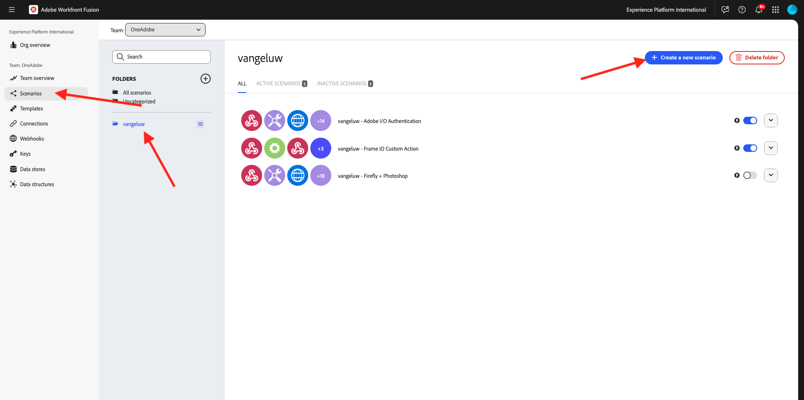
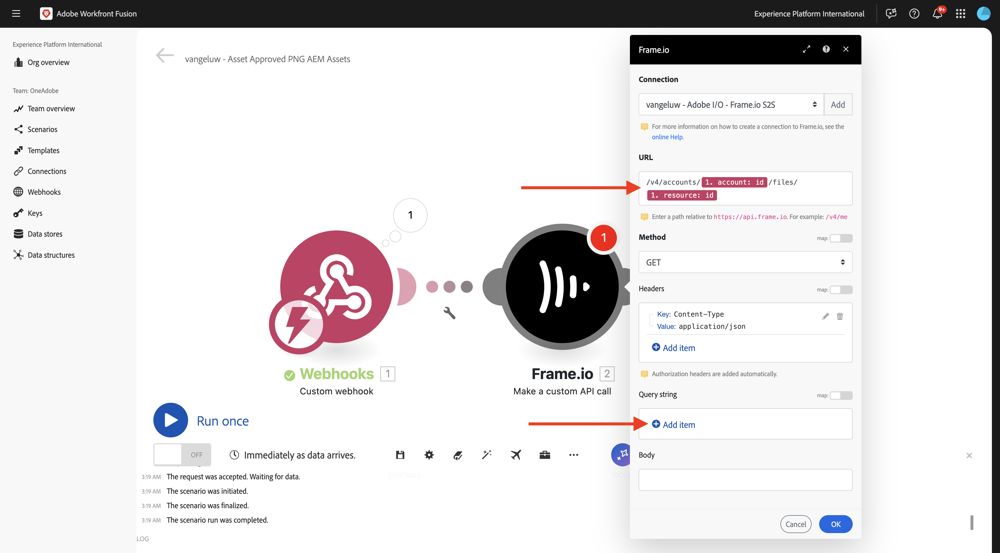
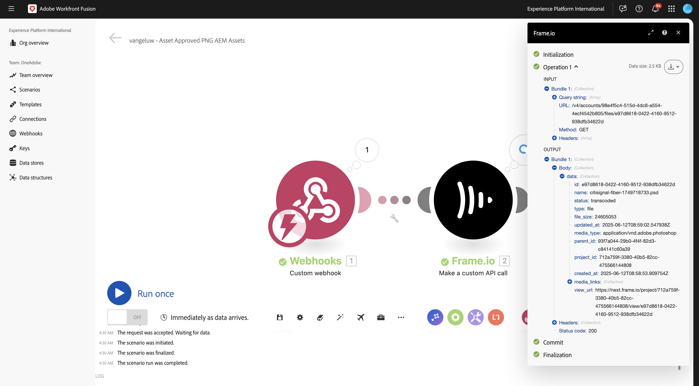
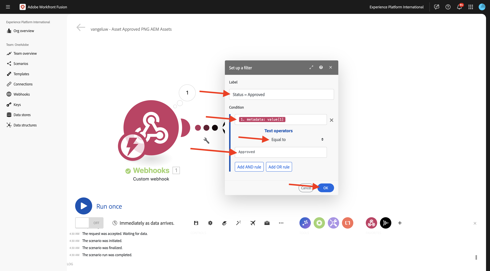
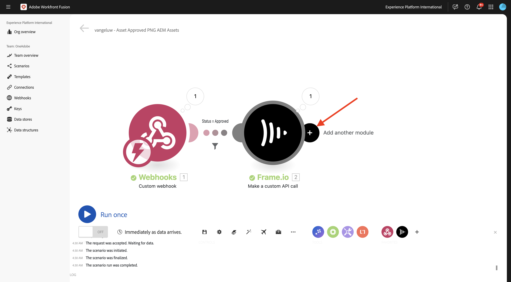

# 1.2.4 Bildruta I/O till Workfront Fusion till AEM Assets

>[!IMPORTANT]
>
>För att slutföra den här övningen måste du ha tillgång till en fungerande AEM Assets CS-redigeringsmiljö. Om du följer övning [Adobe Experience Manager Cloud Service &amp; Edge Delivery Services](./../../../modules/asset-mgmt/module2.1/aemcs.md){target="_blank"} har du tillgång till en sådan miljö.

>[!IMPORTANT]
>
>Om du tidigare har konfigurerat ett AEM Assets CS-program med en redigeringsmiljö kan det bero på att din AEM CS-sandlåda har tagits i viloläge. Eftersom det tar 10-15 minuter att dölja en sådan sandlåda, är det en bra idé att börja denavigeringsprocessen nu så att du inte fastnar vid ett senare tillfälle.

I föregående övning konfigurerade du ett scenario som automatiskt genererar varianter av en Adobe Photoshop PSD-fil med Adobe Firefly, Photoshop API:er och Workfront Fusion. Resultatet av det scenariot var en ny Photoshop PSD-fil.

Affärsteamen behöver dock inte ha någon PSD-fil, de behöver en PNG-fil eller en JPG-fil. I den här övningen ska du konfigurera en ny automatisering som resulterar i att en PNG-fil genereras när resursen i bildruta-I/O har godkänts och att PNG-filen lagras i AEM Assets automatiskt.

## 1.2.4.1 Skapa ett nytt scenario

Gå till [https://experience.adobe.com/](https://experience.adobe.com/){target="_blank"}. Öppna **Workfront Fusion**.

Gå till **Scenarier** på den vänstra menyn och markera mappen `--aepUserLdap--`. Klicka på **Skapa ett nytt scenario**.

Använd namnet `--aepUserLdap-- - Asset Approved PNG AEM Assets`. Klicka sedan på **?**, ange söktermen `webhook` och klicka sedan på **Webbhooks**.

Klicka på **Anpassad webkrok**.

Klicka på **Lägg till** om du vill skapa en ny webkrok.

Använd namnet `--aepUserLdap-- - Frame.io Webhook`. Klicka på **Spara**.

Du borde se det här då. Klicka på **Kopiera adress till Urklipp**.

## 1.2.4.2 Konfigurera webkrok i Frame.io

Gå till Postman och öppna begäran **POST - Get Access Token** i samlingen **Adobe IO - OAuth**. Klicka sedan på **Skicka** för att begära en ny **access_token**.

Gå tillbaka till **Samlingar** på den vänstra menyn. Öppna förfrågan **POST - Create Webkroks** i samlingen **Frame.io V4 - Tech Insiders** i mappen **Webhooks**.

Gå till **brödtexten** för begäran. Ändra fältet **name** till `--aepUserLdap--  - Fusion to AEM Assets` och ändra sedan fältet **url** till värdet för den webkrok-URL som du kopierade från Workfront Fusion.

Klicka på **Skicka**.

Den anpassade åtgärden Frame.io V4 har skapats.

Gå till [https://next.frame.io/project](https://next.frame.io/project){target="_blank"} och gå till det projekt som du skapade tidigare, som bör ha namnet `--aepUserLdap--` och öppna mappen **CitiSignal Fibre Campaign**. Du bör nu se resurserna som skapades i den föregående övningen.

Klicka på fältet **Status** och ändra statusen till **Pågår**.

Byt tillbaka till Workfront Fusion. Du bör nu se att anslutningen **har identifierats**.

Klicka på **Spara** för att spara ändringarna och klicka sedan på **Kör en gång** för att göra ett snabbtest.

Växla tillbaka till Frame.io och klicka på fältet **Pågår** och ändra statusen till **Behöver granskas**.

Växla tillbaka till Workfront Fusion och klicka på bubblan i modulen **Anpassad webkrok** .

Detaljerad vy av bubblan visar data som tagits emot från Frame.io. Du bör se olika ID:n. Fältet **resource.id** visar till exempel det unika ID:t i Frame.io för resursen **citisign-fiber.psd**.

## 1.2.4.3 Hämta resursinformation från Frame.io

Nu när kommunikationen mellan Frame.io och Workfront Fusion har upprättats via en anpassad webkrok bör du få mer information om resursen som statusetiketten uppdaterades för. För att göra detta använder du återigen kontakten Frame.io i Workfront Fusion, som i föregående övning.

Håll pekaren över det **anpassade webkrokobjektet** och klicka på ikonen **+** för att lägga till en annan modul.

Ange söktermen `frame`. Klicka på **Frame.io**.

Klicka på **Frame.io**.

Klicka på **Gör ett anpassat API-anrop**.

Kontrollera att anslutningen är inställd på samma anslutning som du skapade i den tidigare övningen, som bör ha namnet `--aepUserLdap-- - Adobe I/O - Frame.io S2S`.

Använd URL:en **för konfigurationen av modulen** Frame.io - gör ett anpassat API-anrop`/v4/accounts/{{1.account.id}}/files/{{1.resource.id}}`.

>[!NOTE]
>
>Variabler i Workfront Fusion kan anges manuellt med följande syntax: `{{1.account.id}}` och `{{1.resource.id}}`. Talet i variabeln refererar till modulen i scenariot. I det här exemplet ser du att den första modulen i scenariot kallas **Webhooks** och har sekvensnumret **1**. Det innebär att variablerna `{{1.account.id}}` och `{{1.resource.id}}` kommer åt fältet från modulen med sekvensnummer 1. Sekvensnummer kan ibland vara olika, så var uppmärksam när du kopierar/klistrar in sådana variabler och kontrollera alltid att det sekvensnummer som används är det rätta.

Klicka sedan på **+ Lägg till objekt** under **Frågesträng**.

Ange dessa värden och klicka på **Lägg till**.

| Nyckel | Värde |
|:-------------:| :---------------:| 
| `include` | `media_links.original` |

Du borde ha den här nu. Klicka på **OK**.

Klicka på **Spara** för att spara ändringarna och klicka sedan på **Kör en gång** för att testa konfigurationen.

Växla tillbaka till Frame.io och ändra status till **Pågår**.

Gå tillbaka till Workfront Fusion och klicka på bubblan i **Frame.io - Gör ett anpassat API-anrop** . Du bör då se en liknande översikt.

Därefter bör du konfigurera ett filter så att bara en PNG-fil återges för resurser som har statusen **Godkänd**. Det gör du genom att klicka på ikonen **Förnya** mellan modulerna **Anpassad webkrok** och **Frame.io - Gör ett anpassat API-anrop** och sedan välja **Konfigurera ett filter** .

Konfigurera följande fält:

- **Etikett**: använd `Status = Approved`.
- **Villkor**: `{{1.metadata.value[]}}`.
- **Grundläggande operatorer**: välj **Lika med**.
- **Värde**: `Approved`.

Klicka på **OK**.

Du borde ha den här då. Klicka på **Spara** för att spara ändringarna.

## 1.2.4.4 Konvertera till PNG

Hovra över modulen **Frame.io - Gör ett anpassat API-anrop** och klicka på ikonen **+** .

Ange söktermen `photoshop` och klicka sedan på **Adobe Photoshop**.

Klicka på **Konvertera bildformat**.

Kontrollera att fältet **Connection** använder din tidigare skapade anslutning, som har namnet `--aepUserLdap-- - Adobe IO`.

Under **Indata** ställer du in fältet **Lagring** till **Extern** och ställer in **Filplats** till att använda variabeln **Original** som returneras av modulen **Frame.io - gör ett anpassat API-anrop**.

Klicka sedan på **Lägg till objekt** under **Utdata**.

För konfigurationen **Utdata** anger du **Lagring** till **Fusion internal storage** och **Type** till **image/png**. Klicka på **Lägg till**.

Klicka på **OK**.

Klicka på **Spara** för att spara ändringarna och klicka sedan på **Kör en gång** för att testa konfigurationen.

Växla tillbaka till Frame.io och klicka på fältet **Pågår** och ändra statusen till **Godkänd**.

Gå tillbaka till Workfront Fusion. Nu bör du se att alla moduler i ditt scenario har körts korrekt. Klicka på bubblan i modulen **Adobe Photoshop - Konvertera bildformat** .

I informationen om körningen av modulen **Adobe Photoshop - Konvertera bildformat** kan du se att en PNG-fil nu har genererats. Nästa steg är att sedan lagra filen i AEM Assets CS.

## 1.2.4.5 Lagra PNG i AEM Assets CS

Håll pekaren över modulen **Adobe Photoshop - Konvertera bildformat** och klicka på ikonen **+** .

Ange söktermen `aem` och välj **AEM Assets**.

Klicka på **Överför en resurs**.

Nu måste du konfigurera anslutningen till AEM Assets CS. Klicka på **Lägg till**.

Använd följande inställningar:

- **Anslutningstyp**: **AEM Assets as a Cloud Service**.
- **Anslutningsnamn**: `--aepUserLdap-- AEM Assets CS`.
- **Instans-URL**: kopiera instans-URL:en för AEM Assets CS-redigeringsmiljön, som ska se ut så här: `https://author-pXXXXX-eXXXXXXX.adobeaemcloud.com`.
- **Fyllningsalternativ för åtkomstinformation**: välj **Tillhandahåll JSON**.

Du måste nu ange autentiseringsuppgifterna för **det tekniska kontot i JSON-format**. För att göra detta finns det ett antal steg som du måste utföra när du använder AEM Cloud Manager. Låt skärmen vara öppen medan du gör det.

Gå till [https://my.cloudmanager.adobe.com](https://my.cloudmanager.adobe.com){target="_blank"}. Organisationen som du bör välja är `--aepImsOrgName--`. Då ser du något sådant här. Klicka för att öppna programmet, som bör ha namnet `--aepUserLdap-- - Citi Signal`.

Klicka på de tre punkterna **..** och välj **Developer Console**.

Klicka på **Logga in med Adobe**.

Gå till **Verktyg** > **Integreringar**.

Klicka på **Skapa nytt tekniskt konto**.

Då borde du se något sådant här. Öppna det nya tekniska kontot. Klicka på de tre punkterna **..** och välj sedan **Visa**.

Du bör då se en liknande nyttolast för token för tekniskt konto. Kopiera den fullständiga JSON-nyttolasten till Urklipp.

Gå tillbaka till Workfront Fusion och klistra in den fullständiga JSON-nyttolasten i fältet **för det tekniska kontot i JSON-format**. Klicka på **Fortsätt**.

Anslutningen valideras sedan och när den lyckas väljs anslutningen automatiskt i AEM Assets-modulen. Nästa steg är att konfigurera en mapp. Som en del av övningen bör du skapa en ny dedikerad mapp.

Om du vill skapa en ny dedikerad mapp går du till [https://experience.adobe.com](https://experience.adobe.com/){target="_blank"}. Kontrollera att rätt Experience Cloud-instans är markerad, som ska vara `--aepImsOrgName--`. Klicka sedan på **Experience Manager Assets**.

Klicka på **Markera** i din AEM Assets CS-miljö, som bör ha namnet `--aepUserLdap-- - Citi Signal dev`.

Gå till **Resurser** och klicka på **Skapa mapp**.

Ange namnet `--aepUserLdap-- - CitiSignal Fiber Campaign` och klicka på **Skapa**.

Mappen skapas sedan.

Gå tillbaka till Workfront Fusion, välj **Klicka här för att välja mapp** och välj sedan mappen `--aepUserLdap-- - CitiSignal Fiber Campaign`.

Kontrollera att målet är inställt på `--aepUserLdap-- - CitiSignal Fiber Campaign`. Välj sedan **Karta** under **Source-fil**.

Välj variabeln **under** Filnamn`{{3.filenames[1]}}`.

Välj variabeln **under** Data`{{3.files[1]}}`.

>[!NOTE]
>
>Variabler i Workfront Fusion kan anges manuellt med följande syntax: `{{3.filenames[1]}}`. Talet i variabeln refererar till modulen i scenariot. I det här exemplet ser du att den tredje modulen i scenariot heter **Adobe Photoshop - Konvertera bildformat** och har sekvensnumret **3**. Det innebär att variabeln `{{3.filenames[1]}}` kommer åt fältet **filnamn[]** från modulen med sekvensnummer 3. Sekvensnummer kan ibland vara olika, så var uppmärksam när du kopierar/klistrar in sådana variabler och kontrollera alltid att det sekvensnummer som används är det rätta.

Klicka på **OK**.

Klicka på **Spara** för att spara ändringarna.

Därefter måste du ange specifika behörigheter för det tekniska konto som du nyss skapade. När kontot skapades i **Developer Console** i **Cloud Manager** fick det **läsbehörighet**, men i det här fallet krävs **skrivbehörighet**. Det gör du genom att gå till AEM CS Author.

Gå till [https://my.cloudmanager.adobe.com](https://my.cloudmanager.adobe.com){target="_blank"}. Organisationen som du bör välja är `--aepImsOrgName--`. Klicka för att öppna programmet, som bör ha namnet `--aepUserLdap-- - Citi Signal`. Då ser du något sådant här. Klicka på författarens URL.

Klicka på **Logga in med Adobe**.

Gå till **Inställningar** > **Säkerhet** > **Användare**.

Klicka för att öppna användarkontot för det tekniska kontot.

Gå till **Grupper** och lägg till den här tekniska kontoanvändaren i gruppen **DAM-Users**.

Klicka på **Spara och stäng**.

Gå tillbaka till Workfront Fusion. Klicka på **Kör en gång** för att testa ditt scenario.

Växla tillbaka till Frame.io och se till att resursens status ändras till **Godkänd** igen.

>[!NOTE]
>
>Du kan behöva ändra den först till **Pågår** eller **Behöver granskas** för att sedan ändra tillbaka den till **Godkänd**.

Ditt Workfront Fusion-scenario aktiveras sedan och slutförs. Genom att visa informationen i bubblan i modulen **AEM Assets** kan du redan se att PNG-filen sparades korrekt i AEM Assets CS.

Gå tillbaka till AEM Assets CS och öppna mappen `--aepUserLdap-- - Frame.io PNG`. Nu bör du se PNG-filen som skapades som en del av Workfront Fusion-scenariot. Dubbelklicka på filen för att öppna den.

Nu kan du se mer information om metadata för PNG-filen som genererades.

Du har nu slutfört den här övningen.

## Nästa steg

Gå till [Sammanfattning och fördelar med Creative Workflow Automation med Workfront Fusion](./summary.md){target="_blank"}

Gå tillbaka till [Creative Workflow Automation med Workfront Fusion](./automation.md){target="_blank"}

Gå tillbaka till [Alla moduler](./../../../overview.md){target="_blank"}
1.2.4