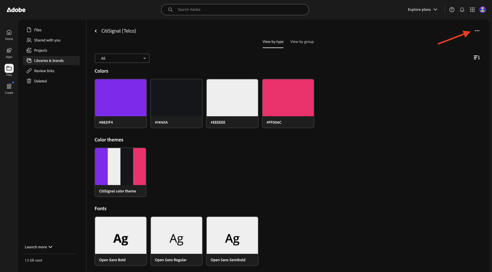
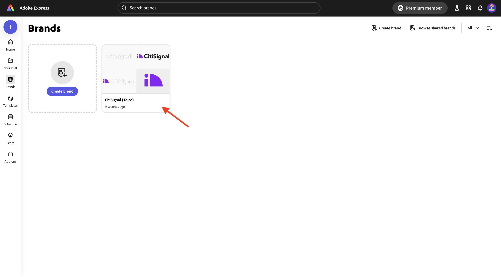
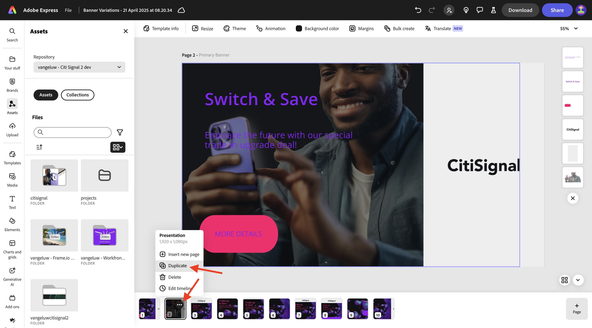
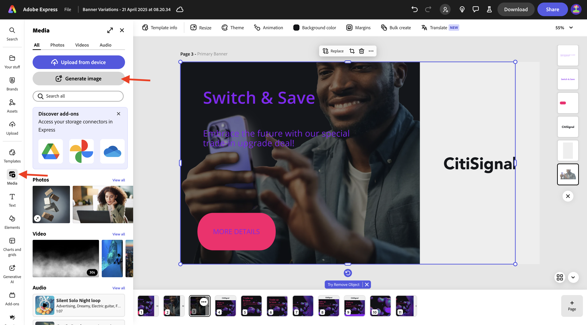
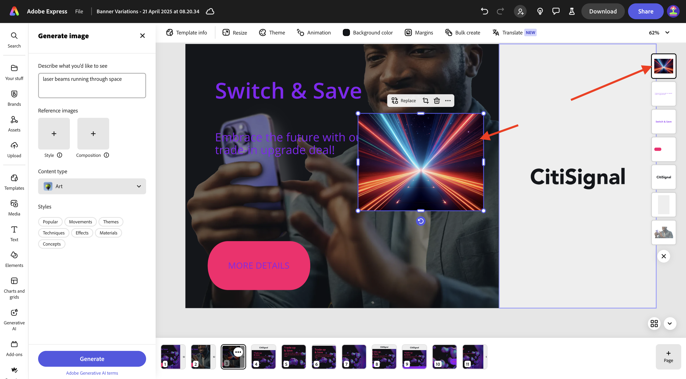
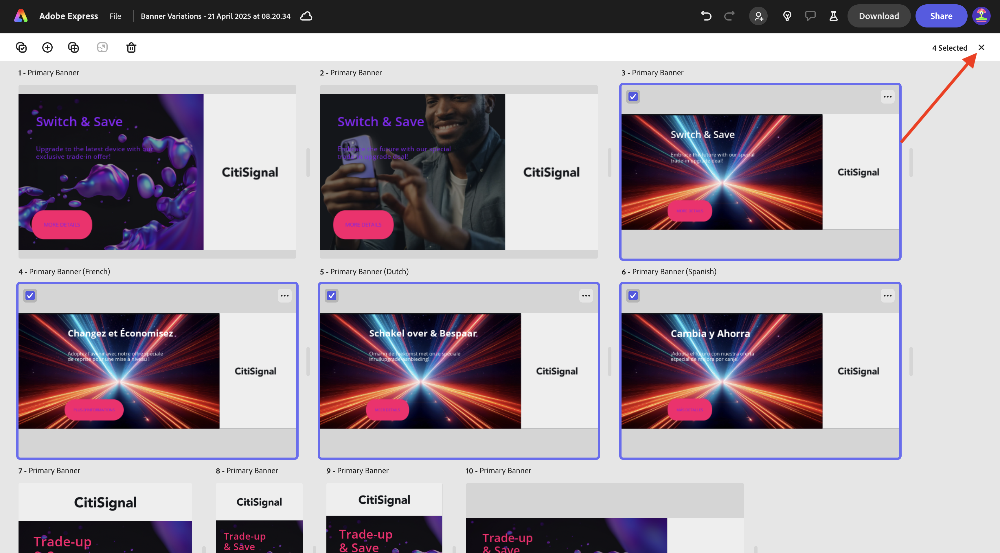

# 1.3.1 Komma igång med Adobe Express

## 1.3.1.1 loggar in på Adobe Express

Öppna ett nytt webbläsarfönster i InDesign och gå till [https://www.adobe.com/home](https://www.adobe.com/home){target="_blank"}. Logga in med ditt **företags- eller skolkonto** och välj sedan kontot **`--aepImsOrgName--`**.

Adobe Express är tillgängligt som en del av organisationens licenser. För att vara säker på att du har tillgång till Adobe Express måste du kontrollera att du är inloggad i rätt organisation. Det gör du genom att klicka på ikonen **profile** och verifiera vilket konto som är aktivt. Kontot som du ska använda har namnet `--aepImsOrgName--`.

Klicka på **Byt profil** om du vill ändra konto.

Välj rätt konto på menyn, i det här fallet **Experience Platform International** (men det kan vara en annan organisation för dig).

När rätt konto är aktivt går du till **Appar** och klickar på **Kom igång** på **Adobe Express**-kortet.

Du är nu inloggad på **Adobe Express**.

## 1.3.1.2 Kom igång från en varumärkesmall

Gå till **Varumärken** i Adobe Express. Ditt varumärkesmallbibliotek är antagligen tomt just nu. CitiSignal har definierat en varumärkesmall tidigare och du bör nu återanvända den befintliga mallen.

Gå till [https://www.adobe.com/files/link/1c2f92cf-17bc-4d11-6031-dbd251e6cb57](https://www.adobe.com/files/link/1c2f92cf-17bc-4d11-6031-dbd251e6cb57) om du vill göra det.

Du borde se det här då. Klicka på de tre punkterna **..**.

Välj **Skapa en kopia**.

Efter ungefär en minut visas ett meddelande som bekräftar att du har gjort en personlig kopia av varumärkesmallen.

Gå tillbaka till Adobe Express, till **Varumärken** och uppdatera sidan. Du bör nu se varumärkesmallen **CitiSignal (Telco)**. Klicka för att öppna varumärkesmallen **CitiSignal (Telco)**.

Du bör då se ett bibliotek med resurser som logotyper, teckensnitt, färger, mallar osv.

Gå till **Express Templates** och klicka för att öppna mallen **Banner Variations**.

Klicka på **Starta en ny fil**.

Du borde se det här då.

Klicka i textrutan **Växla och spara**. Välj sedan **Skriv om** och välj en stil. Klicka sedan på **Generera**.

Välj en variation och klicka på **Ersätt**.

Du bör då se den uppdaterade texten.

Klicka sedan på texten **MER INFORMATION**.

Välj **Effekter**.

Gå till **Form** och klicka på **Visa alla**.

Klicka på knappen **finetune**. Ändra **formstorleken** och klicka sedan på färgknappen.

Ändra färgen genom att välja en annan färg från **CitiSignal-färgtemat**.

Du bör då se den ändrade knappen.

Gå sedan till **Varumärken** och klicka på **Använd varumärke**. Du bör då se hur bilden ser ut.

Observera att du även kan ange detaljerade inställningar för **Använd märke** genom att klicka på ikonen **kugghjulet** .

Klicka sedan på de tre punkterna **..** på bilden som du arbetar med och klicka sedan på **Duplicera**.

Du bör då se en ny, identisk bild. Klicka på bakgrundslagret till höger på skärmen.

>[!IMPORTANT]
>
>För att slutföra den här övningen måste du ha tillgång till en fungerande AEM Assets CS-redigeringsmiljö. Om du följer övning [Adobe Experience Manager Cloud Service &amp; Edge Delivery Services](./../../../modules/asset-mgmt/module2.1/aemcs.md){target="_blank"} har du tillgång till en sådan miljö.

Gå till **Assets** på den vänstra menyn och välj din AEM Assets CS-databas som ska ha namnet `--aepUserLdap-- - CitiSignal dev`. Gå sedan till mappen **citisign**.

Välj bilden **homepage-hero-1.png**. Du bör då se ändringen av bakgrundslagret.

Markera textrutan som du har angett och klicka på **Skriv om**. Välj **Refras** och välj sedan ett specifikt format. Klicka på **Generera**.

Markera en variant och klicka på **Ersätt**.

Du borde se det här då. Klicka sedan på de tre punkterna **..** på sidan längst ned på sidan och klicka på **Duplicera**.

På den nyligen skapade bilden går du till **media** och klickar på **Generera bild**.

Välj **Liggande (4:3)**.

Skriv frågan `laser beams running through space` och klicka på **Generera**.

Du bör då se en bild som genererats av Adobe Firefly. Observera att lagret som bilden skapades i ligger längst upp.

Flytta ned den nya bilden och placera den precis ovanför det föregående bakgrundslagret.

Ta bort det gamla bakgrundslagret genom att klicka på det och välja **Ta bort**.

Justera bilden så att den täcker hela arbetsytan.

Markera textrutan **Byt och spara** om du vill ändra teckenfärgen till **vit**.

Ändra teckenfärgen till **vit**.

Markera den andra textrutan om du även vill ändra teckenfärgen till **vit**.

Ändra teckenfärgen till **vit**.

Klicka sedan på **Ändra storlek** och ange en anpassad upplösning på **2600** x **1080**. Kontrollera att kryssrutan för **Expandera bild** är markerad. Klicka på **Ändra storlek**.

Du borde se det här då.

Efter några minuter visas några nya varianter av bilden. Välj ett alternativ och klicka sedan på **Behåll**.

Du borde se det här då.

Flytta och justera bilden så att den fyller ut det tillgängliga utrymmet.

Klicka sedan på **Översätt**.

Välj några språk, till exempel **Franska**, **Nederländska** och **Spanska**. Kontrollera att bara den sida du arbetar med är markerad, som i det här fallet är **Sidan 3**. Klicka på **Översätt**.

Översättningar genereras sedan.

Du bör då se ett antal nya sidor som skapas. Klicka på ikonen **close** .

Verifiera översättningarna och ändra dem vid behov, t.ex. i det här exemplet där översättningen inte är optimal.

Uppdatera texten efter behov.

Dina resurser är nu klara.

## Nästa steg

Gå till [Animering och video i Adobe Express](./ex2.md){target="_blank"}

Gå tillbaka till [Adobe Express och Adobe Experience Cloud](./express.md){target="_blank"}

Gå tillbaka till [Alla moduler](./../../../overview.md){target="_blank"}
