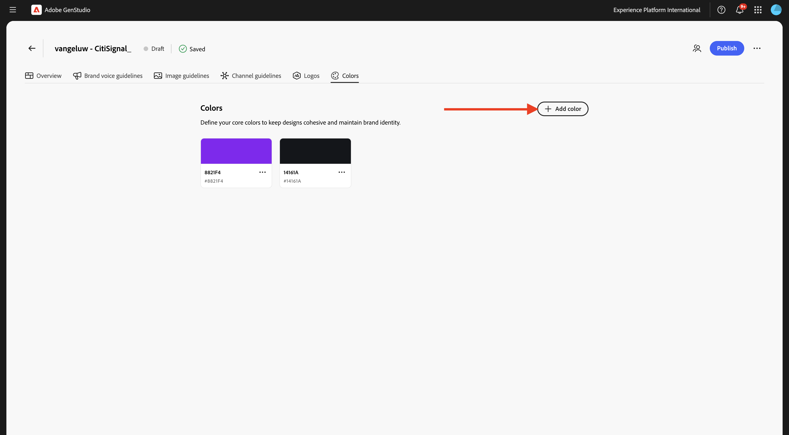
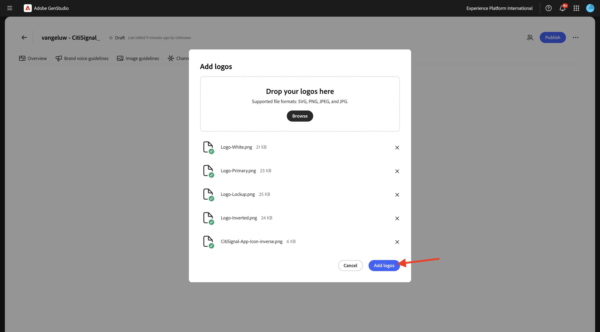

# 1.3.1 Konfiguration: Varumärke

Gå till [https://experience.adobe.com/](https://experience.adobe.com/){target="_blank"}. Öppna **GenStudio**.


Du borde se det här då.


Det första du behöver göra med GenStudio for Performance Marketing är att konfigurera ert varumärke. Klicka på ikonen **Varumärken** .


Klicka på **+ Lägg till varumärke**.


Ange namnet `--aepUserLdap-- - CitiSignal` för ditt varumärke. Välj **Lägg till manuellt** och klicka sedan på **Lägg till varumärke**.


## 1.3.1.1 färger

Du borde se det här då. Klicka på **Färger**.


Klicka på **+ Lägg till färg**.


Det finns fyra olika färger att lägga till:

- `#8821F4`
- `#14161A`
- `#EEEEEE`
- `#FF006C`

Ange hexkoden för färgen `#8821F4`. Klicka på **Lägg till**.


Klicka på **+ Lägg till färg**.


Ange hexkoden för färgen `#14161A`. Klicka på **Lägg till**.


Klicka på **+ Lägg till färg**.



Ange hexkoden för färgen `#EEEEEE `. Klicka på **Lägg till**.


Klicka på **+ Lägg till färg**.


Ange hexkoden för färgen `#FF006C `. Klicka på **Lägg till**.


Du borde ha den här nu.


## 1.3.1.2 logotyper

Hämta filen [CitiSignal-SGPeM-assets.zip](../../../assets/gspem/CitiSignal-GSPeM-assets.zip) till skrivbordet och zippa upp den.


Gå sedan till **Logos**. Klicka på **+ Lägg till logotyp**.


Klicka på **Bläddra**.


Gå till mappen **CitiSignal-GSPeM-assets** > **logotyper** och markera de här filerna. Klicka på **Öppna**.


Du borde ha den här då. Klicka på **Lägg till logotyper**.



Du borde ha den här då.


## 1.3.1.3 Riktlinjer för varumärkesröst

Gå sedan till **Riktlinjer för varumärkesröst**.


Använd följande för **ton och röst**:

```
• Convey a sense of exploration and adventure
• Be authentic and conversational
• Evoke excitement and curiosity
• Speak honestly and straightforwardly
• Be approachable and relatable
• Use everyday language
```


Använd följande för **varumärkesvärden**:

```
• Inspirational
• Sustainability
• Quality
• Durability
• Functionality
• Reliability
• Community-oriented
• Be inclusive and welcome diversity
• Encourage active lifestyles
• Promote discovery
```


Använd följande för **Redaktionella riktlinjer**:

```
• Keep sentences concise and impactful
• Use active voice
• Lists, bullets, and series should be consistent — either they all start with a noun, or they all start with a verb
• Use serial commas
```


Använd följande för **redaktionella begränsningar**:

```
• Avoid activity-specific jargon unless it’s widely adopted
• Avoid promoting the skill level or experience level of the user of our outdoor equipment
• Avoid technical language or jargon
```


## 1.3.1.4 Bildriktlinjer

Gå sedan till **Bildriktlinjer**.


Ange **innehållstypen** till **Art** och använd följande för **Description**:

```
Capture candid, unposed shots of real people and futuristic animals engaging with technology in their daily lives to convey authenticity and relatability.
```


Använd följande för **Disposition**:

```
Focus on the experiences, speed and emotions of using technology, rather than just the products themselves.
```


Använd följande för **Miljö**:

```
Highlight futuristic, clean, and professional settings that reflect innovation and connectivity.
```


Använd följande för **Color**:

```
Use a palette inspired by technology, including sleek metallics, cool purple and blue, and neutral tones.
```


Använd följande för **ljus**:

```
Utilize bright, natural lighting to create a welcoming and dynamic atmosphere.
```


Använd följande för **stämning**:

```
Each image should evoke a feeling of speed, innovation and being part of the future.
```


Använd följande för **begränsningar**:

```
Avoid cluttered or busy backgrounds that detract from the main subject.
```


## Kanalriktlinjer för 1.3.1.4

Gå sedan till **Kanalriktlinjer**.


Använd följande värden för **E-post**:

- **Allmänt**

```
• Use simple, short sentences
• Be clear and concise
• Invoke a sense of adventure and exploration
```

- **Ämnesrad**

```
• Limit to less than 8 words
• Provide specific details about what’s inside the email
• Use sentence case
• Do not use end punctuation
```

- **Förrubrik**

```
• Limit to less than 80 characters
• Provide specific details about what’s inside the email
• Use sentence case
• Use ending punctuation
```

- **Rubrik**

```
• Limit to less than 12 words
• Generate excitement through compelling and exciting statements
• Use sentence case
```

- **Underrubrik**: lämna tomt för tillfället

- **Brödtext**

```
• Limit to less than 120 words
• Use bullet points for lists containing more than 3 items
• Use between 0 to 4 headings within the body to separate main ideas
• Use sentence case
• Use ending punctuation
```

- **Call-to-action (CTA)**

```
• Limit to between 1 to 3 short words
• Limit to less than 20 characters
• Use an action-oriented verb as the first word and intended action the end-user should take
• Avoid ending punctuation
• Use title case
```


Använd följande värden för **Metaannonser**:

- **Allmänt**

```
• Use simple, short sentences
• Be clear and concise
• Invoke a sense of adventure and exploration
• Make product names prominent
• Use community-building concepts and language
```

- **Rubrik**

```
• Limit  to less than 8 words
• Limit to less than 27 characters
• Make it clear what action the reader should take
• Use sentence case
• Avoid ending punctuation
```

- **Brödtext**

```
• Limit to less than 125 characters
• Use sentence case
• Use ending punctuation
```

- **I bildtext**: lämna tomt för tillfället


Använd följande värden för **banner- och Display-annonser**:

- **Allmänt**

```
• Make readers feel inspired, interested, and sure of the next step
• Avoid word repetition
• Make product names prominent
```

- **Rubrik**

```
• Clearly state the main benefit of the offer
• Use sentence case
• Use ending punctuation
• Limit to less than 60 characters
```

- **Underrubrik**: lämna tomt för tillfället

- **Brödtext**

```
• Communicate the benefits of clicking into the offer
• Use sentence case
• Use ending punctuation
```

- **Call-to-action (CTA)**

```
• Limit to between 1 to 3 short words
• Limit to less than 20 characters
• Use an action-oriented verb as the first word
• Use title case
• Avoid ending punctuation
```


Använd följande värden för **LinkedIn**:

- **Allmänt**: lämna tomt för tillfället

- **Rubrik**: lämna tomt för tillfället

- **Beskrivning**: lämna tomt för tillfället

- **Introduktionstext**: lämna tomt för tillfället

- **I bildtext**: lämna tomt för tillfället


Till sist går du till **Översikt**. Nu kan du se en översikt över allt du konfigurerat. Det finns en sista sak att göra. Klicka på **+ Lägg till** under **När du vill använda det här varumärket**.


Ange texten nedan och klicka på **Spara ändringar**.

```
This is the default brand for CitiSignal marketing campaign. Use the CitiSignal brand for all brand and product campaigns that don't require specific guidelines.
```


Klicka på **Publicera**.


Klicka på **Publicera** igen.


Ditt varumärke är nu publicerat och det här varumärket kan nu användas för att skapa varumärkesprofilerat innehåll. Klicka på **Klar**.


## Nästa steg

Gå till [Konfiguration: Personas, Produkter och mallar](./ex2.md){target="_blank"}

Gå tillbaka till [GenStudio for Performance Marketing](./genstudio.md){target="_blank"}

Gå tillbaka till [Alla moduler](./../../../overview.md){target="_blank"}
