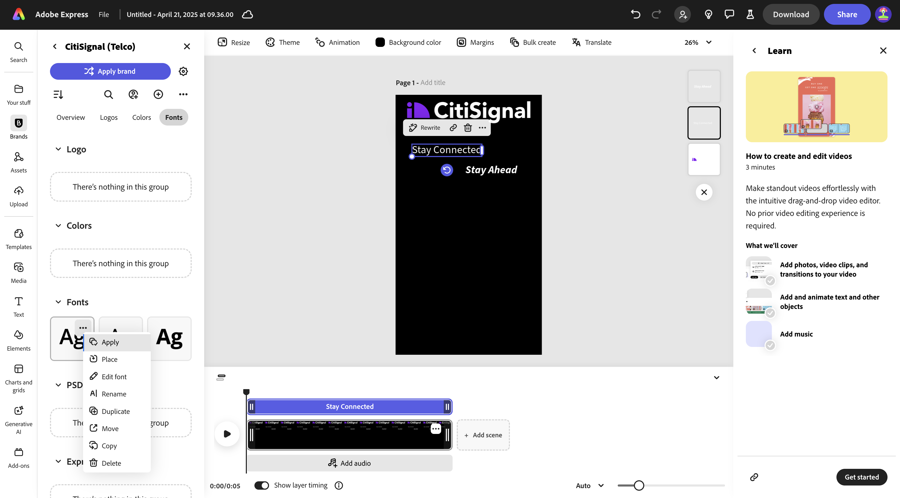
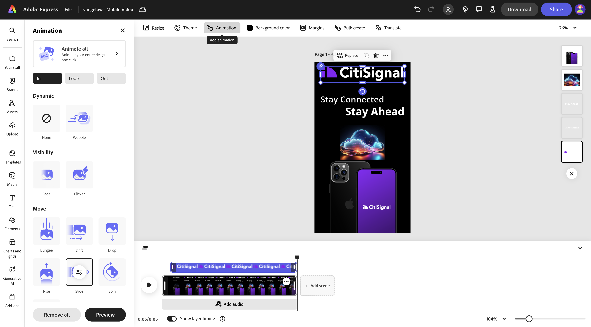
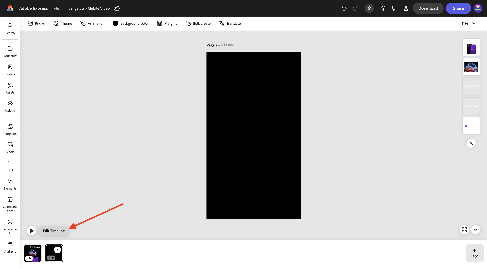
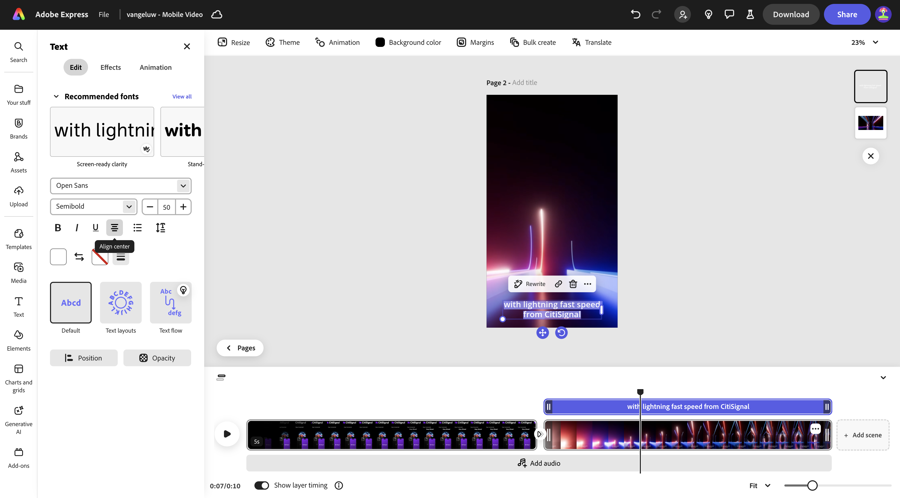
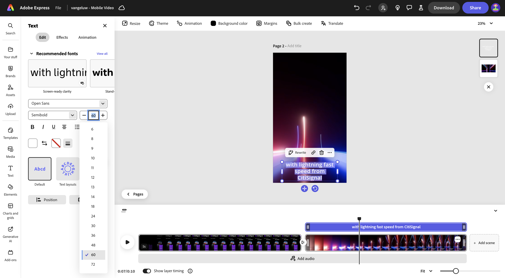
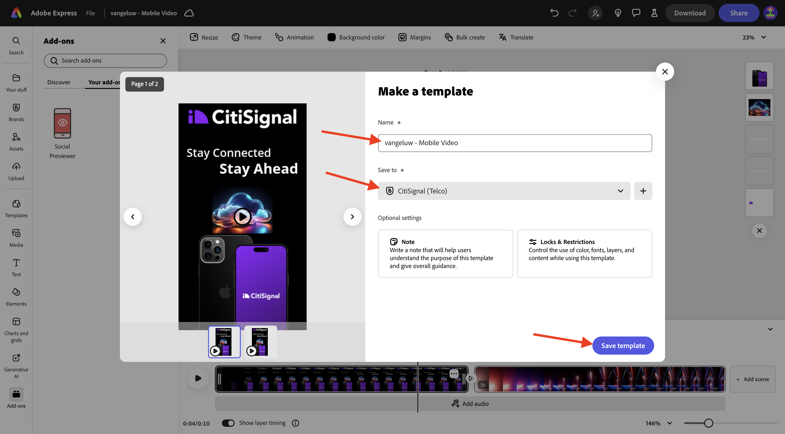

# 1.3.2 Animering och video i Adobe Express

Innan du påbörjar den här övningen hämtar du de nödvändiga resurserna från [https://tech-insiders.s3.us-west-2.amazonaws.com/one-adobe/Adobe_Express.zip](https://tech-insiders.s3.us-west-2.amazonaws.com/one-adobe/Adobe_Express.zip){target="_blank"} och packar upp dem på skrivbordet.

## 1.3.2.1 Skapa en video

Gå till [https://new.express.adobe.com/](https://new.express.adobe.com/){target="_blank"}. Klicka på ikonen **+** för att skapa en ny **bild**.

Gå till **Video** och välj sedan **Mobilvideo**.

Du borde se det här då.

Välj **Bakgrundsfärg** och välj sedan **svart**.

Sedan ska du lägga till logotypen **CitiSignal** . Gå till **Varumärken** och välj den vita CitiSignal-logotypen. Klicka på de tre punkterna **..** och välj **Montera**.

Centrera CitiSignal-logotypen högst upp i bilden.

Gå till **Text** och välj sedan **Lägg till text**.

Ange texten `Stay Connected` och placera textrutan på en liknande plats som i bilden nedan.

Gå till **Text** och välj sedan **Lägg till text**. Ange texten `Stay Ahead`.

Placera textrutan på en liknande plats som i bilden nedan.

Markera den första textrutan med texten **Fortsätt vara ansluten**. Gå till **Varumärken**, till **Teckensnitt**. Klicka på de 3 punkterna **..** i det första teckensnittet och klicka på **Använd**.

Markera den andra textrutan med texten **Ligg steget före**. Gå till **Varumärken**, till **Teckensnitt**. Klicka på de 3 punkterna **..** i det tredje teckensnittet och klicka på **Använd**.

Du borde se det här då. Gå till **Media** och välj **Generera bild**.

Skriv uppmaningen `futuristic looking transparent cloud on a black background` och klicka på **Generera**.

Välj **Liggande (4:3)**.

Du borde se det här då. Välj en av variationerna.

Centrera den genererade bilden. Gå till **Media** och klicka sedan på **Överför från enhet**.

Navigera till din dator till mappen **Adobe_Express** som innehåller de resurser du laddat ned tidigare. Markera filen **CitiSignalPhoneLogo.png** och klicka på **Öppna**.

Du borde se det här då.

Dra bilden nedåt så att den ser ut ungefär som bilden nedan.

Ändra namnet på ditt projekt till `--aepUserLdap-- - Mobile Video`.

Gå till **Animering** och klicka sedan på animeringen **Glide** .

Klicka på ikonen **play** för att testa animeringen.

Markera textrutan **Ligg steget före**.

Justera skjutreglaget för tidslinje för textrutan **Ligg steget före** så att den startar halvvägs.

Välj logotypen **CitiSignal**.

Öppna detaljinställningarna för åtgärden **Bild** och ändra längden till 2,5 s.

Klicka sedan på **Hämta**. Markera **filformatet** **MP4** och ange **videoupplösningen** till **1080p**. Klicka på **Hämta**.

Videofilen genereras och hämtas sedan till datorn. Din första video är nu klar.

## 1.3.2.2 Lägg till i videon

Stäng vyn **Tidslinje**.

Klicka på de 3 punkterna **..** och välj **Duplicera**.

Därefter skapas en ny sida. Klicka på **Redigera tidslinje** för att börja arbeta med den nya sidan.

Klicka på **+ Lägg till scen**.

Du bör då se att en ny scen läggs till.

Navigera till din dator till mappen **Adobe_Express** som innehåller de resurser du laddat ned tidigare. Markera filen **`AdobeStock_648887461_trimmed.mp4`** och klicka på **Öppna**.

Videofilen läggs sedan till i den nya scenen.

Klicka i mitten mellan de två scenerna och välj sedan **Lägg till övergång**.

Klicka på **Tona till svart**.

Ändra **Varaktighet** till 2 sekunder. Klicka gärna på knappen **play** för att testa övergången.

Gå till **Text** och klicka sedan på **Lägg till text**.

Ange texten `with lightning fast speed from CitiSignal`. Centrera texten genom att klicka på **Centrera**.

Ändra teckenstorleken till **60**.

## 1.3.2.3 Använda tillägg i Adobe Express

Gå till **Tillägg** och sök efter tillägget **Social Previewer**.

Klicka på **+ Lägg till** för att lägga till tillägget.

Markera tillägget **Förhandsvisning i sociala medier** och klicka på förhandsvisningsalternativet **Instagram-inlägg** . Nu kan du enkelt förhandsgranska hur ditt inlägg kommer att se ut på de vanligaste plattformarna för sociala medier.

## 1.3.2.4 Skapa en ny mall i Adobe Express

Klicka sedan på knappen **Dela** och välj **Skapa en mall**.

Använd namnet `--aepUserLdap-- - Mobile Video`, markera varumärket **CitiSignal (Telco)** och klicka sedan på **Spara mall**.

Din videomall sparas nu i din varumärkesmall.

## 1.3.2.5 Spara videon i AEM Assets CS

Klicka på **Dela** igen och välj sedan **Spara i molnet**. Välj **AEM Assets**.

Markera den **aktuella sidan**. Använd namnet `--aepUserLdap-- - Mobile Video` och klicka sedan på **Välj mapp**.

Markera mappen **`--aepUserLdap-- - Frame.io PNG`** och klicka på **Välj**.

Klicka på **Överför 1 resurs**.

Gå till [https://experience.adobe.com/](https://experience.adobe.com/){target="_blank"} och klicka på **Experience Manager Assets**.

Välj din AEM Assets CS-miljö, som ska få namnet `--aepUserLdap-- - Citi Signal dev`.

Gå till mappen **`--aepUserLdap-- - Frame.io PNG`** i **Assets**. Dubbelklicka på resursen **`--aepUserLdap-- - Mobile Video`** för att öppna den.

Din video som skapades i Adobe Express finns nu i Adobe Experience Manager Assets.

## Nästa steg

Gå till [Skapa Assets gruppvis i Adobe Express](./ex3.md){target="_blank"}

Gå tillbaka till [Adobe Express och Adobe Experience Cloud](./express.md){target="_blank"}

Gå tillbaka till [Alla moduler](./../../../overview.md){target="_blank"}
