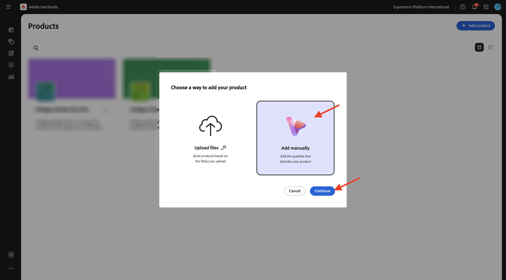
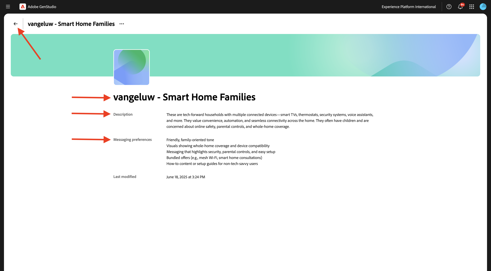
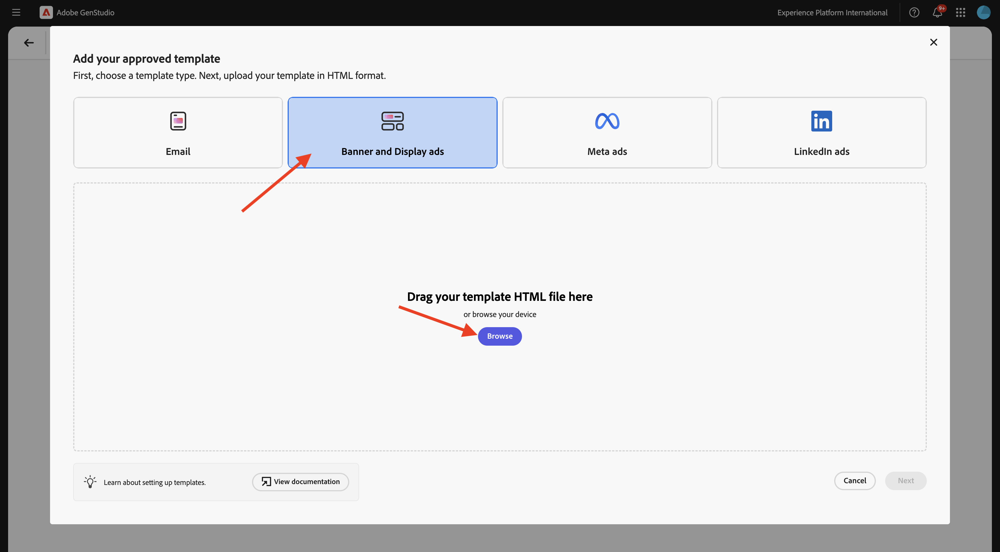

# 1.3.2 Konfiguration: Personas, Produkter och mallar

Gå till [https://experience.adobe.com/](https://experience.adobe.com/){target="_blank"}. Öppna **GenStudio**.


## 1.3.2.1 produkter

Produkterna i GenStudio for Performance Marketing har en djupgående förståelse för produktspecifikationer, fördelar och differentierande faktorer för att skapa slagkraftigt innehåll.

Produkterna omfattar alla delar i en viss produkt, t.ex. bilder, beskrivningar och värdeförslag, för att skapa en sammanhängande varumärkesrepresentation. Genom att utnyttja Adobe avancerade AI-teknologi kan GenStudio for Performance Marketing riktlinjer - varumärken, produkter och personer - tillsammans generera övertygande material som visar upp vilka styrkor era produkter har och säkerställer enhetlighet i alla budskap.

Om du vill börja skapa egna produkter klickar du på de tre punkterna **..** och väljer sedan **Produkter**.


Klicka på **+ Lägg till produkt**.


Välj **Lägg till manuellt** och klicka på **Fortsätt**.



Du borde se det här då.


För produktnamnet använder du `--aepUserLdap-- - CitiSignal Mobile Flex Plan`.

Använd följande för fältet **Beskrivning**:

```
CitiSignal Mobile Flex is a next-gen 5G mobile plan that adapts to your lifestyle. Choose from Unlimited, Family Share, or Data Saver tiers, with optional add-ons like international roaming, hotspot tethering, and SmartFamily™ parental controls. All plans include priority access to CitiSignal’s 5G UltraWide network and seamless integration with CitiSignal Fiber for unified billing, shared data pools, and SmartSwitch™ connectivity. 
```

Använd följande för fältet **Värdeförslag**:

```
A mobile plan that flexes with your life—fast, fair, and fully connected to your world.
```

Använd följande för fältet **Meddelandeinställningar**:

```
Remote Professionals: “Work from anywhere with a mobile plan that’s as flexible as your schedule.”
Online Gamers: “Unlimited 5G. No throttling. Just pure performance—on the go.”
Smart Home Families: “One plan. One bill. One less thing to worry about.”
```

Din produktkonfiguration bör nu se ut så här. Klicka på ikonen **bak**.


Klicka på **+ Lägg till produkt**.


Välj **Lägg till manuellt** och klicka på **Fortsätt**.


Du borde se det här då.


För produktnamnet använder du `--aepUserLdap-- - CitiSignal Fiber Max`.

Använd följande för fältet **Beskrivning**:

```
CitiSignal Fiber Max is our premium residential internet plan, engineered for households that demand uncompromising speed, stability, and coverage. With symmetrical speeds up to 2 Gbps, it’s ideal for remote professionals juggling Zoom calls and cloud apps, gamers chasing millisecond precision, and families running dozens of smart devices. The plan includes a Wi-Fi 6E router, optional mesh extenders for whole-home coverage, and proactive network monitoring. 
```

Använd följande för fältet **Värdeförslag**:

```
Power your work, play, and home with the fastest, most reliable fiber internet—built for the way you live today and tomorrow.
```

Använd följande för fältet **Meddelandeinställningar**:

```
Remote Professionals: “Stay connected, stay productive—no matter how many meetings or megabytes your day demands.”
Online Gamers: “Zero lag. Zero mercy. Dominate with 2 Gbps fiber and ultra-low ping.”
Smart Home Families: “Every room. Every device. Always on. Welcome to whole-home harmony.”
```

Din produktkonfiguration bör nu se ut så här. Klicka på ikonen **bak**.


Du bör då se de två produkter som du har konfigurerat.


## 1.3.2.2 personas

Personerna utgör en autentisk bild av era kundsegment, med information, intressen, smärtor, preferenser och beteenden.

GenStudio for Performance Marketing utnyttjar riktlinjerna - varumärken, produkter och personligheter - och Adobe generativa AI-teknik för att strukturera personaliserat marknadsföringsmaterial för era målkunder. &#x200B;

Klicka på de tre punkterna **..** och välj sedan **Personas** för att börja skapa dina profiler.


Klicka på **+ Lägg till persona**.


Välj **Lägg till manuellt** och klicka på **Fortsätt**.


Du borde se det här då.


Vi `--aepUserLdap-- - Smart Home Families` för personnamnet.

Använd följande för fältet **Beskrivning**:

```
These are tech-forward households with multiple connected devices—smart TVs, thermostats, security systems, voice assistants, and more. They value convenience, automation, and seamless connectivity across the home. They often have children and are concerned about online safety, parental controls, and whole-home coverage.
```

Använd följande för fältet **Meddelandeinställningar**:

```
Friendly, family-oriented tone
Visuals showing whole-home coverage and device compatibility
Messaging that highlights security, parental controls, and easy setup
Bundled offers (e.g., mesh Wi-Fi, smart home consultations)
How-to content or setup guides for non-tech-savvy users
```

Din personliga konfiguration bör nu se ut så här. Klicka på ikonen **bak**.



Klicka på **+ Lägg till persona**.


Välj **Lägg till manuellt** och klicka på **Fortsätt**.


Du borde se det här då.


Vi `--aepUserLdap-- - Online Gamers` för personnamnet.

Använd följande för fältet **Beskrivning**:

```
This persona includes competitive and casual gamers who demand ultra-fast, low-latency internet. They often stream gameplay, participate in multiplayer matches, and use voice chat platforms. They are highly sensitive to lag, jitter, and packet loss, and they’re vocal about their experiences online. Many are early adopters of new tech and value performance above all else.
```

Använd följande för fältet **Meddelandeinställningar**:

```
Bold, energetic tone with gaming lingo
Metrics like ping time, jitter, and upload/download speeds
Visuals showing latency improvements or side-by-side comparisons
Endorsements from gaming influencers or esports teams
Promotions tied to gaming platforms or bundles (e.g., free months of Xbox Game Pass)
```

Din personliga konfiguration bör nu se ut så här. Klicka på ikonen **bak**.


Klicka på **+ Lägg till persona**.


Välj **Lägg till manuellt** och klicka på **Fortsätt**.


Du borde se det här då.


Vi `--aepUserLdap-- - Remote Professionals` för personnamnet.

Använd följande för fältet **Beskrivning**:

```
These are knowledge workers, freelancers, consultants, and hybrid employees who rely on a stable, high-speed internet connection to maintain productivity from home. Their workdays are filled with video calls, cloud-based collaboration, and large file transfers. They often use multiple devices simultaneously and expect seamless performance across all of them. Many are tech-savvy and value proactive customer support and service transparency.
```

Använd följande för fältet **Meddelandeinställningar**:

```
Clear, professional tone with a focus on productivity and reliability
Testimonials or case studies from similar professionals
Visuals like speed comparison charts and uptime guarantees
Emphasis on 24/7 support and service-level agreements
Messaging that highlights “work-from-anywhere” flexibility
```

Din personliga konfiguration bör nu se ut så här. Klicka på ikonen **bak**.


Du bör sedan se de 3 personerna som du konfigurerade.


## Mallar för 1.3.2.3

Med GenStudio for Performance Marketing kan innehållsskapare snabbt producera enhetligt marknadsföringsmaterial med hjälp av mallar. En mall minskar tiden och arbetet som krävs för att generera nytt innehåll avsevärt genom att tillhandahålla en startpunkt som inkluderar förkonfigurerade layouter och designelement.

GenStudio for Performance Marketing stöder inte direkt framtagning av mallar i programmet, men du kan enkelt utforma och förbereda mallar med vanliga designverktyg som Adobe InDesign, Illustrator eller Express. När designen är klar kan du anpassa den för användning i GenStudio for Performance Marketing. I den här övningen importerar du ett antal fördefinierade mallar till GenStudio for Performance Marketing.

I föregående övning laddade du ned filen [CitiSignal-SGPeM-assets.zip](../../../assets/gspem/CitiSignal-GSPeM-assets.zip) till skrivbordet och packade upp den. Mappen innehåller fyra exempelmallar som du nu behöver importera i GenStudio.


Gå till **Innehåll** > **Mallar**. Klicka på **+ Lägg till mall**.


Välj **Metaannonser** och klicka sedan på **Bläddra**.


Navigera till mappen **templates** i mappen som innehåller de hämtade filerna **CitiSignal-SGPeM-assets**. Markera filen **citisign-meta-ad.html** och klicka på **Öppna**.


Du borde se det här då. Klicka på **Nästa**.


Klicka på **Nästa**.


Använd detta för fältet **Mallnamn**:
`--aepUserLdap---citisignal-meta-ad` och ställ in proportionerna på **1:1** . Klicka på **Publicera mall**.


Mallen har nu sparats och är tillgänglig i mallbiblioteket.


Klicka på **+ Lägg till mall**.


Välj **Banderoll och visa annonser** och klicka sedan på **Bläddra**.


Navigera till mappen **templates** i mappen som innehåller de hämtade filerna **CitiSignal-SGPeM-assets**. Markera filen **citisign-displaytemplate-300x250.html** och klicka på **Öppna**.


Du borde se det här då. Klicka på **Nästa**.


Klicka på **Nästa**.


Använd detta för fältet **Mallnamn**:
`--aepUserLdap---citisignal-displaytemplate-300x250` och ställ in **annonsbredd** och **annonshöjd** på **300x250**. Klicka på **Publicera mall**.


Mallen har nu sparats och är tillgänglig i mallbiblioteket.


Klicka på **+ Lägg till mall**.


Välj **Banderoll och visa annonser** och klicka sedan på **Bläddra**.



Navigera till mappen **templates** i mappen som innehåller de hämtade filerna **CitiSignal-SGPeM-assets**. Markera filen **citisign-displaytemplate-300x600.html** och klicka på **Öppna**.


Du borde se det här då. Klicka på **Nästa**.


Klicka på **Nästa**.


Använd detta för fältet **Mallnamn**:
`--aepUserLdap---citisignal-displaytemplate-300x600` och ställ in **annonsbredd** och **annonshöjd** på **300x600**. Klicka på **Publicera mall**.


Mallen har nu sparats och är tillgänglig i mallbiblioteket.


Klicka på **+ Lägg till mall**.


Välj **Banderoll och visa annonser** och klicka sedan på **Bläddra**.


Navigera till mappen **templates** i mappen som innehåller de hämtade filerna **CitiSignal-SGPeM-assets**. Markera filen **citisign-displaytemplate-970x250.html** och klicka på **Öppna**.


Du borde se det här då. Klicka på **Nästa**.


Klicka på **Nästa**.


Använd detta för fältet **Mallnamn**:
`--aepUserLdap---citisignal-displaytemplate-970x250` och ställ in **annonsbredd** och **annonshöjd** på **970x250**. Klicka på **Publicera mall**.


Mallen har nu sparats och är tillgänglig i mallbiblioteket.


Du har nu konfigurerat mallarna som du behöver för nästa övning.

## Nästa steg

Gå till [Kampanjaktivering till Meta](./ex3.md){target="_blank"}

Gå tillbaka till [GenStudio for Performance Marketing](./genstudio.md){target="_blank"}

Gå tillbaka till [Alla moduler](./../../../overview.md){target="_blank"}
