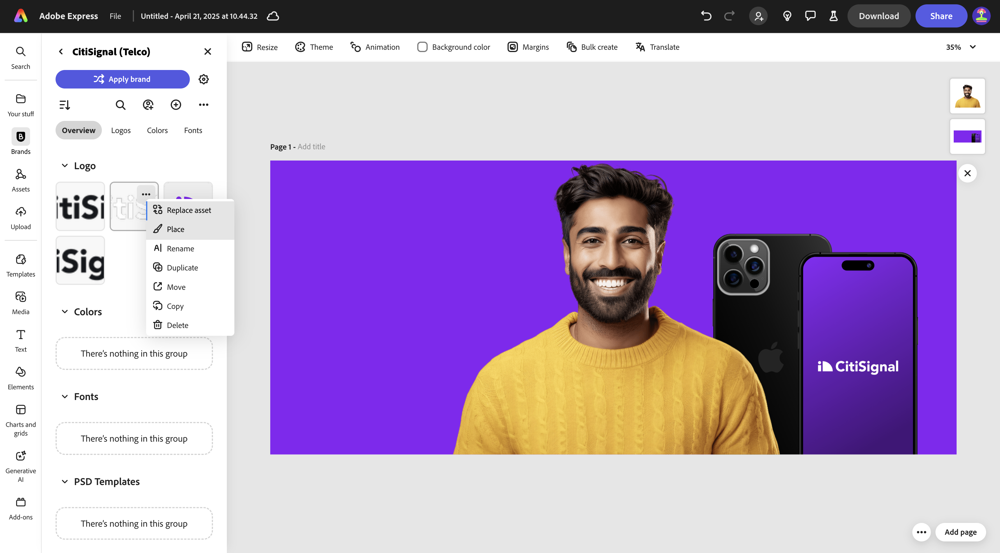
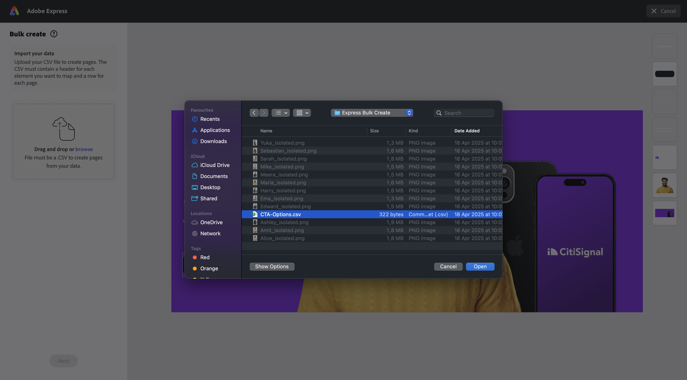

# 1.3.3 Skapa Assets satsvis i Adobe Express

Innan du påbörjar den här övningen hämtar du de nödvändiga resurserna från [https://tech-insiders.s3.us-west-2.amazonaws.com/one-adobe/Adobe_Express.zip](https://tech-insiders.s3.us-west-2.amazonaws.com/one-adobe/Adobe_Express.zip){target="_blank"} och packar upp dem på skrivbordet.

## 1.3.3.1 Skapa din grundläggande resurs

Gå till [https://new.express.adobe.com/](https://new.express.adobe.com/){target="_blank"}. Klicka på ikonen **+** för att skapa en ny **bild**.

Välj **Foto** och välj sedan **Överför media**.

Navigera till din dator till mappen **Adobe_Express** som innehåller de resurser du laddat ned tidigare. Markera filen **banner.png** och klicka på **Öppna**.

Du borde se det här då. Välj **Redigera bild**.

Gå sedan till **Media** och välj **Överför bild**. Navigera till din dator till mappen **Adobe_Express** som innehåller de resurser du laddat ned tidigare. Markera filen **man.png** och klicka på **Öppna**.

Du borde se det här då.

Sedan ska du lägga till logotypen **CitiSignal** . Gå till **Varumärken** och välj den vita CitiSignal-logotypen. Klicka på de tre punkterna **..** och välj **Montera**.

Justera placeringen av CitiSignal-logotypbilden så att den återspeglar samma position i bilden nedan.

Gå till **Text** och klicka på **Lägg till text**.

Lägg till texten `Empowering Connections` i den nya textrutan. Dra textrutan till en liknande plats som visas i bilden nedan. Gå sedan till **Varumärken** och till **Teckensnitt**. Klicka på de 3 punkterna **..** i det tredje teckensnittet och klicka på **Använd**.

Ändra sedan teckenfärgen till **vit**.

Gå till **Text** igen och klicka på **Lägg till text**.

Ange texten `Your pathway to reliable communication` i den nya textrutan. Justera placeringen av textrutan som ska vara under den föregående textrutan, ungefär som bilden nedan.

Gå till **Varumärkena**, till **Teckensnitt** och klicka på de 3 punkterna **..** i det andra teckensnittet. Klicka sedan på **Använd**.

Du borde ha den här då. Gå sedan till **Elements**, till **Former** och klicka på den rundade rektangelformen.

Sedan har du en ny rundad rektangel på bilden. Justera storleken och platsen så att den ser ut som en knapp. Ändra sedan färgen på den rundade rektangeln till **svart**.

Gå till **Text** igen och klicka på **Lägg till text**.

Ange texten `Shop now` i den nya textrutan och ändra platsen för textrutan som ska centreras på knappen. Gå till **Varumärkena**, till **Teckensnitt** och klicka på de 3 punkterna **..** i det tredje teckensnittet. Klicka sedan på **Använd**.

Du borde se det här då.

## 1.3.3.2 Skapa satsvis i Adobe Express

Klicka sedan på **Skapa** gruppvis.

Du borde se det här då. Klicka på **bläddra**.

Navigera till din stationära dator till mappen **Express Bulk Create** i mappen **Adobe_Express** som innehåller de resurser du laddat ned tidigare. Markera filen **CTA-options.csv** och klicka på **Öppna**.

Du borde se det här då. Klicka på **Nästa**.

Klicka på **Anslut element**.

Markera textrutan som innehåller texten **Vägen till tillförlitlig kommunikation**. Klicka sedan på knappen **Element 1** och länka det till ett fält från CSV-filen, i det här fallet fältet **Underrubrik**.

Markera sedan textrutan som innehåller texten **Handla nu**.

Klicka sedan på knappen **Element 1** och länka det till ett fält från CSV-filen, i det här fallet fältet **CTA**.

Du borde se det här då. Klicka sedan på personens bild.

Klicka på knappen **Element 1**.

Du kommer då att se den här popup-rutan. Klicka på **bläddra**.

Navigera till din stationära dator till mappen **Express Bulk Create** i mappen **Adobe_Express** som innehåller de resurser du laddat ned tidigare. Markera 6-7 bildfiler och klicka på **Öppna**.

Då ser du det här. Dra och släpp olika bilder för varje variant av resursen. Klicka på **Klar**

Sedan ser du variationerna i bilden som genereras. Klicka på **Skapa sidor**.

Nu är dina varianter klara och du kan granska och validera dem separat.

Du har nu avslutat den här övningen.

## Nästa steg

Gå till [Sammanfattning och förmåner](./summary.md){target="_blank"}

Gå tillbaka till [Adobe Express och Adobe Experience Cloud](./express.md){target="_blank"}

Gå tillbaka till [Alla moduler](./../../../overview.md){target="_blank"}