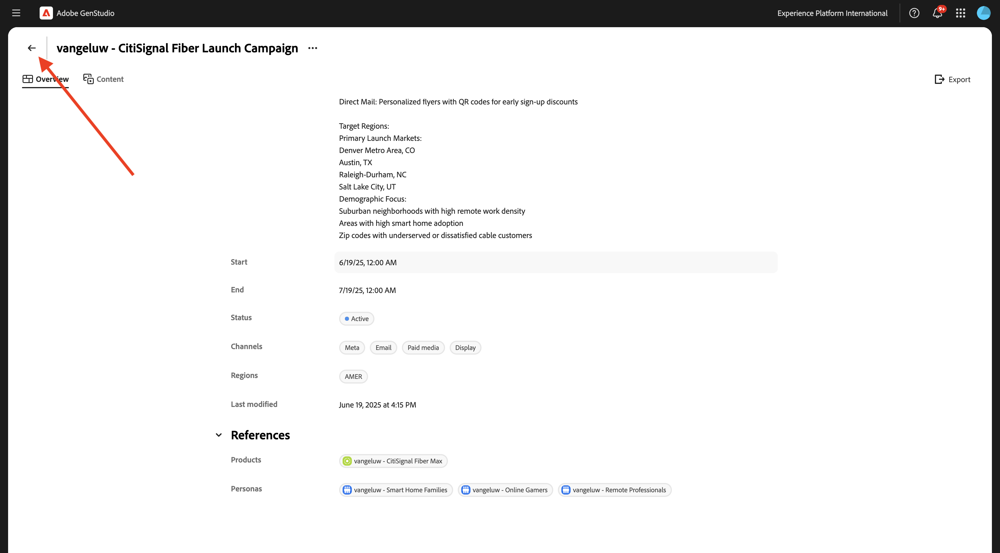
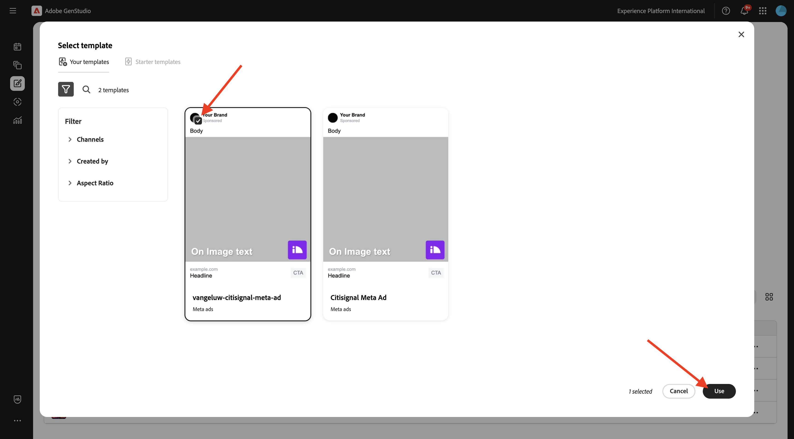
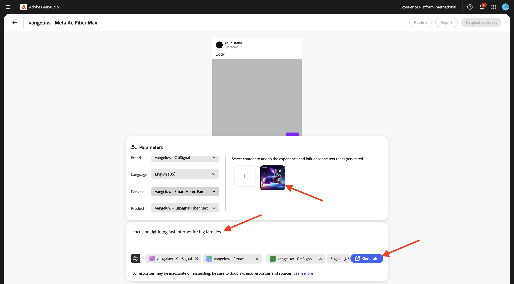
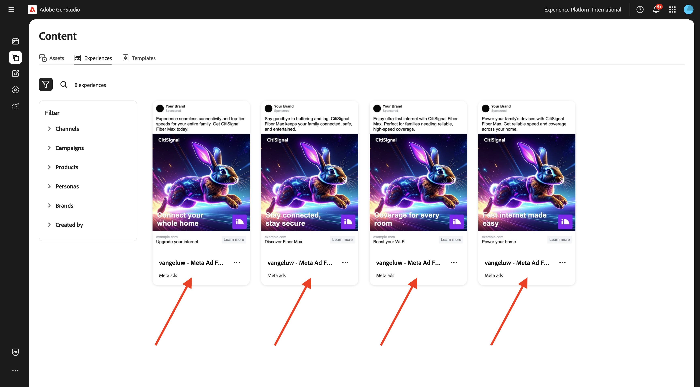
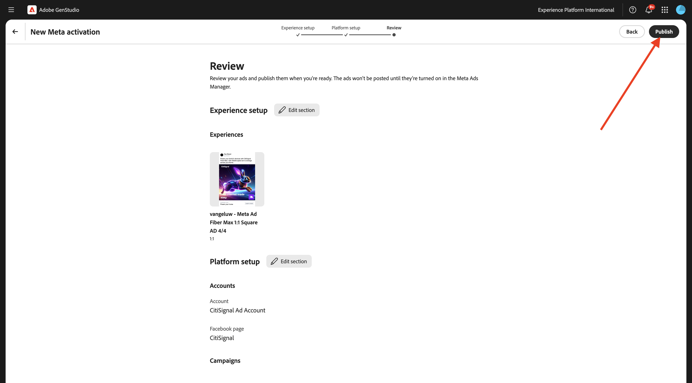

# 1.3.3 Kampanjaktivering till Meta

>[!IMPORTANT]
>
>För att slutföra den här övningen måste du ha tillgång till en fungerande AEM Assets CS-redigeringsmiljö där AEM Content Hub är aktiverat. Om du följer övning [Adobe Experience Manager Cloud Service &amp; Edge Delivery Services](./../../../modules/asset-mgmt/module2.1/aemcs.md){target="_blank"} har du tillgång till en sådan miljö.

>[!IMPORTANT]
>
>För att kunna utföra alla steg i den här övningen måste du ha tillgång till en befintlig Adobe Workfront-miljö, och i den miljön måste du ha skapat ett projekt och ett arbetsflöde för godkännande. Om du följer övningen [Arbetsflödeshantering med Adobe Workfront](./../../../modules/workflow-planning/module1.2/workfront.md){target="_blank"} har du tillgång till de nödvändiga inställningarna.

>[!IMPORTANT]
>
>Om du tidigare har konfigurerat ett AEM Assets CS-program med en författare- och AEM Assets-miljö kan det bero på att din AEM CS-sandlåda har tagits i viloläge. Eftersom det tar 10-15 minuter att dölja en sådan sandlåda, är det en bra idé att starta separationsprocessen nu så att du inte behöver vänta på den vid ett senare tillfälle.

## 1.3.3.1 Skapa kampanj

Gå till **Kampanjer** i den vänstra menyn i **GenStudio for Performance Marketing**. Klicka på **+ Lägg till kampanj**.


Du bör då se en tom kampanjöversikt.


Använd `--aepUserLdap-- - CitiSignal Fiber Launch Campaign` som fältnamn.

Använd texten nedan för fältet **Beskrivning**.

```
The CitiSignal Fiber Launch campaign introduces CitiSignal’s flagship fiber internet service—CitiSignal Fiber Max—to key residential markets. This campaign is designed to build awareness, drive sign-ups, and establish CitiSignal as the go-to provider for ultra-fast, reliable, and future-ready internet. The campaign will highlight the product’s benefits for remote professionals, online gamers, and smart home families, using persona-driven messaging across digital and physical channels.
```

Använd texten nedan för fältet **Mål**.

```
Generate brand awareness in target regions
Drive early sign-ups and pre-orders for CitiSignal Fiber Max
Position CitiSignal as a premium, customer-first fiber internet provider
Educate consumers on the benefits of fiber over cable or DSL
```

Använd texten nedan för fältet **Nyckelmeddelanden**.

```
Supporting Points:
Symmetrical speeds up to 2 Gbps
Whole-home Wi-Fi 6E coverage
99.99% uptime guarantee
24/7 concierge support
No data caps or throttling
 Channels:
Digital Advertising: Google Display, YouTube pre-roll, Meta (Facebook/Instagram), TikTok (for gamers)
Email Marketing: Persona-segmented drip campaigns
Social Media: Organic and paid posts with testimonials, speed demos, and influencer partnerships
Out-of-Home (OOH): Billboards, transit ads in suburban commuter corridors
Local Events: Pop-up booths at tech expos, family festivals, and gaming tournaments
Direct Mail: Personalized flyers with QR codes for early sign-up discounts
 
Target Regions:
Primary Launch Markets:
Denver Metro Area, CO
Austin, TX
Raleigh-Durham, NC
Salt Lake City, UT
Demographic Focus:
Suburban neighborhoods with high remote work density
Areas with high smart home adoption
Zip codes with underserved or dissatisfied cable customers
```

Du bör då ha den här:


Bläddra nedåt om du vill se fler fält:


Ange dagens datum för fältet **Start**.

För fältet **Slut** anger du det till ett datum på en månad från och med nu.

För fältet **Status** anger du det till **Aktiv**.

För fältet **Kanaler** ställer du in det på **Meta**, **Email**, **Paid**, **Display**.

Välj ett valfritt område för fältet **Områden**.

För fältet För fältet **Referenser** > **Produkter**: välj produkten `--aepUserLdap-- - CitiSignal Fiber Max`.

**Referenser** > **Personas**: välj persona `--aepUserLdap-- - Remote Professionals`, `--aepUserLdap-- - Online Gamers`, `--aepUserLdap-- - Smart Home Families`

Du bör då se det här:


Din kampanj är nu färdig. Klicka på **pilen** för att gå tillbaka.



Då visas kampanjen i listan. Klicka på kalendervyikonen om du vill ändra vyn till kampanjkalendern.


Du bör då se en kampanjkalender som ger en mer visuell uppfattning om vilka kampanjer som är aktiva vid den tidpunkten.


## 1.3.3.2 Konfigurera anslutning till Meta

>[!IMPORTANT]
>
>Om du vill konfigurera anslutningen till Meta måste du ha ett Meta-användarkonto tillgängligt och det användarkontot måste läggas till i ett Meta Business-konto.

Om du vill konfigurera anslutningen till Meta klickar du på de 3 punkterna **..** och väljer **Inställningar**.


Klicka på **Anslut** för **Meta Ads**.


Logga in med ditt Meta-konto. Klicka på **Fortsätt**.


Om ditt konto är kopplat till ett Meta Business-konto kan du välja den företagsportfölj som har konfigurerats i Meta.


När anslutningen har upprättats klickar du på raden **X anslutna konton**.


Du bör sedan se information om det Meta Business Account som är anslutet till GenStudio for Performance Marketing.


## 1.3.3.3 Skapa ny resurs

Gå till [https://firefly.adobe.com/](https://firefly.adobe.com/){target="_blank"}. Skriv uppmaningen `a neon rabbit running very fast through space` och klicka på **Generera**.


Sedan visas flera bilder som genereras. Välj den bild du gillar mest, klicka på ikonen **Dela** på bilden och välj sedan **Öppna i Adobe Express**.


Du ser då att den bild du just har skapat blir tillgänglig i Adobe Express för redigering. Nu måste du lägga till CitiSignal-logotypen på bilden. Gå till **Varumärken** om du vill göra det.


Du bör då se varumärkesmallen för CitiSignal som du skapade i GenStudio for Performance Marketing visas i Adobe Express. Klicka för att välja din varumärkesmall med namnet `--aepUserLdap-- - CitiSignal`.


Gå till **Logos** och klicka på den **vita** Citisign-logotypen för att släppa den på bilden.


Placera CitiSignal-logotypen högst upp i bilden, inte långt från mitten.


Klicka sedan på **Dela**.


Välj **AEM Assets**.


Klicka på **Välj mapp**.


Välj din AEM Assets CS-databas som ska ha namnet `--aepUserLdap-- - CitiSignal` och markera sedan mappen `--aepUserLdap-- - CitiSignal Fiber Campaign`. Klicka på **Markera**.


Du borde se det här då. Klicka på **Överför 1 resurs**. Bilden överförs nu till AEM Assets CS.


Gå till [https://experience.adobe.com/](https://experience.adobe.com/){target="_blank"}. Öppna **Experience Manager Assets**.


Välj din AEM Assets CS-miljö, som ska få namnet `--aepUserLdap-- - CitiSignal dev`.


Gå till **Assets** och dubbelklicka sedan på mappen `--aepUserLdap-- - CitiSignal Fiber Campaign`.


Du borde se något liknande. Dubbelklicka på bilden `--aepUserLdap-- - neon rabbit`.


Bilden `--aepUserLdap-- - neon rabbit` visas sedan. Ändra **status** till **Godkänd** och klicka sedan på **Spara**

>[!IMPORTANT]
>
>Om status för en bild inte är inställd på **Godkänd** visas inte bilden i GenStudio for Performance Marketing. Endast godkända mediefiler är tillgängliga i GenStudio for Performance Marketing.


Byt tillbaka till GenStudio for Performance Marketing. På den vänstra menyn går du till **Assets** och väljer din AEM Assets CS-databas, som bör ha namnet `--aepUserLdap-- - CitiSignal`. Du kommer då att se bilden som du just har skapat och godkänt bli tillgänglig i GenStudio for Performance Marketing.


## 1.3.3.4 Skapa och godkänn metaannons

Gå till **Skapa** på den vänstra menyn. Välj **Meta**.


Välj mallen **Meta ad** som du importerade tidigare, med namnet `--aepUserLdap---citisignal-meta-ad`. Klicka på **Använd**.



Du borde se det här då. Ändra namnet på din annons till `--aepUserLdap-- - Meta Ad Fiber Max`.

Välj följande alternativ under **Parametrar**:

- **Varumärke**: `--aepUserLdap-- - CitiSignal`
- **Språk**: `English (US)`
- **Persona**: `--aepUserLdap-- - Smart Home Families`
- **Produkt**: `--aepUserLdap-- - CitiSignal Fiber Max`

Klicka på **Välj från innehåll**.


Välj resursen `--aepUserLdap-- - neon rabbit.png`. Klicka på **Använd**.


Skriv uppmaningen `focus on lightning fast internet for big families` och klicka på **Generera**.



Då borde du se något sådant här. Dina annonser är nu klara att granskas och godkännas. Det gör du genom att klicka på **Begär godkännande** som ansluter till Adobe Workfront.


Välj ditt Adobe Workfront-projekt, som ska få namnet `--aepUserLdap-- - CitiSignal Fiber Launch`. Ange din egen e-postadress under **Bjud in personer** och kontrollera att din roll är inställd på **Godkännare**.


Du kan också använda ett befintligt arbetsflöde för godkännande i Adobe Workfront. Det gör du genom att klicka på **Använd mall** och välja mallen `--aepuserLdap-- - Approval Workflow`. Klicka på **Skicka**.


Klicka på **Visa kommentarer i Workfront** så skickas du nu till Adobe Workfront korrekturrundgränssnitt.


Klicka på **Fatta beslut** i Adobe Workfront Proof UI.


Välj **Godkänd** och klicka på **Fatta beslut**.


Klicka på **Publicera**.


Välj din kampanj `--aepUserLdap-- - CitiSignal Fiber Launch Campaign` och klicka på **Publicera**.


Klicka på **Öppna i innehåll**.


De fyra Meta-annonserna är nu tillgängliga under **Innehåll** > **Erfarenheter**.



## 1.3.3.5 Publicera annonser på metadata

Välj en av annonserna och klicka sedan på **Aktivera**.


Välj en **Call to action** i listan och ange en exempel-URL. Klicka på **Nästa**.


Välj Meta-kontot, den länkade Facebook-sidan, Meta Campaign och Meta Ad Set.

Ge din add ett namn, använd `--aepUserLdap-- Fiber Max Ad`.

Klicka på **Nästa**.


Klicka på **Publicera**.



Klicka på **OK**.


Din annons status är nu inställd på **Publicering**, vilket kan ta några minuter.


Efter några minuter ändras annonsens status till **Publicerad**. Det innebär att annonsen har skickats från GenStudio for Performance Marketing till Meta. Det betyder inte att annonsen redan är publicerad i Meta! Det finns fortfarande ett antal steg att ta i Meta Business Account för att ta annonsen och publicera den så att den kan ses av användare på olika Meta-plattformar.

Klicka på **Visa information**.


Klicka på **Öppna**, som tar dig till ditt Meta Business-konto.

>[!IMPORTANT]
>
>Om du inte har tillgång till det Meta Business-konto som är anslutet till din miljö kan du inte visualisera annonsen i Meta.


Här är en översikt över den annons du just skapade, men nu i Meta.


Du har nu avslutat den här övningen.

## Nästa steg

Gå till [Sammanfattning och förmåner](./summary.md){target="_blank"}

Gå tillbaka till [GenStudio for Performance Marketing](./genstudio.md){target="_blank"}

Gå tillbaka till [Alla moduler](./../../../overview.md){target="_blank"}
