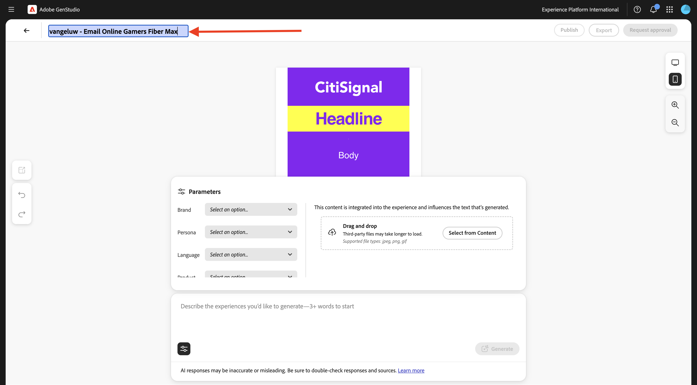
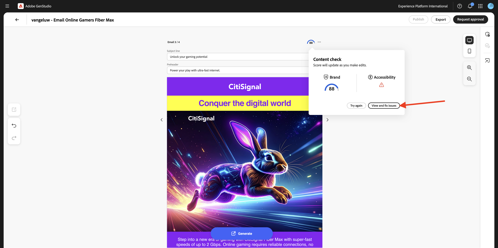
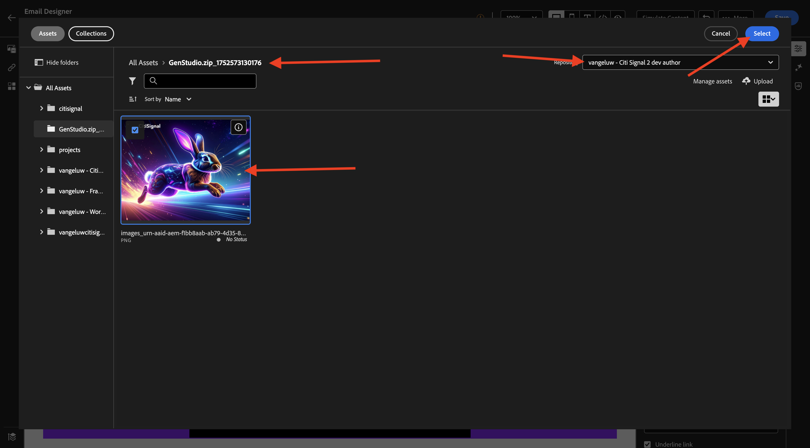
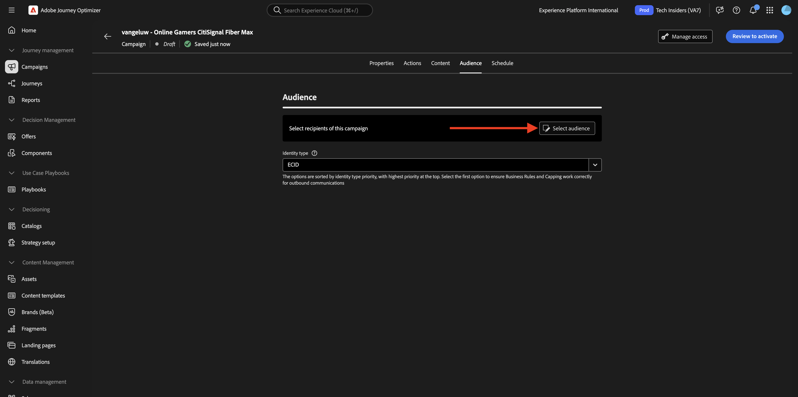

# 1.3.4 Skapa e-postupplevelse för AJO

>[!IMPORTANT]
>
>För att kunna slutföra den här övningen måste du ha tillgång till en Adobe Journey Optimizer-miljö som är avsedd för integrering med GenStudio for Performance Marketing, som för närvarande är en betaversion.

>[!IMPORTANT]
>
>För att kunna utföra alla steg i den här övningen måste du ha tillgång till en befintlig Adobe Workfront-miljö, och i den miljön måste du ha skapat ett projekt och ett arbetsflöde för godkännande. Om du följer övningen [Arbetsflödeshantering med Adobe Workfront](./../../../modules/workflow-planning/module1.2/workfront.md){target="_blank"} har du tillgång till de nödvändiga inställningarna.

## 1.3.4.1 Skapa och godkänn e-postupplevelse

Gå till **Skapa** på den vänstra menyn. Välj **E-post**.


Välj mallen **E-post** som du importerade tidigare, med namnet `--aepUserLdap---citisignal-email-template`. Klicka på **Använd**.


Du borde se det här då. Ändra namnet på din annons till `--aepUserLdap-- - Email Online Gamers Fiber Max`.



Välj följande alternativ under **Parametrar**:

- **Varumärke**: `--aepUserLdap-- - CitiSignal`
- **Språk**: `English (US)`
- **Persona**: `--aepUserLdap-- - Online Gamers`
- **Produkt**: `--aepUserLdap-- - CitiSignal Fiber Max`

Klicka på **Välj från innehåll**.


Välj resursen `--aepUserLdap-- - neon rabbit.png`. Klicka på **Använd**.


Skriv uppmaningen `convince online gamers to start playing online multiplayer games using CitiSignal internet` och klicka på **Generera**.


Du bör då se något sådant, med 4 e-postvarianter genererade. I standardvyn visas vyn **mobile**. Du kan växla till skrivbordsvyn genom att klicka på ikonen **computer** .


För varje e-postmeddelande beräknas ett poängtal automatiskt. Klicka på musikspåret för mer information.


Klicka på **Visa och åtgärda problem**.



Du kan sedan se mer ingående vad du kan göra för att optimera komplikationspoängen.


Klicka sedan på **Begär godkännande** som ansluter till Adobe Workfront.


Välj ditt Adobe Workfront-projekt, som ska få namnet `--aepUserLdap-- - CitiSignal Fiber Launch`. Ange din egen e-postadress under **Bjud in personer** och kontrollera att din roll är inställd på **Godkännare**.


Du kan också använda ett befintligt arbetsflöde för godkännande i Adobe Workfront. Det gör du genom att klicka på **Använd mall** och välja mallen `--aepuserLdap-- - Approval Workflow`. Klicka på **Skicka**.


Klicka på **Visa kommentarer i Workfront** så skickas du nu till Adobe Workfront korrekturrundgränssnitt.


Klicka på **Fatta beslut** i Adobe Workfront Proof UI.


Välj **Godkänd** och klicka på **Fatta beslut**.


Klicka på **Publicera**.


Välj din kampanj `--aepUserLdap-- - CitiSignal Fiber Launch Campaign` och klicka på **Publicera**.


Klicka på **Öppna i innehåll**.


De fyra e-postupplevelserna är nu tillgängliga under **Innehåll** > **Erfarenheter**.


## 1.3.4.2 Skapa en kampanj i AJO

Logga in på Adobe Journey Optimizer på [Adobe Experience Cloud](https://experience.adobe.com). Klicka på **Journey Optimizer**.


Du omdirigeras till vyn **Hem** i Journey Optimizer. Kontrollera först att du använder rätt sandlåda. Sandlådan som ska användas kallas `--aepSandboxName--`. Du kommer sedan att vara i vyn **Hem** i din sandlåda `--aepSandboxName--`.


Nu ska ni skapa en kampanj. Till skillnad från den händelsebaserade resan från föregående övning, som bygger på inkommande upplevelsehändelser, målgruppsposter eller utträde för att utlösa en resa för en viss kund, riktar kampanjer sig mot en hel målgrupp en gång med unikt innehåll som nyhetsbrev, engångskampanjer eller allmän information eller regelbundet med liknande innehåll som skickas regelbundet, till exempel födelsedagskampanjer och påminnelser.

Gå till **Kampanjer** på menyn och klicka på **Skapa kampanj**.


Välj **Schemalagd - marknadsföring** och klicka på **Skapa**.


Konfigurera följande när kampanjen skapas:

- **Namn**: `--aepUserLdap--  - Online Gamers CitiSignal Fiber Max`.
- **Beskrivning**: Fiberkampanj för onlinespel

Klicka på **Åtgärder**.


Klicka på **+ Lägg till åtgärd** och välj sedan **E-post**.


Välj sedan en befintlig **e-postkonfiguration** och klicka sedan på **Redigera innehåll**.


Då ser du det här. Använd följande för **Subject line**:

```
{{profile.person.name.firstName}}, say goodbye to delays!
```

Klicka sedan på **Redigera innehåll**.


Klicka på **Importera HTML**.


Klicka sedan på knappen för **Adobe GenStudio for Performance Marketing**.


Du bör då se ett popup-fönster som visar alla e-postupplevelser som publicerats i GenStudio for Performance Marketing. Välj en av de tillgängliga e-postupplevelserna och klicka på **Använd**.


Välj en egen AEM Assets CS-databas som ska ha namnet `--aepUserLdap-- - CitiSignal dev` och klicka på **Importera**.


Du borde se det här då. Markera knappen för saknad bild och klicka på **Välj en resurs**.


Gå till den mapp som ser ut så här, med början från **GenStudio.zip....** och markera bilden `--aepUserLdap-- - neon rabbit.png`. CLick **Select**



Du borde se det här då.


Bläddra nedåt till sidfoten, markera ordet **Avsluta prenumeration** och klicka på ikonen **länk** .


Ange **Type** till **External Opt-out/Unsubscription** och ange URL:en till `https://techinsiders.org/unsubscribe.html` (det är inte tillåtet att ha en tom URL för länken för att avbryta prenumerationen).

Klicka på **Spara** och sedan på **pilen** i skärmens övre vänstra hörn för att gå tillbaka till kampanjkonfigurationen.


Gå till **målgrupp**.


Klicka på **Välj målgrupp**.



Välj målgrupp för prenumerationslistan för onlinespel, som ska få namnet `--aepUserLdap--_SL_Interest_Online_Gaming`. Klicka på **Spara**.


Klicka på **Granska för att aktivera**.


Om kampanjkonfigurationen inte har några problem kan du klicka på **Aktivera**.


Din kampanj kommer sedan att aktiveras, vilket tar några minuter.


Efter några minuter är kampanjen aktiv och e-postmeddelandet skickas till den prenumerationslista du valt.


Du har nu avslutat den här övningen.

## Nästa steg

Gå till [Sammanfattning och förmåner](./summary.md){target="_blank"}

Gå tillbaka till [GenStudio for Performance Marketing](./genstudio.md){target="_blank"}

Gå tillbaka till [Alla moduler](./../../../overview.md){target="_blank"}
