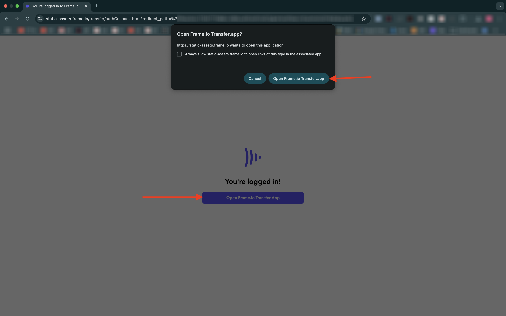

# 1.5.1 Komma igång med Frame.io

>[!NOTE]
>
> Skärmbilden nedan visar att en viss miljö används. När du går igenom den här självstudiekursen är det troligt att din miljö har ett annat namn. När du registrerade dig för den här självstudiekursen fick du den information om miljön som du skulle använda. Följ dessa instruktioner.

Gå till [https://next.frame.io/](https://next.frame.io/). Kontrollera att du är inloggad i miljön `--aepImsOrgName--`.

Om du inte är inloggad i den högra miljön klickar du på logotypen i det nedre vänstra hörnet och klickar för att välja den miljö du behöver använda.

## 1.5.1.1 Skapa din arbetsyta och ditt projekt

Klicka på **+ Ny Workspace**.

Använd `--aepUserLdap--` som arbetsytans namn. Klicka på **Spara**.

Arbetsytan har skapats. Sedan ska du skapa ett nytt projekt. Klicka på **+ Nytt projekt**.

Välj **Tom** och använd namnet `CitiSignal`. Klicka på **Skapa nytt projekt**.

Ditt projekt har skapats. Nu måste du överföra resurser i ditt projekt. Klicka på **Överför**.

Hämta följande filer: [https://tech-insiders.s3.us-west-2.amazonaws.com/Frame.io_Assets.zip](https://tech-insiders.s3.us-west-2.amazonaws.com/Frame.io_Assets.zip) till skrivbordet och zippa upp dem på skrivbordet.

Markera alla filer och klicka på **Öppna**.

>[!NOTE]
>
>Som du kan se i skärmbilden är mappen **Ljudeffekter** inte markerad just nu. Detta beror på att den manuella överföringen inte stöder överföring av mappar. Om några minuter installerar du appen Frame.io Transfer, som du använder för att överföra mappen och dess filer.

Efter några minuter visas dina filer i Frame.io.

Du har nu överfört filer manuellt, men det finns ett bättre och snabbare sätt att överföra och hämta filer till och från Frame.io. Det bästa sättet att göra det är att använda appen Frame.io Transfer.

## 1.5.1.2 Hämta och konfigurera överföringsappen Frame.io

Gå till [https://frame.io/transfer](https://frame.io/transfer) och hämta datorversionen.

Installera programmet och öppna det sedan.

När programmet öppnas måste du logga in. Klicka på **logga in**.

Ange e-postadressen för ditt Adobe-konto och klicka på **Kör**.

När autentiseringen är klar klickar du på **appen Open Frame.io Transfer**.

Du borde se det här då. Välj rätt miljö genom att klicka för att öppna listrutan.

Välj den miljö som du behöver använda för den här självstudiekursen, som är `--aepImsOrgName--`.

Du bör sedan se arbetsytan och projektet som du skapade tidigare, tillsammans med filerna som du överförde manuellt.

Klicka på **Överför**.

Gå till mappen som du använde tidigare och som innehåller de uppzippade filerna som du laddade ned tidigare. Markera mappen **Ljudeffekter** och klicka på **Överför**.

Dina filer kommer sedan att överföras.

När du har överfört den visas den nya mappen i Frame.io.

## Nästa steg

Gå till [1.5.2-godkännanden med Frame.io](./ex2.md){target="_blank"}

Gå tillbaka till [Effektivisera arbetsflödet med Frame.io](./frameio.md){target="_blank"}

Gå tillbaka till [Alla moduler](./../../../overview.md){target="_blank"}
