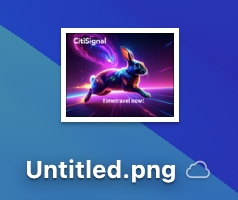
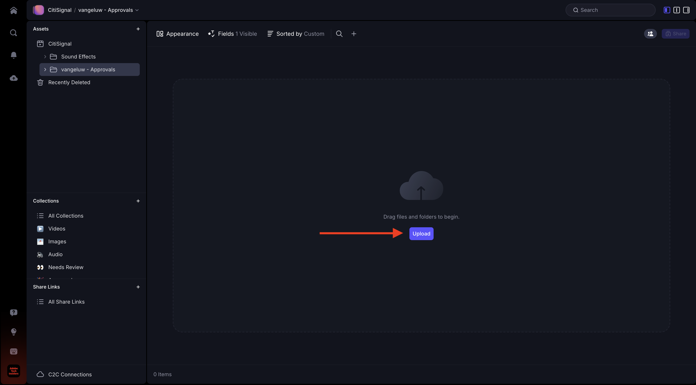

# 1.5.2 Godkännanden med Frame.io

>[!NOTE]
>
> Skärmbilden nedan visar att en viss miljö används. När du går igenom den här självstudiekursen är det troligt att din miljö har ett annat namn. När du registrerade dig för den här självstudiekursen fick du den information om miljön som du skulle använda. Följ dessa instruktioner.

För att kunna gå igenom godkännandearbetsflödet i Frame.io måste du ha en resurs. I den här övningen börjar du med att skapa resursen själv med Adobe Firefly och Adobe Express. När du har tillgång till resursen laddar du upp den i Frame.io och godkänner den till slut.

## 1.5.2.1 Skapa resurs med Adobe Firefly Services och Adobe Express

Gå till [https://firefly.adobe.com/](https://firefly.adobe.com/){target="_blank"}. Skriv uppmaningen `a neon rabbit running very fast through space` och klicka på **Generera**.

Sedan visas flera bilder som genereras. Välj den bild du gillar mest, klicka på ikonen **Dela** på bilden och välj sedan **Öppna i Adobe Express**.

Du ser då att den bild du just har skapat blir tillgänglig i Adobe Express för redigering. Nu måste du lägga till CitiSignal-logotypen på bilden. Gå till **Varumärken** om du vill göra det.

Du bör då se en CitiSignal-varumärkesmall. som skapades i GenStudio for Performance Marketing visas i Adobe Express. Klicka för att välja en varumärkesmall med namnet `CitiSignal`.

Gå till **Logos** och klicka på den **vita** Citisign-logotypen för att släppa den på bilden.

Placera CitiSignal-logotypen högst upp i bilden, inte långt från mitten.

Gå till **Text**.

Klicka på **Lägg till din text**.

Ange texten `Timetravel now!`, ändra teckensnittsfärg och teckensnittsstorlek, ställ in texten på **Fet** så att du har en bild som liknar den här.

Klicka sedan på **Dela**.

Klicka på **.. Visa alla**.

Bläddra nedåt och välj **Hämta**.

Klicka på **Hämta**.

Sedan har du resursen på din lokala dator.

## 1.5.2.2 Godkänn din resurs i Frame.io

Gå till [https://next.frame.io/](https://next.frame.io/). Kontrollera att du är inloggad i miljön `--aepImsOrgName--`.

Om du inte är inloggad i den högra miljön klickar du på logotypen i det nedre vänstra hörnet och klickar för att välja den miljö du behöver använda.

Gå till arbetsytan, som ska ha namnet `--aepUserLdap--`, och öppna sedan mappen **CitiSignal**. Klicka på ikonen **+** och välj sedan **Ny mapp**.

Namnge mappen `--aepUserLdap-- - Approvals`. Dubbelklicka på mappen för att öppna den.

Du kommer nu att överföra filen som du skapade i föregående övning till den här mappen. Klicka på **Överför**.

Markera filen och klicka på **Öppna**.

Du borde ha den här då. Dubbelklicka på filen för att öppna den.

Aktivera ikonen om du vill lämna en förankrad kommentar.

Ange en kommentar, till exempel `Change CTA to "Get on board now!"`. Klicka på ikonen **Skicka** för att dela din kommentar.

Du borde ha den här då. Gå till **Fält**.

Ändra statusen till **Behöver granskas** i fältet **Status**.

Du borde ha den här då. Gå tillbaka till mappen genom att klicka på pilen för att gå tillbaka.

Klicka på de tre punkterna **..** och välj **Byt namn**.

Ändra filnamnet till `version1.png`.

## 1.5.2.3 Gör designändringar i Adobe Express

Gå till [https://new.express.adobe.com/your-stuff/files](https://new.express.adobe.com/your-stuff/files) och öppna bilden som du skapade tidigare igen.

Ändra CTA-texten till `Get On Board Now!`.

Klicka på **Dela** och välj sedan **Hämta**.

Klicka på **Hämta**.

Därefter hämtas en ny bild till din lokala dator. Byt namn på filen till `version2.png`.

## 1.5.2.4 Godkänn version 2 i Frame.io

Klicka på ikonen **+** i mappen Frame.io och välj **Upload Asset**.

Markera filen **version2.png** och klicka på **Öppna**.

Dra sedan filen **version2.png** över filen **version1.png**. Den här åtgärden aktiverar versionshantering i Frame.io.

Du borde se det här då.

Klicka på de 3 punkterna **..** på bilden och välj sedan **Jämför versioner**.

Du bör då se den här jämförelsevyn som visar båda versionerna av filen. Gå till **Fält**.

Ändra fältet **Status** till **Godkänd**.

Du borde ha den här då. Klicka på pilikonen för att gå tillbaka till mappvyn.

Klicka på de tre punkterna **..** och välj **Hämta** om du vill använda den här filen i ett annat program.

## Nästa steg

[1.5.3 Frame.io och Premiere Pro](./ex3.md){target="_blank"}

Gå tillbaka till [Effektivisera arbetsflödet med Frame.io](./frameio.md){target="_blank"}

Gå tillbaka till [Alla moduler](./../../../overview.md){target="_blank"}
