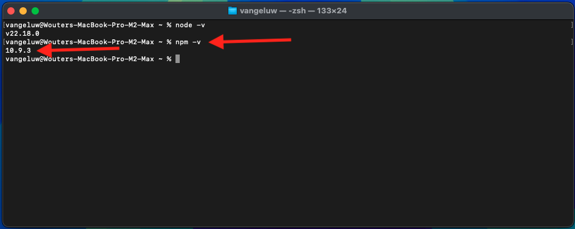

# 1.6.1 Adobe IO och App Builder

## 1.6.1.1 Skapa ditt Adobe I/O-projekt

Gå till [https://developer.adobe.com/console/home](https://developer.adobe.com/console/home){target="_blank"}.

Se till att du väljer rätt instans i skärmens övre högra hörn. Din instans är `--aepImsOrgName--`.

>[!NOTE]
>
> På skärmbilden nedan visas en viss organisation som valts. När du går igenom den här självstudiekursen är det troligt att din organisation har ett annat namn. När du registrerade dig för den här självstudiekursen fick du den information om miljön som du skulle använda. Följ dessa instruktioner.

Välj sedan **Skapa projekt från mall**.

Välj **App Builder**.

Ange namnet `--aepUserLdap-- GSPeM EXT`. Klicka på **Spara**.

Då borde du se något sådant här.

## 1.6.1.2 Konfigurera utvecklingsmiljön

För att kunna skapa, skicka och distribuera ditt utökningsbara program bör följande program och paket vara installerade i din lokala utvecklingsmiljö på datorn:

- Node.js (version 20.x eller senare)
- npm (paketerat med Node.js)
- Adobe Developer kommandoradsgränssnitt

Följ de här stegen om programmen eller paketen inte har installerats på datorn än.

### Node.js &amp; npm

Gå till [https://nodejs.org/en/download](https://nodejs.org/en/download). Du bör då se detta med ett antal terminalkommandon som måste köras för att Node.js och npm ska kunna installeras. De kommandon som visas här gäller för MacBook.

Öppna först ett nytt terminalfönster. Klistra in och kör kommandot som anges på rad 2 i skärmbilden:

`curl -o- https://raw.githubusercontent.com/nvm-sh/nvm/v0.40.3/install.sh | bash`

Kör sedan kommandot på rad 5 i skärmbilden:

`\. "$HOME/.nvm/nvm.sh"`

Kör det här kommandot när du har utfört båda kommandona:

`node -v`

Du bör se ett versionsnummer som returneras.

Kör sedan det här kommandot:

`npm -v`

Du bör se ett versionsnummer som returneras.

Om de två senaste kommandona returnerade ett versionsnummer är konfigurationen av dessa två funktioner slutförd.

### Adobe Developer kommandoradsgränssnitt

Om du vill installera Adobe Developer kommandoradsgränssnitt kör du följande kommando i ett terminalfönster:

`npm install -g @adobe/aio-cli`

Om du kör det här kommandot kan det ta några minuter. Slutresultatet ska vara ungefär så här:

Adobe Developer kommandoradsgränssnitt (CLI) har nu också installerats.

Du har nu konfigurerat de grundläggande elementen för att kunna köra ett App Builder-projekt.

## Nästa steg

Gå till [Skapa din AWS S3-bucket](./ex2.md){target="_blank"}

Gå tillbaka till [GenStudio for Performance Marketing - utökningsbarhet](./genstudioext.md){target="_blank"}

Gå tillbaka till [Alla moduler](./../../../overview.md){target="_blank"}
