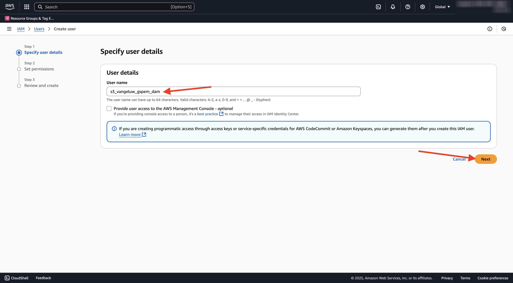
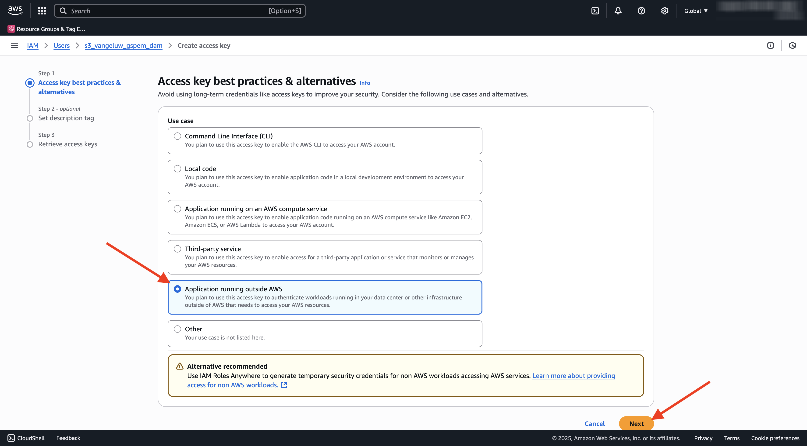

# 1.6.2 Skapa din AWS S3-bucket

## 1.6.2.1 Skapa din S3-bucket

Gå till [https://console.aws.amazon.com](https://console.aws.amazon.com) och logga in.

>[!NOTE]
>
>Om du inte har något AWS-konto än skapar du ett nytt AWS-konto med din personliga e-postadress.

När du har loggat in omdirigeras du till **AWS Management Console**.

Sök efter **s3** i sökfältet. Klicka på det första sökresultatet: **S3 - Skalbar lagring i molnet**.

Därefter visas startsidan för **Amazon S3**. Klicka på **Skapa pyts**.

Använd namnet **på skärmen** Skapa pyts`--aepUserLdap---gspem-dam`.

Låt alla andra standardinställningar vara som de är. Bläddra nedåt och klicka på **Skapa hink**.

Då ser du att din bucket skapas och kommer att omdirigeras till Amazon S3-hemsida.

## Ange behörigheter för att komma åt S3-bucket

Nästa steg är att konfigurera åtkomst till din S3-bucket.

Gå till [https://console.aws.amazon.com/iam/home](https://console.aws.amazon.com/iam/home) om du vill göra det.

Åtkomsten till AWS-resurser styrs av Amazon Identity and Access Management (IAM).

Du kommer nu att se den här sidan.

Klicka på **Användare** på den vänstra menyn. Sedan visas skärmen **Användare**. Klicka på **Skapa användare**.

Konfigurera sedan användaren:

- Användarnamn: använd `s3_--aepUserLdap--_gspem_dam`

Klicka på **Nästa**.

Då visas den här behörighetsskärmen. Klicka på **Koppla profiler direkt**.

Ange söktermen **s3** om du vill visa alla relaterade S3-principer. Välj principen **AmazonS3FullAccess**. Bläddra nedåt och klicka på **Nästa**.

Granska konfigurationen. Klicka på **Skapa användare**.

Då ser du det här. Klicka på **Visa användare**.

Klicka på **Säkerhetsuppgifter** och sedan på **Skapa åtkomstnyckel**.

Välj **Program som körs utanför AWS**. Bläddra nedåt och klicka på **Nästa**.

Klicka på **Skapa åtkomstnyckel**

Då ser du det här. Klicka på **Visa** för att visa din hemliga åtkomstnyckel:

Din **hemliga åtkomstnyckel** visas nu.

>[!IMPORTANT]
>
>Lagra dina inloggningsuppgifter i en textfil på datorn.
>
> - Åtkomstnyckel-ID: ...
> - Hemlig åtkomstnyckel: ...
>
> När du klickar på **Klar** visas aldrig dina autentiseringsuppgifter igen!

Klicka på **Klar**.

Du har nu skapat en AWS S3-bucket och du har skapat en användare med behörighet att komma åt den här bucket.

## 1.6.2.2 Överför Assets till din S3-bucket

Sök efter **s3** i sökfältet. Klicka på det första sökresultatet: **S3 - Skalbar lagring i molnet**.

Klicka för att öppna din nyligen skapade S3-bucket, som ska heta `--aepUserLdap---gspem-dam`.

Klicka på **Överför**.

Du borde se det här då.

Du kan hämta CitiSignal-bildfiler [här](./../../asset-mgmt/module2.2/images/CitiSignal_Neon_Rabbit.zip){target="_blank"}.

Exportera filerna till skrivbordet.

Ta de två bildfilerna i mappen och släpp dem i S3 bucket-överföringsfönstret. Klicka på **Överför**.

Du borde se det här då. Din S3-bucket, dina bildfiler och din IAM-användare är nu klara att användas av din externa DAM-app.

## Nästa steg

Gå till [Skapa din externa DAM-app](./ex3.md){target="_blank"}

Gå tillbaka till [GenStudio for Performance Marketing - utökningsbarhet](./genstudioext.md){target="_blank"}

Gå tillbaka till [Alla moduler](./../../../overview.md){target="_blank"}
