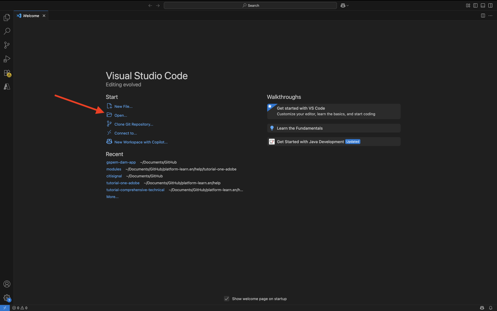
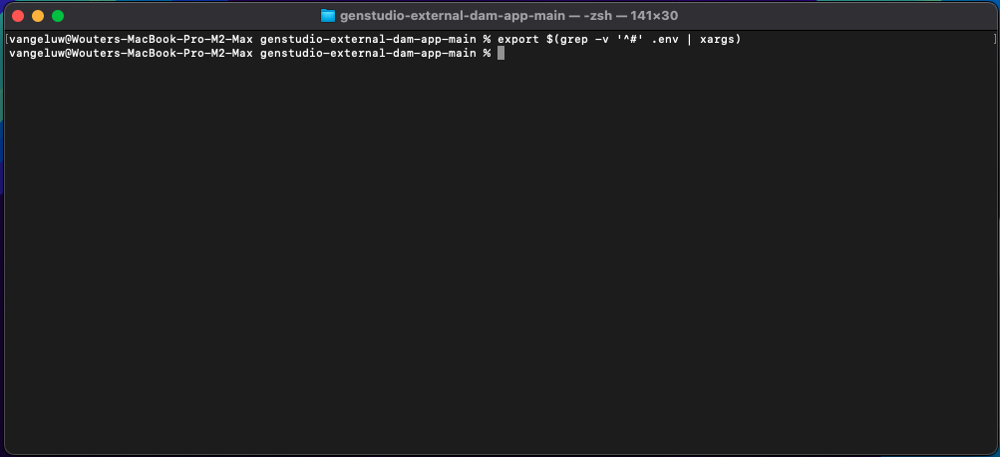
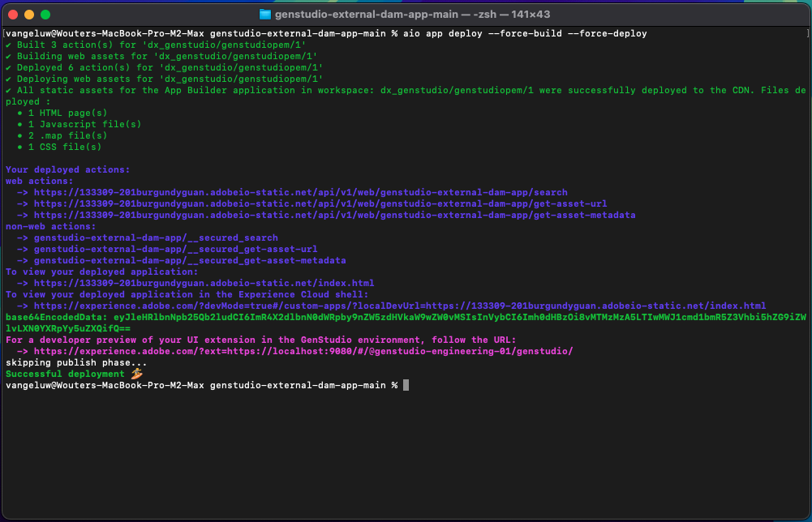

# 1.6.3 Skapa och distribuera din externa DAM-app

## 1.6.3.1 Hämta exempelprogramfiler

Gå till [https://github.com/woutervangeluwe/genstudio-external-dam-app](https://github.com/woutervangeluwe/genstudio-external-dam-app). Klicka på **Kod** och välj sedan **Hämta ZIP**.


Packa upp zip-filen på skrivbordet.


## 1.6.3.2 Konfigurera Adobe Developer kommandoradsgränssnitt

Högerklicka på mappen **genstudio-external-dam-app-main** och välj **Ny terminal i mappen**.


Du borde se det här då. Ange kommandot `aio login`. Kommandot dirigeras om till webbläsaren och du förväntas logga in.


När inloggningen är klar bör du se detta i webbläsaren.


Webbläsaren dirigeras sedan tillbaka till terminalfönstret. Du bör se ett meddelande som säger **Inloggningen lyckades** och en lång token som returneras av webbläsaren.


Nästa steg är att konfigurera instansen och Adobe IO-projektet som du ska använda för den externa DAM-appen.

För att göra detta måste du hämta en fil från Adobe IO-projektet som du konfigurerade tidigare.

Gå till [https://developer.adobe.com/console/home](https://developer.adobe.com/console/home){target="_blank"} och öppna det projekt du skapade tidigare, med namnet `--aepUserLdap-- GSPeM EXT`. Öppna arbetsytan **Produktion**.


Klicka på **Hämta alla**. Detta hämtar en JSON-fil.


Kopiera JSON-filen från katalogen **Downloads** till rotkatalogen för den externa DAM-appen.


Gå tillbaka till terminalfönstret. Ange kommandot `aio app use XXX-YYY-Production.json`.

>[!NOTE]
>
>Du måste ändra namnet på filen i ovanstående kommando så att det matchar namnet på filen.

När kommandot har körts är din externa DAM-app nu ansluten till Adobe IO-projektet med App Builder som du har skapat tidigare.


## 1.6.3.3 Installera GenStudio Extensibility SDK

Därefter måste du installera **GenStudio Extensibility SDK**. Mer information om SDK finns här: [https://github.com/adobe/genstudio-extensibility-sdk](https://github.com/adobe/genstudio-extensibility-sdk).

Kör det här kommandot i terminalfönstret för att installera SDK:

`npm install @adobe/genstudio-extensibility-sdk`


Efter några minuter installeras SDK.


## 1.6.3.4 Granska den externa DAM-appen i Visual Studio Code

Öppna Visual Studio-kod. Klicka på **Öppna..** för att öppna en mapp.



Markera mappen **genstudio-external-dam-app-main** som innehåller appen som du hämtade tidigare. Klicka på **Öppna**.


Klicka för att öppna filen **.env**.


Filen **.env** skapades med kommandot `aio app use` som du körde i föregående steg och innehåller den information som behövs för att ansluta till ditt Adobe IO-projekt med App Builder.


Du måste nu lägga till följande information i filen **.env** så att den externa DAM-appen kan ansluta till den AWS S3-bucket som du skapade tidigare.

```
AWS_ACCESS_KEY_ID=
AWS_SECRET_ACCESS_KEY=
AWS_REGION=
AWS_BUCKET_NAME=
```

Fältet **`AWS_ACCESS_KEY_ID`** och **`AWS_SECRET_ACCESS_KEY`** var tillgängliga efter att IAM-användaren skapades i föregående övning. Du har ombetts att skriva ned dem och du kan nu kopiera värdena.


Fältet **`AWS_REGION`** kan hämtas från hemvyn i AWS S3, bredvid ditt bucketnamn. I det här exemplet är regionen **us-west-2**.


Fältet **`AWS_BUCKET_NAME`** ska vara `--aepUserLdap---gspem-dam`.

Med den här informationen kan du uppdatera värdena för var och en av dessa variabler.

```
AWS_ACCESS_KEY_ID=XXX
AWS_SECRET_ACCESS_KEY=YYY
AWS_REGION=us-west-2
AWS_BUCKET_NAME=--aepUserLdap---gspem-dam
```

Nu bör du klistra in den här texten i filen `.env`. Glöm inte att spara ändringarna.


Gå sedan tillbaka till terminalfönstret. Kör det här kommandot:

`export $(grep -v '^#' .env | xargs)`



Slutligen måste du ändra etiketten som ska visas i GenStudio for Performance Marketing, så att du kan skilja din externa DAM-app från andra integreringar. Det gör du genom att öppna filen **Constants.ts** som du hittar genom att gå nedåt i Utforskaren till **src/genstudiopem > web-src > src**.

Rad 14 måste ändras till

`export const extensionLabel: string = "--aepUserLdap-- - External S3 DAM";`

Glöm inte att spara ändringarna.


## 1.6.3.5 Kör din externa DAM-app

Kör kommandot `aio app run` i terminalfönstret. Du bör se det här efter 1-2 minuter.

>[!NOTE]
>
>När du kör `aio app run` första gången kan du omdirigeras till webbläsaren för att acceptera ett nytt certifikat. Om det inträffar godkänner du certifikatet och sedan kan du fortsätta med stegen nedan.


Du har nu bekräftat att din app körs. Nästa steg är att distribuera den.

Tryck först på **CTRL+C** för att stoppa programmet från att köras. Ange sedan kommandot `aio app deploy`. Detta kommando distribuerar koden till Adobe IO.

Därför får du en liknande URL för att komma åt ditt distribuerade program:

`https://133309-201burgundyguan.adobeio-static.net/index.html`


I testsyfte kan du nu använda den URL:en som frågesträngsparameter genom att lägga till `?ext=` som ett prefix till ovanstående URL. Detta resulterar i den här frågesträngsparametern:

`?ext=https://133309-201burgundyguan.adobeio-static.net/index.html`

Gå till [https://experience.adobe.com/genstudio/create](https://experience.adobe.com/genstudio/create).


Lägg sedan till frågesträngsparametern precis före **#**. Din nya URL bör se ut så här:

`https://experience.adobe.com/?ext=https://133309-201burgundyguan.adobeio-static.net/index.html#/@experienceplatform/genstudio/create`

Sidan läses in som vanligt. Klicka på **Banners** för att börja skapa en ny banderoll.


Välj en mall och klicka på **Använd**.


Klicka på **Välj från innehåll**.


Du bör sedan kunna välja din externa DAM, som ska namnges `--aepUserLdap-- - External S3 DAM` från listrutan.


Du borde se det här då. Markera bilden **neon_rabbit_banner.jpg** och klicka på **Använd**.


Du har nu valt ut en bild från din externa DAM som körs i en S3-bucket. När bilden är markerad kan du nu följa det normala arbetsflödet som beskrivs i övningen [1.3.3.4 Skapa och godkänn meta ad](./../module1.3/ex3.md#create--approve-meta-ad).


När du ändrar koden på den lokala datorn måste du distribuera om programmet. När du distribuerar igen använder du det här terminalkommandot:

`aio app deploy --force-build --force-deploy`



Din app är nu klar att publiceras.

## Nästa steg

Gå till [Publicera din app privat](./ex4.md){target="_blank"}

Gå tillbaka till [GenStudio for Performance Marketing - utökningsbarhet](./genstudioext.md){target="_blank"}

Gå tillbaka till [Alla moduler](./../../../overview.md){target="_blank"}
