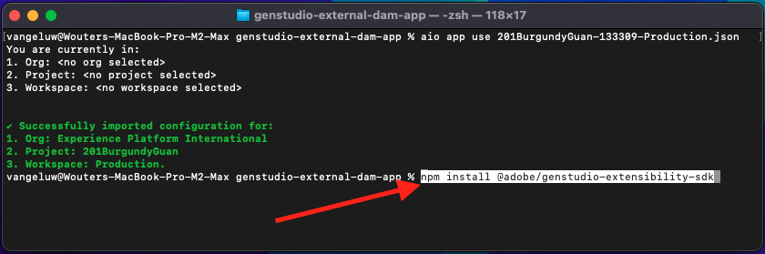
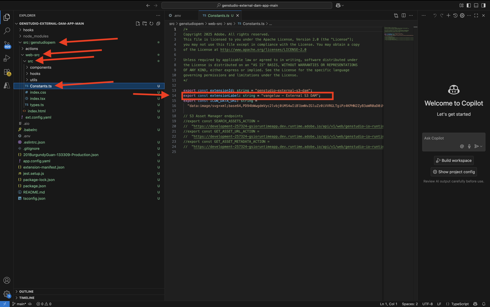

# 1.6.3 Skapa en extern DAM-app

## 1.6.3.1 Hämta exempelprogramfiler

Gå till [https://github.com/adobe/genstudio-extensibility-examples](https://github.com/adobe/genstudio-extensibility-examples). Klicka på **Kod** och välj sedan **Hämta ZIP**.


Packa upp zip-filen på skrivbordet.


Öppna mappen **genstudio-extensibility-examples-main**. Du ser flera exempelappar. Den som är av intresse för den här övningen är **genstudio-external-dam-app**.

Kopiera katalogen och klistra in den på skrivbordet.


Nu bör du ha den här på datorn:


För nästa övningar använder du bara mappen **genstudio-external-dam-app** .

## 1.6.3.2 Konfigurera Adobe Developer kommandoradsgränssnitt

Högerklicka på mappen **genstudio-external-dam-app** och välj **Ny terminal i mappen**.


Du borde se det här då. Ange kommandot `aio login`. Kommandot dirigeras om till webbläsaren och du förväntas logga in.


När inloggningen är klar bör du se detta i webbläsaren.


Webbläsaren dirigeras sedan tillbaka till terminalfönstret. Du bör se ett meddelande som säger **Inloggningen lyckades** och en lång token som returneras av webbläsaren.


Nästa steg är att konfigurera instansen och Adobe IO-projektet som du ska använda för den externa DAM-appen.

För att göra detta måste du hämta en fil från Adobe IO-projektet som du konfigurerade tidigare.

Gå till [https://developer.adobe.com/console/home](https://developer.adobe.com/console/home){target="_blank"} och öppna det projekt du skapade tidigare, med namnet `--aepUserLdap-- GSPeM EXT`. Öppna arbetsytan **Produktion**.


Klicka på **Hämta alla**. Detta hämtar en JSON-fil.


Kopiera JSON-filen från katalogen **Downloads** till rotkatalogen för den externa DAM-appen.


Gå tillbaka till terminalfönstret. Ange kommandot `aio app use XXX-YYY-Production.json`.

>[!NOTE]
>
>Du måste ändra namnet på filen så att det matchar namnet på filen.

När kommandot har körts är din externa DAM-app nu ansluten till Adobe IO-projektet med App Builder som du har skapat tidigare.


## 1.6.3.3 Installera GenStudio Extensibility SDK

Därefter måste du installera **GenStudio Extensibility SDK**. Mer information om SDK finns här: [https://github.com/adobe/genstudio-extensibility-sdk](https://github.com/adobe/genstudio-extensibility-sdk).

Kör det här kommandot i terminalfönstret för att installera SDK:

`npm install @adobe/genstudio-extensibility-sdk`



Efter några minuter installeras SDK.


## 1.6.3.4 Granska den externa DAM-appen i Visual Studio Code

Öppna Visual Studio-kod. Klicka på **Öppna..** för att öppna en mapp.


Välj mappen **genstudio-external-dam-app** som innehåller appen som du hämtade tidigare.


Klicka för att öppna filen **.env**.


Filen **.env** skapades med kommandot `aio app use` som du körde i föregående steg och innehåller den information som behövs för att ansluta till ditt Adobe IO-projekt med App Builder.


Nu måste du skapa två nya filer i roten av mappen:

- `.env.dev`. Klicka på knappen **Ny fil** och ange sedan filnamnet `.env.dev`.


- `.env.prod`.  Klicka på knappen **Ny fil** och ange sedan filnamnet `.env.prod`.


Dessa filer innehåller de inloggningsuppgifter som behövs för att ansluta till AWS S3-bucket som du skapade tidigare.

```
AWS_ACCESS_KEY_ID=
AWS_SECRET_ACCESS_KEY=
AWS_REGION=
AWS_BUCKET_NAME=
```

Fälten **AWS_ACCESS_KEY_ID** och **AWS_SECRET_ACCESS_KEY** var tillgängliga efter att IAM-användaren skapades i föregående övning. Du har ombetts att skriva ned dem och du kan nu kopiera värdena.


Fältet **AWS_REGION** kan hämtas från hemvyn i AWS S3, bredvid ditt bucketnamn. I det här exemplet är regionen **us-west-2**.


Fältet **AWS_BUCKET_NAME** ska vara `--aepUserLdap---gspem-dam`.

Med den här informationen kan du uppdatera värdena för var och en av dessa variabler.

```
AWS_ACCESS_KEY_ID=XXX
AWS_SECRET_ACCESS_KEY=YYY
AWS_REGION=us-west-2
AWS_BUCKET_NAME=--aepUserLdap---gspem-dam
```

Nu bör du klistra in den här texten i båda filerna, `.env.dev` och `.env.prod`. Glöm inte att spara ändringarna.




Gå sedan tillbaka till terminalfönstret. Kör det här kommandot:

`export $(grep -v '^#' .env.dev | xargs)`


## 1.6.3.5 Kör din externa DAM-app

Kör kommandot `aio app run` i terminalfönstret. Du bör se det här efter 1-2 minuter.


## Nästa steg

Gå till [Distribuera koden och publicera appen privat](./ex4.md){target="_blank"}

Gå tillbaka till [GenStudio for Performance Marketing - utökningsbarhet](./genstudioext.md){target="_blank"}

Gå tillbaka till [Alla moduler](./../../../overview.md){target="_blank"}
