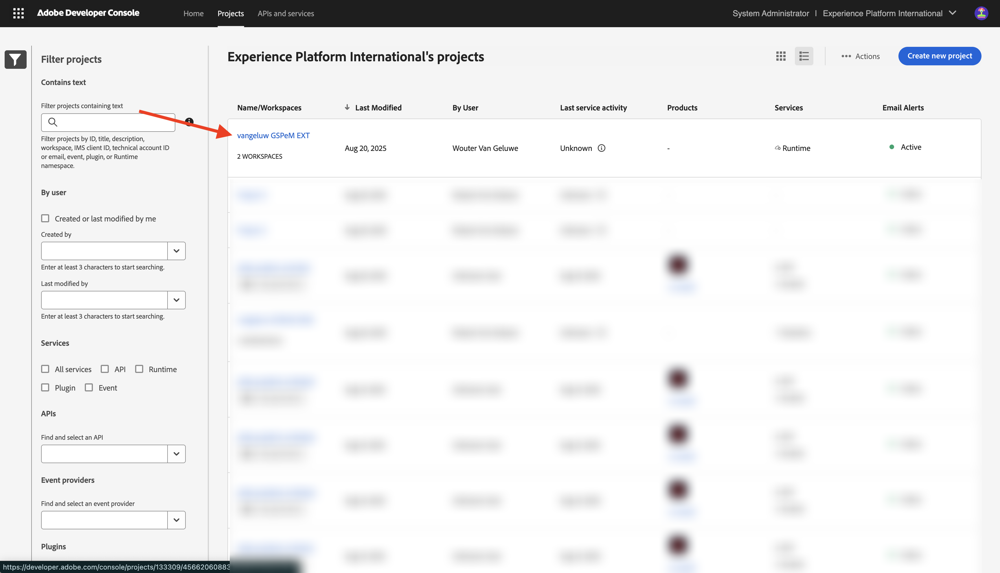

# 1.6.4 Distribuera koden och publicera appen privat

Om du publicerar din app privat innebär det att din app är tillgänglig i GenStudio for Performance Marketing utan att du behöver använda frågesträngsparametern.

## 1.6.4.1 Publicera din app

Gå till [https://developer.adobe.com/console/projects](https://developer.adobe.com/console/projects){target="_blank"}.

>[!NOTE]
>
> På skärmbilden nedan visas en viss organisation som valts. När du går igenom den här självstudiekursen är det troligt att din organisation har ett annat namn. När du registrerade dig för den här självstudiekursen fick du den information om miljön som du skulle använda. Följ dessa instruktioner.

Öppna Adobe IO-projektet med App Builder, som ska ha namnet `--aepUserLdap-- GSPeM EXT`.

Gå till **Produktion**.

Klicka på **Publicera privat**.

Sedan måste du fylla i ett antal fält.

Fyll i följande fält:

- **Programtitel**: `--aepUserLdap-- - External DAM AWS S3`.
- **Programbeskrivning**: `External DAM AWS S3`
- **Kontakta e-postadress**: ange din e-postadress
- **Appikon**: Hämta och använd den här bilden: [S3-bild](./images/s3.jpeg)
- **Kommentar till granskare**: Extern DAM AWS S3

Klicka på **Skicka**.

Klicka på **Skicka**.

## 1.6.4.2 Godkänn din app

>[!IMPORTANT]
>
>Det här steget kan bara utföras av systemadministratörer i Adobe Admin Console. Om du inte är systemadministratör kan du inte köra det här. Kontakta systemadministratören om du vill godkänna din app istället.

När en utvecklare skickar in en ny app för publicering meddelas systemadministratörerna för din organisation och ombeds granska och godkänna den.

Om du är systemadministratör får du det här e-postmeddelandet och sedan kan du klicka på **Min Exchange** för att starta processen.

På **Adobe Exchange** visas App Builder-programmen och appen som just skickats väntar nu på en granskning. Klicka på knappen **Granska** för programmet `--aepUserLdap-- - External DAM AWS S3`.

Lägg till i en kommentar och klicka på **Godkänn**.

Ditt program är nu godkänt och kommer att fungera automatiskt i GenStudio for Performance Marketing, utan att du behöver ange frågesträngsparametern.

## Nästa steg

Gå till [Sammanfattning och förmåner](./summary.md){target="_blank"}

Gå tillbaka till [GenStudio for Performance Marketing - utökningsbarhet](./genstudioext.md){target="_blank"}

Gå tillbaka till [Alla moduler](./../../../overview.md){target="_blank"}
