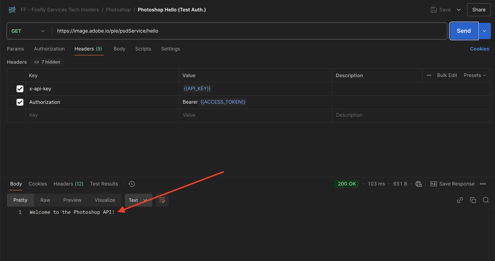
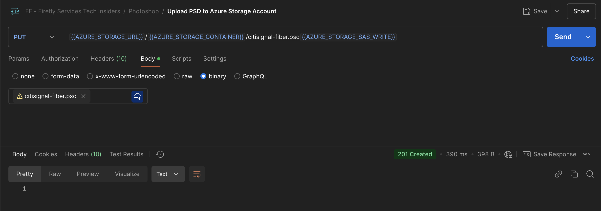

# 1.1.3 Arbeta med Photoshop API:er

## 1.1.3.1 Uppdatera integreringen med Adobe I/O

Gå till [https://developer.adobe.com/console/home](https://developer.adobe.com/console/home){target="_blank"}.


Gå till **Projekt** och klicka för att öppna projektet som du skapade i föregående övning, som kallas `--aepUserLdap-- Firefly`.


Klicka på **+ Lägg till i projekt** och sedan på **API**.


Markera **Creative Cloud** och klicka på **Photoshop - Firefly-tjänster**. Klicka på **Nästa**.


Klicka på **Nästa**.


Därefter måste du välja en produktprofil som definierar vilka behörigheter som är tillgängliga för den här integreringen.

Markera profilen **Standardkonfiguration för Firefly-tjänster** och **Standardkonfiguration för Creative Cloud Automation Services**.

Klicka på **Spara konfigurerat API**.


Ditt Adobe I/O-projekt har nu uppdaterats för att fungera med API:er för Photoshop &amp; Firefly Services.


## 1.1.3.2 Interagera med PSD

Hämta filen Gå till [citisign-fiber.psd](./../../../assets/ff/citisignal-fiber.psd){target="_blank"} till skrivbordet.

Öppna filen **citisign-fiber.psd** i Photoshop. Du borde ha den här då.


I rutan **Lager** ser du att fildesignern har gett varje lager ett unikt namn. Du kan se lagerinformationen genom att öppna PSD-filen i Photoshop, men du kan också göra det programmatiskt.

Låt oss skicka din första API-begäran till Photoshop API:er.

Gå till Postman. Innan du skickar API-begäranden till Photoshop måste du autentisera till Adobe I/O. Öppna den begäran du använde tidigare med namnet **POST - Hämta åtkomsttoken**.

Gå till **Parametrar** och kontrollera att parametern **Scope** är korrekt inställd. **Värdet** för **Scope** ska se ut så här:

`openid,session,AdobeID,read_organizations,additional_info.projectedProductContext, ff_apis, firefly_api`

Klicka sedan på **Skicka**.


Sedan har du en giltig åtkomsttoken för att interagera med Photoshop API:er.


### 1.1.3.2.1 Photoshop API - Hello World

Sedan hälsar vi på Photoshop API:er för att testa om alla behörigheter och all åtkomst är korrekt inställda. Öppna begäran med namnet **Photoshop Hello (Test Auth) i samlingen** Photoshop **.**. Klicka på **Skicka**.


Du bör sedan få följande svar: **Välkommen till Photoshop API!**.



För att programmässigt kunna interagera med PSD-filen **citisign-fiber.psd** måste du överföra den till ditt lagringskonto. Du kan göra det manuellt genom att dra och släppa det i behållaren med Azure Storage Explorer, men den här gången bör du göra det via API:t.

### 1.1.3.2.2 Överför PSD till Azure

Öppna begäran **Överför PSD till Azure Storage-kontot** i Postman. I föregående övning konfigurerade du dessa miljövariabler i Postman, som du nu kommer att använda:

- `AZURE_STORAGE_URL`
- `AZURE_STORAGE_CONTAINER`
- `AZURE_STORAGE_SAS_READ`
- `AZURE_STORAGE_SAS_WRITE`

Som du kan se i begäran **Överför PSD till Azure Storage-konto**, är URL:en konfigurerad att använda dessa variabler.


I **Body** bör du nu lägga till filen **citisign-fiber.psd**.


Du borde ha den här då. Klicka på **Skicka**.


Du bör sedan få tillbaka det här tomma svaret från Azure, vilket innebär att din fil lagras i din behållare i ditt Azure Storage-konto.



Om du använder Azure Storage Explorer för att få en look, kommer du att se filen när du har uppdaterat mappen.


### 1.1.3.2.3 Photoshop API - Hämta manifest

Därefter måste du hämta manifestfilen för din PSD-fil. Öppna begäran **Photoshop - Hämta PSD-manifestet** i Postman. Gå till **Body**.

Kroppen ska se ut så här:

```json
{
  "inputs": [
    {
      "storage": "external",
      "href": "{{AZURE_STORAGE_URL}}/{{AZURE_STORAGE_CONTAINER}}/citisignal-fiber.psd{{AZURE_STORAGE_SAS_READ}}"
    }
  ],
  "options": {
    "thumbnails": {
      "type": "image/jpeg"
    }
  }
}
```

Klicka på **Skicka**.

I svaret ser du nu en länk. Eftersom åtgärder i Photoshop ibland kan ta lite tid att slutföra, kommer Photoshop att tillhandahålla en statusfil som svar på de flesta inkommande begäranden. För att förstå vad som händer med din begäran måste du läsa statusfilen.


Om du vill läsa statusfilen öppnar du begäran **Photoshop - Hämta PS-status**. Du ser sedan att den här begäran använder en variabel som URL, vilket är en variabel som anges av den tidigare begäran som du skickade, **Photoshop - Get PSD Manifest**. Variabler anges i **Skript** för varje begäran.

Klicka på **Skicka**.


Du borde se det här då. För närvarande är statusen inställd på **väntande**, vilket innebär att processen inte har slutförts än.


Du kan klicka på Skicka några gånger till på begäran **Photoshop - Hämta PS-status** tills statusen ändras till **Succas**. Det här kan ta några minuter.

När svaret är tillgängligt skapar du en JSON-fil som innehåller information om alla lager i PSD-filen. Den här informationen är användbar, eftersom exempelvis lagernamnet eller lager-ID:t visas här.


Sök till exempel efter texten `2048x2048-cta`. Du borde se det här då.


### 1.1.3.2.4 Photoshop API - Ändra text

Därefter måste du ändra texten för anropet till åtgärd med API:erna. Öppna begäran **Photoshop - Ändra text** i Postman och gå till **Brödtext**.

Du borde se det här då. Du kan se följande:

- först anges en indatafil: `citisignal-fiber.psd`
- därefter anges det lager som ska ändras, med texten som ska ändras till
- För det tredje har en utdatafil angetts: `citisignal-fiber-changed-text.psd`

```json
{
  "inputs": [
    {
      "storage": "external",
      "href": "{{AZURE_STORAGE_URL}}/{{AZURE_STORAGE_CONTAINER}}/citisignal-fiber.psd{{AZURE_STORAGE_SAS_READ}}"
    }
  ],
  "options": {
    "layers": [
      {
        "name": "2048x2048-cta",
        "text": {
          "content": "Get Fiber now!"
        }
      }
    ]
  },
  "outputs": [
    {
      "storage": "azure",
      "href": "{{AZURE_STORAGE_URL}}/{{AZURE_STORAGE_CONTAINER}}/citisignal-fiber-changed-text.psd{{AZURE_STORAGE_SAS_WRITE}}",
      "type": "vnd.adobe.photoshop",
      "overwrite": true
    }
  ]
}
```

Utdatafilen har ett annat namn eftersom du inte vill åsidosätta den ursprungliga indatafilen.

Klicka på **Skicka**.


Precis som tidigare innehåller svaret en länk som pekar på statusfilen som håller reda på förloppet.


Om du vill läsa statusfilen öppnar du begäran **Photoshop - Hämta PS-status** igen och klickar på **Skicka**. Om statusen inte är inställd på **success** omedelbart, vänta några sekunder och klicka sedan på **Skicka** igen.

När statusen är inställd på **success** bör du se detta. I sökvägen `outputs[0]._links.renditions[0].href` bör du se URL:en till utdatafilen som skapades av Photoshop och som innehåller den ändrade texten.

Klicka på URL:en för att hämta utdatafilen.


Filen **citisign-fiber-changed-text.psd** hämtas sedan till din dator, varefter du kan öppna den. Du bör då se att platshållaren för anropet till åtgärd har ersatts med texten **Hämta nu!**.


Slutligen kan du även se den filen i din behållare med hjälp av Azure Storage Explorer.


Du har nu avslutat den här övningen.

Nästa steg: [1.1.4 Firefly anpassade modeller](./ex4.md){target="_blank"}

[Gå tillbaka till modul 1.1](./firefly-services.md){target="_blank"}

[Gå tillbaka till alla moduler](./../../../overview.md){target="_blank"}
